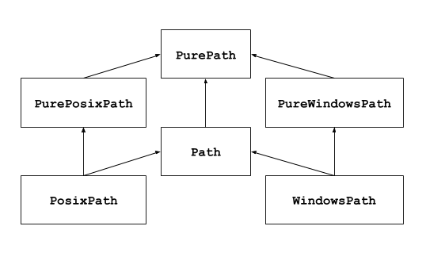
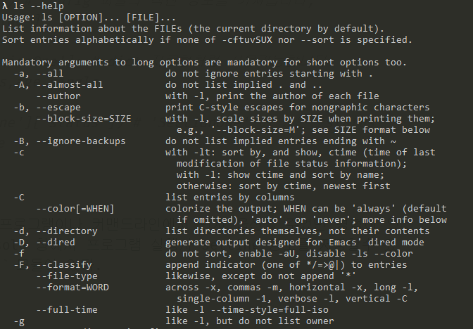

## 📄 Exception/File/Log Handling

### ✏️ Exception Handling

사용자의 모든 반응을 예상하여 프로그램을 만드는 것은 생각보다 쉬운일이 아니다. 그렇지만 예상치 못한 반응으로 프로그램이 비정상적으로 작동되는것을 막기위해서 **예외(Exception) 핸들링** 이 필요하다.

1. **예상 가능한 예외**
   - 발생 여부를 **사전에 인지할 수 있는 예외**
   - 사용자의 잘못된 입력, 파일 호출시 파일 없음
   - 개발자가 반드시 **명시적으로 정의**
2. **예상 불가능한 예외**
   - **인터프리터 과정에서 발생하는 예외**
   - 개발자의 실수로 인해 발생
   - ZeroDivisionError, IndexError..
   - 수행불가시 인터프리터가 자동호출

파이썬에서는 예외처리를 위해 `try~except~finally` ,`try~except~else` 구문을 제공해준다.

```python
for i in range(10):
    try:
        result=10/i
    except ZeroDivisionError as e:
        print('Not divided by 0')
    else:
        print('예외가 발생하지 않았을 때 동작합니다')
    finally:
        print('예외 발생 여부와 상관없이 무조건 실행됩니다.')
    print('--------------------------------------------------')
```

만약 사용자의 반응이 프로그램에 큰 악영향을 끼칠수 있을경우 프로그램의 작동을 멈추는 것이 최선의 선택일수도 있다. `raise` 와 `assert` 를 통해 예외를 발생시킬 수 있다.

```python
user_input=input('음이 아닌 정수를 입력해주세요 : ')
for digit in user_input:
    if digit not in '0123456789':
    	raise ValueError('음이 아닌 정수를 입력해주세요)     
def append_int(src,data):
    assert isinstance(src,list) # list가 아니면 예외
    assert isinstance(data,int) # int가 아니면 예외
    src.append(data)
```

### ✏️ File Handling

기본적으로 파일은 **text 파일** 과 **binary 파일** 로 나뉜다. 물론 모든 text 파일도 실제로는 binary 파일이지만 ASCII/UNICODE 등 인코딩 형식에 따라 문자열집합으로 변환되어 사람이 읽을수 있다.

| Binary 파일                                                  | Text 파일                                             |
| ------------------------------------------------------------ | ----------------------------------------------------- |
| 컴퓨터만 이해할 수 있는 형태인 **이진법 형식**으로 저장된 파일 | 인간도 이해할 수 있는 **문자열 형식**으로 저장된 파일 |
| 일반적으로 메모장으로 열면 내용이 깨져보인다                 | 메모장으로 열면 확인 가능                             |
| 엑셀파일,워드파일 등                                         | 메모장에 저장된 파일, HTML 파일, 파이썬 코드파일 등   |

파이썬에서는 기본적으로 다음과 같이 파일핸들링이 이루어진다.

| 파일모드 | 설명                                                         |
| -------- | ------------------------------------------------------------ |
| r        | 읽기모드 - 파일을 읽기만 할 때 사용 (디폴트)                 |
| w        | 쓰기모드 - 파일에 내용을 쓸 때 사용(내용이 있을경우 지우고 새로쓴다) |
| a        | 추가모드 - 파일의 마지막에 새로운 내용을 추가 시킬때 사용    |
| t        | 텍스트파일 - 텍스트 문자 기록에 사용 (디폴트)                |
| b        | 바이너리파일 - 바이트 단위 데이터 기록에 사용                |

```python
f=open('boostcamp.txt','r')
contents=f.read() # 모든 데이터를 문자열로 읽어옵니다.
print(contents)
f.close() # 파일을 닫아줘야합니다.

#################################
# 파일을 닫는게 귀찮다면 with를 이용합시다.
with open('boostcamp.txt','r') as f: 
    line=f.readline() # 데이터를 한줄씩 읽어온다. (readline)
    print(line)
    
#################################

with open('boostcamp.txt','r') as f:
    lines=f.readlines() # 모든 데이터를 list로 반환한다. (readlines)
    print(lines)

#################################
# encoding 규칙은 상황에 맞게 정합니다.
with open('boostcamp.txt','a',encoding='utf-8') as f:
    for i in range(1,6):
	f.write(f'{i}번째 학습정리입니다.') # 데이터를 파일에 저장합니다.
```

#### with 블록

- 파일을 다룰 때 with 블록을 통해 명시적으로 `close()`  메소드를 호출하지 않고도 파일을 닫을 수 있다.
- 파일 객체는 내부적으로 `__enter__()`, `__exit__()` 가 구현되어 있다.
- with 블록이 자동으로 블록을 종료할 때 `__exit__()` 메소드를 호출하여 파일을 close 시키게 된다.

#### os 모듈

- 파일을 복사하거나 
- 디렉터리를 생성하거나
- 특정 디렉터리 내의 파일 목록을 구할 때 보통 사용

```python
import os

try :
    os.mkdir("folder") # 폴더 만들기
except FileExistsError as e:
    print("Already created") # 이미 폴더 있을경우 예외처리

os.path.exists("folder") # 현재 경로에 folder 이름의 폴더가 있는지 반환
os.path.isfile("file.py") # 현재 경로에 file.py 이름의 파일이 있는지 반환
```

```python
import os

## 특정 디렉토리 아래의 모든 파일의 절대 경로 목록(list)을 리턴하는 함수

def allfiles(path):
    res = []
	# os.walk는 특정 디렉토리 아래의 모든 디렉토리와 파일의 목록을 얻어 올 수 있도록 도와준다. 
    # for문 안에서 3개의 아이템으로 구성된 튜플로 분해가 가능한데 
    # root : 어떤 디렉토리인지
    # dirs : root 아래의 디렉토리 목록
    # files : root 아래의 파일 목록
    # 모든 목록은 리스트 형태로 반환
    for root, dirs, files in os.walk(path):
        rootpath = os.path.join(os.path.abspath(path), root)

        for file in files:
            filepath = os.path.join(rootpath, file)
            res.append(filepath)

    return res
```


#### shell util 모듈

- DOS에서 사용하던 명령어를 python에서 사용하게 해주는 것과 같은 기능

```python
import shutil

source - "sample.txt"
dest = os.path.join("folder", "file.py")

shutil.copy(source, dest) # 파일 복사(sample.txt -> file.py로 복사)
```


#### pathlib module

- python 3.4 부터 공식 빌트인 모듈로 추가

- OS 와 상관없이 경로를 나타내고, 다룰 수 잇는 클래스를 정의

  - 위의 예제들을 살펴보면 파일 핸들링을 위해서는 **file path**를 다뤄야 한다. 그런데 운영체제에 따라 path 표현방식이 달라 문제가 생기는 경우가 있다. 그래서 최근에는 [pathlib](https://docs.python.org/3/library/pathlib.html) 모듈을 사용하여 **path 자체를 객체로 사용하여 다루기도 한다.**

- 크게 두개의 클래스로 구성

  - PurePath

    실제 파일 I/O와 관계없이 순수한 경로 연산만 담당

  - Path

    Concret Path라고도 부르며 시스템 I/O 연산까지 수행

    PurePath를 상속받아 구현됬기 때문에 PurePath가 제공하는 속성과 메소드 사용가능




```python
# path를 객체로 다룰 수 있음
import os
from pathlib import Path

file_path = './path/to/file'

# 기존 (os.path)
if os.path.exists(file_path):
  # do something

# pathlib 사용
p = Path(file_path)
if p.exists():
  # do something
```

```python
import os
from pathlib import Path

dir_name = 'dir'
sub_dir_name = 'sub_dir_name'
file_name = 'file'

# 기존 (os.path)
file = os.path.join(dir_name, sub_dir_name, file_name)

# pathlib
dir = Path(dir_name)
file = dir / sub_dir_name / file_name
# 나누기 연산자인 슬래시(/) 가 경로 구분 문자로 사용된다는 점을 착안하여 나누기 연산자로 path를 연결하게 함
```

```python
# 파일 오픈
from pathlib import Path

filename = 'text.txt'

# without pathlib
file = open(filename, 'r')

# with pathlib
path = Path(filename)
file = path.open('r')
```

```python
# 파일 읽고 쓰기 - 파일을 열고 닫을 필요가 없음
from pathlib import Path

filename = 'text.txt'

# without pathlib
file = open(filename, 'r')
r = file.read()
file.close()

# without pathlib2
with open(filename, 'r') as f:
  r = f.read()

# with pathlib
path = Path(filename)
r = path.read_text()
```

```python
# glob 패턴을 사용하여 파일/ 디렉토리를 리스팅 할 수 있음
from pathlib import Path

path = Path('.')

files = path.glob('*')
# <generator object Path.glob at 0x7f0ff370a360>

list(files)
# [PosixPath('.git'), PosixPath('.gitconfig'), PosixPath('.vimrc'), PosixPath('.zshrc'), PosixPath('pre-commit')]

# path.rglob(*)도 동일하다
list(path.glob('**/*'))
# [PosixPath('.git/COMMIT_EDITMSG'), PosixPath('.git/config'), PosixPath('.git/description'), PosixPath('.git/HEAD'), PosixPath('.git/hooks'), PosixPath('.git/index'), PosixPath('.git/info'), PosixPath('.git/logs'), PosixPath('.git/objects'), PosixPath('.git/refs')]

# path가 가리키는 폴더를 리스팅 할때는 glob('*') 대신 iterdir을 사용할 수 있다.
list(path.iterdir())
# [PosixPath('.git'), PosixPath('.gitconfig'), PosixPath('.vimrc'), PosixPath('.zshrc'), PosixPath('pre-commit')]

```

#### log 파일 만들기 -os 예제

```python
import os

if not os.path.isdir("log") : # 로그 폴더가 없다면
    os.mkdir("log") # 폴더 만들기
if not os.path.exits("log/count_log.txt") : # 로그 폴더 안에 count_log.txt 가 없을 경우
    f= open("log/count_log.txt", "w", encoding="utf-8") 
    # count_log.txt 쓰기 모드로 열기(인코딩 utf-8)
    # 파일을 쓰기 모드로 열면 해당 파일이 이미 존재할 경우 있던 내용이 모두 사라지고,
    # 파일이 존재하지 않으면 새로운 파일이 생성됨.
    f.write("Log starts\n")
    f.close()
 
with open("log/count_log.txt", 'a', encoding="utf8") as f : # count_log.txt 추가모드로 열기
    import random, datetime
    for i in range(1, 11) :
        stamp = str(datetime.datetime.now()) # 현재 시간
        value = random.random() * 10000000 # 0~1 사이 실수 랜덤 추출
        log_line = stamp + "\t" + str(value) + "created log" + "\n" # 쓰여진 로그 만들기
        f.write(log_line) # 파일에 적기
```


#### pickle

- 일반적으로 텍스트를 파일로 저장할 때는 파일 입출력을 이용하지만, **리스트나 클래스 같은 객체의 경우** 데이터를 저장하거나 불러올 수 없다. 그래서 파이썬에서는 이와 같은 텍스트 이외의 데이터를 파일로 저장하기 위해 `pickle` 모듈을 제공한다.
- data, object 등 실행 중(메모리에 있는) 정보/계산결과(모델) 등을 저장할 떄 쓰임

```python
import pickle

class Multiply:
    def __init__(self,multiplier):
        self.multiplier=multiplier
    
    def multiply(self,number):
        return number*self.multiplier

calculator=Multiply(5)
print(calculator.multiply(10)) #50

# 객체 저장
with open('multiply_object.pickle','wb') as f:
    pickle.dump(calculator,f) # pickle.dump(data, file) 파일에 데이터 입력

del calculator # 객체 삭제

# 객체 로드
with open('multiply_object.pickle','rb') as f:
    calculator_pickle=pickle.load(f) # pickle.load(file) 한줄씩 파일을 읽어옴(더이상 로드할 데이터 없으면 EOF 에러)
    print(calculator_pickle.multiply(5)) # 25
```


### ✏️ Log Handling

프로그램을 개발하면 개발자가 의도한대로 작동하지 않는 경우가 상당히 자주 나온다. 그래서 **로그(Log)** 는 시스템 발생 장애 및 이상 징후를 모니터링 할 수 있는 좋은 판단 기준이다. 이를 위해 파이썬에서는 `logging` 모듈을 제공한다.


| Level        | 개요                                                         | 예시                                                         |
| ------------ | ------------------------------------------------------------ | ------------------------------------------------------------ |
| **debug**    | 개발시 처리 기록을 남겨야하는 로그정보를 남김                | - 다음함수로 A를 호출함 - 변수 A를 무엇으로 변경함           |
| **info**     | 처리가 진행되는 동안의 정보를 알림                           | - 서버가 시작되었음 - 서버가 종료됨 - 사용자 A가 프로그램에 접속함 |
| **warning**  | 사용자가 잘못 입력한 정보나 처리는 가능하나, 원래 개발시 의도치 않는 정보가 들어왔을때 알림 | - str 입력을 기대했으나, int가 입력됨  **->** str casting 으로 처리함 - 함수에 argument로 이차원 리스트를 기대했으나 일차원리스트가 들어옴  **->** 이차원으로 변환후 처리 |
| **error**    | 잘못된 처리로 인해 에러가 났으나, 프로그램은 동작할수있음을 알림 | - 파일에 기록을 해야하는데 파일이 없음  **->** Exception 처리 후 사용자에게 알림 - 외부서비스와 연결 불가 |
| **critical** | 잘못된 처리로 데이터 손실이나 더이상 프로그램이 동작할 수 없음을 알림 | - 잘못된 접근으로 해당 파일이 삭제됨 - 사용자의 의한 강제종료. |

```python
import logging

#Stream(콘솔)에 로그 남기기
logging.debug('debug log')
logging.info('info log')
logging.warning('warning log')
logging.error('error log')
logging.critical('critical log')

# WARNING:root:warning log
# ERROR:root:error log   
# CRITICAL:root:critical log
```

#### debug level 설정

**debug,info level 이 나오지 않는 이유** 는 기본적으로 `logging`의 **default level 이 warning** 으로 되어 있기 때문이다. 만약 level을 변경하고 싶다면 다음과 같이 설정한다.

```python
import logging

logging.basicConfig(level=logging.DEBUG) # DEBUG level 설정

logging.debug('info log')
logging.info('info log')
logging.warning('info log')
logging.error('info log')
logging.critical('info log')

# DEBUG:root:debug log
# INFO:root:info log
# WARNING:root:warning log
# ERROR:root:error log
# CRITICAL:root:critical log
```

#### 로그 파일 만들기

만약 **로그 형식 변경** 과 **로그를 파일로 기록** 하고 싶다면 다음과 같이 설정한다.

```python
import logging

#logger instance 생성 
logger=logging.getLogger() 

#logger formatter 생성
#logRecode attributes
formatter=logging.Formatter('[%(asctime)s][%(levelname)s]|[%(filename)s:%(lineno)s]>> %(message)s')  

#logger level 셋팅 
logger.setLevel(logging.DEBUG)

# file & stream handler 생성
file_handler=logging.FileHandler('logging_example.log') # 로그 파일 핸들러
stream_handler=logging.StreamHandler() # 로그 스트림(콘솔) 핸들러

# handler 에 formatter 설정
file_handler.setFormatter(formatter)
stream_handler.setFormatter(formatter)

# logger instance에 handler 등록, 스트림과 파일에 동시 로그 출력
logger.addHandler(file_handler)
logger.addHandler(stream_handler)

logger.debug('debug_test')
logger.info('info_test')
logger.warning('warning_test')
logger.error('error_test')
logger.critical('critical_test')

# [2021-01-23 00:30:53,444][DEBUG]|[logging_example.py:45]>> debug_test
# [2021-01-23 00:30:53,445][INFO]|[logging_example.py:46]>> info_test
# [2021-01-23 00:30:53,447][WARNING]|[logging_example.py:47]>> warning_test
# [2021-01-23 00:30:53,449][ERROR]|[logging_example.py:48]>> error_test  
# [2021-01-23 00:30:53,450][CRITICAL]|[logging_example.py:49]>> critical_test
```

------

## 📄 Configparser & Argparser

### ✏️ Configparser

프로그램을 만들다보면, 상황에 따라 설정파일의 변동이 있다. 예를들어, 파일들의 주소, 출력파일을 저장할 디렉토리 주소 등이다. 이와 같이 **프로그램을 실행시킬때마다 설정을 다르게 해주고 싶을 때** 유용한 `configparser` 모듈이 있다.

- 프로그램의 실행 설정을 file에 저장
- section, key, value 값의 형태로 설정된 설정 파일 사용
- 설정파일을 dict type으로 호출 후 사용
- key:value 혹은 key=value 형식으로 parse

```python
#config.cfg

[SectionOne]
Status:Single
Age:20
Single:True

[SectionTwo]
FavortieColor=Green
#==========================================================================
import configparser

config=configparser.ConfigParser()
config.read('config.cfg') # Config 파일 읽어옵니다.

print(config.sections()) # Config 파일의 섹션 정보를 가져옵니다, ['SectionOne','SectionTwo']

for key in config['SectionOne']: # dict 자료형처럼 사용가능합니다.
    print(key) # status,age,single

print(config['SectionOne']['status']) # 'SectionOne' 에 있는 'status' 값을 가져옵니다. # Single
```

### ✏️ Argparser

파이썬 프로그램이나 커맨드라인에서 인자 옵션을 주었던 경험이 있을 것이다. 이와 같이 console 창에서 프로그램 실행시 setting 정보를 저장할수 있도록 도와주는 `argparse` 모듈이 있다.



```python
#parser_example.py
import argparse

parser=argparse.ArgumentParser(description='Argparser example')

parser.add_argument('-a','--a_value',dest='A_value',help='A integers',type=int)
parser.add_argument('-b','--b_value',dest='B_value',help='B integers',type=int)

args=parser.parse_args()
print(args)
print(args.A_value)
print(args.B_value)
>> parser_example.py -a 4 --b_value 5 
Namespace(A_value=4,B_value=5)
4
5
```

## 📄 Python data handling

### ✏️ CSV(Comma seperate Value/ Character-separated values)

- 엑셀 양식의 데이터를 프로그램에 상관없이 쓰기 위한 데이터 형식
- 구분의 종류에 따라 콤마로구분, TSV(tab), SSV(space) 3개가 있다
- Python에서는 간단히 CSV파일을 처리하기 위해 csv객체를 제공함( import csv )
- CSV 객체의 활용
  - delimiter (default = ,) : 글자를 나누는 기준
  
  - lineterminator (default = \r\n) : 줄 바꿈 기준
  
  - quotechar (default = ") : 문자열을 둘러싸는 신호 문자
  
  - quoting (default = QUOTE_MINIMAL) : 데이터 나누는 기준이 quotechar에 의해 둘러싸인 레벨
  
    

### ✏️ Web

- WWW (World Wide Web)

  - HTTP protocal: 데이터 송수신

  - HTML 형식: 데이터 표시

  - 동작방식

    1) 요청 : 웹주소, From, Header 등

    2) 처리 : Database 처리 등 요청 대응

    3) 응답 : HTML, XML 등으로 결과 반환

    4) 렌더링 : HTML, XML 표시

- HTML(Hyper Text Markup Language)

  - 웹 상의 정보를 구조적으로 표현
  - 제목, 단락, 링크 등 요소 표시를 위해 Tag를 사용
  - 모든 HTML은 트리 모양의 포함관계를 가짐
  - 일반적으로 html 소스파일을 컴퓨터가 다운로드 후 웹 브라우저가 해석
  - 태그 특징을 이용해 정규식으로 파싱 가능

- 정규식 (regular expression)

  - 정규 표현식, regexp 또는 regex 등으로 불림
  - 복잡한 문자열 패턴을 정의하는 문자 표현 공식
  - 특정한 규칙을 가진 문자열의 집합을 추출
  - 문법 자체는 매우 방대, 스스로 찾아서 하는 공부 필요
  - 필요한 것들은 인터넷 검색을 통해 찾을 수 있음
  - [regexr.com](https://www.regexr.com/)

- XML(eXtensible Markup Language)

  - 데이터의 구조와 의미를 설명하는 TAG(MarkUp)를 사용하여 표시하는 언어

  - TAG와 TAG사이에 값이 표시되고, 구조적인 정보를 표현할 수 있음

  - HTML과 문법이 비슷, 대표적인 데이터 저장 방식

  - 정보의 구조에 대한 정보인 스키마와 DTD 등으로 정보에 대한 정보(메타정보)가 표현되며, 용도에 따라 다양한 형태로 변경가능

  - XML은 컴퓨터(예: PC ↔ 스마트폰)간에 정보를 주고받기 매우 유용한 저장 방식으로 쓰이고 있음

  - XML도 HTML과 같이 구조적 markup 언어

  - 정규표현식으로 Parsing이 가능함

  - 가장 많이 쓰이는 parser인 beautifulsoup으로 파싱

    BeautifulSoup

    - HTML, XML등 Markup 언어 Scraping을 위한 대표적인 도구
    - lxml 과 html5lib 과 같은 Parser를 사용함
    - 속도는 상대적으로 느리나 간편히 사용할 수 있음

- JSON (JavaScript Object Notation)
  - javascript의 데이터 객체 표현 방식
  - 간결하고 데이터 용량이 작고 code로 전환이 쉬움
  - {“key”:”value”} 형태로 dict type과 상호 호환
  - import json (json.loads())