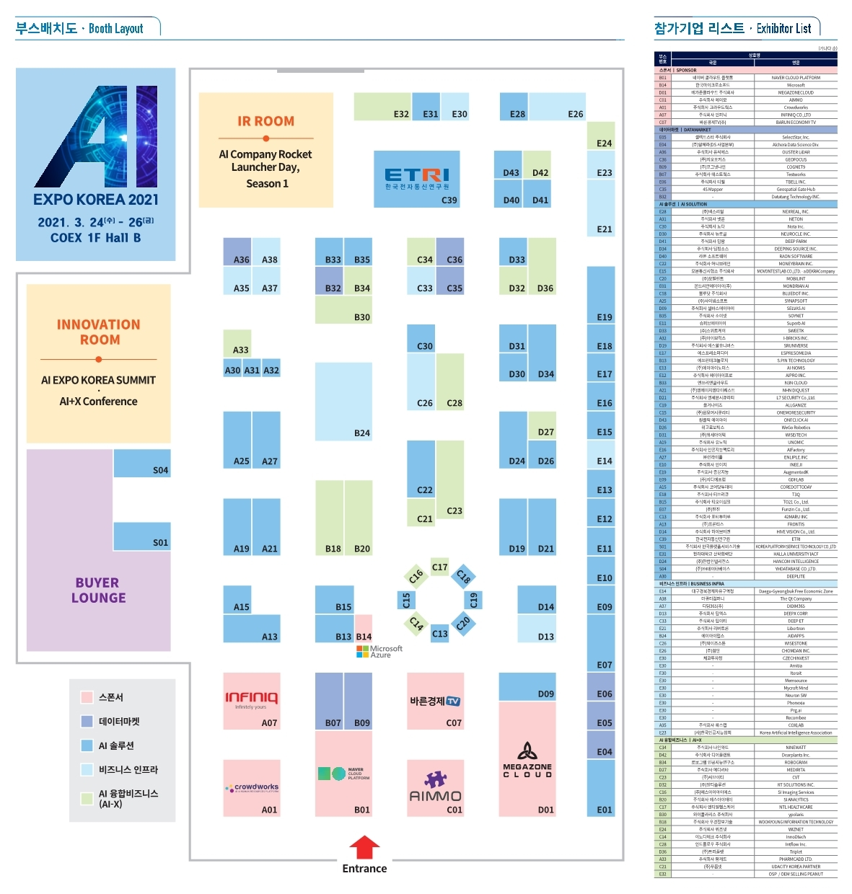

# Expo

http://www.aiexpo.co.kr/

전시회의 목적 : AI EXPO KOREA는 인공지능, ICT, IoT 산업 여러 분야에서 활용되고 있는 인공 지능적 요소 및 솔루션을 도입할 수 있는 기술력을 만날 수 있으며, 새로운 트랜드 및 신기술, 신제품을 만날 수 있는 최적의 비즈니스 플랫폼이 될 것입니다.

## 왜 갔는가?

- 인공지능이 현재 난리이기도 하고, 인공지능을 어느정도 공부해 본 입장에서 "사업적으로 인공지능을 어떻게 활용하고 있는가? " 에 대한 궁금증이 있었다.

- 어떤 기업들이 우리나라에 존재하고, 어떤 비지니스로 돈을 벌고 있는가에 대해 궁금했다.

- 앞으로 인공지능이 어떤 방향으로 나아갈 것인가 강연도 듣고, 인공지능 분야가 어떻게 발전해 나갈지 면모를 살펴보고 싶었다.

  

## 어떤 기업들이 있었는가?

- 라벨링 기업
  - 현재 인공지능 산업을 돕기 위해 국가가 데이터 라벨링 하는데 필요한 돈을 지원해주고 있다. (디지털 바우처 산업이었나?) 그것에 맞추어, 21세기 현대판 인형눈 붙이기와 같은 라벨링 기업들이 다수 있었다.
- 클라우드 플랫폼
  - one-click-ai, 인공지능 통합플랫폼(데이터 관리 + 인공지능 파이프라인 구성 + 시각화)까지 이어지는 플랫폼 사업
- 오브젝트 디텍션
  - 사람인식을 통해, 사람이 어딜 가고 있는지, 어떤 행동을 하는지 분석하여 사고를 방지하는 감시카메라
  - 자율주행 관련
- 공장 불량 사진을 통한 검출
- OCR
- 테스트 자동화
- 인공지능 하드웨어
  - 보통 사진 파일을 얼마나 빠르게 처리하느냐를 중점적으로 광고 

## 기억에 남는 몇가지 회사들

- ETRI
  - 인공지능 기반 얼굴정보 통합 인식 기술
    - 마스크를 쓰더라도 입 모양까지 전부 예측해서 얼굴을 인식함
    - 개인적으로는 가장 기술력에 놀랐다
- 식물과 대화
  - 식물에 전류를 측정하는 기계를 부착한 후 스마트폰과 연동해서 마치 애완동물처럼 식물과 대화를 할 수 있게 한 것. 식물의 미세 전류를 학습시켜서 식물의 감정을 읽어낸다.
  - 아이디어가 너무 신박해서 기억에 남는다.
- 메타버스
  - VR 세상에 회의실을 빌려주고, 돈을 받는 회사
  - VRChat이 공짜인데 과연 이게 사업성이 될까..? 라는 의문이 들었던 회사

undefined

undefined

undefined

## 후기

가장 놀랐던 점은 방문객의 수 였다. 아직 코로나가 종결된 것이 아님에도 불구하고 어마어마한 인파가 몰렸다. 그리고 IT 회사들이 방문하는 것이 아니라, 다수는 일반 대기업이나 다른 산업의 회사들에서 인공지능을 자신의 산업에 어떻게 녹여야할지 그 의문을 해소하기 위해 오고 있는 것 처럼 보여졌다. 정말 인공지능의 인기가 대단하다 라는 것을 실감했다.

개인적으로 아직까지 너무 간단한 인공지능밖에 사업화되지 않았다고 느껴졌고, AutoML때문에 사양산업인 어노테이션 회사들은 왜이리 많은지 그것에 놀랐다. 그리고 인공지능 하드웨어 회사와 인공지능 클라우드 플랫폼 산업들이 이렇게 많이 있는지 깜짝 놀랐다. 어느 정도 경쟁력이 있는 것 같아 보이긴 했지만, 과연 하드웨어로 Nvidia 같은 거대회사를 대적할 수 있을까에 대한 의문과,  Azure나 Colab과 같은 세계적 IT강자를 플랫폼 산업으로 경쟁력을 가질 수 있을까에 대한 의문은 있었다. 

그리고 이번 Expo가 인공지능이 아닌 분야의 사람들에게 우리 인공지능을 써보는게 어떠냐고 권하는 B2B 기반의 자리라, 개인을 대상으로한 아이디어와 인공지능 그 자체로 기술력을 가지고 서비스하는 업체들은 볼 수 없었던 것이 아쉬웠다.

# 강연

- AI 활용과 윤리적 접근-  마이크로소프트 이건복 상무
- 주제 : 효과적인 인공지능의 활용과 윤리적 접근방법

## AI의 등장

- 알고리즘적으로는 약한 AI 형태로 예전에 완성되어 있었다
- 대규모 계산처리 능력
- 강력한 알고리즘
- 누적된 빅데이터

전기모터 발명된지 100년 넘음.

모터는 어디에나 있지만 모터를 연구하는 기업은 극소수이다.

대부분의 기업들은 모터를 잘 가져다 쓰는게 목표

인공지능도 누구나 다쓰는 기술이 될 수 있다. 

지금은 너무 강력한 알고리즘에만 집중하고 있어, 알고리즘은 나머지 두가지 요소가 간과되기 쉬움

마약 탐지견 - 개의 DNA가 알고리즘이라고 하면, 개의 훈련이 중요한데 우리는 좋은 개의 품종만 찾는 것일수도 있다

바닥부터 만들어야하지 않으면 안된다는 강박관념에서 벗어나야한다.

## AI 적용영역

비지니스 에이전트 - B2B, B2C, B2E

- 복잡한 사용법에 대한 교육에 대한 비용의 감소

사물, 사람, 그리고 활동을 인지 - 유통 제조 보안

전문화된 업무의 AI보조 - 마케팅 법무 금융

- 보조인가 대체인가에 대한 논란이 있음

무인시스템 - 자동차 네트워크

- 사람들의 비용을 줄이기 위해서 쓰이는 것 아니냐
- 하지만 기술의 발전을 통해서 지금까지 직업이 사라지는 만큼 파생되었기 때문에 인공지능도 그렇게 되지 않을까 생각한다
  - 단순한 노동을 사람에게 강요해야하는 시스템은 없어져야한다.

지식 및 콘텐트 관리 - 문서, 비디오

- deepfake, 가짜 뉴스, 

### AI 서비스

- 자체 인프라스트럭처 및 개발
- 서버만 클라우드 사용
- ML용으로 디자인 된 플랫폼 서비스의 사용
- Cognitive 서비스 API 호출(개발코드 없이 사용)

### AI의 사용적 측면 (사용측면)

- 처음부터 직접 개발
- 전문업체 SI를 통한 구축
- AI API를 이용한 사용
- 일부 단계만 외부 서비스 사용
- IP만 제공 또는 사용
  - 알고리즘 팔이
  - 인공지능 시장이 커지면 새로운 분야의 지적시장이 커질 수 있음

### 모든 업무용 프로세스에인공지능 적용

- SaaS 형 AI (빠른 시장 진입과 적용)
  - AI 서비스를 가져다가 쓰는 것
- 검증된 AI 모델
- 커스텀 AI (성능 및 유연성 확보)
  - 완전히 내 입맛에 맞게끔 

**현재는 문제를 해결하는 능력이 우선시되는데, 인공지능의 발전이 되면 문제를 찾아내는 능력이 더 중요시 여겨질 것이다.**

문제를 발견하고 그것의 해결을 위해서 어떻게 해야하는지 아는사람이 중요시될 것이다.

### AI 관리형 서비스

- 관리형 서비스는 특정 AI 솔루션을 고객에게 정기적을 ㅗ제공하고 이 제공항목에는 AI서비스의 계회그 구현, 일상적인 운영 및 지원에 이르기까지 다양하게 구성
- 계쇡
  - 긍적적인 결과를 얻을 수 있는 시나리오 개발
  - AI 의 추론, 이해 및 상호작용으로 개선도리 ㅣ수 있는 업무영역 발견
  - 기존에 구축된 서비스(응ㅇ요프로그램)과 AI를 같이 사용하는 기회발견
  - 소규모 또는 단기 기회의 성공을 바탕으로 더 큰 기회의 경로를 보여주는 로드맵을 작성
- 구현
  - 고객과 함께 AI 솔루션을 설계및 구현
  - 프록세스 전반에 걸쳐 고객의 도메인 전문지식을 활용하여 통찰력과 검증을 확보
- 지원 및 운영
  - SLA및 가동 시간 보장 추가 기술지원을 제공
  - 솔루션을운영하고 모니터링
  - 머신러닝 모델의 성능을 모티너링
  - 기계학습을 재훈련

### 관리형 AI 솔루션

- 시각화 및 보고서 작성 43$
- AI 지원 43%
- 검증 및 기획 38%
- 분석형 서비스 : ML용 패키지화된 API 또는 에이전트
- 기술지원 및 문제해결 위주 서비스
- 데이터 사이언스 지원
- 특정 도메인 영역 지원
- 모델 성능 모니터링
- 모델의 튜닝 및 재학습
- 모델 호스팅

### AI 기능을 구현하기 위한 모델과 비용

- 네트워크
- 서버
- 솔루션
- 운영

그래서 초기에는 관리형 AI 를 쓰는것이 좋다.

## 윤리

### 윤리적 그리고 책임감있는 AI 필요성

- AI 의 발전은 혁신의 속도와 인간의 지능과의 근접성으로 인해 다른 기술과 다르며 개인 및 사회 수준에서 영향
  - VISION 2016
  - Speech Recognition 2017
  - Reading 2018
  - Translate 2018
  - Speech Synthesis 2018
  - Language Understanding 2019

### 왜 책임감 있는 인공지능을 고민해야 하는가

- 개인정보를 침해할 수 있는 요소가 많다
  - 칼이나 망치를 살때 살인도구로써 사지 않는다. 그리고 살 때 그런 제제도 없다
  - 데이터를 가지고, 범죄에 활용될 가능성이 있다
- 제제와 규제가 강해지면, 산업의 발전이 저해가 된다. - 딜레마

- AI 위험성은 정말 크다

### 책임감 있는 AI (Responsible AI)

- Accountability - 책임소제
- Transparency - 투명한 공개, 알고리즘에 대한 공개
  - 무인운전 자동차가 사람보다 사물을 우선시
- Principles and Practice
  - Fairness - 인종, 나이 등의 공평성
  - Realiability and safety - 서비스공격에 대한 보안
  - Privacy & Security - 개인정보 보안
  - Inclusiveness - 차별을 최소화할 수 있는 서비스

### 위험감소 방안

- 사람을 위한 인공지능

  - 사용자의 경험을 어떻게 개선할 것인가
  - 사람과 인공지능 간의 상호작용에 대한 지침
    - 인공지능이 사람이 개입되지 않은 상태에서의 진화는 위험할 수 있다.
  - 대화형 인공지능 서비스에 대한 책임감있는 지침실제 체험할 수 있는 교육적 시연과정

- 사람에 의한 인공지능

  - 어덯게 프로세스를 최적화 할 수 있는가?
  - 기술
    - InterpretML, Homomorphic Encryption, Tensorwatch
  - 모범사례
    - Datasheets for Datasetsm Face API투명성

## 후기

현재는 문제를 해결하는 능력이 우선시되는데, 인공지능의 발전이 되면 문제를 찾아내는 능력이 더 중요시 여겨질 것이다. 라는 말이 너무 크게 와닿았고, 현재는 아이디어 보다 인공지능 그 자체에 사회가 매몰되어 가고 있지만 점점 아이디어가 부각될 것이라는 생각을 했다.

내가 데이터사이언스의 길을 접고, DevOps쪽으로 나아가는 선택이 옳았다고 다시 한번 되새김질 할 수 있었던 시간인 것 같다.

undefined

undefined