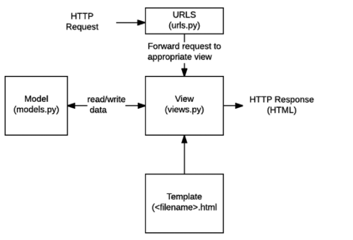
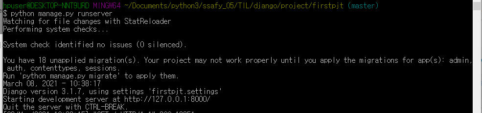
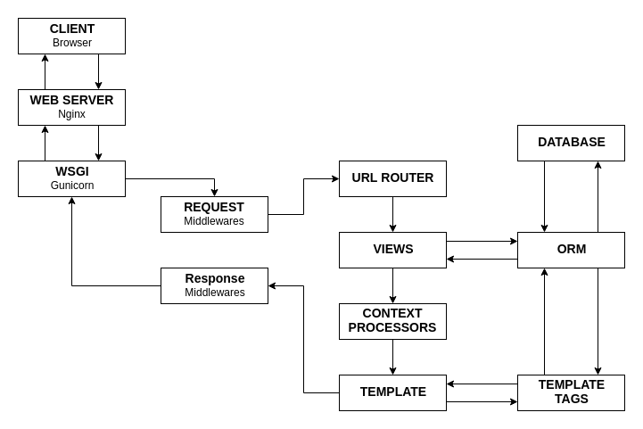
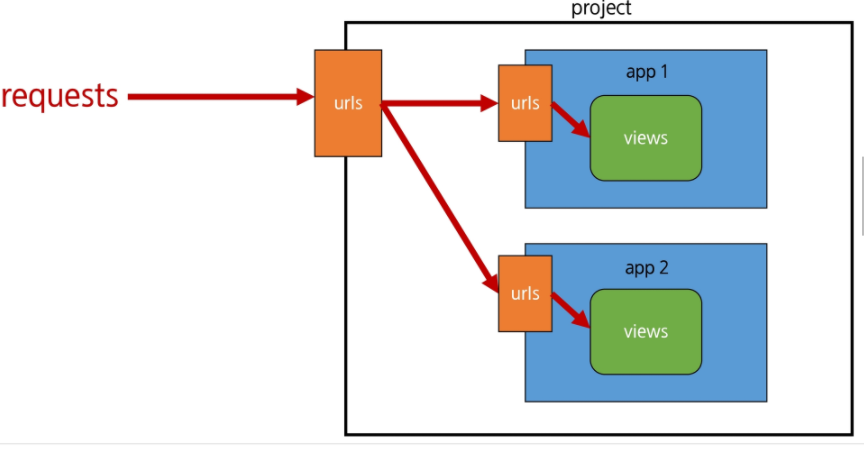
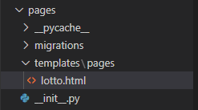

# Django란?

- Dynamic Web Web Application Program

  - static web : 미리 저장된 정적파일(HTML, CSS, JS)를 제공
  - Dyanamic Web :server에서 request을 처리해서 client에게 response를 보내주게 됨

- Python web framework

  - web framework: 웹페이지를 개발하는 과정에서 겪는 어려움을 줄이는 것이 주 목적
  - 가게를 창업할 때 스스로 다 하는 것과 프랜차이즈로 창업하는 것 정도의 차이
  - 기본적인 구조나 필요한 코드는 알아서 제공, 좋은 웹 서비스 만드는 것에 집중 가능

- 어느 기업에서 쓰는가?

  - spotify
  - Instagram
  - dropbox
  - delivery hero

- 구조

  - MVC(model view controller) 소프트웨어 디자인 패턴

    MTV(model template view) 같은 의미지만 django에서는 다르게 씀

    - 데이터 베이스 관리 : Model
      - 응용프로그램의 데이터 구조를 정의하고 데이터베이스의 기록을 관리(추가, 수정, 삭제)
    - 레이아웃(화면) : Template
      - 파일의 구조나 레이아웃을 정의
      - 실제 내용을 보여주는 데 사용 (presentation)
    - 중심 컨트롤러(심장) : View
      - HTTP 요청을 수신하고 HTTP 응답을 반환
      - Model을 통해 요청을 충족시키는데 필요한 데이터에 접근
      - 그리고 탬플릿에게 응답의 서식 설정을 맡김



# Django 설치

- pip 

```bash
pip install django
```

- 프로젝트 만들 공간위치로 cmd 열기  - 플젝생성
  - 플젝이름에는 python키워드(라이브러리 이름들, 함수명 등)와 하이픈을 쓰면 안됨
    - 하이픈은 언더바로 대체해서 쓸것
  - 만약 현재 위치에 바로 생성하고 싶다면 맨 뒤에 . 추가
    - 하단 폴더 안내려가고 바로 생성됨
  - 플젝명이 아니라 config 로 할 경우도 있음

```bash
django-admin startproject 플젝이름
django-admin startproject 플젝이름 . 
```

- 플젝 폴더에 하나 더 들어가면 플젝이름폴더, manage.py가 보임
  - 여기서 cmd 열기 - 서버 켜기
  - 끄고 싶으면 ctrl+c

```bash
python manage.py runserver
```





- (참고)runserver의 Automatic reloading
  - 개발 서버는 요청이 들어올 때마다(코드가 저장될 때 마다) 자동으로 Python 코드를 다시 불러온다. 
  - 코드의 변경사항을 반영하기 위해서 굳이 서버를 재가동 하지 않아도 된다. 
  - 그러나, 파일을 추가하는 등의 몇몇의 동작(커스텀 필터, 새로운 모듈 추가 등)은 개발 서버가 자동으로 인식하지 못하기 때문에, 이런 상황에서는 서버를 재가동 해야 적용되는 경우도 있다.

## VScode Django 추가 설치
- django extension
  - ctrl + shift + p → json검색 → Preferences: Open Settings (JSON) 선택
  - 추가 코드 작성
  ```
	// settings.json

  {
    ... 생략 ...,

    // Django
    "files.associations": {
      "**/*.html": "html",
      "**/templates/**/*.html": "django-html",
      "**/templates/**/*": "django-txt",
      "**/requirements{/**,*}.{txt,in}": "pip-requirements"
    },
    "emmet.includeLanguages": {
      "django-html": "html"
    }
  }
  ```
- pylance 
  - Article.ojbects.get(pk=pk) 할떄 Article에 밑줄그어지는거 사라지게 할 수 있음


# Django 프로젝트 폴더의 구성

- `__init__.py` 
  - 아무것도 안쓰여있음
    - 파이썬 2.x 대 버전과의 호환을 위해 만들어진 비어있는 파일입니다.
    - 파이썬 3.x 대 버전에서는 불필요하지만, 계속 생성 되어지는 파일입니다.
  - 이 프로젝트 디렉토리를 하나의 패키지로 인식하게 해주는 기능
- `asgi.py` 
  - 비동기 웹서버 연동에 사용됨
- `setting.py` 
  - django 설정
  - Application 등록,  file들의 위치, 데이터베이스의 세부사항, 보안에 관련된 것들 등등
    - 맨 하단의 Internationalization 수정해주기
    - `LANGUAGE_CODE = 'ko-kr'`  : 한글로 번역이 되어서 나옴
    -  `TIME_ZONE = 'Asia/Seoul'` : 데이터베이스 연동시간 서울표준시간으로
- `urls.py`
  - client요청을 가장 먼저 받는 곳
  - url 내부 연결을 지정해주는 역할(주소 관리)
- `wsgi.py`
  - 배포할 때 사용함



## Settings.py

- BASE_DIR 

  프로젝트 루트 폴더, 설정 파일이나 py 파일 등에서 프로젝트 루트 폴더를 찾아 그 하위를 탐색하거나 하는 일을 수행합니다.

- SECRET_KEY

  - 보안을 위해 사용 됩니다.

  - 세션값의 보호나 비밀번호 변경시 사용되는 보안 URL을 만드는 일 등에 사용

- DEBUG
  - 디버그 모드를 설정합니다.
  - True 일 경우 다양한 오류 메시지를 즉시 확인 할 수 있습니다.
  - 실제 어플리케이션 배포 시에는 False로 바꿉니다.
- ALLOWED_HOSTS
  - 현재 서비스의 호스트를 정합니다.
  - 실제 도메인을 기록합니다. (개발시에는 비워두기..)
  - Debug 모드가 False일 때, ALLOWED_HOSTS가 비어있으면 서비스를 시작 할 수 없습니다.

- INSTALLED_APPS
  - 장고 웹 서비스는 다양한 앱의 결합으로 만들어 집니다.
  - 현재 프로젝트에서 사용하는 앱의 목록을 기록하고 관리합니다.
  - 작성하고 추가 할 앱 또한 이곳에 추가 해 주어야 합니다.

- MIDDLEWARE
  - 장고의 모든 요청/응답 메시지 사이에 실행되는 특수한 프레임워크들입니다.
  - 주로 보안에 관한 내용들이 많습니다.

- ROOT_URLCONF
  
- 기준이 되는 urls.py의 경로를 설정합니다.
  
- TEMPLATES
  - 장고에서 사용하는 템플릿 시스템에 관한 설정들입니다.
  - 템플릿 해석 엔진과 폴더의 경로 등을 변경하는데 사용됩니다.

- WSGI_APPLICATION
  
  - wsgi 어필리케이션을 설정합니다.
  
- DATABASES
  
  - DB 관련 설정입니다.
  
- AUTH_PASSWORD_VALIDATORS
  
  - 비밀번호 검증을 위한 설정입니다. 기본적인 검증 로직이 들어있습니다.
  
- LANGUAGE_CODE
  
  - 다국어에 관한 설정.

## 요청과 응답
### urls.py

- 장고 서버로 요청(request)이 들어오면, 그 요청이 어디로 가야하는지 인식하고 관련된 함수(view)로 넘겨준다.

- `views.py` 에서 만든 함수를 연결시켜준다.

  ```python
  # first_project/urls.py
  
  from django.contrib import admin
  from django.urls import path
  from articles import views
  
  urlpatterns = [
      path('admin/', admin.site.urls),
      path('index/', views.index),
  ]
  ```

### views.py

- HTTP 요청을 수신하고 HTTP 응답을 반환하는 함수 작성
- Model을 통해 요청에 맞는 필요 데이터에 접근
- tempate에게 HTTP 응답 서식을 맡김

```python
# articles/views.py

def index(request): # 첫번째 인자는 반드시 request
    return render(request, 'index.html') # render의 첫번째 인자도 반드시 request
```


### Templates**

- `views.py`에서 지정한 `index.html` 파일을 만들자.

- Django에서 template이라고 부르는 HTML 파일은 기본적으로 **app 폴더안의 templates 폴더 안에 위치**한다. 

  ```html
  <!-- articles/templates/index.html -->
  
  <h1>만나서 반갑습니다!</h1>
  ```


# 장고 기본 명령들

- django-admin startproject : 장고 프로젝트를 만드는 명력. 웹 서비스를 만들 때 마다 한번 실행합니다.
- startapp : 프로젝트에 기능 단위인 앱을 새로 만들 때 사용
- makemigrations : 어플리케이션에 변경 사항을 추적해 DB에 적용 할 내용을 정리합니다. 앱 안의 모델에 변경 사항이 존재할 때 사용
- sqlmigrate : 실행 할 SQL 명령문을 출력합니다. 
- migrate: 실제 변경사항을 DB에 반영합니다.
- showmigrations : 프로젝트의 DB 변경사항 목록과 상태를 출력합니다.
- runserver : 테스트 서버를 실행합니다. 웹 서비스를 실제로 동작 시켜 확인합니다.
- dumpdata : 현재 DB의 내용을 백업할때 사용
- loaddata : 백업 파일에서 DB로 내용을 복구 할 때 사용합니다.
- flush : DB 테이블은 그대로 두고 테이블의 내용만 전부 삭제
- shell : 장고 쉘을 실행합니다. 작성한 모델 등을 불러 와 실제로 테스트 해 볼 수있습니다.
- dbshell : DB에 직접 접근 할 수 있는 쉘을 실행합니다. 장고 관리자에 문제가 있을 때 주로 dbshell을 통해 DB를 수정
- createsuperuser : 관리자 계정을 생성
- changepassword : 계정의 비밀번호를 변경 할 수 있습니다.


# Application

- 사이트가 기능적인 측면을 하기 위해서는 프로젝트가 하지는 않음
- 어플리케이션이 실제 기능을 구동함

## 만드는법

- 생성하면 django프로젝트폴더 위치에 어플리케이션 폴더가 하나 생김
  - 하단 명령어로 꼭 생성 후, settings 에 등록할것

```bash
python manage.py startapp 어플리케이션이름
```

## Application 폴더의 구성

- `__init__.py` 
  - 아무것도 안쓰여있음
  - 이 프로젝트 디렉토리를 하나의 패키지로 인식하게 해주는 기능
- `admin.py`
  - 관리자 역할을 관리
  - 자신이 만든 모델을 관리자 페이지에서 확인하거나 특별한 기능을 추가할 수 있음,
- `apps.py`
  - 수업끝날 때 까지 건들이지 않음
- `models.py`
  - MTV의 model역할
  - django는 이 모델을 이용해 DB의 종류에 상관 없이, SQL을 잘 모르더라도 DB를 편하게 이용 할 수 있도록 ORM을 사용합니다.
- `test.py`
  - 테스트 하는데 쓰이는 곳
- `views.py`
  - MTV의 veiw 역할
  - 페이지 관리(페이지 하나당, 하나의 함수)
- (개별생성)`urls.py`
  - "어떤 url"을 이용해 "어떤 view"를 동작 시킬까를 결정 해야 하는 것을 결정 해 주는 파일
- (개별생성)templates
  - 보통 HTML이 들어있는 파일입니다. 대부분 html 의 확장자를 가지고 있지만, html이 아닌 템플릿 코드들도 들어있습니다.


## 프로젝트에 application 등록하기

- `프로젝트.settings.py ` 열기

  - `INSTALLED_APPS = [ ... ]` 

    - 이곳에 맨 상단에 `application이름` 을 적기

    - 보통 application의 적는 순서는 이렇게 구성됨

      1. local apps
      2. 3rd-party apps
      3. django apps

    - 보게되면 리스트 맨 뒤에 요소 뒤에 `,` 가 붙은 것을 확인할 수 있음(trailing comma)

      django에서 권장되는 문법임


# 실험하면서 작동과정 체험해보기

## 페이지 연동시켜보기

- `프로젝트폴더.urls.py` 

```python
urlpatterns = [
    path('admin/', admin.site.urls),
    # path 첫번째 인자 : 연결시킬 주소
    # path 두번째 인자 : 어떤 View(application.함수명)를 연결시킬 것이냐  
]
```

- 연결시킬 View : `Application이름.views.py`
  - app 이름은 복수형으로 만들자
    - 사용하다보면 app의 단수형 이름 class를 사용할 경우가 생겨 혼동 생기는 것을 막기 위해 복수형으로 만드는 것이 좋다

```python
def index(request) : # view함수의 첫번째 인자는 request이어야함
    return render(request, '템플릿경로') 
    # 랜더링의 첫번째 인자도 request이어야함
    # 두번째 인자는 template 경로
```

- 다시 `프로젝트폴더.urls.py` 

```python
from articles import views # application의 view를 import 시키기

urlpatterns = [
    path('admin/', admin.site.urls),
	path('index/', views.index), # 방금 만든 views의 함수를 연동시킴
]
```

- 템플릿 만들기
  - `application폴더` 내부에 `templates` 폴더 생성
  - 폴더 안에 html 파일(예시 : index.html) 만들어주기
- View에 템플릿 등록하기

```python
def index(request) : # view함수의 첫번째 인자는 request이어야함
    return render(request, 'index.html') # 템플릿경로 작성
```


# Template

- 데이터 표현을 제어하는 도구이자 표현에 관련된 로직
- 사용하는 built-in system
  - Django template language

## Django template language(DTL)

- django template에서 사용하는 built-in template system
- 조건, 반복, 변수 치환, 필터 등의 기능을 제공
- 단순히 python이 HTML에 포함된 것이 아니며 
  - 프로그래밍적 로직이 아니라 프레젠테이션을 표현하기 위한 것
- 파이썬처럼 일부 프로그래밍 구조(if, for)를 사용할 수 있지만, 이것은 해당 python코드로 실행되는 것이 아님

## DTL Syntax

- 참고
  - Django Template Language(DTL)
    - https://docs.djangoproject.com/en/3.1/ref/templates/language/
  - Built-in template tags and filter
    - https://docs.djangoproject.com/en/3.1/ref/templates/builtins/

### Variable

- `{{ 변수명 }}` 
- render()를 사용하여 views.py에서 정의한 변수를 template 파일로 넘겨 사용하는 것
- 변수명은 영어, 숫자와 밑줄(_)의 조합으로 구성될 수 있으나, 밑줄로는 시작할 수없음
  - 공백이나 구두점 문자 또한 사용할 수 없음
- dot(`.`)을 사용하여 변수 속성에 접근할 수 있음
- render()의 세번째 인자로 {'key': value}와 같이 딕셔너리 형태로 넘겨주며, 여기서 정의한 key에 해당하는 문자열이 template 에서 사용 가능한 변수명이 됨.

### Filters

- `{{ 변수명|filter }}`
  - `{{ name|lower }}` : name 변수를 모두 소문자로 출력
- 표시할 변수를 수정할 때 사용
- 60개의 built-in template filters를 제공
- chained가 가능하며 일부 필터는 인자를 받기도함
  - `{{ 변수명|truncatewords:30 }}`

#### Length filter

```python
  <h3> 3. Length filter </h3>
  <p> {{students|length}} </p>
  
    
      <p>{{fruit}} 과일 이름이 기네요? </p>
    
      <p>{{fruit}} 과일 이름이 짧네요 </p>
    
    
```

#### 글자필터

```python
  <hr>
  <h3> 5. 글자필터 </h3>
  <p> {{ 'JIYOUNG'|lower}} </p>
  <p> {{'ji young'|title}} </p>
  <p> {{ students|random}} </p>
  <br>
```

#### 연산

```python
  <hr>
  <h3> 6. 연산 </h3>
  <p> {{4|add:6}} </p> 
```

#### 날짜

- https://docs.djangoproject.com/en/3.1/ref/templates/builtins/#date

```HTML
  <h3> 7. 날짜 </h3>
   현재시간을 여러 형태로 바꿔서 보여주기 
  <p> </p><!-- 2021년 3월 9일 12:40 오후--> 
  <p> </p><!--2021-3-9 12:40 -->
  <p> </p><!--2021년 3월 9일 -->
  <p> </p><!-- 2021-3-9.-->
  <p> </p> <!--2021년 03월 09일 12:40-->
  <p>  <!-- 2021년 03월 09일 (화요일) 오후 12:44-->

   출력결과를 변수로 저장해서 활용하기 
  
  <p>{{ current_year}}</p><!-- 2021-->

```

### Tags

- `` 
- 출력 텍스트를 만들거나, 반복 또는 논리를 수행하여 제어 흐름을 만드는 등 변수보다 복잡한 일들을 수행
- 일부 태그는 시작과 종료 태그가 필요
  - `` ... ``
- 약 24개의 built-in template tags를 제공

#### for문

```python
  <h1>DTL 연습페이지</h1>
  <hr>
  <h3>1. for </h3>
  <p> for 문 돌릴 것 : {{students}}</p>
  
    <p>{{student}}</p>
  
  
  <br>
  <p>for 문 인덱스사용하기 </p>
  
    <p>{{ forloop.counter }} {{fruit}} </p> 
  
  <br>

  <p>for문 비어있을 경우</p>
  
    <p> {{ user }} </p>
  
    <p> 유저정보가 없습니다 </p>
  
  <br>
```

#### if 문

```python
  <hr>
  <h3> 2. if </h3>
   
    <p> 반장있어요 </p>
  
    <p> 반장없음 </p>
  
  <br>

  
     루프에서 첫번째 이면 
    
      <p> 첫번째 학생은 {{student}}님 입니다. </p>
    
      <p> {{stduent}} </p>
    
  
  <br>
```

#### lorem

- ``

  | `count`  | 생성 할 단락 또는 단어 수를 포함하는 숫자 (또는 변수)입니다 (기본값은 1). |
  | -------- | ------------------------------------------------------------ |
  | `method` | 어느 `w`단어에 대한 `p`HTML 단락 또는 `b` 일반 텍스트 단락 블록 (기본값입니다 `b`). |
  | `random` | `random`주어진 경우 단어 는 텍스트를 생성 할 때 공통 단락 ( "Lorem ipsum dolor sit amet…")을 사용하지 않습니다. |


### Comments

- `{# lorem ipsum #}`
- django template에서 줄의 주석을 표현하기 위해 사용
- 아래처럼 유효하지 않은 템플릿 코드가 포함될 수 있음
  - `{# {% if .. % }text #}`
- 한줄 주석에만 사용할 수 있음( 줄바꿈이 허용되지 않음)
- 여러 줄 주석은 `` 와 `` 사이에 입력


## Template inheritance 

- 템플릿 상속은 기본적으로 코드의 재사용성에 초점을 맞춤
- 템플릿 상속을 사용하면 사이트의 모든 공통요소를 포함하고, 하위 템플리이 재정의(override) 할 수 있는 블록을 정의하는 기본 "skeleton" 템플릿을 만들 수 있음
- `` 
  - 자식(하위)템플릿이 부모 템플릿을 확장한다는 것을 알림
  - 반드시 **템플릿 최상단** 에 작성되어야함
    - 즉, 2개 이상 사용할 수 없음
- `` 
  - 하위 템플릿에서 재지정(overriden)할 수 있는 블록을 정의
  - 즉, 하위 템플릿이 채울 수 있는 공간
  - 가독성을 높이기 위해 선택적으로 ``태그에 이름 지정

### Base.html 만들기

- base.html 하고 (위치 : 프로젝트/templates  폴더 만들고 안에)

  - index.html 재정의 - 코드가 엄청 짧아짐(간결)

  ```HTML
  
  
    <h1> 만나서 반가워요 </h1>
  
  ```

  

- 플젝.settings 에서 templates 
  - `app_dirs:True` : 이거는 templates/ 경로를 생략해도 되는 이유

    - 템플릿 로더가 앱의 템플릿 디렉토리를 검색하여 템플릿을 찾습니다.

    ```
    myapp/
        templates/
            blog/
                list.html
                post.html
    ```

    

  - `dirs`: 여기에 

    - `[BASE_DIR / 'firstpjt' / 'templates'],

      - python pathlib 

      - 이렇게 사용시 os에 따른 경로표현(window는 역슬래쉬, mac은 슬래쉬)에 상관없이 경로 표현이 가능해짐

      -  settings 상단에 찾아보면 `BASE_DIR = Path(__file__).resolve().parent.parent` 이런게 있음

        의미는 현재 프로젝트 최상단 디렉토리 위치임

      - 템플릿 로더는 먼저 《DIRS》 디렉토리에서 템플릿을 찾습니다.


## Template의 Django 설계 철학

- 표현과 로직(view)을 분리
  - 템플릿 시스템은 표현을 제어하는 도구이자 표현에 관련된 로직일 뿐이라고 생각
  - 즉, 템플릿 시스템은 이러한 기본 목표를 넘어서는 기능을 지원하지 말아야 한다.
- 중복을 배제
  - 대다수의 동적 웹사이트는 공통 header, footer, navbar 같은 사이트 공통 디자인을 갖는다.
  - Django 템플릿 시스템은 이러한 요소를 한 곳에 저장하기 쉽게 하여 중복 코드를 없애야한다.
  - 이것이 템플릿 상속의 기초가 되는 철학이다.


# HTML form

- 웹에서 사용자 정보를 입력하는 여러 방식(text, button, checkbox, file, hidden, image, password, radio, reset, submit)을 제공하고, 사용자로부터 할당된 데이터를 서버로 전송하는 역할을 담당
- 핵심 속성
  - action : 입력 데이터가 전송될 URL 지정
  - method : 입력 데이터 전달 방식 지정

## HTML input element

- 사용자로부터 데이터를 입력받기 위해 사용
- type속성에 따라 동작방식이 달라짐
- 핵심 속성
  - name
  - 중복가능, 양식을 제출했을 때 name이라는 이름에 설정된 값을 넘겨서 값을 가져올 수 있음
  - 주요 용도는 GET/POST방식으로 서버에 전달하는 파라미터(name은 key, value는 value)로 `?key=value&key=value` 형태로 전달

## HTTP

- HyperTeext Transfer Protocol
- 웹에서 이루어지는 모든 데이터 교환의 기초
- 주어진 리소스가 수행 할 원하는 작업을 나타내는 request methods를 정의
- HTTP request method 종류
  - GET, POST, PUT, DELETE ...


### GET - HTTP request method

- 서버로부터 정보를 조회하는 데 사용
- 데이터를 가져올 떄만 사용해야함
- 데이터를 서버로 전송할 때 body가 아닌 Query String Parameters를 통해 전송
- 우리는 서버에 요청을 하면 HTML 문서 파일 한 장을 받는데 이 떄 사용하는 요청의 방식이 GET


## 실습 - 데이터 받아서 넘기는 페이지 만들기

- 첫번째 view = 데이터 받는 template

  - `프로젝트.urls` > urlpatterns 에 `path('throw/', views.throw), ` 추가

  - `어플리케이션.views`  에 throw 함수 추가

    ```python
    def throw(request) :
        return render(request, 'throw.html')
    ```

  - `어플리케이션.templates`에 throw.html 추가

  ```html
  
  
  
    <h1>THROW</h1>
     action은 어느 페이지로 넘겨줄지 
    <form action="/catch/" method="GET"> 
      <label for="message">Throw: </label>
      <input type="text" name="message" id="message">
      <input type="submit">
    </form>
  
  ```

  

- 두번째 view - 보내준 데이터 받는 view

  - `프로젝트.urls` > urlpatterns 에 `path('catch/', views.catch), ` 추가

  - `어플리케이션.views`  에 throw 함수 추가

    ```python
    def catch(request) :
        message = request.GET.get('message') # request 객체에서 GET 에서, throw에서 text input의 name = message
        context = {
            'message' : message,
        }
        return render(request, 'catch.html', context)
    ```

    

  - `어플리케이션.templates`에 catch.html 추가

    ```DTL
    
    
    
      <h1>{{message}}</h1>
    
    ```

    


# URL

- Django URLs

  - Dispatcher(발송자, 운항 관리자) 로서의 URL
  - 웹 어플리케이션은 URL을 통한 클라이언트의 요청에서부터 시작 됨


## App URL mapping

- app의 view 함수가 많아지면서 사용하는 path() 또한 많아지고, app 또한 더 작성되기 때문에 프로젝트의 urls.py에서 모두 관리하는 것은 코드 유지보수에 좋지 않음

- 이제는 각 app에 urls.py를 작성하게 됨

  - 원래 app에 urls.py는 없다.

  - 근데 여러개의 app으로 구성될경우 `프로젝트.settings`에서 import 받을 때 충돌이 나겠지? 물론 as를 이용해서 각각 이름을 나눠줘도 되긴 하지만 복잡해짐

    - `어플리케이션.urls.py`

      ```python
      from django.urls import path
      from . import views # django는 명시적인 경로 표현을 선호함
      
      urlpatterns = [
          # 원래 프로젝트.urls에 있던 것을 가져옴 - admin 제외
          path('index/', views.index), 
          path('greeting/', views.greeting), 
          path('throw/', views.throw),
          path('catch/', views.catch),
      ]
      ```

    - `두번쨰어플리케이션.urls.py`

      ```python
      from django.urls import path
      from . import views # django는 명시적인 경로 표현을 선호함
      
      urlpatterns = [
          # 두번째 어플리케이션 내부의 view를 연동
      ]
      ```

    - 그럼 project의 urls는 아무런 역할을 안하냐?

      그것은 아님 `articles.urls`로 갈지 `pages.urls`로 갈지  판단하여 넘겨줌

      ```python
      from django.contrib import admin
      from django.urls import path, include # app의 urls 로 넘기기 위해 include 추가
      from articles import views
      
      urlpatterns = [
          path('admin/', admin.site.urls),
          # path 첫번째 인자 : 연결시킬 주소
          # path 두번째 인자 : 어떤 View(application.함수명)를 연결시킬 것이냐
          path('articles/', include('articles.urls')),
          path('pages/', include('pages.urls')),
      ]
      ```




## Variable routing (동적 라우팅)

- 주소 자체를 변수처럼 사용해서 동적으로 주소를 만드는 것

- 하는 법

  - `urls`

  ```python
  path('hello/<str:name>/', views.hello), # str: 은 기본값이라 생략가능, int나 다른 변수형은 명시해주어야함
  ```

  - `views.py`

  ```python
  def hello(request, name) : # 주소로 넘겨받은 name변수값 
      context = {
          'name' : name,
      }
      return render(request, 'hello.html', context)
  ```

## Including other URLconfs

```python
# firstpjt/urls.py

from django.contrib import admin
from django.urls import path, include


urlpatterns = [
    path('admin/', admin.site.urls),
    path('articles/', include('articles.urls')),
    path('pages/', include('pages.urls')),
]
```


`include()`

- 다른 URLconf(app1/urls.py)들을 참조할 수 있도록 도움
- 함수 include()를 만나게 되면, URL의 그 시점까지 일치하는 부분을 잘라내고, 남은 문자열 부분을 후속 처리를 위해 include된 URLconf로 전달

## Naming URL patterns

- 이제는 링크에 url을 직접 작성하는 것이 아니라 path()함수의 name인자를 정의해서 사용
- Django Template Tag 중 하나인 url 태그를 사용해서 path() 함수에 작성한 name을 사용할 수 있음
- url 설정에 정의된 특정한 경로들의 의존성을 제거할 수 있음

```python
path('index/', views.index, name='index')
```

```html
<a href="">메인 페이지</a>
```
- ``

  - 주어진 URL 패턴 이름 및 선택적 매개 변수와 일치하는 절대 경로 주소를 반환
  - 템플릿에 URL을 하드 코딩하지 않고도 DRY 원칙을 위반하지 않고 링크를 출력하는 방법

## Namespace

- application이 많아질 경우 naming url 사용시 어떤 application과 연동된 페이지인지 알기가 힘들어짐

- `어플리케이션.templates` 안에 `어플리케이션이름` 폴더를 하나 더 만들고 그 안에 html 파일을 넣는 방식을 취함
  - Django는 기본적으로 `app_name/templates/` 경로에 있는 templates 파일들만 찾을 수 있으며, INSTALLED_APPS에 작성한 app 순서로 tamplate을 검색 후 렌더링
  - 임의로 templates의 폴더 구조를 `app_name/templates/app_name` 형태로 변경해 임의로 이름 공간 생성 후 변경된 추가 경로 작성하는 것임



- `어플리케이션.urls`에서 app_name 속성 활성화
  - URL namespace를 사용하면 서로 다른 앱에서 동일한 URL 이름을 사용하는 경우에도 이름이 지정된 URL을 고유하게 사용 할 수 있음
  - urls.py에 `app_name` attribute 값 작성
```python
app_name = '어플리케이션이름'
urlpatterns = [
	...
]
```
  

- view 단에서 연결시켜줄 때 `어플리케이션/페이지이름.html` 로 접근

  ```python
  def lotto(request) :
      now_lotto = random.sample(range(1:46), 7)
  
      context = {
          'now_lotto6' : now_lotto[:6],
      }
  
      return render(request, 'pages/lotto.html', context)
  ```

- 실제페이지에서 연동할 때 `어플리케이션.urls.py > app_name`의 속성에 의하여 연동됨

  ``  와 같이 url 이후 `해당어플리케이션:페이지` 로 어느 어플리케이션에서 쓰는지 명시하면서 사용


