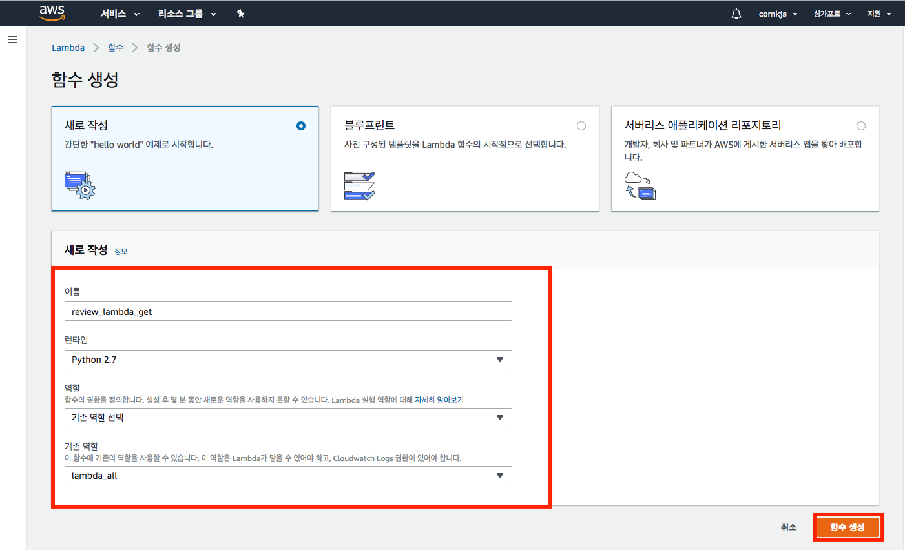
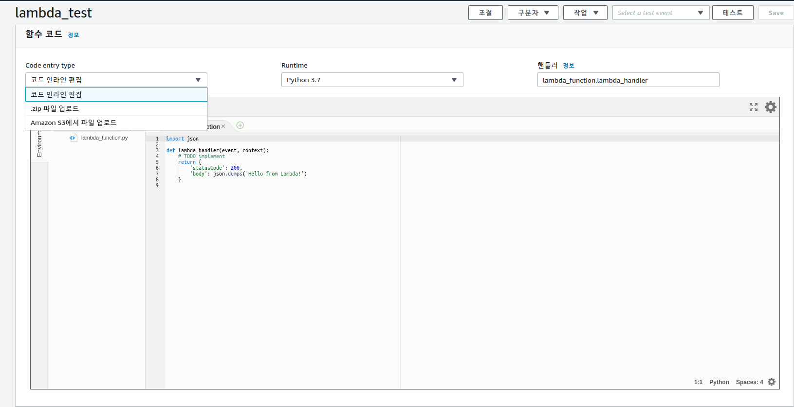
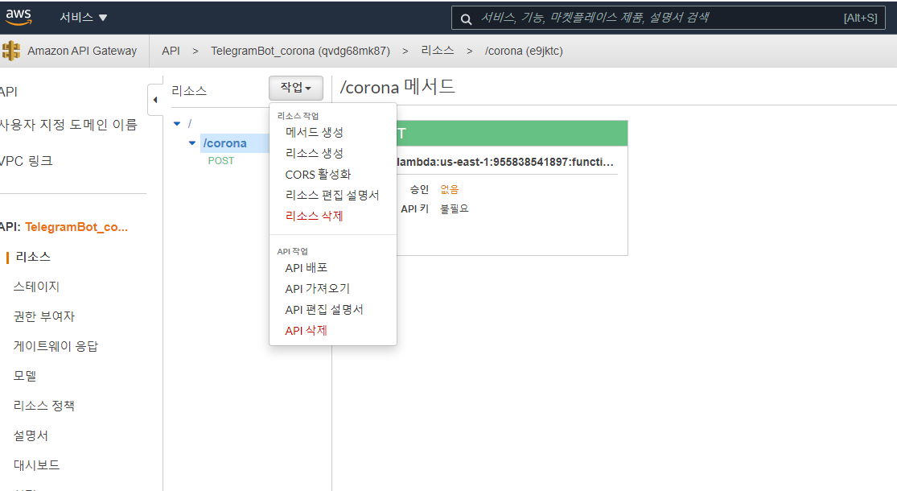

# Lambda 함수 생성하기
## 함수생성
https://us-east-2.console.aws.amazon.com/lambda/home?region=us-east-2#/functions

기존 역할 생성이 아니라 기본 Lambda 권한을 가진 새 역할 생성 으로


## 함수 로직짜기
‘Hello from Lambda’ 문자열로 리턴되는 Lambda 함수가 생성

## lambda 코드 배포하는 법

1. 인라인 편집기(간단한 코드의 경우 온라인에서 코딩하고 바로 실행) - 외부 라이브러리 사용 불가
2. zip파일 업로드( 50Mb 이하 외부 라이브러리 이용)
3. S3 (50Mb 이상 zip과 마찬가지)

### zip 파일 업로드로 배포
https://docs.aws.amazon.com/ko_kr/lambda/latest/dg/python-package.html

1. 사용 패키지 폴더에 설치하기

> pip install firebase-admin -t .

>  pip install lambdagram -t .

터미널 디렉토리 위치에 라이브러리를 설치해라 라는 의미로 해당 폴더의 하위폴더에 패키지들이 주르륵 깔린다.

2. 이 주르륵 깔린 패키지 파일들을 선택하여 하나의 zip 파일로 묶어준다.

3. .zip 파일 업로드를 선택하여 묶어준 zip 파일을 선택하여 업로드하다.



4. 업로드가 완료되면 파일 목록에 패키지 파일과 폴더들이 보이고, 그 이후에는 기존에 쓰던 것처럼 import를 통해 패키지를 사용하는 것이 가능하다.

(추가사항)

여기보면 lambda_function.lambda_handler 가 핸들러라고 되어있다.

zip 파일안에 내가 실행시킬 py의 이름을 lambda_function 이라고 파일 이름을 짓고

그 안에 lambda_handler 실행시킬 main 함수의 이름을 지어 놓으면 실행된다.

올리고 나서 상단의 테스트를 통해서 잘 실행이 되는지 확인해보면 좋다.


## lambda_function.lambda_handler 메서드 구성
```python
def lambda_handler(event, context): # Basic function signature on AWS lambda 
    
    내용
    
    return log에 저장될 값
```
### event

> 사용자 요청에 대한 정보를 담고 있다.
>
> type은 딕셔너리이다.
>
> 아래는 텔레그램 봇을 만들 떄 POST 메시지로 보낸 요청을 lambda 함수가 받은 것이다.

```python
{
	'update_id': 439837311,
	'message': {
		'message_id': 13,
		'from': {
			'id': 93827364,
			'is_bot': False,
			'first_name': '홍길동',
			'username': 'honggildong',
			'language_code': 'ko-KR'
		},
		'chat': {
			'id': 93827364,
			'first_name': '홍길동',
			'username': 'honggildong',
			'type': 'private'
		},
		'date': 1520404199,
		'text': 'test message'
	}
}
```

### context

https://docs.aws.amazon.com/ko_kr/lambda/latest/dg/python-context.html

> 이 객체는 호출, 함수 및 실행 환경에 관한 정보를 제공하는 메서드 및 속성들을 제공한다.


## 웹훅
> 웹훅을 이용하면 getUpdates를 실시간으로 감시하지 않아도 메시지가 도착하면 텔레그램이 알려준다.

- 웹훅을 등록/해지 하는 주소

https://api.telegram.org/TOKEN/setWebhook

예시 :  https://api.telegram.org/bot코드:코드/setWebhook

GET으로 호출하면 아래와 같은 메시지를 리턴하면서 웹훅이 해지되어있음을 알려준다.

```python
{"ok":true,"result":true,"description":"Webhook is already deleted"}
```

- 웹훅 등록하기

[https://api.telegram.org/bot${telegramBotToken}/setWebhook?url=${callbackURL}](https://api.telegram.org/bot/setWebhook?url=)

예시 : https://api.telegram.org/bot코드:코드/setWebhook?url=https://qvdg68mk87.execute-api.us-east-1.amazonaws.com/corona_test/corona

${telegramBotToken}은 봇 token을 입력해 줍니다.
${callbackURL}은 Lambda함수와 연결되어 있는 APIGateway URL을 입력해 줍니다.

콜백받을 Amazon API Gateway 는 스테이지에 가면 호출 url을 알 수 있다.
내꺼 : https://qvdg68mk87.execute-api.us-east-1.amazonaws.com/

https://qvdg68mk87.execute-api.us-east-1.amazonaws.com/corona_testv3

성공적으로 등록 될 시 아래와 같이 출력된다.

```python
{"ok":true,"result":true,"description":"Webhook was set"}
```


- 웹훅 삭제하기

[https://api.telegram.org/bot${telegramBotToken}/setWebhook?url=](https://api.telegram.org/bot/setWebhook?url=)

${telegramBotToken}은 봇 token을 입력해 줍니다.
url을 비우면 웹훅 삭제가 됩니다.

```python
{"ok":true,"result":true,"description":"Webhook is already deleted"}
```


## 테스트 하기
```json
#Test
{
	"update_id": 1544010213,
	"message": {
		"message_id": 13,
		"from": {
			"id": 1544010213,
			"is_bot": false,
			"first_name": "홍길동",
			"username": "honggildong",
			"language_code": "ko-KR"
		},
		"chat": {
			"id": 1544010213,
			"first_name": "홍길동",
			"last_name": "honggildong",
			"type": "private"
		},
		"date": 1520404199,
		"text": "test message"
	}
}
```

```python
#결과
event : {
    'update_id': 1544010213, 
    'message': {
        'message_id': 13, 
        'from': {
            'id': 1544010213, 
            'is_bot': False, 
            'first_name': '홍길동', 
            'username': 'honggildong', 
            'language_code': 
            'ko-KR'}, 
        'chat': {'id': 1544010213, 
                 'first_name': '홍길동', 
                 'username': 'honggildong', 
                 'type': 'private'}, 
        'date': 1520404199, 
        'text': 'test message'}
}    

context : <__main__.LambdaContext object at 0x7fe470448f60>"
```

## AWS API GateWay와 lambda 연동
메서드 생성 > post 메서드 생성 (텔레그램에서 post방식으로 보냄) > 만들었던 lambda와 연동


## 로그 확인하기
CloudWatch > cloudWatch Logs > Log groups > 내가 만든 람다식

을 확인해서 에러가 어디에서 났는지 확인 가능함

AWS 람다 공식문서

https://docs.aws.amazon.com/ko_kr/lambda/latest/dg/welcome.html
