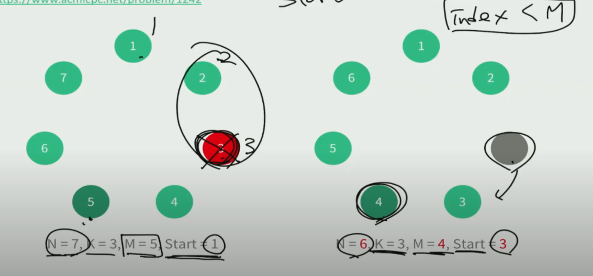
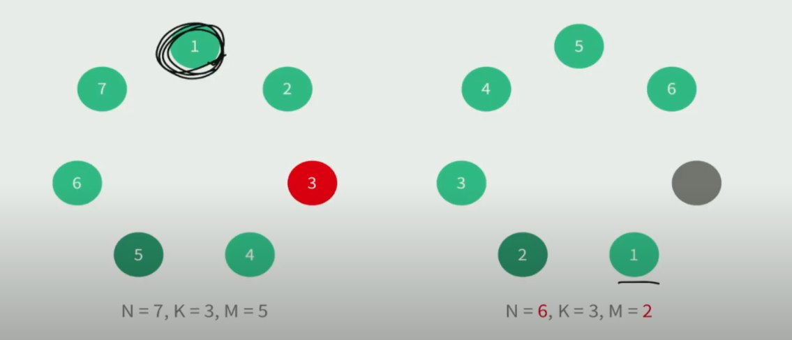

- https://www.acmicpc.net/problem/1242


# 1. 시뮬레이션식 구현

- 시간초과
- list를 만들어서 문제에 적힌 대로 리스트를 pop 하면서 pop한 내용이 M과 같을 때 종료하고 몇번째인지 출력하게 구현
  - 시간 복잡도 : O(NK)

```python
N, K, M = map(int, input().split())

arr = list(range(1, N+1))

def func(arr, K, M) :
    start_len = len(arr)
    cnt = 0
    while True :
        cnt = (cnt + K -1) % len(arr) # 제거할 번호 고르기
        now = arr.pop(cnt) # 제거
        if now == M : # 제거된 것이 M인지 확인
            return start_len - len(arr)


print(func(arr, K, M))
```


# 2. 리스트 없이 풀이 - 1

- 아이디어 

  - 우리는 전체적으로 몇 번이 언제 제거되는지 알 필요가 없이 M번째 사람만 중요
  - 제거 하고 뒤에 번호들을 다시 땡김
    - 제거되는index < M 이면 M=M-1 , N = N-1
    - 제거되는 index >M 이면 N = N-1
    - start 위치는 계속 변경



- 리스트를 만들지 않고 변수 4개만 이용해서 풀이

  - 시간 복잡도 : O(N)

| 제출 번호 | 아이디                                              | 문제                                         | 문제 제목 | 결과             | 메모리 | 시간 | 언어     | 코드 길이 | 제출한 시간 |
| :-------- | :-------------------------------------------------- | :------------------------------------------- | :-------- | :--------------- | :----- | :--- | :------- | :-------- | :---------- |
| 27938904  | [swhan9404](https://www.acmicpc.net/user/swhan9404) | [1242](https://www.acmicpc.net/problem/1242) | 소풍      | **맞았습니다!!** | 28776  | 1088 | Python 3 | 421       |             |

```python
N, K, M = map(int, input().split())

M -=1 # 0번부터 시작하는 것처럼 맞추기

def func(N, K, M, start) :
    cnt =0
    while True :
        cnt +=1
        next_start = (start-1+K)% N
        if next_start == M :
            return cnt
        elif next_start < M :
            M -=1
        else : # next_start > M
            pass
        
        N -= 1
        start = next_start

print(func(N, K, M, 0))
```


# 3. 리스트 없이 풀이 -2

- 아까는 항상 1을 기준으로 번호를 셋다고 하면 

  이번에는 항상 제거되는 숫자를 기준으로 번호를

- 이렇게 하면 아까 계속 나머지 연산을 하기 위해 나머지 값을 쓰던 것을 안쓸 수 있음

  - 어느위치에서 시작하는지 매개변수도 필요없음
  - 속도 상승

- 그럼 동호의 번호는 어떻게 구할까?

  - M = M-K
    - M 이 음수가 되면 +N 해줌
  - N = N- 1




| 등수 | 제출 번호 | 시도 | 아이디                                              | 메모리 | 시간 | 언어                                                         | 코드 길이 | 제출한 시간 |
| :--- | :-------- | :--- | :-------------------------------------------------- | :----- | :--- | :----------------------------------------------------------- | :-------- | :---------- |
| 2    | 27940515  | 5    | [swhan9404](https://www.acmicpc.net/user/swhan9404) | 28776  | 992  | [Python 3](https://www.acmicpc.net/source/27940515) / [수정](https://www.acmicpc.net/submit/1242/27940515) | 232       |             |


```python
N, K, M = map(int, input().split())

def func(N, K, M) :
    cnt = 0

    while True :
        cnt+=1
        M -= K
        while M<0 : # 나머지 계산을 하지 않고 처리하는 방법
            M+= N
        if M == 0 :
            return cnt
        N-=1

print(func(N, K, M))
```

