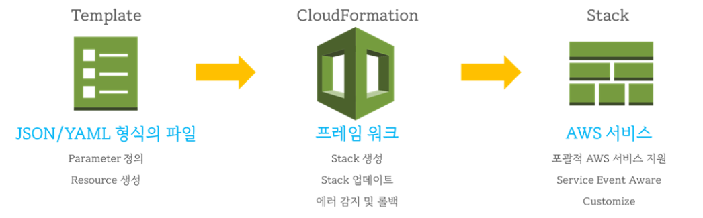

# CloudFormation

- CloudFormation이란?
  - AWS Infrastructure를 개략적으로 설명하여 선언하는 방법 (Infrastructure as Code - IaC)
  - CloudFormation은 정의한 대상에 대해 자동으로 순서대로 자원을 생성
  - 아키텍처의 전체 정의가 하나의 파일에 있고 AWS에 제출하여 AWS가 모든 리소스를 관리

- 스택
  - CloudFormation 기능으로 자동 생성된 AWS 리소스의 집합을 나타냄
  - CloudFormation은 스택 단위로 리소스를 관리하기 위해 스택에 연관된 리소스를 한번에 구축하거나 한번에 제거할 수 있음
  - 리소스간에는 의존관계가 있는 경우가 많은데 예를 들어 VPC와 EC2 인스턴스에서 VPC가 없다면 인스턴스를 만들 수 없다. 이같은 의존 관계를 CloudFormation이 자동 구축 시에 판단하고 구축하는 순서에 모순이 없도록 결정
- 템플릿
  - 스택 구성을 결정하는 설계자로서 CloudFormation의 핵심 요소
  - JSON이나 YAML 형식으로 기술
  - 템플릿은 AWS 리소스를 기술하는 장소, 실행조건을 기술하는 장소 등의 몇 개 섹션으로 구성
  - 템플릿 생성을 지원하는 내장함수가 존재하며 이 내장함수를 사용해 범용성 높은 템플릿 구성 가능

## 작동방식

1. 템플릿 작성
2. 템플릿 업로드
3. 스택 생성
4. 스택 설정 및 리소스 생성

## 탬플릿 작성법

- 양식
  - JSON 이나 YAML 형식으로 작성
- 템플릿 만드는 곳
  - https://console.aws.amazon.com/cloudformation/designer/home
  - 에서 JSON  -> YAML  또는 그 반대로 자유로 변경할 수 있음
  - 템플릿에 선언된 리소스를 그래픽으로 표시하고 편집할 수 있는 기능도 제공
- 템플릿 구성 요소
  - Resources (리소스)
    - 구축하는 AWS 리소스를 정의하는 섹션 (사용하는 AWS 서비스의 정의를 기술)
  - Parameters (파라미터)
    - 템플릿 실행 시에 사용자가 선택하는 항목을 정의하는 섹션
    - 동일한 템플릿에도 용도에 따라 템플릿 설정 값을 변경하려는 경우 사용 (예를 들어 인스턴스 유형을 운영환경에서는 t2.large로 사용하지만 개발환경에서는 t2.small로 지정하고 싶은 경우) 
    - 파라미터 섹션을 이용해 CloudFormation 실행 사용자에게 인스턴스 유형을 선택하게 할 수 있음
    - 파라미터를 통해 스택을 생성하거나 업데이트 할 때마다 템플릿에 사용자 지정 값을 입력할 수 있음
  - Mappings (매핑)
    - Map 형식의 변수를 정의하는 섹션
    - 템플릿의 실행 환경에 따라 달라질 수 있는 값을 사전에 맵 형식으로 정의할 수 있음
    - 리전마다 설정 값이 다른 경우 등은 Mappings 섹션에 정의해 두고 리전마다 사용하는 값을 변경할 수 있게함
  - Conditions (조건)
    - 조건에 따라 템플릿의 동작을 바꾸고 싶은 경우 사용 (예를 들어 조건을 충족할때만 EC2 인스턴스를 시작하는 경우) 
  - Output (출력)
    - 구축된 리소스에 관한 정보 중에서 관리 콘솔 등에 출력하는 정보를 정의
    - 정의한 값은 관리 콘솔에서 확인할 수 있을뿐더러 다른 AWS 리소스를 구축할 때 사용할 수 있음
  - Metadata (메타데이터)
    - 템플릿에 대한 세부 정보를 제공하는 임의 JSON 또는 YAML 객체를 포함할 수 있음 (특정 리소스에 대한 템플릿 구현 세부 정보를 포함할 수 있음)
    - 스택 업데이트 중에는 메타데이터 섹션을 자체적으로 업데이트할 수 없음, 리소스를 추가 / 수정 / 삭제하는 변경 내용을 포함할 때만 업데이트할 수 있음
  - Transform (변환)
    - 템플릿을 처리하는데 사용하는 하나 이상의 매크로를 지정
    - CloudFormation에서는 지정된 순서에 따라 매크로를 실행하고 변경 세트를 생성할 때 CloudFormation에서 처리된 템플릿 콘텐츠를 포함시키는 변경 세트를 생성 (변경사항을 검토하고 변경 세트를 실행)

## 특징

- 표준화된 템플릿 파일로 전체 인프라를 모델링
  - 별도로 인프라를 표준화하는 작업이 필요하지 않고 이미 정의된 CloudFormation 템플릿을 사용하기만 하면된다.
  - 템플릿에 대한 자세한 설명도 AWS CloudFormation 사용 설명서에 나와 있다.
- 인프라를 코드로 관리(Infrastructure as code)
  - 코드를 Git과 같은 버전 관리 시스템으로 관리하면 개발자가 소스코드를 관리하는 것과 비슷하게 인프라를 관리할 수 있다.
- 인프라 관리가 편리
  - 템플릿에 리소스를 정의하기만 하면 리소스를 생성하고 리소스가 서로 연계되도록 구성
  - 리소스가 더 이상 필요하지 않으면 스택을 삭제하는 것만으로 전체 리소스를 삭제 가능
  - 인프라 구성을 재사용한다. 한번 구성한 인프라는 얼마든지 다시 구축할 수 있다. 
  - 한 리전에서 사용한 템플릿을 다른 리전에서 동일하게 사용한다. 같은 리전에서 재사용하려면 스택 이름을 다르게 설정
- 사용 요금이 없다. 생성된 리소스에 대한 요금만 지불하면 되고 CloudFormation 자체에는 별도로 요금이 부과되지 않는다.

### 비슷한 툴?

- **Terraform**

  HashiCorp에서 오픈 소스로 개발하고 있는 인프라 관리 툴이다. CloudFormation과 마찬가지로 코드에 필요한 리소스를 선언하여 관리할 수 있게 한다. 하지만 사용할 수 있는 리소스가 AWS 에 국한되지 않는다.

- **Vagrant**

  역시 HashiCorp에서 개발하고 있는 개발 환경 관리 툴이다. 프로덕션용 인프라를 구축하기 보다는 개발 환경 구성에 특화되어 있다. 예를 들어, 공유폴더나 HTTP 터널링 같은 설정을 쉽게 할 수 있다.

  

## 장점

1. Infrastructure as code
   - 수동으로 리소스를 만들지 않아도 된다.
   - Github을 활용하여 제어
   - 코드를 통하여 인프라 변경사항을 검토 가능
2. Cost
   - 리소스 비용을 쉽게 추정할 수 있다.
   - 필요한 경우만 CloudFormation을 배포하고 필요하지 않을 경우 삭제하여 비용 절감 예)오후 5시에 자원을 삭제하고, 다음날 오전 8시에 자원을 생성

3. Productivity
   - 클라우드 상 인프라를 즉시 삭제하거나 재 생성이 가능
   - Diagram 기능으로 Template 구성 가능 (Automated Generation)
   - Declarative Programming (선언적 프로그래밍)
   - Don’t re-invent the wheel (불필요하게 처음부터 다시 하지 마라!!!)
   - 웹 상에 기존 Template을 활용하라.
   - 다양한 정보와 문서가 많이 있다.