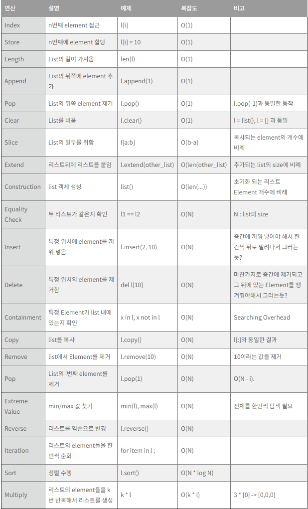
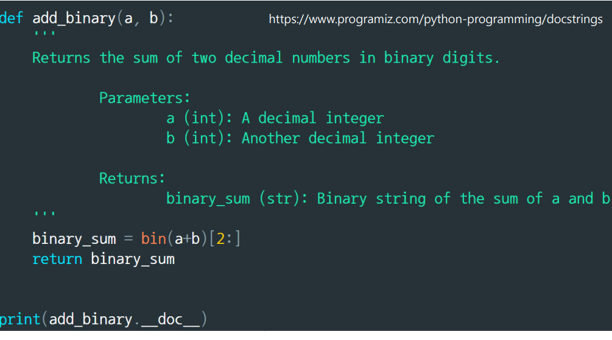

# 📌 Life is short, you need python

------

## 📄 Variable & List

### ✏️ Variables

**변수(Variable)란 가장 기초적인 프로그래밍 문법 개념으로, 데이터(값)을 저장하기 위한 메모리 공간의 프로그래밍상 이름이다.** 변수는 **메모리 주소** 를 가지고 있고 변수에 들어가는 **값** 은 **메모리 주소**에 할당된다. 그래서 변수가 선언되는 순간 **메모리 특정영역에 물리적인 공간**이 할당되며 해당 값은 메모리에 저장된다.

- 변수 이름 작명법
  - 알파벳, 숫자, 언더스코어(_) 로 선언 가능.
  - 변수명은 의미 있는 단어로 표기하는 것이 좋다.
  - 변수명은 대소문자가 구분된다.
  - 특별한 의미가 있는 예약어는 쓰지 않는다.
- 기본 자료형
  - 정수형 (integer) : 양/음의 정수 (ex. 1,2,3,100, -9)
  - 실수형 (float) : 소수점이 포함된 실수 (ex. 10.2, -9.3, 9.0)
  - 문자형 (string) : 따옴표 ("")에 들어가 있는 문자형 (ex. abc, a20abc)
  - 논리 자료형 (boolean) : 참 또는 거짓 (ex. True, False)
- 사칙연산과 같은 기호들을 연산자라고 칭함.
- 연산자에 의해 계산이 되는 숫자들을 피연산자라고 칭함.
- 연산의 순서는 수학에서 연산 순서와 같음.
- 단순한 실수도 이진수로 변환하면 무한소수가 된다. 따라서 컴퓨터의 반올림 오차를 주의하자!
- 패킹과 언패킹

  | 패킹                               | 언패킹                                      |
  | ---------------------------------- | ------------------------------------------- |
  | 한 변수에 여러개의 데이터를 넣는것 | 한 변수의 데이터를 각각의 변수로 변환하는것 |
  | t=[1,2,3]                          | a,b,c=t                                     |


### ✏️ List

데이터가 100개, 혹은 1000개 이상 존재한다면 어떻게 관리할까? 일일이 변수를 선언하는 것은 비효율적일 것이다. 그래서 파이썬에서는 리스트를 활용하여 손 쉽게 데이터를 관리할 수 있다.

**리스트는 시퀀스 자료형으로 int,float와 같은 다양한 데이터 타입을 하나의 리스트에 포함할 수 있다.**
리스트의 특징은 크게 다음과 같다.

- **인덱싱**
  리스트에 있는 값들은 주소(offset)을 가진다. 주소를 사용해 할당된 값을 호출한다. 주목해야 할것은 **음수**를 지원한다.

```python
colors=['red','blue','green']
print(colors[0]) # red
print(colors[2]) # green
print(colors[-1]) # green
print(colors[-2]) # blue
print(colors[-3]) # red
```

- **슬라이싱**
  list의 offset을 기반으로 부분 값을 반환한다. 주목해야할것은 인덱싱과 마찬가지로 **음수**를 지원한다.

```python
cities = ['서울', '부산', '인천']
print (cities[:]) # a변수의 처음부터 끝까지 ,['서울', '부산', '인천']
print (cities[-4:4]) # 범위를 넘어갈 경우 자동으로 최대 범위를 지정 , ['서울', '부산', '인천']
print (cities[::2], " AND ", a[::-1]) # 2칸 단위로, 역으로 슬라이싱
print(cities[-1:1]) # =cities[2:1] = []
print(cities[-1:2]) # =cities[2:2] = []
print(cities[-1:3]) # =cities[2:3] = 범위를 넘어서므로 최대범위 ['인천']
```

- **리스트 연산**



- **메모리 저장방식**
  파이썬은 해당 리스트 변수에 **리스트 주소값** 이 저장된다. 주목해야할것은 **리스트 변수는 주소값을 가리키고 있기 때문에 다음과 같은 문제가 발생한다.**

```python
a=[1,2,3]
b=[2,3,4]
b=a  # 같은 주소를 가리키게 된다.
print(a) # [1,2,3]
print(b) # [1,2,3]
a[1]=4 # a의 값을 변경했지만 동일한 메모리주소를 갖는 b 값 역시 변경된다
print(a) # [1,4,3]
print(b) # [1,4,3]
```

그래서 일반적으로 다음과 같이 리스트의 원본을 건드리지 않고 **복사본**을 이용하는것을 권한다.

```python
a=[1,2,3]
b=a[:] # Shallow copy
a[1]=4
print(a) # [1,4,3]
print(b) # [1,2,3] 
```

그렇지만 다음과 같이 리스트 안에 리스트가 중첩된 경우 **얕은 복사** 로 해결되지 않는다.
그 이유는 **리스트 안의 리스트 역시 메모리 주소값을 가지고 있고, 메모리 주소 값이 그대로 복사되었고 여전히 같은 메모리 주소를 가리키고 있다.**

```python
nested_list=[3]
a=[1,2,nested_list]
b=a[:] # Shallow copy
a[1]=4
print(a) # [1,4,[3]]
print(b) # [1,2,[3]]
nested_list[0]=5
print(a) # [1,4,[5]]
print(b) # [1,2,[5]]
```

그래서 이 문제를 해결하기 위해서는 `copy` 모듈의 `deepcopy`를 이용한다.

```python
import copy
nested_list=[3]
a=[1,2,nested_list]
b=copy.deepcopy(a) # Deep copy 
print(a) # [1,2,[3]]
print(b) # [1,2,[3]]
nested_list[0]=5  
print(a) # [1,2,[5]]
print(b) # [1,2,[3]]
```


------

## 📄 Function and Console I/O

### ✏️ Function

**함수(Function)란 어떤 일을 수행하는 코드 덩어리로 하나의 논리적인 단위이다.**

```python
def function (parameter1,parameter2,...):
    statements1
    statements2
    return value  

function(argument1,argument2,...)
```

위의 함수 템플릿에서 **parameter** 와 **argument**의 차이는 다음과 같다.

| parameter                | argument                   |
| ------------------------ | -------------------------- |
| 함수의 입력값 인터페이스 | 실제 parameter에 대입된 값 |

또한 위의 함수 템플릿에 따라 크게 4가지의 함수를 생각해 볼 수 있다.

| _           | parameter 없음                             | parameter 존재                                  |
| ----------- | ------------------------------------------ | ----------------------------------------------- |
| 반환값 없음 | 함수내의 수행문만 수행                     | parameter를 사용, 수행문만 수행                 |
| 반환값 존재 | parameter 없이, 수행문 수행 후 결과값 반환 | parameter를 사용하여 수행문 수행 후 결과값 반환 |

### ✏️ Console I/O

기본적인 I/O 는 **input() 과 print()** 가 있다.

```python
user_name=input('Enter your name : ')  # user_input 은 문자열 
user_age=int(input('Enter your age : ')) # user_age 는 정수
print(user_name,user_age) 
```

### ✏️ Formatting

파이썬은 3가지의 **formatting** 을 지원해준다.

1. **% string**

   | type | 설명                     |
   | ---- | ------------------------ |
   | %s   | 문자열(String)           |
   | %c   | 문자(Character)          |
   | %d   | 정수(Integer)            |
   | %f   | 부동소수(Floating-point) |
   | %o   | 8진수                    |
   | %x   | 16진수                   |
   | %%   | 문자 % 자체              |

```python
print('%s %s' % ('one', 'two')
print('%d %d' % (1, 2)
print('Art : %5d, Price per Unit : %8.2f' % (453,59.058)) #Art :   453, Price per Unit :    59.06
print('Art : %05d, Price per Unit : %08.2f' % (453,59.058)) #Art : 00453, Price per Unit : 00059.06
```

2. **format()**

```python
print("I 'm {0} years old.".format(24))
print('Art : {0:5d}, Price per Unit : {1:8.2f}'.format(453,59.058)) #Art :   453, Price per Unit :    59.06
 print('Art : {0:05d}, Price per Unit : {1:08.2f}'.format(453,59.058)) # Art : 00453, Price per Unit : 00059.06
```

3. **f-string**

```python
name='lots-o'
age='NO!!'
print(f"Hello, {name}. You are {age}.")
print(f'{name:20}')
print(f'{name:>20}') 
print(f'{name:*<20}') # 왼쪽 정렬, lots-o**************
print(f'{name:*>20}') # 오른쪽 정렬, **************lots-o
print(f'{name:*^20}') # 가운데 정렬, *******lots-o*******
number = 3.141592653589793
print(f'{number:.2f}') #3.14
```

------

## 📄 Conditionals and Loops

### ✏️ Condition

프로그램 작성시 **조건에 따른 판단** 은 필수적인 부분이다. `if`, `elif`, `else`를 통해 조건에 따라 참/거짓을 판단하여 동작을 제어할 수 있다.

```python
if condition: 
    statements1
    statements2
    
elif condition:
    statements1
    statements2
    
else:
    statements1
    statements2

    
    
```

조건의 참/거짓을 판단하기 위해서는 다음과 같은 비교 연산자들을 알고 있어야 한다.

| 비교연산자     | 비교상태    | 설명                            |
| -------------- | ----------- | ------------------------------- |
| x < y          | ~보다 작음  | x과 y보다 작은지 검사           |
| x > y          | ~ 보다 큼   | x과 y보다 큰지 검사             |
| x == y         | 같음        | x와 y가 같은지 검사 (값만 검사) |
| **x is y**     | 같음        | x와 y가 **같은 객체** 인지 검사 |
| x != y         | 같지 않음   | x와 y가 다른지 검사 (값만 검사) |
| **x is not y** | 같지않음    | x와 y가 **다른 객체** 인지 검사 |
| x >= y         | 크거나 같음 | x과 y보다 이상인지 검사         |
| x <= y         | 작거나 같음 | x과 y보다 이하인지 검사         |

주의할것은 `is` 연산자의 경우 단순 값을 비교하는 것이 아닌 같은 객체, 즉 **같은 메모리 주소를 갖는지 검사** 한다는 것이다.

```python
>>> a = [1,2,3]
>>> b = a
>>> c = [1,2,3]
>>> a is b
True
>>> a is c
False
```

또 한가지 주의해야할 점은 다음의 예시이다.

```python
>>> a = -5
>>> b = -5
>>> a is b
True
>>> a = 256
>>> b = 256
>>> a is b
True

>>> a=-6
>>> b=-6
>>> a is b
False
>>> a=257
>>> b=257
>>> a is b
False
```

`a=1 ,b=1` 인 경우 다른 객체인데 `True`, `a=300,b=300` 은 `False` 를 반환한다. 이것은 파이썬은 동작속도가 매우 느리기 때문에 로딩되는 순간에,`-5~256` 까지는 자주 사용하는 값들로 의 값을 메모리에 **static** 하게 저장한다. 따라서 변수 선언 시 값을 `-5~256` 안의 값으로 할당했을 때, 메모리를 새로 할당하는 것이 아니라 이미 저장된 메모리 주소를 할당하기 때문이다.

### ✏️ Loop

프로그램 작성시 **반복** 은 필수적인 부분이다. `for`, `while`, `break`,`continue` 를 통해 반복을 제어할 수 있다.

```python
for i in 'abcdefg':
    if i == 'e':break
    print(i)
######################   

for i in range(1,10,2):
    if i==3 : continue
    print(i)
######################

for i in range(10,1,-1):
    print(i)
######################

i=0
while i <5 :
    print(i)
    i+=1
######################
```

### ✏️ Debugging

**디버깅(Debugging) 은 코드의 오류를 발견하여 수정하는 과정**이다. 즉,오류의 원인을 알고 그에 대한 해결책을 찾는것이다. 오류의 원인에는 다음 2가지가 있다.

1. 문법적 에러
   - 들여쓰기 에러 (Indentation Error)
   - 오탈자
   - 대소문자 구분
   - ...
2. 논리적 에러
   - 뜻대로 실행이 되지 않는 코드

------

## 📄 String and advanced function concept

### ✏️ String

우리 눈엔 컴퓨터가 문자들을 직접적으로 인식하는 것 같지만, **모든 데이터는 2진수로 인식된다.** 이를 위해 2진수를 문자로 변환하는 표준 규칙을 정했는데 `ASCII `,`cp-949`,`utf-8`,`UNICODE` 등 과 같은 규칙들이 존재한다. 그리고 변환된 문자열들은 메모리에 저장된다.

파이썬에서 문자열은 **리스트와 같이 슬라이싱,인덱싱, 덧셈(Concatenation), in 연산 등 다양한 기능을 제공한다.**

| 문자열 함수         | 기능                                                         |
| ------------------- | ------------------------------------------------------------ |
| len(a)              | 문자열의 문자 개수를 반환                                    |
| a.upper()           | 대문자로 변환                                                |
| a.lower()           | 소문자로 변환                                                |
| a.capitalize()      | 첫 문자를 대문자로 변환                                      |
| a.title()           | 제목형태로 변환, 띄워쓰기 후 첫 글자만 대문자                |
| a.count('abc')      | 문자열 a에 'abc'가 들어간 횟수 반환                          |
| a.find('abc')       | 문자열 a에 'abc'가 왼쪽 기준 처음 발견되는 위치(오프셋) 반환 |
| a.rfind('abc')      | 문자열 a에 'abc'가 오른쪽 기준 처음 발견되는 위치(오프셋) 반환 |
| a.startswith('ab'c) | 문자열 a는 'abc'로 시작하는 문자열여부 반환                  |
| a.endswith('abc')   | 문자열 a는 'abc'로 끝나는 문자열여부 반환                    |
| a.strip()           | 좌우 공백을 없앰                                             |
| a.rstrip()          | 오른쪽 공백을 없앰                                           |
| a.lstrip()          | 왼쪽 공백을 없앰                                             |
| a.split()           | 공백을 기준으로 나눠 리스트로 반환                           |
| a.split('abc')      | abc를 기준으로 나눠 리스트로 반환                            |
| a.isdigit()         | 문자열이 숫자인지 여부 반환                                  |
| a.islower()         | 문자열이 소문자인지 여부 반환                                |
| a.isupper()         | 문자열이 대문자인지 여부 반환                                |

### ✏️ 특수문자 표현

| **문자** | **설명**                |
| -------- | ----------------------- |
| \        | 다음 줄과 연속임을 표현 |
| \\       | \ 문자 자체             |
| `\'`     | ' 문자                  |
| `\"`     | " 문자                  |
| \b       | 백 스페이스             |
| \n       | 줄 바꾸기               |
| \t       | TAB 키                  |
| \e       | ESC 키                  |

### ✏️ Raw string

**Raw string** 은 escape문, **예를들어 \b(백스페이스) , \" (큰따옴표 출력) , \n(줄바꿈) 등**,을 무시하고 있는 그대로 출력해준다.

```python
>>> raw_string ="성장하자\n 제발"
>>> print(raw_string)
성장하자
제발
>>> raw_string = r"성장하자\n 제발"
>>> print(raw_string)
성장하자\n 제발
```

### ✏️ Function-Scoping rule

변수가 사용되는 범위는 다음 두가지가 있다.

1. **Local variable(지역 변수)** : 함수 내에서만 사용

```python
def function(t):
    t=20 # 새로운 지역변수
    print(t) # 20
    
x=10 # 전역변수
function(x)
print(x) # 10
```

1. **Global variable(전역 변수)** : 프로그램 전체에서 사용

```python
def function():
    s = "I love London!" # 새로운 지역변수
    print(s) # I love London 
    

s = "I love Paris!"
function()
print(s) # I love Paris
```

전역변수는 함수에서 사용가능 하지만, **함수내에서 전역변수와 같은 이름의 변수를 선언하면 새로운 지역변수가 생긴다.** 만약 함수 내에서 전역변수를 사용하고 싶다면 `global` 키워드를 사용한다.

```python
def function():
    global s
    s = "I love London!" # 전역변수
    print(s) # I love London 
    

s = "I love Paris!"
function()
print(s) # I love London
```

### ✏️ Function-Call by Object Reference

일반적으로 함수에서 parameter를 전달하는 방식은 크게 두가지이다.

1. Call by Value
   - 함수에 인자를 넘길 때 값만 넘긴다.
   - 함수 내에 인자 값 변경시, 호출자에게 영향을 주지 않는다.
2. Call by Reference
   - 함수에 인자를 넘길 때 메모리 주소를 넘긴다.
   - 함수 내에 인자 값 변경시, 호출자의 값도 변경된다.

그런데 파이썬은 특이하게도 위의 두 경우에 해당하지 않고 **Object Reference** 를 넘겨준다. 이러한 파이썬의 함수 parameter 전달 방식을 **Call by Object Reference** 또는 **Call by Sharing** 이라 한다.

파이썬에서는 global 인지 local 인지 영역에 따라 변수들의 정보를 저장하는 namespace가 따로 있다. 즉, **전역변수를 함수에서 인자로 받아오더라도 함수내에서는 지역변수(이름표)에 불과하다.** 그래서 다음과 같은 경우 **Call by Value 처럼** 행동한다.

```python
def function(L):
    L=[1,2,3] # 새로운 지역변수, Call by value 처럼 행동하여 L에 영향을 끼치지 않는다.
    print(L) # [1,2,3]

L=[1,2,4]
function(L) # [1,2,3]
print(L) # [1,2,4]
```

주의할점은 다음과 같이 단순히 지역변수 생성이 아닌, **직접 조작하는 경우** 는 **Call by Reference** 처럼 행동한다.

```python
def function(L):
    L.append(5) # Mutable 객체를 직접 조작하는 경우
    print(L) # [1,2,4,5]

L=[1,2,4]
function(L) # [1,2,4,5]
print(L) # [1,2,4,5]
```

요약하면, **파이썬은 단순히 함수내에서 새로운 객체를 생성하는 경우에는 Call by Value 처럼 행동하지만, 직접 조작하는 경우에는 Call by Reference 처럼 행동한다.(물론 이때, 직접 조작하기 위해선 Mutable 객체여야 한다.)**

***참고\***

| Mutable       | Immutable                          |
| ------------- | ---------------------------------- |
| 값 변경가능   | 값 변경 불가능                     |
| list,str,dict | int,float,bool,tuple,str,frozenset |

(`a=4` 에서 `a=5`로 값이 변경된거니까 **int 객체는 mutable 한거 아닌가요?** 라는 생각을 할 수 있지만, 정확하게 말하면 값이 변경된 것이 아닌 **새로운 객체로 바인딩 된것이다.**)

> 바인딩 : 어떤 코드에서 함수를 호출할 때 그 해당 함수가 위치한 메모리 주소로 연결해주는 것을 의미

```python
>>> a=4
>>> id(a)
140708198164352
>>> a=5
>>> id(a)
140708198164384
```

### ✏️ Function-Recursive function

**재귀함수(Recursive function) 은 자기 자신을 호출하는 함수로 점화식과 같은 재귀적 수학 모형을 표현할 때 사용한다.** 재귀함수에서 가장 중요한 것은 **함수 종료조건** 과 **함수호출 반복**이 정확하게 명시 되어 있어야 한다.

```python
def factorial(n):
    if n == 1: # 함수 종료 조건 
	return 1

    else: # 함수호출 반복
	return n + factorial(n-1)

print (factorial(int(input("Input Number for Factorial Calculation: "))))
```

### ✏️ Function-Type hints

파이썬은 dynamic typing 으로 처음 함수를 사용하는 사용자가 인터페이스를 파악하기 어렵다는 단점이 있다. 그래서 python 3.5 이후로 pep484에 기반하여 **type hints** 기능 제공

```python
def do_function(var_name: var_type) -> return_type:
    pass
```

- Type hints 의 장점

  1. 사용자에게 인터페이스를 명확히 알려줄 수 있다.
  2. 함수의 문서화시 parameter에 대한 정보를 명확히 알 수 있다.
  3. mypy 또는 IDE, linter 등을 통해 코드의 발생 가능한 오류를 사전에 확인할 수 있다.

  4. 시스템 전체적인 안정성을 확보할 수 있다.

### ✏️ Function-Docstring

파이썬 클래스 또는 함수에 대한 상세스팩을 사전에 작성하여 사용자의 이행도를 올려준다.



### ✏️ 함수 작성 가이드라인

- 함수는 가능하면 짧게 작성할 것
- 함수의 이름에 함수의 역할, 의도가 명확히 들어날 것
- 하나의 함수에는 유사한 역할을 하는 코드만 포함할 것
- 인자로 받은 값 자체를 바꾸진 말 것

### ✏️ 파이썬 코딩 컨밴션

- 명확한 규칙은 없음
- 때로는 팀마다, 프로젝트마다 따로
- 중요한 건 일관성!!!
- 읽기 좋은 코드가 좋은 코드
- 들여쓰기는 Tab or 4 Space 논쟁!
- 일반적으로 4 Space를 권장함
- 중요한 것은 혼합하지 않으면 됨
- 한 줄은 최대 79자까지
- 불필요한 공백은 피함
- =연산자는 1칸 이상 안 띄움
- 주석은 항상 갱신, 불필요한 주석은 삭제
- 코드의 마지막에는 항상 한 줄 추가
- 소문자l, 대문자O, 대문자I 금지
- 함수명은 소문자로 구성, 필요하면 밑줄로 나눔