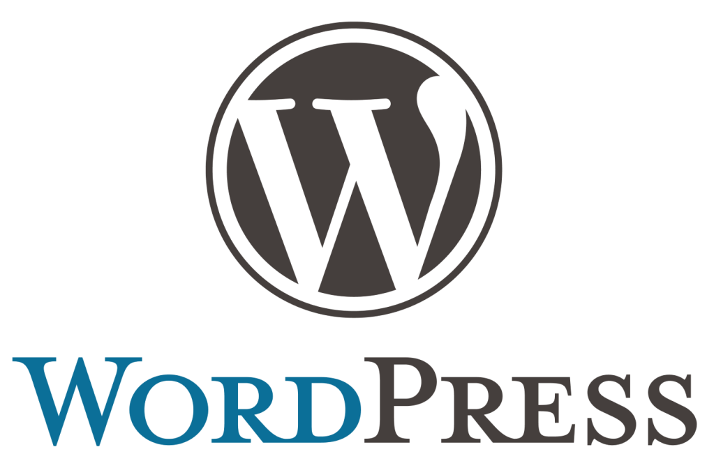

## Wordpress란?

누구나 손쉽게 블로그, 웹사이트, 쇼핑몰 들 을 구축하는 **웹사이트 제작 도구**이다.

- 장점

  - 워드프레스는 수많은 써드파티 테마와 플러그인 제작자들에 의해 제공되는 무료, 유로 플러그인을 설치해 사이트 디자인을 바꾸고 기능을 확장시키는 것이 큰 장점이다.

  - **워드프레스(WordPress)란 CMS는** 이런 제한된 환경이 내키지 않는 동시에 그렇다고 직접 자신이 원하는 형태의 블로그나 웹사이트를 개발할 수 있는 코딩 지식은 없는 비개발자에게, **넘이 만들어 놓은 테마와 플러그인들을 설치하기만 하면 원하던 기능과 구성을 만들어 주는 훌륭한 대안**임.

    - CMS란 콘텐츠관리시스템(Content Management System)를 말한다.

      **직관적으로 관리할 수 있는 대시보드가 마련되어 코딩에 대한 지식이 전혀 없는 사람이라도 웹 상에서 콘텐츠를 생성, 수정, 삭제할 수 있다는 공통점**을 갖고 있음. 물론, 여기에서 콘텐츠는 나름의 규칙에 맞게 정리되어 데이터베이스에 저장되고, **단순하게 텍스트만이 아니라 웹사이트 전반적인 레이아웃, 기능 등을 포함한 것**을 말함.

  - **오픈 소스이다.**
    오픈소스 CMS이기 때문에 워드프레스 **다운로드 및 설치에 비용이 전혀 발생하지 않음.** 게다가, 수정/재배포가 가능한 GNU GPLv2 라이센스라서 **대부분의 호스팅 업체로부터 초기 워드프레스 세팅이 지원**되므로, 굳이 직접 다운로드 받아 호스팅 서버에 워드프레스 수동 설치를하는 번거로운 과정을 겪을 필요가 거의 없음. 물론, 오픈소스라고 해도 개인 사이트로써 식별되기 위한 도메인 주소가 필요하고, 데이터가 저장될 공간인 호스팅 서버도 필요하므로 최소한의 **도메인/호스팅 비용은 발생함.**

  - **최적화를 위한 변수 관리**

    검색엔진마다 다른 알고리즘이 있다고 해도, 웹사이트 전체와 각 페이지에 포함된 콘텐츠를 기반으로 특정 검색어에 순위를 매기도록 한다는 골자는 크게 다르지 않기 때문에, 특정 검색엔진마다 **웹사이트와 페이지 단위의 변수를 지속적으로 설정하고 테스트**해가면서 어떤 영향을 미치는지 결과를 보는 과정은 **굉장히 중요함**. 이 때, 워드프레스라면 웹사이트 단위는 **테마 설정의 다양한 옵션**을 통해 쉽고 빠르게 변경이 가능하고, 페이지 단위는 **SEO 플러그인을 통해** 전반적인 조언과 함께 통제할 수 있는 기능이 지원되므로 보다 폭 넓은 시야를 갖을 수 있게 됨.

- 단점

  - 완제품상태로 서비스되기 때문에, 아무리 많은 기능과 설정이 있다고 해도 주어진 형태 안에서만 구성이 가능하다는 한계가 있다.

  - **K-검색엔진**

    잘 알다시피 네이버와 다음은 검색결과를 여러 영역으로 쪼개 놓고, 특정 조건에 부합하는 문서만을 해당되는 영역에 노출시킴. 당연히, **특정 조건의 대부분은 네이버 블로그나 티스토리 같은 자사 또는 특정 서비스 사용**을 말하고, 이 조건을 충족시키지 못하는 워드프레스 개인 블로그를 포함한 많은 웹서비스 기반의 문서들은 **애먼 위치에 노출되어 페이지 전환을 기대할 수 없게 됨.** 결국은, 이런 폐쇄적이고 비합리적인 시장을 만들어 놓은 네이버가 망하기를 기도하거나, 아예 관심두지 않는 게 정신 건강에 좋음. 어찌되었건, 가장 치명적인 워드프레스 단점이기도 하지만 워드프레스의 문제는 아니기도 한 K-스러운 그런 것이겠음.

  - **커스터마이징의 한계**

    **일반적인 사용자**처럼 테마와 플러그인의 옵션 설정을 통해 기능과 형태를 개선하려는 의미의 커스터마이징이라면 워드프레스는 **굉장히 유연하고 확장성**이 있다고 말할 수 있지만, 내 맘대로 **모든 영역의 코드를 건드려서 바꾸고 싶다는 의미의 커스터마이징**이라면 **굉장히 복잡해짐.** 후자라면, HTML/CSS, JS, PHP에 대한 기본적인 이해는 당연하고, 워드프레스의 코어 구조와 테마와 플러그인의 기능을 호출하는 훅(Hook)이라는 개념에 대해서도 알 필요가 있으니, 국내나 해외나 코더들이 찍먹하고 극혐하는 이유이기도 하겠음. 사실, 이 정도의 커스터마이징이 필요하다면 아예 직접 웹사이트를 제작하는 게 가장 합리적인 선택이고, 완제품 형태의 웹서비스에서는 백엔드 영역은 건드릴 수조차 없다는 걸 간과하는 부분이 없지 않아 있음.

