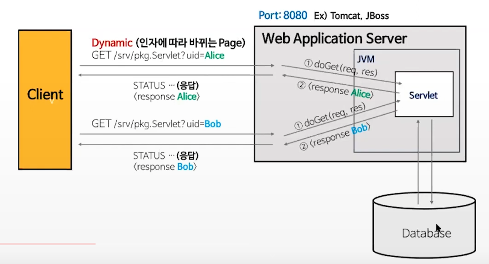
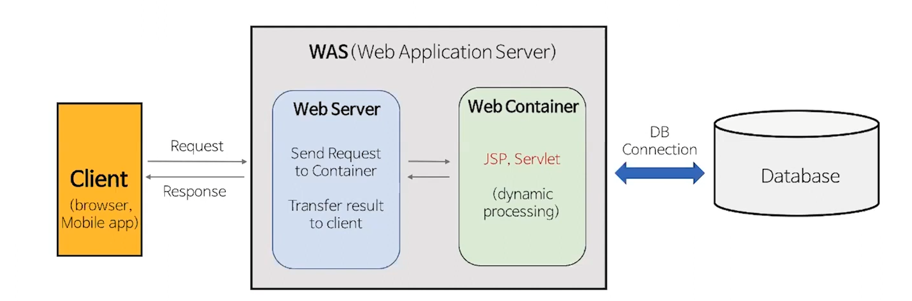

# web server

- 웹브라우저(클라이언트)로부터 HTTP 요청을 받아 HTML 문서와 같은 정적 컨텐츠를 제공하는 프로그램
  -  정적 컨텐츠란?
     - 요청 인자 값에 상관없이 달라지지 않는 컨텐츠(html, css, image ...)
     - 어느 사용자 요청이든 항상 동일한 컨텐츠

- 웹서버의 기능
  - 클라이언트로부터 HTTP 요청을 받을 수 있다
    1. 정적 컨텐츠 요청 시 정적 컨텐츠(html, jpeg, css ...) 를 제공할 수 있다
    2. 동적 컨텐츠 요청 시 Web Application Server(WAS)로 전달하여 WAS 가 처리한 결과를 클라이언트에 전달
- 웹 어플리케이션 서버(WAS)
  - DB 조회나 다양한 로직처리를 요구하는 동적인 컨텐츠를 제공하기 위해 만들어진 프로그램
    - 동적컨텐츠란?
      - 요청 인자에 따라 바뀔 수 있는 컨텐츠

- WAS 의 기능
  - 클라이언트로부터 HTTP 요청을 받을 수 있다. ( 대부분의 WAS는 Web Server 내장)
  - 요청에 맞는 정적 컨텐츠(html, jpeg, css ...) 를 제공할 수 있다.
  - DB 조회나 다양한 로직 처리를 통해 동적 컨텐츠를 제공할 수 있다.

- 면접질문 - 따로 Web Server를 사용하지 하셨나요?

  - 해석 : WAS 앞 단에 따로 Web Server를 두지 않은 이유가 무엇인가요?

- 왜 Web server를 사용할까?

  1. 책임 분할을 통한 서버 부하 방지

     - 정적 컨텐츠는 Web server, 동적 컨텐츠는 WAS가 담당
     - 이미지를 찾아 제공한다거나..

  2. 여러 대의 WAS 로드 밸런싱

     - WAS가 처리해야 하는 요청을 여러 WAS가 나눠서 처리할 수 있도록 설정 

  3. 여러대 WAS의 Health check

     - 서버에 주기적으로 HTTP 요청을 보내 서버의 상태를 확인( ex 특정 url 요청에 200 응답이 오는지? )
     - Interval : health check를 통해 서버 상태를 확인하는 요청을 날리는 주기(default : 5초 )
     - Fails : 아래의 경우 3회 연속 실패하면 서버가 비정상이라고 인지 (default : 1회)
     - Passes : 서버가 다시 복구되어 요청이 2번 연속 성공하면 서버가 정상으로 인지(default : 1회)

  4. 보안

     - 리버스 프록시를 통해 실제 서버를 외부에 노출시키지 않음

     

