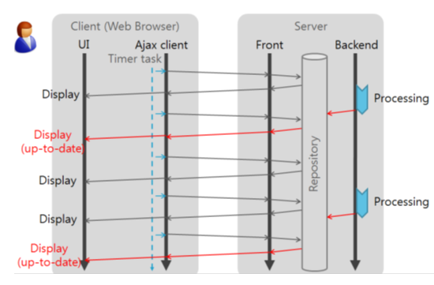
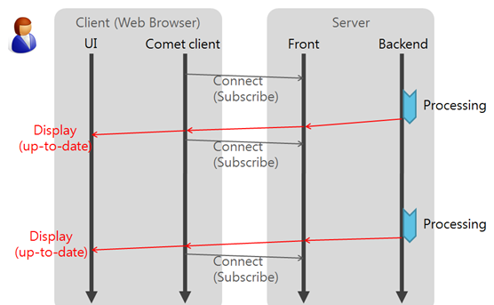
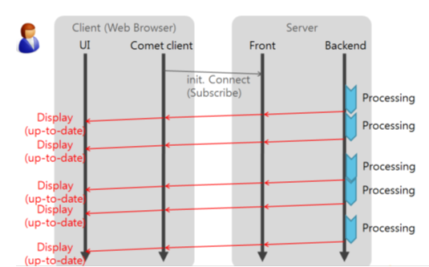
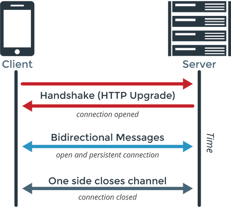
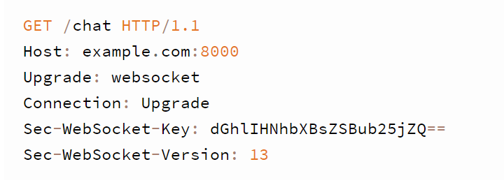
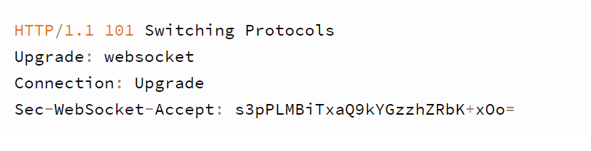

# Socket IO란?

> Socket.IO는 자바스크립트를 이용하여 브라우저 종류에 상관없이 실시간 웹을 구현할 수 있도록 한 기술

**[특징]**

- Node.js 라이브러리로 실시간 웹 기술을 손쉽게 사용할 수 있는 모듈

- Websock, Polling, Streaming 등 다양한 방법을 하나의 API로 추상화

- 브라우저의 종류에 상관없이 실시간 웹 구현 가능

**[작동방식]**

Socket.IO는 웹 브라우저와 웹 서버의 종류와 버전을 파악하여 가장 적합한 기술을 선택하여 사용한다. 

- 만약 브라우저에 FlashSocket이라는 기술을 지원하는 플러그인이 설치되어 있으면 그것을 사용하고 
- 플러그인이 없으면 AJAX Long Polling방식을 사용하도록 한다.

## HTTP 양방향 통신 방법들

- 종류
  - Polling
  - Long Polling
  - Streaming

### Polling

클라이언트에서 **일정 주기마다 요청**을 보내고 서버는 현재 상태를 바로 응답하는 방식입니다.

이 방식은 실시간으로 반영되는 것이 중요한 서비스에는 별로 좋지 않고 서버에서 변화가 없더라도 매 요청마다 응답을 내려주기 때문에 불필요한 트래픽이 발생하게 됩니다.

### Long Polling

클라이언트에서 요청을 보내고 서버에서는 이벤트가 발생했을 때 응답을 내려주고 **클라이언트가 응답을 받았을때 다시 다음 응답을 기다리는** 요청을 보내는 방식입니다.

실시간 반응이 가능하고 polling에 비해서 불필요한 트래픽은 유발하지는 않지만 오히려 이벤트가 잦다면 순간적으로 과부하가 걸리게 됩니다.

### Streaming

이벤트가 발생했을때 응답을 내려주는데 **응답을 완료시키지 않고 계속 연결을 유지하는 방식**입니다.

Long Polling에 비해 응답마다 다시 요청을 하지 않아도 되므로 효율적이지만, 연결 시간이 길어질수록 연결의 유효성 관리의 부담이 발생합니다

## websocket 이란?

> 서버 - 클라이언트 간의 효율적인 양방향 통신을 실현하기 위한 통신 프로토콜
>
> 하나의 HTTP접속으로 양방향 메시지를 자유롭게 주고받을 수 있다
> (서버와 클라이언트가 지속적으로 연결된 TCP라인을 통해 실시간으로 데이터를 주고 받을 수 있도록하는 HTML5의 새로운 사양)

**[특징]**

1.  HTTP Request를 사용하므로 추가적인 방화벽을 열지 않고도 양방향 통신 가능하고 CORS 적용이나 인증 등의 과정을 기존과 동일하게 적용
2. 양방향 통신 프로토콜로서 클라이언트와 서버는 TCP로 통신

**[HTTP 에 비해 장점]**

1. 클라이언트의 요청이 없음에도, 그 다음 서버로부터 응답을 받는 상황 해결

   - 기존 HTTP는 Client가 요청을 보내지 않아도 Server가 데이터를 보내주는 기능의 구현에 있어서 많은 고민이 있었음(HTTP의 구조적 한계)
   - websocket은 하나의 HTTP 접속으로 브라우저가 서버에 데이터를 요청하고, 서버가 브라우저에 데이터를 보내기 위해 별다른 제약이 없습니다.

2. HTTP의 오버헤드 문제 해결

   - HTTP 헤더 크기 문제도 800byte에서 수 kbyte의 헤더 크기를 가지고 있는 HTTP와 달리 WebSocket은 수 byte 수준으로 압축이 가능하다.

   

**[HTTP와 공통점과 차이점]**

- 공통점
  1. HTTP는 클라이언트가 애플리케이션을 사용하기 위해 URL에 접근하여 HTTP method, header, entity 등을 통해 요청을 한다.
  2. 서버는 그에 따른 요청에 응답을 통해 통신이 이루어진다.
- 차이점
  1. WebSocket은 초기에 연결한 오직 하나의 URL 만 존재한다. 즉 모든 애플리케이션 메시지는 같은 TCP 커넥션을 통해 통신된다.
  2. HTTP와는 완전히 다른 방식의 비동기식 이벤트 중심 메시징 아키텍처
  3. WebSocket은 HTTP 핸드 셰이크 과정에서 Sec-WebSocket-Protocol에서 STOMP와 같은 높은 수준의 메시징 프로토콜을 사용하도록 요청할 수 있다.

**[문제점]**

1. 프로그램 구현에 보다 많은 복잡성을 초래합니다.
   - 웹 소켓은 HTTP와 달리 Stateful protocol이기 때문에 서버와 클라이언트 간의 연결을 항상 유지해야 하며 만약 비정상적으로 연결이 끊어졌을때 적절하게 대응해야 한다. 이는 기존의 HTTP 사용시와 비교했을때 코딩의 복잡성을 가중시키는 요인이 될 수 있습니다.

2. 서버와 클라이언트 간의 Socket 연결을 유지하는 것 자체가 비용이 듭니다.
   - 특히나 트래픽 양이 많은 서버같은 경우에는 CPU에 큰 부담이 될 수 있습니다.

3. 오래된 버전의 웹 브라우저에서는 지원하지 않습니다. (물론 SocketJS 라이브러리 같은 경우에는 Fallback option을 제공하고 있습니다.)

### websocket의 작동방식

1. 서버와 클라이언트간의 연결은 HTTP 프로토콜을 통해 이루어진다.
   - Handshake 요청 
     - HTTP 1.1로 요청을 하고, 웹 소켓 프로토콜로 **Upgrade : websocket** 해줄 것을 요청
     - 요청 헤더에는 소켓 버전과 소켓 비밀키 정보 등을 포함
   - Handshake 응답
     - http 1.1에서 WebSocket으로 프로토콜 업그레이드가 성공되면 HTTP status 101 응답을 전송
     - 만약 연결이 정상적으로 이루어진다면 서버와 클라이언트 간에 WebSocket연결이 이루어지고 일정 시간이 지나면 HTTP연결은 자동으로 끊어진다.

