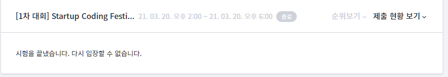

https://scofe2021.goorm.io/apply/assessment/25665/startup-coding-festival-2021

6문제가 출제되었다. 난이도는 백준 기준 실버3~ 실버1정도 되는 느낌
시험시간은 2시~6시까지 4시간이었지만 4시가 되기전에 6문제가 다 통과되서 빠르게 나왔다.
오늘 아침에 SQLD 시험 치르고 와서 정신이 없는 상태에서도 이렇게 풀고 나올 수 있는 난이도면 1차는 코테 준비가 된 사람인지 체크하는 정도의 수준인거 같다.
2차가 찐인거같은데 기대된다. 이번주 한주는 다시 알고리즘 좀 공부해야겠다. 이것저것하느라 알고리즘 약 3주간 공부를 못했는데 제발 빨리 실력이 복귀될 수 있었으면 좋겠다.