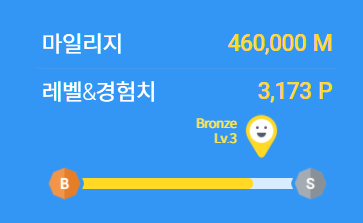

- 이 글은 python 반 기준으로 작성됨

undefined

# SSAFY 에서 무엇을 배웠나?

## 프로그래밍 관련

- 기본적인 알고리즘들과 자료구조
  - 기본 수업만 들어서는 그렇게 깊은 내용은 배우지 않음
    - 스스로 조금 찾아서 공부해야할 필요성이 있음
  - B형 특강( 성적 우수자에 한해 신청가능)  정도가 좀 깊게 배울 수 있는 기회가 있음
- python 기본 문법
- Django 백엔드
- Vue 프론트

## 취업을 위한 것들

- 포트폴리오, 이력서 컨설팅
- 회사 정보를 검색하거나, 어떻게 분석해야하는지 방법론
- 다양한 회사의 채용설명회

# SSAFY는 물질적으로 얼마나 도와줬나?

## 돈과 물건

1~6월치 : 600만원
SSAFY 면접비(서울기준) : 2만원

vicxxo 핸드폰 거치대 : 10000원
후드티, 에코백, 텀블러 : ?
웹캠(SIG H703) : 54000원

- 합계 : 608.4만원

## 기프티콘

0129 출석왕 : BHC 후라이드치킨+콜라(20000원)
0331 일타싸피 반대표 : 베스킨라빈스 파인트(8200원)
0429 생일자 : 스타벅스 달콤한 디저트 세트(9800원)
0531 우수교육생 : 스타벅스 시원한 아메리카노 커플세트(8200원)

0331 회사설명회 우수참여자 : 스타벅스 e카드 1만원

0416 밋업 유튜브 채팅 참여 : 스타벅스 아이스아메리카노 T(4100원)
0416 밋업 패널 참여 : 스타벅스 e카드 1만원

0122 입학식 SNS 댓글 : 스타벅스 e카드 1만원

교수님이 주신 것들
0305 수업참여우수 : 스타벅스 아이스아메리카노 T(4100원)
0423 수업참여우수 : 스타벅스 아이스아메리카노 T(4100원)

취업담당컨설턴트님이 주신거

0622 우수 포트폴리오선정 : 스타벅스 민트 초코칩 블랜디드 T (6100원)

- 합계 : 9.5 만원

## 상금

성적 반 2등 : 30만원

프로젝트 최우수상 : 10만원

- 합계 : 40만원 (제세공과금 22% ) = 32만원

# 2학기 시작 현재 상황은 어떤가?

- 인원수 
  - 전체기준 : 750 -> 590 ( 160 명이 취업이나 기타 이유로 퇴소 )
  - 1학기 반 기준으로 : 21 -> 16 ( 5 명이 취업이나 기타 이유로 퇴소 )
- 배우는 방식의 변화
  - 1학기는 09~18시 까지 연속되는 새로운 교육들의 연속이었다면
    2학기는 2~3시간 정도만 어떤 새로운 것을 가르치고, 나머지는 자기가 알아서 하는 시간을 가지게 됨
- 2학기의 프로젝트를 시작하면서의 변화
  - 프로젝트의 백엔드가 다 java가 기본임
    - 팀원들의 도움으로 python 반 사람들이 백엔드로 가서 spring을 익히면서 할 수 있긴 하나, 시간 여건 상 어느정도 준비를 해놓지 않았다면 불가능에 가까움
    - 그래서 주변을 보면 python 반 사람들은 보통 프론트로 가게 됨..
  - 1학기는 취업활동의 비중이 적은 사람이 대부분이라면 2학기는 슬슬 취업활동 비중이 높아져서 ssafy 활동보다 취업활동을 하고 있을 수 있게 됨
    - 프로젝트 조를 나눌 때도 면접 최종결과 대기조 같은 조가 생겨남

# 내가 얻은 것은 무엇인가?

- 취업에 대한 진지한 고민을 할 수 있는 시간
  - 내가 진짜 뭘 하고싶은지 조금 되돌아보고, 어떤 회사에 가고 싶은지 생각해봄
    - DevOps가 가미된 백엔드
    - 아직 해본적은 없지만, Node.js가 너무 재밌고 유망해보여서 한번 손대고 싶음..
    - 단 시간에 다양한 것을 배우고 경험할 수 있는 스타트업 으로 진로를 정함
- 여러가지 취업 준비 시간
  - 포트폴리오 작성
  - GitHub 잔디 깔기
  - 기술 블로그 운영
- 물질적 풍요
  - 대학 입학 이후 한번도 용돈을 받지도 않았고, 알바도 하지 않고 살았기 때문에, 1달에 100만원을 번적이 없다
    그런데, 100만원에 열심히 참여하면 주는 여러 기프티콘 덕에 굉장히 윤택한 삶을 누리게 되었다.
    - 모니터, 키보드, 창문형 에어콘, 눈 안마기, 수비드기계 등등 나의 욕망을 채워줄 수 있는 물건들을 살 수 있었다.
- 공부할 시간
  - SSAFY 에서 알려주는 지식은 깊이가 깊다거나 하지는 않다. 
  - 하지만, 뭘 해야할지 고민해야하는 시간이 사라지고 여유로운 공부시간이 주어져 배운 내용을 스스로 업그레이드 할 수 있다.
  - 그리고, 그것을 보조해줄 교수님과 친구들이 존재한다는 점이 굉장히 강점이다.
- 늘어난 살...
  - 진짜 6달을 1달에 한번 외출하는 꼴로 나가고, 방 안에서 코딩만 하는 삶을 살다보니 인생최대 몸무게를 달성했다...
- 다양한 조력자들
  - 교수님, SSAFY 3기 선배, 컨설턴트님 등등 나의 개인적인 고민과 생각을 공유하면서 이야기를 들을 수 있는 조력자들이 생겼다.

