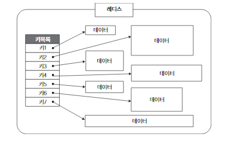
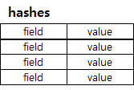
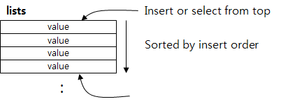
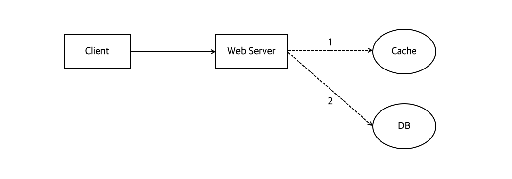
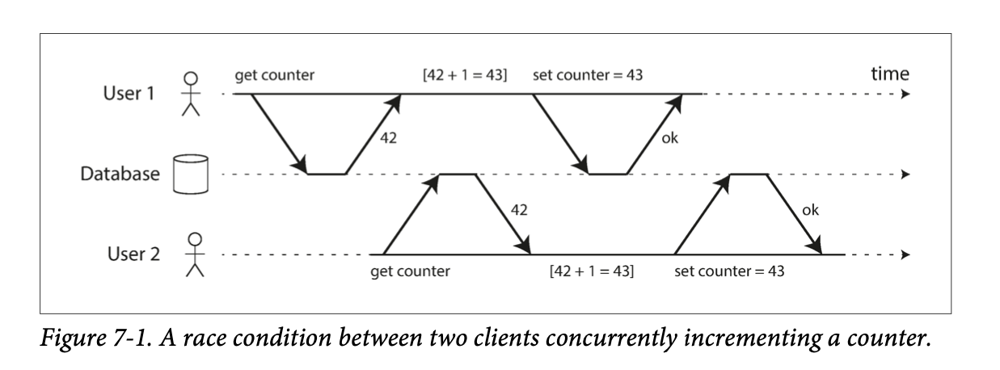
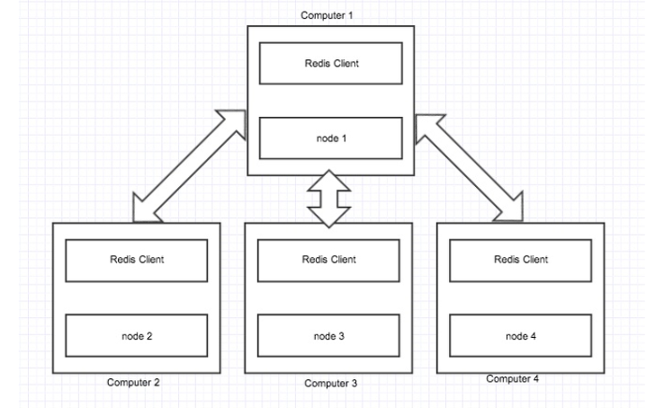

# 왜 궁금하게 되었는가?

- 당근마켓 python 웹/서버 개발자에게 요구하는 기술에서 봄
  https://boards.greenhouse.io/daangn/jobs/4300805003
  - 이런 일을 해요
    - 머신러닝 어드민 웹/서버 개발
    - 머신러닝 기능을 웹에서 테스트 확인
    - 데이터 탐색/수집 UI
    - 비동기 작업 처리
    - 머신러닝 기능 내부 API 개발
  - 이런 분을 찾아요
    - Python, SQL 언어에 능숙한 분
    - CSS, Javascript 웹 프론트 개발 경험
    - Redis, memcache를 활용한 개발 경험
    - 비동기 작업 개발 경험 (예: Celery)
    - gRPC / REST API 구현 능력
  - 딥러닝에 대한 이해
    이런 분이라면 더 좋아요!
    - 딥러닝 모델을 사용자 서비스에 적용

#  Redis란? (REmote Dictionary Server)

- Remote에 위치한
- 프로세스로 존재하는
- In-Memory 기반의 : 보통 메모리에 상주하면서 RDBMS의 캐시 솔루션으로 사용됨(RDBMS의 read 부하 줄임)
- "키-값" 구조 데이터 관리 시스템 : 비관계형이며, 키-값 구조이기 때문에 별도 쿼리 없어도 간단히 데이터를 가져올수 있다.(NoSQL)

## Memcached와의 차이(거의 유사함)

- Memcached의 특징
  - 처리속도가 빠르다 - 데이터가 메모리에만 저장되므로 빠르다. 즉, 속도가 느린 Disk를 거치지 않는다
  - 데이터가 메모리에만 저장된다.
    - 당연히 프로세스가 죽거나 장비가 shutdown되면 데이터가 사라진다
  - 만료일을 지정하여 만료가 되면 자동으로 데이터가 사라진다.
    - 이름에서도 느껴지듯이 cached이다.
  - 저장소 메모리 재사용
    - 만료가 되지 않더라도 더 이상 데이터를 넣은 메모리가 없으면 LRU(Least recently used) 알고리즘에 의해 데이터가 사라진다.
      - LRU : 가장 오랫동안 사용되지 않은 것을 삭제

| Memcached                                                    | REDIS                                                        |
| ------------------------------------------------------------ | ------------------------------------------------------------ |
| 처리 속도가 빠르다.  - 당연히 데이터가 메모리에만 저장되므로 빠르다. 즉, 속도가 느린 Disk를 거치지 않는다. | 처리 속도가 빠르다.  - 당연히 데이터가 메모리+Disk에 저장된다. 그러나, 속도는 Memcached와 큰 차이가 없다. |
| 데이터가 메모리에만 저장된다.  - 당연히 프로세스가 죽거나 장비가 Shutdown되면 데이터가 사라진다. | 데이터가 메모리+Disk에 저장된다.  - 프로세스가 죽거나 장비가 Shutdown되더라도 Data의 복구가 가능하다. |
| 만료일을 지정하여 만료가 되면 자동으로 데이터가 사라진다.  - 이름에서도 느껴지듯이 Cache이다 | 만료일을 지정하여 만료가 되면 자동으로 데이터가 사라진다.  - 동일한 기능을 지원한다. |
| 저장소 메모리 재사용  - 만료가 되지 않았더라도 더이상 데이터를 넣을 메모리가 없으면LRU(Least recently used) 알고리즘에 의해 데이터가 사라진다. | 저장소 메모리 재사용 하지 않는다.   - 명시적으로만 데이터를 제거할 수 있다. |
| **문자열만 지원**                                            | **문자열, Set, Sorted Set, Hash, List등의 다양한 Data Type을 지원.** |

# Redis의 특징

## key-value store

레디스는 거대한 맵(Map) 데이터 저장소입니다. Key와 value가 매핑된 단순한 맵 데이터 저장소로서 데이터를 레디스에 쉽고 편하게 읽고 쓸 수 있습니다. 장점은 익히기 쉽고 직관적인 데 있고 단점은 Key-value 형태로 저장된 데이터를 레디스 자체내에서 처리하는 것이 어렵다는 점입니다.

## 다양한 데이터 타입

Key로 참조되는 Value 타입을 다양하게 지정하여 저장할 수 있습니다. List, String, Set, Sorted set 등 여러 데이터를 저정하여 손쉽고 편리하게 데이터를 저장할 수 있습니다.

1. String 
   - 일반적인 문자열로 최대 512mbyte 길이까지 지원한다. Text 문자열뿐만 아니라 Integer와 같은 숫자나 JPEG 같은 Binary File까지 저장할 수 있다.
2. Set
   - set은 String의 집합이다. 여러 개의 값을 하나의 Value 내에 넣을 수 있다고 생각하면 되며 블로그 포스트의 태그(Tag) 등에 사용될 수 있다. 재미있는 점은 set 간의 연산을 지원하는데, 집합인 만큼 교집합, 합집합, 차이(Differences)를 매우 빠른 시간 내에 추출할 수 있다.
   - 중복된 데이터를 담지 않기 위해 사용하는 자료구조이다. 중복된 데이터를 여러번 저장하면 최종 한번만 저장된다.
     이걸 사용했을 때 모든 데이터를 전부 다 갖고올 수 있는 명령이 있으므로 주의해서 사용해야 한다.

3. Sorted Set

   - set에 “score”라는 필드가 추가된 데이터 형으로 score는 일종의 “가중치” 정도로 생각하면 된다. sorted set에서 데이터는 오름차순으로 내부 정렬되며, 정렬이 되어있는 만큼 score 값 범위에 따른 쿼리, top Rank에 따른 query 등이 가능하다.

     

4. Hashes

   - hash는 value 내에 field/string value 쌍으로 이루어진 테이블을 저장하는 데이타 구조체이다. RDBMS에서 PK 1개와 string 필드 하나로 이루어진 테이블이라고 이해하면 된다.

     

5. List

   - list는 string들의 집합으로 저장되는 데이터 형태는 set과 유사하지만, 일종의 양방향 Linked list라고 생각하면 된다. List 앞과 뒤에서 PUSH/POP 연산을 이용해서 데이터를 넣거나 뺄 수 있고, 지정된 Index값을 이용하여 지정된 위치에 데이터를 넣거나 뺄 수 있다.

     

## Persistence(Disk에 저장이 가능하면서 생긴 영속성)

Redis는 데이터를 disk에 저장할 수 있습니다. 따라서 Redis는 서버가 shutdown된 후에 restart 하더라도 disk에 저장해놓은 데이터를 다시 읽어서 데이터가 유실되지 않습니다. redis의 데이터를 disk에 저장하는 방식은 snapshot, AOF 방식이 있습니다.

- Snapshot : 스냅샷은 RDB에서도 사용하고 있는 어떤 특정 시점의 데이터를 DISK에 옮겨담는 방식을 뜻합니다. Blocking 방식의 SAVE와 Non-blocking 방식의 BGSAVE 방식이 있습니다.

- AOF : Redis의 모든 write/update 연산 자체를 모두 log 파일에 기록하는 형태입니다. 서버가 재시작할 시 write/update를 순차적으로 재실행, 데이터를 복구합니다.

레디스 공식문서에서의 권장사항은 RDBMS의 rollback 시스템같이 두 방식을 혼용해서 사용하는 것입니다. 주기적으로 snapshot으로 벡업하고 다음 snapshot까지의 저장을 AOF 방식으로 수행하는 것이다.

### 그렇다면 cache 로 쓰일 때는 언제?

서비스 사용자가 증가했을 때, 모든 유저의 요청을 DB 접근으로만 처리하게 된다면 DB 서버에 무리가 갈 수 밖에 없다. 물론 데이터베이스는 데이터를 디스크에 저장하기 때문에 서버의 장애와는 별개로 데이터를 유지할 수는 있지만, 요청이 증가하는 상황에서는 기존 성능을 기대하기 힘들다.

이런 맥락에서 캐시는 **나중에 요청된 결과를 미리 저장해두었다가 빨리 제공하기 위해** 사용한다. 보통 우리가 사용하는 Redis Cache 는 메모리 단 (In-Memory) 에 위치한다. 따라서 디스크보다 **수용력(용량) 은 적지만 접근 속도는 빠르다.**

그렇다면 이 캐시는 어떻게 사용할까?

- 일반적인 패턴 : `Look aside cache`

  처리순서

  	1.  웹 서버는 클라이언트 요청을 받아서, 데이터가 존재하는지 캐시를 **먼저** 확인
   	2.  Cache에 데이터가 있으면 그걸 꺼내주는데, 만약 없으면
   	3.  DB에서 읽어서 ->  먼저 캐시에 저장한다음 클라이언트에게 데이터를 돌려줌

- `Write Back`

  데이터를 캐시에 전부 저장해놓았다가 특정 시점마다 한번식 캐시 내 데이터를 DB에 `insert`하는 방법이다.

  `insert`를 1개씩 500번 수행하는 것보다 500개를 한번에 삽입하는 동작이 훨씬 빠름에서 알 수 있듯이, write back방식도 성능면에서 뒤쳐지는 방식은 아니다. 하지만 어쨋든 여기서 데이터를 일정 기간동안은 유지하고 있어야하는데, 이때 이걸 유지하고 있는 storage는 메모리 공간이므로 서버 장애 상황에서 데이터가 손실될 수 있다는 단점이 있다. 그래서 다시 재생 가능한 데이터나 극단적으로 heavy한 데이터에서 `write back`방식을 많이 사용ㅎ나다.

## ANIS C 로 작성

C언어로 작성되어 Java와 같이 가상머신 위에서 동작하는 언어에서 발생하는 성능 문제에 대해 자유롭습니다. 곧바로 기계어로 동작하지 않고 어떤 가상의 머신 위에서 인터프리터 된 언어로 가동하는 경우에는 가비지 컬렉션(Garbage Collection) 동작에 따른 성능 문제가 발생할 수밖에 없습니다. 하지만 C언어로 작성된 Redis는 이런 이슈에서 자유롭다.

## 서버 측 복제 및 샤딩을 지원

- 읽기 성능 증대를 위한 서버 측 복제를 지원합니다.

- 쓰기 성능 증대를 위한 클라이언트 측 샤딩을 지원합니다.
  - 샤딩 :  "조각내다"라는 뜻으로 데이터베이스 저장기법 중 하나이며, 전체 네트워크를 분할한 뒤 트랜잭션을 영역별로 저장하고 이를 병렬적으로 처리하여 블록체인에 확장성을 부여하는 온체인 솔루션으로 데이터를 샤드라는 단위로 나눠서 저장 및 처리

## Atomic 하다

- 친구 리스트를 관리할 때 데이터를 key-value 형태로 저장해야 한다면

  - 같은 친구 리스트를 읽은 후, 서로 다른 클라이언트에서 리스트에 서로 다른 친구를 추가하고자 했다고 가정해보자.

  - 이런 상황에서 친구 리스트의 최종 상태는 -> 두 클라이언트가 추가한 사람 A, B 가 전부 반영되지 않을 수 있다.

  - 이런걸 `race condition` 이라고 하는데, 지금 회사에서 스터디중인 `데이터 중심 애플리케이션 설계 #트랜젝션` 파트에서 이걸 다루고 있길래 도움이 될만한 그림을 가져와봤다.
    
    그림속 상황에 매치시켜보면,
    친구리스트에 `B` 와 `C` 를 동시에 추가하게 될 경우

    > **T1**[`친구 B` 추가] -> **T2**[`친구 C` 추가] -> **T1**[`B` 추가한걸 최종상태에 반영(쓰기)] -> **T2**[`C` 추가한걸 최종상태에 반영(쓰기)]

    각 트랜젝션에서는 이런 순서로 로직을 처리하게 된다.
    그럼 우연한 타이밍에 3번째와 4번째 프로세스가 순서대로 진행되면서 리스트 덮어쓰기가 발생하고,
    최종 상태에서도 **결국 context switching 때문에 T1 과 T2 둘 중 뭐가 먼저 발생할지 예측할 수 없기 때문에** 친구리스트가 `[A,B]` or `[A,C]` 랜덤으로 유지될 수 있다.

Redis 자료구조는 **`Atomic 하다는 특징`** 때문에 이런 `race condition` 을 피할 수 있다. 즉, Redis Transaction 은 한번의 딱 하나의 명령만 수행할 수 있다. 이에 더하여 **`single-threaded 특성`** 을 유지하고 있기 때문에 다른 스토리지 플랫폼보다는 이슈가 덜하다고 한다.
하지만 이 특징이 더블클릭 같은 동작으로 같은 데이터가 2번씩 들어가게 되는 불상사는 막을 수 없기 때문에 별도 처리가 필요하다.

따라서 레디스는 `remote data storage` 로서 여러 서버에서 같은 데이터를 공유하고 보고싶을 때 많이 사용한다. 그래서 우리는 인증 토큰을 저장하거나 유저 API limit 을 두는 상황 등에서 레디스를 많이 사용하고 있다.

# Redis 아키텍쳐

## Redis Topology

레디스는 아래 그림과 같이 Master-slave 형태로 데이터를 복제해서 운영할 수 있습니다. 이 master-slave 간의 복제는 non-blocking 상태로 이루어집니다.

## Redis Sharding

레디스에서 데이터를 샤딩하여 레디스의 read성능을 높일 수 있습니다. 예로들어 #1~#999, #1000~#1999 ID 형태로 데이터를 나누어서 데이터의 용량을 확장하고 각 서버에 있는 Redis의 부하를 나누어 줄일 수 있습니다. 

## Redis Clustering

레디스는 이전에는 Clustering을 지원하지 않았지만 Clustering을 지원하면서 대부분의 회사가 Redis를 클러스터로 묶어서 가용성 및 안정성있는 캐시 매니져로서 사용하고 있습니다. Single Instance로서 레디스를 사용할 때는 Sharding이나 Topology로서 커버해야했던 부분을 Clustering을 이용함으로서 어플리케이션을 설계하는 데 좀 더 수월해졌다고 볼 수 있습니다.

- Cluster 란

  각기 다른 서버를 하나로 묶어 하나의 시스템처럼 동작하게 함으로써 클라이언트에게 고가용성을 제공하는 것

  Point - 특정 서버에 장애가 일어나더라도 백업 서버의 보완을 통해 데이터의 유실없이 서비스를 계속 이어나갈 수 있음.

