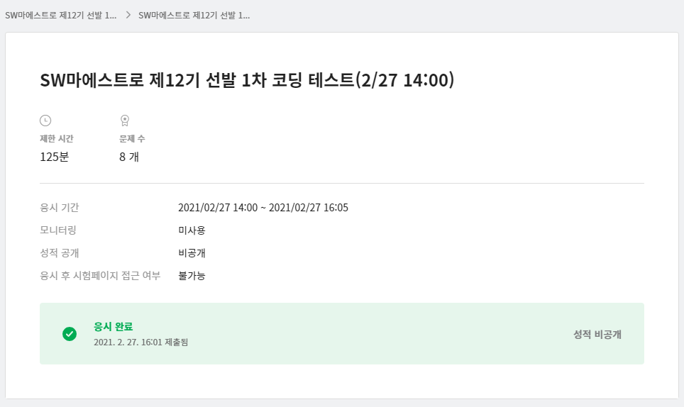

알고리즘 : 6문제 (프로그래머스 2단계정도 난이도)
SQL : 1문제 (기본적인거 join 이나 조건 이런거 잘 쓸수 있는지)
web : 1문제 (기본적인 html, css 구조/ media나 transition도 쓸수 있는지)

로 구성되어있었다.

시험은 특이하게도 elice 에서 봤는데, 아마 elice가 sw마에스트로 출신자가 창업한 기업이라 협약을 맺고 하는 것같다. 그런데 elice가 이런 시험을 처음 운영하는지 서버 상태가 굉장히 좋지 못했다.
시험시간에 맞춰 접속했는데 약 5분정도 로그인이 되지 않아 아무것도 못하고 시간이 흘렀고, 중간중간 코드 제출할 때도 커맨드 창이 실행이 되지 않을 때가 있어서 제출도 못하고 골때리는 상황이 나오기도 했다.
알고리즘 문제의 난이도는 평이했는데, 첫문제가 뭔가 설명이 이상해서 문제를 제대로 해석 수가 없었다. 내가 국어가 딸리는건지.. 문제가 이상한건지..; 이거 때문에 40분을 버렸다. 그거랑 중간에 두더지 문제같은게 있었는데 시간 없어서 버리고 나머지는 다 풀었다.
SQL과 web은 보자마자 바로 해결할 정도로 간단한 문제였다.

programmers에서 시험보다가 이런곳에서 시험보니까 역체감이 엄청 심한 것 같다. programmers가 대단한 사이트처럼 느껴진다.

(시간 분배)
40분 : 첫문제
60분 : 2,3,4,6 문제
10분 : SQL
10분 : web