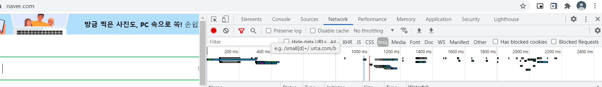
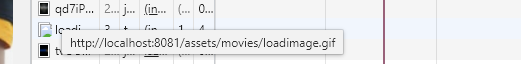

# 문제 상황

- 메인페이지에는 60개의 포스터 이미지가 떠야함.
  - background-image 형태로 css를 이용해 div 요소에 집어넣음
  - 60개의 이미지가 로드가 되는데 어느정도 지연이 생김


# lazy loading

- Image Lazy Loading은 페이지 안에 있는 실제 이미지들이 실제로 화면에 보여질 필요가 있을 때 로딩을 할 수 있도록 하는 테크닉

  - 웹 페이지 내에서 바로 로딩을 하지 않고 로딩 시점을 뒤로 미루는 것이라 볼 수 있습니다. 이 방식은 웹 성능과 디바이스 내 리소스 활용도 증가, 그리고 연관된 비용을 줄이는데 도움

  - lazy loading은 페이지 내에서 실제로 필요로 할 때까지 리소스의 로딩을 미루는 것


## 왜 lazy loading을 사용해야 하는가?

1. 성능향상 -  웹 사이트의 로딩 시간 줄이기
   - lazy loading을 이용하면, 페이지 초기 로딩 시 필요로 한 이미지의 수를 줄일 수 있습니다. 
   - 리소스 요청을 줄이는 것은 다운로드 bytes를 줄이는 것이며, 이는 유저가 사용할 수 있는 제한된 네트워크 대역폭의 경쟁을 줄이는 것을 의미
   - 다른 리소스들을 더 빠르게 처리해서 다운로드하도록 확보할 수 있게됨. 그러므로, lazy loading을 쓰지 않는 것에 비해서 페이지를 훨씬 빨리 유저가 이용가능
2. 비용감소 - 통신 비용
   - 이미지 전달 또는 다른 전달할 무언가는 주로 전송 바이트 수에 기반하여 청구
   - 이미지가 보여지지 않으명 절대 로딩하지 않으므로, 페이지 내에서 전달할 총 바이트 용량을 줄일 수 있음


## 이미지 lazy loading을 사용하는 방법

- img 태그를 이용하는 방법 - 1
  - ``
  - 형식으로 data-src 태그를 써서, src는 비워진 상태를 만듬
  - Intersection Observer API 를 이용하거나, getBoundingClientRect 를 이용해서 객체가 뷰포트에 들어오는지 확인되면, 
    - data-src 를 src로 바꾸는 js를 짜서 넣기

- img 태그를 이용하는 방법 - 2
  - Google Chrome 브라우저 버전(Chroem 76)에서는 native lazy loading 사용하기
    - 개발자는 lazy loading을 구현하기 위해 임베딩 할 이미지에 'loading' 속성만 추가해주면 됨
    - native lazy loading을 지원하지 않는 브라우저의 경우, 위에서 설명했던 다른 방식을 이용해야함
  - loading 속성에 사용할 수 있는 값들
    - **lazy** - 뷰포트에서 일정한 거리에 닿을 때까지 로딩을 지연시킵니다.
    - **eager** - 현재 페이지 위치가 위, 아래 어디에 위치하던 상관없이, 페이지가 로딩되자마자 해당 요소를 로딩합니다. 
    - **auto** - 이 속성은 디폴트로 로딩을 지연하는 것을 트리거합니다. 기본적으로 이것은 loading 속성을 쓰지 않을 것과 같습니다.
  - 주의 사항
    - 로딩 지연된 이미지들이 다운로드될 때 다른 감싸고 있는 콘텐트 내용들이 밀려나는 것을 방지하려면, 반드시 height와 width 속성을 태그에 추가하거나 inline style로 직접 값을 지정해야 함

```html
<!-- img 태그 -->

<!-- iframe 태그 -->

```


- CSS 속성 background image에 사용하는 방법
  - img와 달리 문서 내 DOM 노드에 CSS 스타일이 적용되는지 여부를 결정하기 위해 CSSOM(CSS Object Model)과 DOM(Document Object Model) Tree를 구성하는 것이 필요
  - 만약 문서 내 엘리먼트에 CSS의 background image가 적용되어 있지 않다면, 브라우저는 background image를 로드하지 않고, 엘리먼트에 CSS 규칙에 적용될 경우 브라우저가 이미지를 로딩할 것
  - img 태그 1번 방법과 구현상으로는 유사
    - 맨 처음 요소의  css background을 비워놓거나, loading image를 해 놓음
    - Intersection Observer API 를 이용하거나, getBoundingClientRect 를 이용해서 객체가 뷰포트에 들어오는지 확인되면, 
      - 원래 이미지로 background-image 속성을 변경함


## 모든 이미지에 lazy load를 적용하지 않기

- 초기 로딩 시에는 로딩이 줄어들기는 하지만, 많은 이미지들로 인해 유저 사용성으로 좋지 않은 결과가 주어질 수도 있습니다. 
  - 특히나 웹 페이지 상단의 이미지는 자바스크립트가 적용되고 동작할 때까지 보여지지 않게 됨
- 어떤 부분에 적용하면 안되는가?
  - 뷰포트에 있거나, 웹 페이지에서 시작되는 이미지들은 lazy loading을 하도록 하면 안됩니다. 페이지 상단 이미지나 마케팅 배너, 로고 등과 같은 이미지는 페이지가 로딩 되자마자 유저에게 보여져야 합니다.
  - 뷰포트에서 살짝 떨어져 있는 이미지는 lazy loading할 이미지로 적합하지 않습니다.
    - 금방 보여질 수 있는 부분이기 때문에 시작 이미지처럼 페이지 로딩되자마자 보이게 하는 것이 사용성 측면에서는 좋음
  - 만약 페이지가 길지 않다면, 한, 두번 정도의 스크롤로 페이지를 내리거나 뷰포트 바깥에 이미지 개수가 5개 이하일 것입니다. 이럴 땐 lay loading을 전부 걸지 않는게 더 좋을 수 있음


## lazy loading 적용 됬는지 확인하기

- 크롬 > f12 > 네트워크 > 이미지 
  - 처음으로 페이지를 새로고침 하면, 미리 로딩되었던 이미지들이 다시 새롭게 로딩이 될 것
  - 이미지의 로드 시점을 확인해서 잘 적용되었는지 판단





# 나의 구현

- 다른 요소에도 쉽게 적용할 수 있도록 mixin 형태로 구현
- 작동방식
  - 시작(`$nextTick`으로 넣어줌) 
    -  background-image = 로딩돌아가는 gif 나오게
  - 이미지 로드 이후(image onload 이벤트)
    - background-image = 실제 이미지로 변경
  - 에러날 시 
    -  background-image = 에러 사진으로 출력


## lazyMixin

- 넘겨주어야할 요소
  - 이미지 소스 주소
  - 이미지 적용될 요소의 크기(height, width)
  - error 뜨면 실행할 function(선택)
  - 로딩 성공시 실행할 function(선택)


```js
export default {

  props: {
    imageSource: {
      type: String,
      required: true
    },
    imageErrorCallback: {
      type: Function,
      required: false,
      default: function() {}
    },
    imageSuccessCallback: {
      type: Function,
      required: false,
      default: function() {}
    },
    backgroundSize: {
      type: String,
      required: false,
      default: 'cover'
    }
  },
  data : function() {
    return {
      imageWidth: 0,
      imageHeight: 0,
      imageState: 'loading',
      asyncImage: new Image(),
      errorImage : require("@/assets/movies/error.png"),
      //https://icons8.com/preloaders/
      loadingImage : require("@/assets/movies/loadimage.gif"),
    }
  },
  computed: {
    computedStyle() {
      if (this.imageState === 'loading') {
        return 'background-image: url(' + this.loadingImage + '); background-size: ' + this.backgroundSize
      }
      if (this.imageState === 'error') {
        return 'background-image: url(' + this.errorImage + '); background-size: ' + this.backgroundSize
      }
      if (this.imageState === 'loaded') {
        return 'background-image: url(' + this.asyncImage.src + '); background-size: ' + this.backgroundSize
      }
      return '';
    }
  },
  methods: {
    fetchImage() {
      // 이미지가 성공적으로 load 되었을 때
      this.asyncImage.onload = this.imageOnLoad
      //이미지가 load에서 error 났을 경우
      this.asyncImage.onerror = this.imageOnError
      this.imageState = 'loading'
      this.asyncImage.src = this.imageSource
    },
    imageOnLoad() {
      this.imageState = 'loaded'
      this.imageWidth =  this.asyncImage.naturalWidth
      this.imageHeight = this.asyncImage.naturalHeight
      this.imageSuccessCallback()
    },
    imageOnError() {
      this.imageState = 'error'
      this.imageErrorCallback()
    }
  },
  mounted() {
    this.$nextTick(() => {
      this.fetchImage()
    })
  }
}
```


## 구현하면서 만난 트러블


### 문제상황

- javascript에서 background-image를 프로젝트 assets 파일의 이미지로 바꾸었는데, 이미지의 주소를 찾지 못함

```js
  data : function() {
    return {
      imageWidth: 0,
      imageHeight: 0,
      imageState: 'loading',
      asyncImage: new Image(),
      errorImage : "@/assets/movies/error.png",
      loadingImage : "@/assets/movies/loadimage.gif",
    }
  },
  computed: {
    computedStyle() {
      if (this.imageState === 'loading') {
        return 'background-image: url(' + this.loadingImage + '); background-size: ' + this.backgroundSize
      }
      if (this.imageState === 'error') {
        return 'background-image: url(' + this.errorImage + '); background-size: ' + this.backgroundSize
      }
      if (this.imageState === 'loaded') {
        return 'background-image: url(' + this.asyncImage.src + '); background-size: ' + this.backgroundSize
      }
      return '';
    }
  },
```





### 원인분석

- `url('../assets/') ` 혹은 `url('@/assets/') ` 로 접근하게 되면,  웹페이지 해당 주소창 위치를 기준으로 이미지를 찾게됨.
- 그래서 프로젝트 내부의 assets에 도달하지 못함


### 해결방법

- require('파일경로')
  - 우리가 vue component나 다른 js 파일을 import 할 때 처럼 모듈을 가져오는 개념을 생각해야함
  - require 은 해당 모듈의 경로값을 반환함
  - 이렇게 되면, js내부에서도 파일의 실제 경로를 찾을 수 있게됨.

```js
  data : function() {
    return {
      imageWidth: 0,
      imageHeight: 0,
      imageState: 'loading',
      asyncImage: new Image(),
	  // 바뀐부분
      errorImage : require("@/assets/movies/error.png"),
      loadingImage : require("@/assets/movies/loadimage.gif"),
      // ---------------
    }
  },
  computed: {
    computedStyle() {
      if (this.imageState === 'loading') {
        return 'background-image: url(' + this.loadingImage + '); background-size: ' + this.backgroundSize
      }
      if (this.imageState === 'error') {
        return 'background-image: url(' + this.errorImage + '); background-size: ' + this.backgroundSize
      }
      if (this.imageState === 'loaded') {
        return 'background-image: url(' + this.asyncImage.src + '); background-size: ' + this.backgroundSize
      }
      return '';
    }
  },
```

# 실제 적용 사진
- 0.2 ~ 0.4 초정도 빨라짐
  - 맨 위의 슬라이더는 페이지 로딩과 동시에 보여야함으로 lazy loading을 적용하지 않고, 밑의 carousel들에만 적용함

undefined