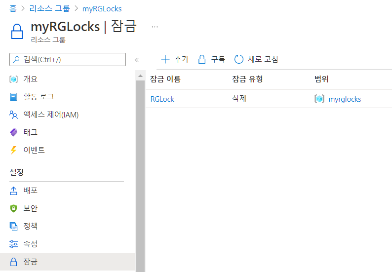
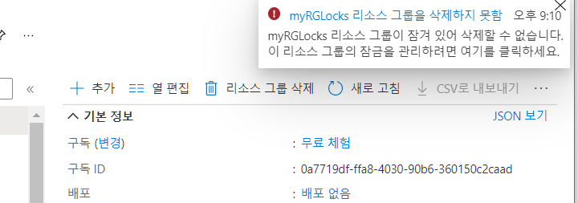
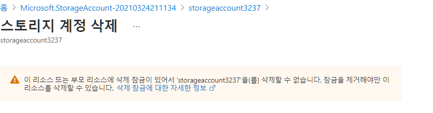

- 실습 내용 
  - 리소스 그룹을 만들고
  - 삭제 잠금을 걸어보기
  - 삭제 잠금이 걸린 상태로 리소스 그룹 삭제 시도 해보고
  - 리소스 그룹 - 스토리지 만든 다음 스토리지 삭제 시도
  - 잠금을 풀어보고 다시 삭제 시도해보기

# 1. 리소스 그룹 만들기

1. 검색 - 리소스그룹
2. 만들기

3. 리소스그룹 만들기 - 기본

   - 구독 - 무료체험
   - 리소스그룹 - myRGLocks

   - 영역 - 동남아시아
     - 메타 정보로써의 영역을 말함
     - 메타정보의 보관장소가 영역의 장소
     - 리소스 그룹의 저장 장소와 리소스의 저장장소는 서로 달라도 무관

4. 만들기

# 2. 리소스 그룹 잠금 만들기

1. 잠금 선택
2. 추가
   - 잠금이름 - RGLock
   - 잠금유형 - 삭제 선택
     - 읽기 전용 - 수정 안됨 / 만들기는 가능 / 훨씬 강력한 잠금기능
     - 삭제 - 수정은 가능 /  만들기는 가능 

3. 개요 - 리소스 그룹 삭제 
   - 리소스 그룹 삭제 잠금떄문에 지워지지 않음

# 3. 스토리지 계정 만들기

1. `스토리지 계정` 검색 - 만들기
2. 스토리지 계정 만들기 - 기본사항
   - 구독 : 무료계정
   - 리소스 그룹 : myRGLocks
   - 스토리지 계정이름 : storageaccount3237
   - 성능 - 표준
   - 계정 종류 - StorageV2
   - 복제 - LRS
3. 만들기

4. 스토리지 계정 - 개요 - 삭제 
   - 삭제가 되지 않음
   - 리소스 그룹에 속한 모든 것은 삭제가 안됨

# 4. 잠금 풀기

1. 리소스 그룹 - myRGLocks - 잠금 
2. `RGLock` - 삭제

3. `myRGLocks`를 리소스 그룹삭제를 하면 이제 삭제가 됨

