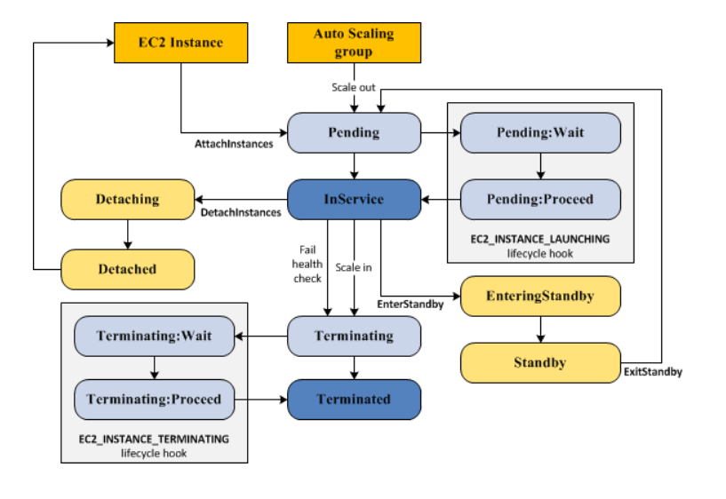

# Auto Scaling

- Auto scaling이란?
  - EC2 인스턴스를 자동으로 시작하거나 종료하여 애플리케이션 로드를 처리하기 위해 적절한 수의 EC2를 유지할 수 있도록 하는 서비스
    - 최소 인스턴스 수, 최대 인스턴스 수를 지정할 수 있음

- 역할
  - 사용자가 정의하는 조건에 따라 EC2 갯수를 자동으로 확장 또는 축소가 가능함
  - 모니터링을 통해 비정상 인스턴스를 탐지하고 교체할 수 있음
  - 수요가 급증할 경우 EC2 수를 자동으로 늘려 성능을 유지하고 수요가 적을 경우 수를 줄여 비용을 절감
  - ELB 대상 그룹을 Auto Scaling Group(ASG)에 포함시켜 자동 생성된 EC2로 하여금 트래픽 분산을 하도록 설정 가능
  - 수요 변화가 예측 가능한 경우 `예약된 일정` 을 통해 늘리거나 줄이도록 설정 가능
  - ASG 내 손상된 인스턴스가 발견될 경우, Auto Scaling은 이를 자동으로 종료하고 새로운 인스턴스로 교체함
    - ELB를 사용하는 경우, ELB가 손상된 인스턴스를 트래픽 요청 대상에서 분리시킨 후 Auto Scaling이 이를 새로운 인스턴스로 교체함
  - 비정상 서버 탐지 후 Auto Scaling이 새로운 인스턴스를 In Service 상태로 만들기까지 5분 이내 소요
- 장점
  - 가변 수요 허용
    - 사용량에 따라 인스턴스를 늘리거나 줄여서 사용량에 따라 최적화 된 인스턴스 수를 구성할 수 있음
  - 가용성과 내결함성 향상
    - 가용성(가동중지 최소화)
      - 현재 트래픽 요구를 처리할 수 있는 적절한 용량을 유지
    - 내결함성(일부 장애가 있어도 시스템 동작)
      - 인스턴스가 비정상 상태일 때 이를 감지하여 종료한 다음 이를 대체할 인스턴스를 시작
      - 하나의 가용 영역이 사용 불가 상태가 되면 다른 가용 영역을 시작할 수 있음
  - 향상된 비용관리
    - 인스턴스가 필요할 때 이를 시작하고 필요 없어지면 종료함으로써 비용을 절감

## 시작구성 ( Launch Configuration)

- 의미
  - Auto Scaling에서 새로운 인스턴스를 시작할 때 기반이 되는 구성
- 옵션을 구성할 수 있음
  - AMI(Amazon Machine Image), 인스턴스 유형, 보안그룹, 스토리지 등 EC2를 생성할 때와 동일
- 특징
  - 시작 구성은 한 번 생성시 수정이 불가하며, 복사와 삭제만 가능
  - 시작 구성을 변경하기 위해서는 기존의 시작구성을 새로운 시작 구성을 만드는 재료로 사용해야 함
  - 하나의 ASG는 하나의 시작구성을 반드시 가짐

- 구성요소
  1. Group
     - EC2 인스턴스는 조정 및 관리 목적의 논리 단위로 취급될 수 있도록 그룹으로 구성됨
     - 그룹을 생성할 때 EC2 인스턴스의 최소 및 최대 인스턴스 수와 원하는 인스턴스 수를 지정할 수 있음
  2. 구성템플릿
     - 그룹은 EC2 인스턴스에 대한 구성 템플릿으로 시작 템플릿(모든 기능 제공) 또는 시작 구성(권장X, 더 적은 기능 제공)을 사용
     - 시작 템플릿 = Launch Template
     - 시작 구성 = Launch Configuration
  3. 조정옵션
     - EC2 Auto Scaling은 Auto Scaling 그룹을 조정하는 다양한 방법을 제공
     - 예시 )  지정한 조건의 발생(동적 확장) 또는 일정에 따라 조정하도록 그룹을 구성할 수 있음

### Launch Template

- 역할
  - EC2 인스턴스를 생성할 때 각 단계를 일일이 지정할 필요없도록 각 파라미터를 저장할 수 있고, 재활용하여 EC2 인스턴스 생성을 간단하게 해줌

- 구성하는 것들
  - EC2 유형, 키페어, 보안그룹, 이미지 ,네트워크 설정

## 조정정책 ( Scaling )

- 최소, 목표, 최대 크기를 설정할 수 있고, 별다른 정책이 없을 경우 목표 크기를 유지하려 함
- 또한 3가지 동적 정책 사용 가능(3가지 정책 모두 모든 인스턴스의 평균 값을 지표로 사용함)
- 대상 추적 정책 : ASG의 지표 평균값을 목표로 인스턴스 수를 조절
  - 평균 CPU 사용률, 네트워크 입/출력, 로드밸런서 요청 수 3가지 활용 가능
- 단순 조정 정책 : 지표의 임계치에 도달할 경우, 사용자가 정한 인스턴스 수를 늘리거나 감소시키는 정책
- 단계 조정 정책 : 단순 조정 정책과 기본은 같지만, 지표 값에 따라 증감 수를 다르게 줄 수 있음(즉 트리거가 여러 개)

- 추천 정책
  - 대상 추적 조정 정책
    - Auto Scaling 그룹의 인스턴스 수에 비례하여 증가하거나 감소하는 사용률 수치를 기준으로 조정하는 경우
  - 단계 조정 정책
    - 위에 언급하지 않은 나머지 상황들

## 조정 휴기( Scaling Cooldown )

- 시작 구성을 이용한 ASG 생성 시점을 포함하여 인스턴스 생성 혹은 제거 후, 지표의 임계값을 넘더라도 인스턴스를 생성하지 않고 기다리는 시간
- 기본 300초

## 수명주기 후크(LifeCycle Hook)

- 역할
  - 지표의 임계값에 의해, Scale In / Out 이 되고 난 후 ‘In Service’ 상태에 돌입하기 전에 사용자가 정의한 작업을 수행하는 시간을 설정하는 기능

- Scale In / Out : ‘In’은 감소를, ‘Out’은 증가를 뜻함
- 특징
  - 기본 3600초
  - 즉 인스턴스 시작/종료시 사용자가 작업을 수행할 수 있음
  - 이 시간동안 인스턴스에 설치 / 설정 등이 가능
  - 가령, Cloudwatch를 사용하면 수명주기 작업이 발생시, Lambda 함수를 호출시키도록 설정 가능

### 인스턴스 수명주기

- Auto Scaling 그룹이 인스턴스를 시작하고 서비스에 들어갈 때 시작
- 인스턴스를 종료하거나 Auto Scaling 그룹이 인스턴스를 서비스에서 제외시키고 이를 종료할 때 끝남

