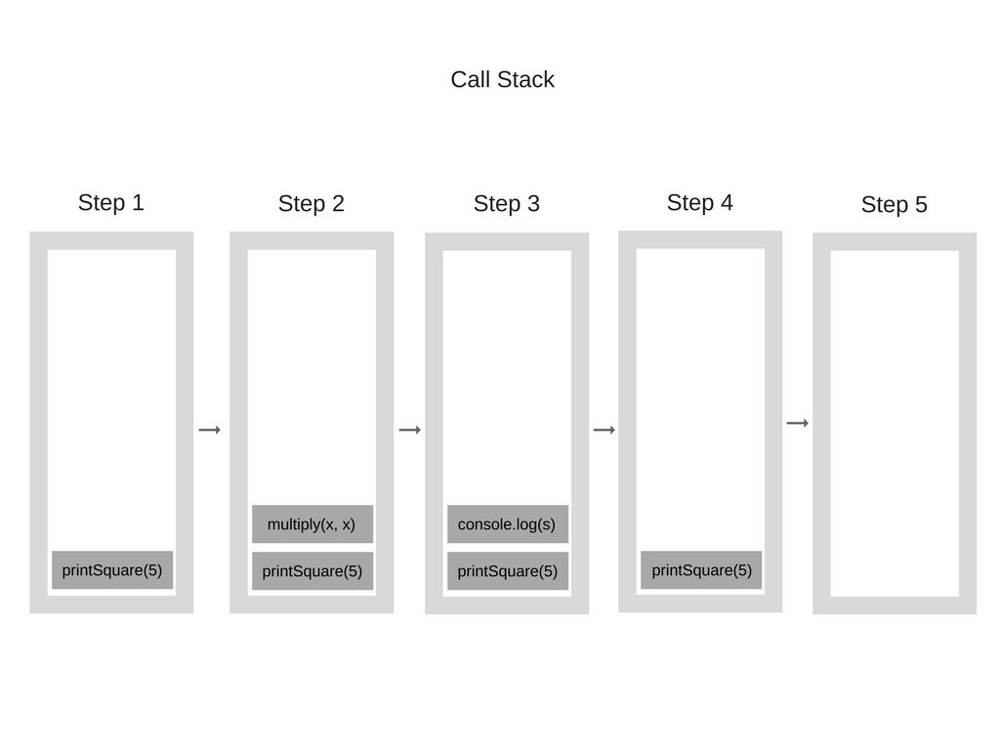

# 자바스크립트 엔진

- 역할

  - 자바스크립트 코드를 실행하는 프로그램 혹은 인터프리터
    - 표준적인 인터프리터로 구현될 수도 있고  
    - 자바스크립트 코드를 바이트코드로 컴파일하는 저스트인타임(just-in-time) 컴파일로러 구현할 수도 있습니다.

  - **가능한 짧은 시간 내에 가장 최적화된 코드를 생성하는 것**이 목표

  - 각각의 자바스크립트 엔진은 특정 버전의 ECMAScript를 구현하기 때문에, ECMAScript가 발전하는 만큼 엔진도 발전

  

- 예시

  - [**V8**](https://en.wikipedia.org/wiki/V8_(JavaScript_engine))**:** 오픈소스, 구글에서 개발, C++로 작성됨
    - Chrome 과 node.js에서 사용됨
  - [**Rhin**](https://en.wikipedia.org/wiki/Rhino_(JavaScript_engine))**o**: 모질라파운데이션에서 관리, 오픈소스, 전체가 자바로 개발됨
  - [**SpiderMonkey**](https://en.wikipedia.org/wiki/SpiderMonkey_(JavaScript_engine)) : 최초의 자바스크립트 엔진. 예전에는 넷스케이프 네비게이터에 사용됐고 지금은 파이어폭스에 사용됨
  - [**JavaScriptCore**](https://en.wikipedia.org/wiki/JavaScriptCore): 오픈소스, 니트로라는 이름으로도 알려져 있으며 애플이 사파리를 위해 개발함
  - [**KJS**](https://en.wikipedia.org/wiki/KJS_(KDE)): KDE의 엔진으로서 KDE프로젝트의 컨커러 웹 브라우저를 위해 해리 포텐이 개발함
  - [**Chakra** (JScript9)](https://en.wikipedia.org/wiki/Chakra_(JScript_engine)): 인터넷익스플로러
  - [**Chakra** (JavaScript)](https://en.wikipedia.org/wiki/Chakra_(JavaScript_engine)): 마이크로소프트엣지
  - [**Nashorn**](https://en.wikipedia.org/wiki/Nashorn_(JavaScript_engine)): 오픈JDK의 일환으로 오픈소스이며 오라클 자바언어와 툴그롭으로 작성됨
  - [**JerryScript**](https://en.wikipedia.org/wiki/JerryScript): 사물인터넷을 위한 경량 엔진


## 엔진의 구성요소

엔진의 2개 구성요소는

- Memory Heap : 메모리 할당이 일어나는 곳
- Call Stack : 호출 스택이 쌓이는 곳


# V8

- 만들어진 이유

  -  브라우저 내부에서 자바스크립트 수행 속도의 개선을 목표로 처음 고안됨

- 특징

  - 속도 향상을 위해 V8은 인터프리터를 사용하는 대신 자바스크립트 코드를 더 효율적인 머신 코드로 번역

    **저스트인타임** 컴파일러를 구현함으로써 코드를 실행 시에 자바스크립트 코드를 머신 코드로 컴파일하는데, 이는 스파이더몽키나 리노와 같은 현대적인 다른 자바스크립트 엔진에서도 마찬가지

  - 주된 차이는 V8은 바이트코드와 같은 중간 코드를 생산하지 않는다는 점입니다.


## 두개의 컴파일러

- 풀코드젠: 간단하고 매우 빠른 컴파일러로서 단순하고 상대적으로 느린 머신 코드를 생산합니다
  - 파싱된 자바스크립트 코드를 변형 없이 직접 머신 코드로 번역
  - 머신 코드의 실행을 **매우 빠르게** 시작할 수 있습니다
- 크랭크샤프트: 좀 더 복잡한 (저스트인타임) 최적화 컴파일러로서 고도로 최적화된 코드를 생산합니다
  - 코드가 얼마간 수행된 다음 프로파일러 쓰레드는 충분한 데이터를 얻게 되고 어떤 메소드를 최적화할 지 알 수 있게 됩니다.
  - 자바스크립트의 추상구문트리를 고수준 정적단일할당(static single-assignment, SSA)으로 번역하는데 이를 **하이드로젠**(Hydrogen)이라고 부릅니다. 


- v8 엔진은 내부적으로 여러 개의 쓰레드를 사용
  - **메인 쓰레드**는 코드를 가져와서 컴파일하고 실행하는 곳입니다
  - 또한 **컴파일을 위한 별도의 쓰레드**가 있어서 이 *쓰레드가 코드를 최적화하는 동안* 메인 쓰레드는 쉬지 않고 코드를 수행할 수 있습니다
  - **프로파일러 쓰레드**는 *어떤 메소드에서 사용자가 많은 시간을 보내는지 런타임에게 알려주어*크랭크샤프트가 이들을 최적화할 수 있게 해줍니다
  - 그 외 **가비지컬렉터 스윕을 처리하기 위한 몇 개의 쓰레드**가 있습니다


## 최적화의 작동 방법

### 인라이닝

- 인라이닝이란
  - 호출 지점(함수가 호출된 곳의 코드 위치)을 호출된 함수의 내용으로 바꾸는 과정

- 미리 가능한 많은 코드를 인라이닝(inlining)하는 것


### 히든클래스

- 자바스크립트는 프로토타입 기반의 언어
  - **클래스라는 것은 없으며** 객체는 복제 과정을 통해 생성됩니다. 
- 자바스크립트는 또한 동적언어(dynamic programming language)이기 때문에 객체가 생성된 이후에도 속성을 쉽게 추가하거나 삭제할 수 있습니다.
- 대부분의 자바스크립트 인터프리터가 딕셔너리와 유사한 구조([해쉬함수](http://en.wikipedia.org/wiki/Hash_function) 기반)를 이용해 객체 속성 값의 위치를 메모리에 저장
  - 이러한 구조 때문에 자바스크립트의 속성 값을 가져오는 것은 자바나 C#에서 보다 계산적으로 더 비싼 행동이 됨
    - 자바에서는 모든 객체 속성이 컴파일 전에 고정된 객체 레이아웃에 의해 결정되고 런타임에 동적으로 추가되거나 제거될 수 없습니다
    -  따라서 속성값(혹은 이들 속성을 가리키는 포인터)은 메모리에 고정된 오프셋을 가진 연속적인 버퍼로 저장될 수 있고 오프셋의 길이는 속성 타입에 따라 쉽게 결정될 수 있습니다
    - 하지만 이런 것들이 속성 타입이 동적으로 변할 수 있는 자바스크립트에서는 불가능


- 딕셔너리를 이용해서 메모리 상에서 객체 속성의 위치를 찾아내는 것은 매우 비효율적인 일이기 때문에 V8에서는 다른 방법을 이용합니다. 바로 **히든클래스(hidden classes)**가 그것
  -  히든클래스는 자바와 같은 언어에서 사용되는 고정 객체 레이아웃과 유사하게 작동하는데 다만 런타임에 생성된다는 차이점이 있음

- 예시로 보는 작동방식

```javascript
function Point(x, y) {
    this.x = x;
    this.y = y;
}
var p1 = new Point(1, 2);
p1.a = 5;
p1.b = 6;
var p2 = new Point(3, 4);
p2.b = 7;
p2.a = 8;
```

1. 일단 `new Point(1, 2)`이 실행되면 V8은 이라는 `C0` 히든클래스를 생성합니다.

   - `Point`에 아직 아무 속성도 정의되지 않았으므로 `C0`은 비어있습니다.


2. `this.x = x`가 수행되면(`Point` 함수 내에서)

   - V8은 `C0`을 기반으로 `C1`이라는 두 번째 히든 클래스를 생성

   - `C1`은 `x`속성을 찾을 수 있는 메모리상의 위치(오브젝트 포인터에 상대적임)에 대한 설명이 포함

   - 예제의경우 `x`는 [오프셋](http://en.wikipedia.org/wiki/Offset_(computer_science)) 0에 저장되는데 이는 연속된 버퍼로서 해당 메모리의 포인트 객체를 읽을 때 첫 번째 오프셋이 `x`속성에 대응한다는 것을 의미

   -  V8은 또한 `C0`을 클래스전환으로 업데이트하는데 여기에는 만약 `x`속성이 포인트 객체에 추가되면 히든 클래스가 `C0`에서 `C1`으로 전환되어야 한다는 내용이 있습니다.

   - 어떤 객체에 새로운 속성이 추가될 때마다 오래된 히든클래스는 새로운 히든 클래스에 대한 전환 경로로 업데이트됨. 

     히든클래스 전환이 중요한 이유는 이를 통해 히든 클래스가 같은 방식으로 생성된 객체들 사이에 공통으로 사용될 수 있기 때문

     만약 두 개의 객체가 하나의 히든클래스를 공유하고 같은 속성이 이들에게 추가되면 전환과정은 이들 객체가 동일한 새로운 히든클래스를 받도록 하고 그에 따라 그에 딸려 오는 최적화 코드도 모두 동일합니다.


3. 이 과정은 `this.y = y`가 수행될 때도 반복됩니다(마찬가지로 `Point`함수 내에서 `this.x = x` 구문 뒤에서)

   - `C2`라는 새로운 히든클래스가 생성되고 `C1`에 클래스전환이 추가되며 여기에는 `y`속성이 포인트 객체(이미 `x`속성을 갖고 있는 그 객체)에 추가되었다는 내용이 명시
   - 그 다음 히든 클래스는 `C2`로 변경되어야 하며 포인트 객체의 히든 클래스는 `C2`로 업데이트


4. p1.a = 5 와 같은 속성 추가
   - 히든클래스 전환은 속성이 객체에 추가되는 순서에 의존적
   - 아마도 `p1`과 `p2`에 대해 같은 히든클래스와 전환이 사용될 것이라고 생각할지도 모르겠습니다만 실제로는 그렇지 않음
   - `p1`에서는 속성 `a`가 추가되고 그 다음 `b`가 추가됩니다. 하지만 `p2`의 경우 `b`가 먼저 할당되고 `a`가 할당됩니다. 따라서 `p1`과 `p2`는 서로 다른 히든클래스를 사용하게 되고 결국 전환 경로도 달라집니다. 이와 같은 경우에 같은 히든클래스를 재사용할 수 있도록 동적 속성을 같은 순서로 초기화하는 것이 훨씬 좋습니다.


### 인라인 캐싱

-  C나 C++ 언어에서 **인라인 함수**라는 문법이 있다. 이는 함수의 호출을 함수 그 자체 내용의 복사본으로 직접 치환하여 오버헤드를 없애는 기법
  -  **캐싱**이란 캐시에 자주 쓰이는 데이터를 저장해 놓고 빠른 속도로 메모리에 가져와서 속도 향상을 목표하는 기법
  - **인라인 캐싱**이란 캐싱을 사용하여 인라인 함수를 구현한 방법 이라고 유추해 볼 수 있겠다.
- 밑의 코드에 인라인 캐싱을 적용한다고 하면 컴파일러는 `userData` 객체를 반복해서 찾는 대신 `found ${user.firstName} ${user.lastName}` 를 `found johnson junior` 라는 문자열으로 대체하여 실행 속도를 향상시킨다.

```javascript
function findUser(user){
  return `found ${user.firstName} ${user.lastName}`
}

const userData = {
  firstName : 'johnson'
  lastName : 'junior'
}

findUser(userData)
```


#### 히든클래스과 인라인캐싱과의 연관성

- 특정 객체에 메소드가 호출될 때마다 V8엔진은 특정 속성에 접근하기 위한 오프셋을 계산하기 위해 해당 객체의 히든클래스를 뒤져봐야 합니다
  - 동일한 히든 클래스의 동일한 메소드에 대해 두 번의 성공적인 호출을 마치고나면 V8은 히든클래스를 찾는 것을 생략하고 단순하게 스스로 해당 객체 포인터에 속성 오프셋을 더해 놓습니다. 
  - 이후 해당 메소드에 대한 모든 호출에 대해 V8은 히든클래스는 변하지 않았다고 가정하고 이전에 찾아 두었던 오프셋을 이용해 직접 메모리 주소로 점프
  - 이를 통해 실행 속도는 크게 증가
- 인라인캐싱은 같은 타입의 객체가 히든클래스를 공유하는 게 중요한 이유
  - 만약 타입은 같고 히든 클래스는 다른 두 객체를 만들면 (앞서의 예제처럼) V8은 인라인캐싱을 사용할 수 없을 것입니다. 왜냐하면 두 객체가 같은 타입이기는 해도 각각에 대응하는 히든클래스!가 그들의 속성에 서로 다른 오프셋을 할당하기 때문
  - 밑의 사진은두 객체가 기본적으로 동일하지만 ‘a’와 ‘`b’` 속성은 서로 다른 순서로 생성되었습니다.


### 머신코드로의 컴파일

- 하이드로젠 그래프가 최적화되면 크랭크샤프트는 이를 **리튬**이라고 부르는 더 하위레벨로 낮춥니다. 

  - 리튬의 대부분의 구현은 아키텍쳐에 따라 다릅니다. 레지스터 할당이 이 수준에서 이루어집니다.

- 리튬은 머신 코드로 컴파일됩니다. 그런 다음 OSR(on-stack replacement, 온스택교환)이라는 것이 일어납니다.

  - 분명하게 수행시간이 긴 메소드를 컴파일하고 최적화하기 전에 그것을 실행할 가능성이 높습니다. 

    V8은 더 최적화된 버전으로 다시 시작하기 위해 방금 어떤 코드가 느리게 수행됐는지 잊지 않을 것

  - 대신 우리가 가진 모든 맥락(스택, 레지스터 등)을 전환하여 코드의 수행 중간에 최적화된 버전으로 옮겨탈 수 있도록 해줍니다.
  
  

## 가비지 컬렉터

- 가비지컬렉션을 대해 V8은 전통적인 마킹하고 쓸어버리기(mark-and-sweep)의 세대적 접근방법을 이용해 예전 세대를 제거
- 마킹 단계에서는 자바스크립트의 수행을 중단하게 되어있습니다. 가비지컬렉션 비용을 통제하고 그 수행을 좀 더 안정적으로 하기위해 V8은 점진적 마킹을 이용
  - 힙 전체를 훑어서 가능한 모든 객체를 마킹하는 대신 힙의 일부만을 확인한 다음 정상적인 자바스크립트 실행을 계속
  -  그 다음의 GC 수행은 바로 이전에 멈춘곳에서부터 계속됩니다. 이를 통해 일상적인 실행에는 매우 짧은 코드 중단만 일어납니다. 위에 언급한대로 쓸어버리기는 별도의 쓰레드에서 수행됩니다.

> **표시하고-쓸기(Mark-and-sweep) 알고리즘**
> 이 알고리즘은 "더 이상 필요없는 오브젝트"를 "닿을 수 없는 오브젝트"로 정의한다.
> 이 알고리즘은 roots 라는 오브젝트의 집합을 가지고 있다(자바스크립트에서는 전역 변수들을 의미한다). 주기적으로 가비지 콜렉터는 roots로 부터 시작하여 roots가 참조하는 오브젝트들, roots가 참조하는 오브젝트가 참조하는 오브젝트들... 을 닿을 수 있는 오브젝트라고 표시한다. 그리고 닿을 수 있는 오브젝트가 아닌 닿을 수 없는 오브젝트에 대해 가비지 콜렉션을 수행한다.
>
> 2012년 기준으로 모든 최신 브라우저들은 가비지 콜렉션에서 **표시하고-쓸기 알고리즘**을 사용한다. 지난 몇 년간 연구된 자바스크립트 가비지 콜렉션 알고리즘의 개선들은 모두 이 알고리즘에 대한 것이다. 개선된 알고리즘도 여전히 "더 이상 필요없는 오브젝트"를 "닿을 수 없는 오브젝트"로 정의하고 있다.


undefined


## 그래서 최적화되게 코드를 작성하는법

1. **객체 속성의 순서**: 객체 속성을 항상 같은 순서로 초기화해서 히든클래스 및 이후에 생성되는 최적화 코드가 공유될 수 있도록 합니다
2. **동적 속성**: 객체 생성 이후에 속성을 추가하는 것은 히든 클래스가 변하도록 강제하고 이전의 히든클래스를 대상으로 최적화되었던 모든 메소드를 느리게 만듭니다. 대신에 모든 객체의 속성을 생성자에서 할당합니다
3. **메소드**: 동일한 메소드를 반복적으로 수행하는 코드가 서로 다른 메소드를 한 번씩만 수행하는 코드 보다 더 빠르게 동작합니다(인라인 캐싱 때문)
4. **배열**: 값이 띄엄띄엄 있어서 키가 계속해서 증가하는 숫자가 되지 않는 배열은 피하는게 좋습니다. 모든 요소를 가지지는 않는 배열은 **해시테이블**입니다. 이와 같은 배열의 요소들은 접근하기에 많은 비용이 듭니다. 또한 커다란 배열을 미리 할당하지 않도록 하십시오. 사용하면서 크기가 커지도록 하는 게 낫습니다. 마지막으로 배열의 요소를 삭제하지 마십시오. 그 배열의 키가 띄엄띄엄 배치됩니다.
5. **태깅된 값**: V8은 객체와 숫자를 32비트로 표현합니다. 어떤 값이 오브젝트(flag = 1)인지 혹은 정수(flag = 0)인지는 SMI(Small Integer)라는 하나의 비트에 저장하고 이 때문에 31비트가 남습니다. 따라서 어떤 숫자가 31비트 보다 크면 V8은 이 숫자를 분리해서 더블 타입으로 전환한 다음 이 숫자를 넣을 새로운 객체를 생성합니다. 이러한 동작은 비용이 높으므로 가능한한 31비트의 숫자를 사용하도록 하십시오.


# Memory Heap and Call Stack

자바스크립트 엔진이 구동되면서 코드를 읽고 실행하는 과정에서 아주 중요한 두가지 단계가 있는데,

1. 정보(ex. 변수, 함수 등)를 특정한 장소에 저장하는 것과
2. 실제 현재 실행되고 있는 코드를 트래킹하는 작업이 그 두가지이다.	

여기서 정보를 저장하는 공간(Memory Allocation이 발생하는 공간)이 바로 **메모리 힙(Memory Heap)**이고, 실행 중인 코드를 트래킹하는 공간이 **콜 스택(Call Stack)**이다.

## Memory Heap

메모리 생존주기는 프로그래밍 언어와 관계없이 비슷하다.

1. 필요할때 할당한다. (allocate)
2. 사용한다. (읽기, 쓰기) (use)
3. 필요없어지면 해제한다. (release)

두 번째 부분은 모든 언어에서 명시적으로 사용된다. 그러나 첫 번째 부분과 마지막 부분은 저수준 언어에서는 명시적이며, 자바스크립트와 같은 대부분의 고수준 언어에서는 암묵적으로 작동한다.

메모리 힙은 변수, 함수 저장, 호출 등의 작업이 발생하여 위 내용들이 진행되는 공간이다.
쉽게 생각하면 'Memory Heap'이라는 이름의 창고가 있고, 변수나 함수들은 겉에 이름이 라벨지로 붙어있는 박스들인거다.


## Call Stack

콜스택은 메모리에 존재하는 공간 중의 하나로, 코드를 읽어내려가면서 수행할 작업들을 밑에서부터 하나씩 쌓고, 메모리 힙에서 작업 수행에 필요한 것들을 찾아서 작업을 수행하는 공간이다.


# 런타임

- DOM, Ajax, setTimeout 과같이 브라우저에서 제공하는 API 들을 Web API
- 아래쪽에 이벤트 루프와 콜백 큐  도 존재


## 호출스택(Call Stack)

- 자바스크립트는 기본적으로 싱글 쓰레드 기반 언어
  - 호출 스택이 하나라는 소리
  - 따라서 한 번에 한 작업만 처리할 수 있습니다.
- 호출 스택은 기본적으로 우리가 프로그램 상에서 어디에 있는지를 기록하는 자료구조
  - 만약 함수를 실행하면(실행 커서가 함수 안에 있으면), 해당 함수는 호출 스택의 가장 상단에 위치하는 거죠. 함수의 실행이 끝날 때(리턴 값을 돌려줄 때), 해당 함수를 호출 스택에서 제거합니다. 그게 스택의 역할
- 호출 스택의 각 단계를 스택 프레임(Stack Frame)이라고 합니다.
  - 보통 예외가 발생했을 때 콘솔 로그 상에서 나타나는 스택 트레이스(Stack Trace)가 오류가 발생하기까지의 스택 트레이스들로 구성됩니다. 간단히 말해서 에러가 났을 때의 호출 스택의 단계를 의미

```javascript
function multiply(x, y) {
    return x * y;
}
function printSquare(x) {
    var s = multiply(x, x);
    console.log(s);
}
printSquare(5);
```



- 호출 스택이 최대 크기가 되면 **“스택 날려 버리기”** 가 일어납니다. 이는 반복문 코드를 광범위하게 테스트하지 않고 실행했을 때 자주 발생

  -  함수 호출 횟수가 호출 스택(Call Stack)의 최대 허용치를 넘게 되면 브라우저가 아래와 같은 에러를 발생시킵니다.
    - `Uncaught RangeError : Maximum call stack size exceeded`

  ```javascript
  function foo() {
      foo();
  }
  foo();
  ```


## 동시성(Concurrency)

- 호출 스택에 처리 시간이 어마어마하게 오래 걸리는 함수가 있으면 무슨 일이 발생할까요? 예를 들어, 브라우저에서 자바스크립트로 매우 복잡한 이미지 프로세싱 작업을 한다고 합시다.

  - *이게 대체 어때서?* 라고 의문이 생길지도 모르지만, 여기서 문제는 호출 스택에서 해당 함수가 실행되는 동안 브라우저는 아무 작업도 못하고 대기 상태가 된다는 겁니다.

    이 말뜻은 **브라우저는 페이지를 그리지도 못하고, 어느 코드도 실행을 못한다는 거죠. 말 그대로 그냥 가만히 있는 겁니다.** 만약 매끄럽고 자연스러운 화면 UI를 가진 앱을 원한다면 위 경우는 문제가 됩니다.

  - 문제는 이뿐만이 아닙니다. 브라우저가 호출 스택의 정말 많은 작업들을 처리하다 보면 화면이 아마 오랫동안 응답하지 않게 됩니다. 이 경우에 대부분의 브라우저가 아래와 같은 에러를 띄우면서 페이지를 종료할 건지 물어봅니다.

- 이것을 해결책이 **비동기 콜백**

  - 특정 코드의 연산이 끝날 때까지 코드의 실행을 멈추지 않고 다음 코드를 먼저 실행하는 자바스크립트의 특성을 의미

  

### Ajax

```javascript
function getData() {
	var tableData;
	$.get('https://domain.com/products/1', function(response) { // ajax 통신하는 부분
		tableData = response;
	});
	return tableData;
}

console.log(getData()); // undefined
```

- 여기서 `$.get()`이 ajax 통신을 하는 부분입니다. `https://domain.com` 에다가 HTTP GET 요청을 날려 1번 상품(product) 정보를 요청하는 코드죠. 좀 더 쉽게 말하면 지정된 URL에 ‘데이터를 하나 보내주세요’ 라는 요청을 날리는 것과 같습니다.
- 그렇게 서버에서 받아온 데이터는 `response` 인자에 담깁니다. 그리고 `tableData = response;` 코드로 받아온 데이터를 `tableData`라는 변수에 저장합니다. 그럼 이제 이 getData()를 호출하면 어떻게 될까요? 받아온 데이터가 뭐든 일단 뭔가 찍혀야겠죠. 근데 결과는 맨 아래에서 보시는 것처럼 undefined입니다. 왜 그럴까요?
- 그 이유는 `$.get()`로 데이터를 요청하고 받아올 때까지 기다려주지 않고 다음 코드인 `return tableData;`를 실행했기 때문입니다. 따라서, getData()의 결과 값은 초기 값을 설정하지 않은 tableData의 값 undefined를 출력합니다.
- **이렇게 특정 로직의 실행이 끝날 때까지 기다려주지 않고 나머지 코드를 먼저 실행하는 것이 비동기 처리입니다.** 자바스크립트에서 비동기 처리가 필요한 이유를 생각해보면, 화면에서 서버로 데이터를 요청했을 때 서버가 언제 그 요청에 대한 응답을 줄지도 모르는데 마냥 다른 코드를 실행 안 하고 기다릴 순 없기 때문입니다. 위에선 간단한 요청 1개만 보냈는데 만약 100개 보낸다고 생각해보세요. 비동기 처리가 아니고 동기 처리라면 코드 실행하고 기다리고, 실행하고 기다리고.. 아마 웹 애플리케이션을 실행하는데 수십 분은 걸릴 겁니다.


```javascript
//위의 코드를 콜백함수를 이용하여 개선하기
function getData(callbackFunc) {
	$.get('https://domain.com/products/1', function(response) {
		callbackFunc(response); // 서버에서 받은 데이터 response를 callbackFunc() 함수에 넘겨줌
	});
}

getData(function(tableData) {
	console.log(tableData); // $.get()의 response 값이 tableData에 전달됨
});
```


### setTimeout()

```javascript
// #1
console.log('Hello');
// #2
setTimeout(function() {
	console.log('Bye');
}, 3000);
// #3
console.log('Hello Again');
```

비동기 처리에 대한 이해가 없는 상태에서 위 코드를 보면 아마 다음과 같은 결과값이 나올 거라고 생각할 겁니다.

- ‘Hello’ 출력
- 3초 있다가 ‘Bye’ 출력
- ‘Hello Again’ 출력

그런데 실제 결과 값은 아래와 같이 나오죠.

- ‘Hello’ 출력
- ‘Hello Again’ 출력
- 3초 있다가 ‘Bye’ 출력

setTimeout() 역시 비동기 방식으로 실행되기 때문에 3초를 기다렸다가 다음 코드를 수행하는 것이 아니라 일단 setTimeout()을 실행하고 나서 바로 다음 코드인 `console.log('Hello Again');`으로 넘어갔습니다. 따라서, ‘Hello’, ‘Hello Again’를 먼저 출력하고 3초가 지나면 ‘Bye’가 출력됩니다.


### 콜백 지옥

콜백 지옥은 비동기 처리 로직을 위해 콜백 함수를 연속해서 사용할 때 발생하는 문제입니다. 아마 아래와 같은 코드를 본 적이 있을 겁니다.

```js
$.get('url', function(response) {
	parseValue(response, function(id) {
		auth(id, function(result) {
			display(result, function(text) {
				console.log(text);
			});
		});
	});
});
```

웹 서비스를 개발하다 보면 서버에서 데이터를 받아와 화면에 표시하기까지 인코딩, 사용자 인증 등을 처리해야 하는 경우가 있습니다. 만약 이 모든 과정을 비동기로 처리해야 한다고 하면 위와 같이 콜백 안에 콜백을 계속 무는 형식으로 코딩을 하게 됩니다. 이러한 코드 구조는 가독성도 떨어지고 로직을 변경하기도 어렵습니다. 이와 같은 코드 구조를 콜백 지옥이라고 합니다.


### 콜백지옥 해결법

일반적으로 콜백 지옥을 해결하는 방법에는 Promise나 Async를 사용하는 방법이 있습니다. 만약 코딩 패턴으로만 콜백 지옥을 해결하려면 아래와 같이 각 콜백 함수를 분리해주면 됩니다.

```js
function parseValueDone(id) {
	auth(id, authDone);
}
function authDone(result) {
	display(result, displayDone);
}
function displayDone(text) {
	console.log(text);
}
$.get('url', function(response) {
	parseValue(response, parseValueDone);
});
```

위 코드는 앞의 콜백 지옥 예시를 개선한 코드입니다. 중첩해서 선언했던 콜백 익명 함수를 각각의 함수로 구분하였습니다. 정리된 코드를 간단하게 살펴보겠습니다. 먼저 ajax 통신으로 받은 데이터를 parseValue() 메서드로 파싱 합니다. parseValueDone()에 파싱 한 결과값인 id가 전달되고 auth() 메서드가 실행됩니다. auth() 메서드로 인증을 거치고 나면 콜백 함수 authDone()이 실행됩니다. 인증 결과 값인 result로 display()를 호출하면 마지막으로 displayDone() 메서드가 수행되면서 text가 콘솔에 출력됩니다.


## 이벤트 루프(Event Loop)

- Callback Event Queue에서 하나 씩 꺼내 동작시키는 Loop. 

  자바스크립트는 단일 스레드 기반 언어이기 때문에 한번에 하나씩 작업을 진행한다. 

- 자바스크립트가 사용되는 환경을 생각해보면 많은 작업이 동시에 처리되고 있는 걸 볼 수 있다. 예를 들면, 웹브라우저는 애니메이션 효과를 보여주면서 마우스 입력을 받아서 처리하고, Node.js기반의 웹서버에서는 동시에 여러 개의 HTTP 요청을 처리하기도 한다. 어떻게 스레드가 하나인데 이런 일이 가능할까? 질문을 바꿔보면 '자바스크립트는 어떻게 동시성(Concurrency)을 지원하는 걸까'?

- 자바스크립트는 이벤트 루프를 이용해서 비동기 방식으로 동시성을 지원한다.
  자바스크립트 엔진에서 제공되는 것이 아닌 브라우저나 node.js에서 지원한다.


> 자바스크립트가 '단일 스레드' 기반의 언어라는 말은 '자바스크립트 엔진이 단일 호출 스택을 사용한다'는 관점에서만 사실이다.
> 실제 자바스크립트가 구동되는 환경(브라우저, Node.js등)에서는 주로 여러 개의 스레드가 사용되며, 이러한 구동 환경이 **단일 호출 스택을 사용하는 자바 스크립트 엔진과 상호 연동하기 위해 사용하는 장치가 바로 '이벤트 루프'**인 것이다.

- 이벤트 루프는 '현재 실행중인 이벤트가 없는지'와 '콜백 큐에 이벤트가 있는지'를 반복적으로 확인한다. 간단하게 정리하면 다음과 같을 것이다.

- 모든 비동기 API들은 작업이 완료되면 콜백 함수를 콜백 큐에 추가한다.
  이벤트 루프는 '현재 실행중인 이벤트(콜백)가 없을 때'(주로 호출 스택이 비워졌을 때) 콜백 큐의 첫 번째 이벤트(콜백)를 꺼내와 실행한다.

### Callback Queue(Task Queue)

Event 실행 관리하기 위해 사용되는 Queue

- 자바스크립트의 런타임 환경의 Callback Queue는 처리할 메세지 목록과 실행할 콜백 함수들의 리스트이다. 버튼 클릭 같은 이벤트나 DOM 이벤트, http 요청, setTimeout 같은 비동기 함수는 Web API를 호출하며 Web API는 콜백 함수를 Callback Queue에 밀어 넣는다.
- Callback queue는 대기하다가 Call Stack이 비는 시점에 이벤트 루프를 돌려 해당 콜백 함수를 스택에 넣는다. **이벤트 루프의 기본 역할은 큐와 스택 두 부분을 지켜보고 있다가 스택이 비는 시점에 콜백을 실행시켜 주는 것이다.**
- 브라우저에서는 이벤트가 발생할 때마다 메세지가 추가되고 이벤트 리스너가 첨부된다. 콜백 함수의 호출은 호출 스택의 초기 프레임으로 사용되며 자바스크립트가 싱글 스레드 이므로 스택에 대한 모든 호출이 반환될 때까지 메세지 폴링 및 처리가 중지 된다. 동기식 함수 호출은 이와 반대로 새 호출 프레임을 스택에 추가한다.

```javascript
function delay() {
    for (var i = 0; i < 100000; i++);
}
function foo() {
    delay();
    console.log('foo!');
}
function bar() {
    delay();
    console.log('bar!');
}
function baz() {
    delay();
    console.log('baz!');
}

setTimeout(foo, 10);
setTimeout(bar, 10);
setTimeout(baz, 10);
```

이 코드를 실행하면 아무런 지연 없이 `setTimeout` 함수가 세 번 호출된 이후에 실행을 마치고 Call Stack이 비워질 것이다.
그리고 10ms가 지나는 순간 `foo`, `bar`, `baz` 함수가 순차적으로 태스크 큐에 추가된다. 이벤트 루프는 `foo` 함수가 태스크 큐에 들어오자 마자, 호출 스택이 비어있으므로 바로 `foo`를 실행해서 호출 스택에 추가한다.
`foo` 함수의 실행이 끝나고 호출 스택이 비워지면 이벤트 루프가 다시 큐에서 다음 콜백인 `bar`를 가져와 실행한다.
`bar`의 실행이 끝나면 마찬가지로 큐에 남아있는 `baz`를 큐에서 가져와 실행한다.
그리고 `baz`까지 실행이 모두 완료되면 현재 진행중인 태스크도 없고 태스크 큐도 비어있기 때문에, 이벤트 루프는 새로운 태스크가 태스크 큐에 추가될 때까지 대기하게 된다.


