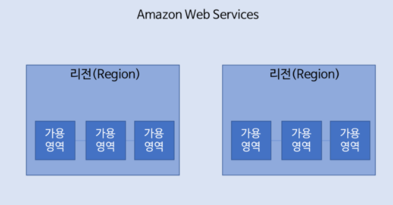

# AWS 글로벌 인프라

- 글로벌인프라 https://aws.amazon.com/ko/about-aws/global-infrastructure/
  - 25개의 리전
  - 80개의 가용영역(Availability Zone - **AZ**)
    - 한국은 가용영역 4곳
  - 5개의 local Zone과 13개의 Wavelength Zone
  - 245개의 국가와 지역에서 서비스 제공
  - 각 리전은 이중화된 100G 케이블(해저 광케이블)로 연결 및 암호화
- AWS 글로벌 인프라 맵
  - https://aws.amazon.com/ko/about-aws/global-infrastructure/regions_az/
  - 해저케이블맵 https://www.submarinecablemap.com/

.png)

- aws 가 이렇게 많은 리전과 가용영역을 가지는 이유?
  - 거리에 따른 지연 
    - 레이턴시(Latency) - 패킷을 전송하는 곳에서부터 전달받는 곳까지 이동하는 데 걸리는 시간
    - 전파 지연(propagation delay) : 송신측 → 수신측으로 이동하는데 필요한 시간, 총 이동거리 대비 신호가 이동하는 속도로 측정
    - 광신호 속도(진공- 30만km/s , 광섬유내 20만km/s)
      - 적도 둘래 : 4만km -> 약 200ms
      - 왕복을 해야하기 때문에 시간*2 해야함
    - 대부분의 사람들은 시스템에서 100~200ms 정도의 지연을 감지하고 300ms 이상시 '느리다'라고 인식
    - AWS 리전 간 레이턴시 확인 https://www.cloudping.co/grid
    - 사용자 브라우저와 리전 간 레이턴시 확인 https://www.cloudping.info/
  - 법적 규제 및 데이터 거버넌스
  - 리전 내에서 사용 가능한 서비스
  - 재해극복

## 리전(지역)

- **리전**이란 AWS가 전 세계에서 데이터 센터를 클러스터링하는 물리적 위치
  - 각 AWS 리전은 지리적 영역 내에서 격리되고 물리적으로 분리된 여러 개의 AZ로 구성
  - 리전은 최소 2개의 가용 영역으로 구성되고 최대 6개의 가용 영역으로 구성된 리전도 있음
  - 리전끼리는 aws 백본 네트워크로 연결되어 있음

.png)

### 리전 선택시 고려사항

- 내가 필요한 서비스를 포함하는지?
- 애플리케이션 및 데이터에 해당 리전이 적합한지?
- 고객에 대한 Latency 고려
- 특정 리전에 원하는 AWS 서비스가 아직 준비되지 않은 경우가 있음. 
- 리전별로 다른 비용 고려
  - 같은 아시아 내라도 국가에 따라 비용이 다를 수 있음

## 가용영역  **AZ (**Availability Zone)

- AZ(가용 영역)는 AWS 리전의 중복 전력, 네트워킹 및 연결이 제공되는 하나 이상의 개별 데이터 센터로 구성

  - 즉 리전이 동일해도 다른 가용 영역에 AWS 서비스를 각각 배치했다면 물리적으로는 복수의 데이터센터를 사용하는 것
  - 각 센터는 광통신 전용망(고속 프라이빗 네트워크)으로 연결되어 있음
    - 동일 리전 내 존재하는 복수의 AZ는 서로 **물리적으로 격리**되어 있지만, 좋은 품질의 네트워크 연결을 통해 **논리적으로 연결**되어 있다.
    - 물리적 격리란 자연재해 및 정전 등 사고에 자유롭다는 의미, 
    - 고가용성(HA)를 위해 리전 내 복수의 가용 영역에 데이터와 애플리케이션을 배포하는 것이 좋다.
  - AWS 한개의 센터에는 50000~80000대의 물리적 서버가 존재한다고 함
  - 가용역역 자체는 장애가 날 수 있음 - 예시) 도쿄 리전 AZ 장애

- 가용영역과 외부(인터넷) 연결을 위한 이중화된 **트랜짓 센터(엣지)** 가 존재

  - 트랜짓 센터는 AWS 글로벌 백본 네트워크에 연결이 되고, 엣지 POP을 통해서 CDN 등 서비스 함

- AZ는 표시할 때는 리전 코드와 식별문자를 조합하여 표현한다.

  - 리전은 국가코드, 위치에 숫자로 표기하며, AZ는 알파벳 소문자를 사용한다

    - us-east-1

      미국 동부(버지니아 북부)

    - us-east-2

      미국 동부(오하이오)

.png)

### Elastic IP

- AWS의 Elastic IP를 사용하여 인스턴스 장애가 발생한 AZ로부터 다른 영역으로 인스턴스 주소를 신속히 변경할 수 있다.
- Elastic IP는 AWS에서 제공하는 Static ip Address service
  - ip주소는 변경되지 않은 상태에서 해당 ip로 연결하는 AZ는 문제가 발생한 곳에서 문제가 없는 곳으로 빠르게 변경 가능하다

