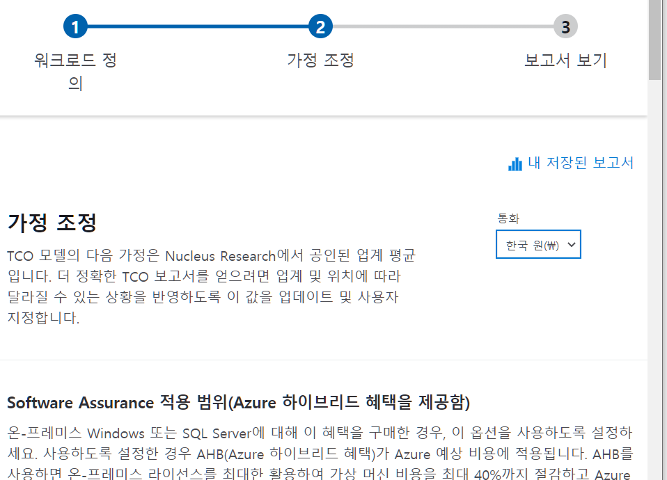
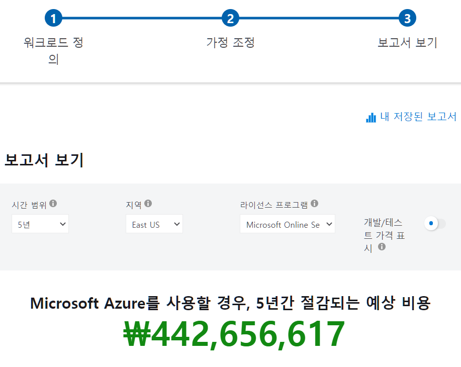
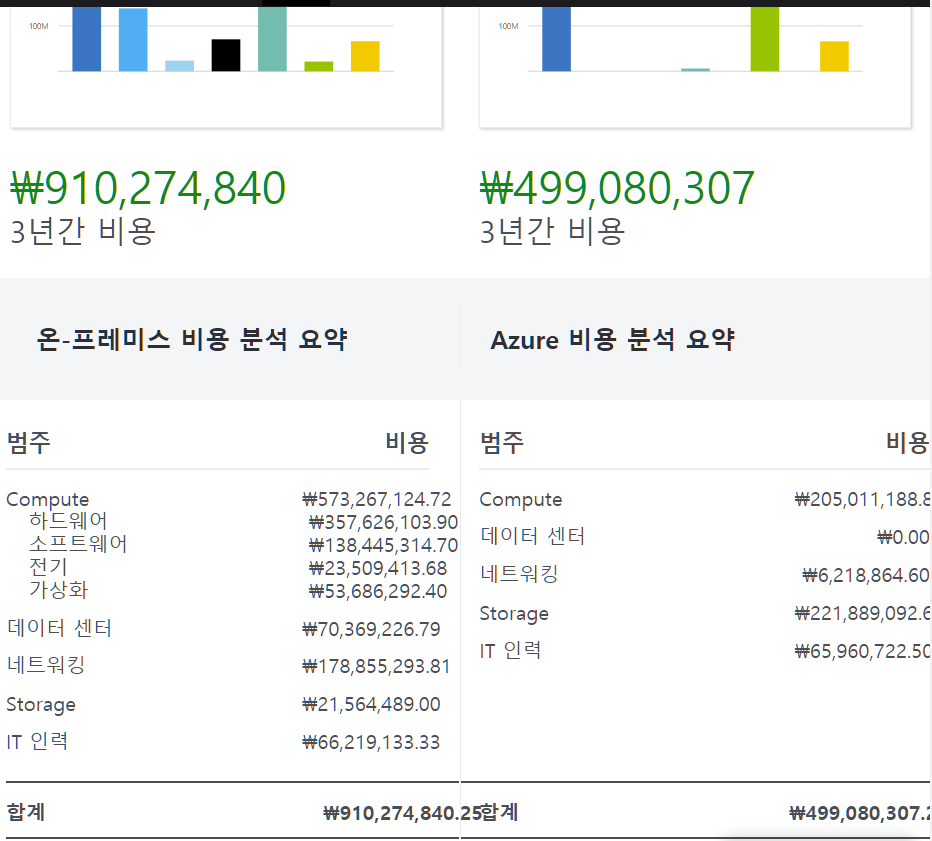
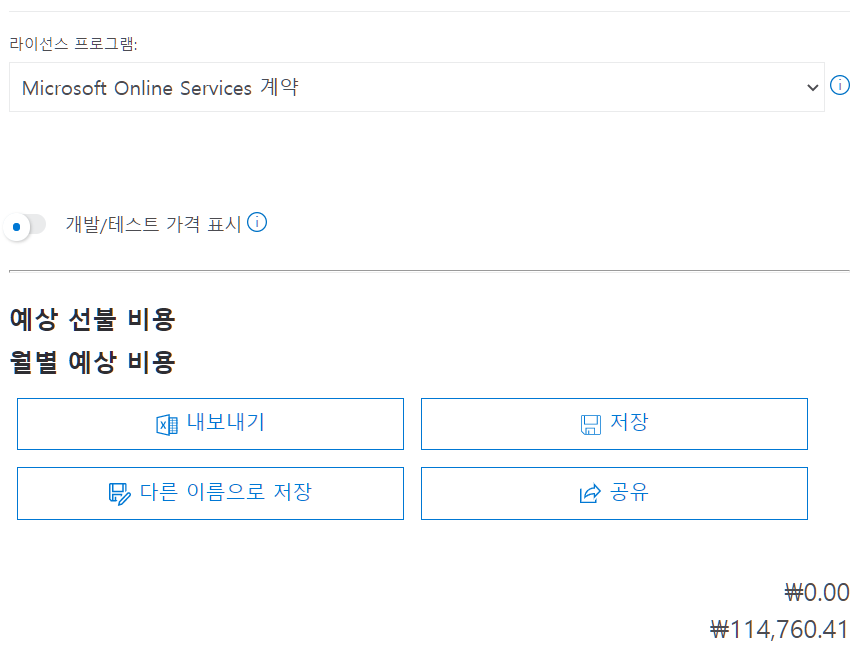

1. https://azure.microsoft.com/ko-kr/pricing/tco/calculator/
   - 워크로드 정의 > 서버 워크로드 추가

2. 서버 - 우리 회사 내의 데이터 센터의 구성을 작성하는 것
   - Servers : Windows VMs 이름 정해주기
   - 작업 : Windows/Linux
   - 환경 : Virtual Machine
   - 운영체제 : Windows
   - 운영체제 라이센스 : 데이터센터
   - VM: 50
   - 가상화 : Hyper-V
   - 코어 : 8개
   - RAM : 16GB
   - 최적화 : CPU

3. 서버 워크로드 추가
   - Servers: Linux VMs 이름 정해주기
   - 작업 : Windows/Linux
   - 환경 : Virtual Machine
   - 운영체제 : Linux
   - VM: 50
   - 가상화 : Hyper-V
   - 코어 : 8개
   - RAM : 16GB
   - 최적화 : CPU
4. Storage 추가
   - 스토리지 유형 : 로컬 디스크 /SAN
   - 디스크 유형 :  HDD
   - 용량 : 60TB
   - Backup : 120TB
   - Archieve : 0TB
5. 네트워킹 구성 
   - 아웃바운드 대역폭: 15TB

6. 다음

7. 다음
   - 데이터 센터를 직접 운영할 때보다 Azure를 운영했을 때 비용적 차이를 보여줌

# 2. 가격 계산기 구성

1. https://azure.microsoft.com/ko-kr/pricing/calculator/
   - **① 제품** 탭에서 **② 가상 머신**을 선택 - 가상머신 생성

2. 저장된 견적 탭 > 견적 보기 - 이렇게 세밀하게 설정하고 견적 짤 수 있는거 확인해보는 거

   - 지역 - Korea Central 로 바꾸기
   - 운영체제 : Windows
   - 유형 : OS만
   - 계층 : Standard
   - 범주 : All
   - 인스턴스 시리즈 : A시리즈
   - 인스턴스 : A0
   - VIRTUAL MACHINES : 1 x 365 시간

   - 종량제

   - Managed Disks
     - 계층 :표준 HDD
     - 디스크크기 : S3
     - 디스크 1개
   - Storage  트랜잭션
     - 10000
   - Bandwidth
     - 지역간 - Korea Central - EastAsia
   - 아웃바운드 데이터 전송
     - 50GB

   

3. 네트워킹 - Application Gateway 클릭 : 네트워크 추가 

4. 저장된 견적 탭 > 견적 보기 - Application Gateway

   - 지역 Korea Central
   - 게이트 웨이 시간 : 1 x365 시간
     - 나는 한달 동안 절반만 사용하겠다. ( 24 x 30 = 720 시간)
   - 처리된 데이터 : 50GB
   - 아웃바운드 데이터전송 : 50GB

5. 저장 하고 내보내기로 액셀로 뽑아볼 수도 있음

