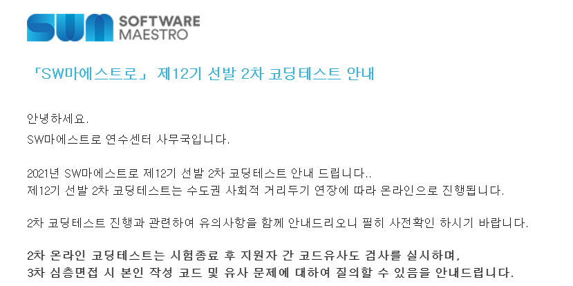

알고리즘 :3 문제
SQL : 1문제
웹 : 1문제

화면 공유 녹화로 시험이 진행되었다.
알고리즘은 뭐 DFS나 완전탐색 의 기초난이도 수준의 문제가 출제되었고, SQL은 JOIN 할줄 아는정도, 웹은 자바스크립트로 document 요소 접근해서 property 값 변하게 하는정도를 물었다.
확실히 기업의 코테가 아니라 쉽다. 그러나 언어, 데이터베이스, 웹 전부 다를 묻고 있기 때문에 정말 생 초짜에게는 어렵게 느껴질 수도 있을 거같다. 아마 기본기를 어느정도는 쓸 줄 아는 사람을 뽑아다가 고급인력으로 만들어내고 싶어하는 소마의 교육철학이 보인 시험이다.

<시간 분배>
알고리즘 문제 : 각각 20분(백준기준 실버1~ 골드 4정도 난이도)
SQL : 10분
웹 : 25분
