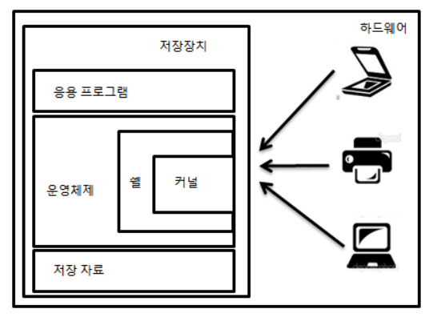

# 📌 Basic computer class for newbies

------

## 📄 OS란 무엇인가?

**OS(Operating System,운영체제)** 는 크게 다음과 같이 정의된다.

- 각종 하드웨어적인 자원과 소프트웨어적인 자원을 효율적으로 운영, 관리함으로서 사용자가 시스템을 이용하는데 편리함을 제공하는 시스템 소프트웨어.
- 사용자에게 편리함을 제공함으로서 시스템의 생산성을 높여주는 역할.
- 사용자가 응용 프로그램을 편리하게 사용하고 하드웨어의 성능을 최적화 하는 역할.
- 모든 하드웨어와 소프트웨어를 관리하는 컴퓨터 시스템의 한 부분인 **실행관리자**

## 📄 OS 는 왜 필요한가?

이진수로 이루어진 기계어로 프로그래밍을 하던 시절에는 OS 라는 개념이 존재하지 않았다. 그런데, A,B,C 라는 프로그램의 전체적인 기능은 다르지만 I/O 명령 등과 같은 공통적인 기능이 존재한다면 하드웨어 관리 영역은 복잡하고 다루기가 어렵기 때문에 매번 그 기능을 작성하는것은 어렵고 비효율적이다. 또한 시스템에 직접적으로 접근하는 것은 시스템 안전에 큰 영향을 끼칠 수 있다. 그래서 **OS는 사용자와 시스템간의 인터페이스 역할** 을 하여 사용자의 편리성, 시스템의 생산성 및 안전성을 보장한다.

------

## 📄 파일 시스템

**컴퓨터등의 기기에서 의미 있는 정보를 담는 논리적인 단위** 로 OS에서 파일을 저장하는 **트리구조** 저장 시스템이다.

### ✏️ 파일 vs 디렉토리

| 파일                                          | 디렉토리                              |
| --------------------------------------------- | ------------------------------------- |
| 컴퓨터에서 정보를 저장하는 논리적인 단위      | 폴더 또는 디렉토리로 불림             |
| 파일은 파일명과 확장자로 식별됨(ex: hello.py) | 파일과 다른 디렉토리를 포함할 수 있음 |
| 실행,쓰기,읽기 등을 할수 있음                 |                                       |

------

## 📄 경로

**컴퓨터 파일의 고유한 위치**로, 트리구조상 노드의 연결로 이루어진다.

### ✏️ 절대경로 vs 상대경로

| 절대경로                               | 상대경로                                     |
| -------------------------------------- | -------------------------------------------- |
| root 디렉토리부터 타겟 위치까지의 경로 | 현재 있는 디렉토리 부터 타겟 위치까지의 경로 |

------

## 📄 터미널

현재에는 **GUI(Graphical User Interface)** 로 마우스를 이용하여 프로그램을 실행시킬 수 있지만, 이전에는 **CLI(Command Line Interface)** 인 **터미널** 을 이용하여 컴퓨터 명령을 입력시켰다. **Console, Terminal, CMD** 로 불리우며, 과거에는 디스플레이와 키보드가 조합된 장치였으나, 현재에는 CLI로 입력하는 화면으로 지칭된다.

각 터미널에서는 프로그램을 작동하는 **shell** 이 존재하는데 **shell** 은 **운영체제의 커널과 사용자 사이를 이어주는 역할** 을 한다. **커널** 이란 **운영체제의 일부로서 컴퓨터의 메모리에 항상 떠있는 하나의 프로그램**이다.
즉, **shell** 은 아래 그림과 같이 **사용자의 명령어를 해석하고 운영체제(커널) 가 알아들을 수 있게 지시해준다. 다시 운영체제(커널)는 shell 에게서 받은 지시를 해석하여 하드웨어를 위한 지시어로 바꾸어준다.**

### ✏️ 기본 명령어

| 윈도우 | shell | 설명                                                         |
| ------ | ----- | ------------------------------------------------------------ |
| cd     | cd    | 현재 디렉토리 이름을 보여주거나 바꾼다.(Change directory)    |
| cls    | clear | CMD 화면에 표시된것을 모두 지운다(Clear screen)              |
| copy   | cp    | 하나이상의 파일을 다른 위치로 복사한다.                      |
| del    | rm    | 하나 이상의 파일을 지운다.(Delete)                           |
| dir    | ls    | 디렉토리에 있는 파일과 하위 디렉토리 목록을 보여준다(Directory) |
| mkdir  | mkdir | 디렉토리를 생성한다.(Make directory)                         |

# 📌 파이썬

- 플랫폼 독립적 인터프리터 언어
  - 플랫폼 (= OS) : 윈도우, 리눅스, 안드로이드, 맥OS, iOS 등 프로그램이 실행되는 운영 체제를 플랫폼이라고 함.
  - 독립적인 (= 관계없는, 상관없는) : OS에 상관없이 한번 프로그램을 작성하면 사용가능.
  - 인터프리터 언어 (= 통역기를 사용하는 언어) : 소스코드를 바로 실행할 수 있게 지원하는 프로그램 실행 방법.

| **컴파일러**                                                 |           | **인터프리터**                                               |
| ------------------------------------------------------------ | --------- | ------------------------------------------------------------ |
| 소스코드를 기계어로 먼저 번역하고 해당 플랫폼에 최적화하여 프로그램을 실행 | 작동방식  | 별도의 번역과정 없이 소스코드를 실행시점에 해석하여 컴퓨터가 처리할 수 있도록 함 |
| 실행속도가 빠름                                              | 장점      | 간단히 작성, 메모리가 적게 필요                              |
| 한번의 많은 기억장소 필요                                    | 단점      | 실행속도가 느림                                              |
| C, 자바, C++, C#                                             | 주요 언어 | 파이썬, 스칼라                                               |

- 객체 지향 동적 타이핑 언어
  - 객체 지향적 언어 : 실행 순서가 아닌 단위 모듈(객체) 중심으로 프로그램을 작성 하나의 객체는 어떤 목적을 달성하기 위한 행동(method)와 속성(attribute)을 가지고 있음.
  - 동적 타이핑 언어 : 프로그램이 실행하는 시점에 프로그램이 사용해야할 데이터에 대한 타입을 결정함.

