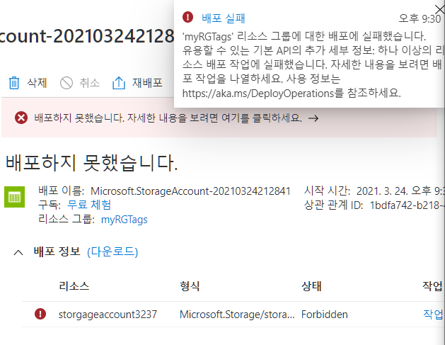
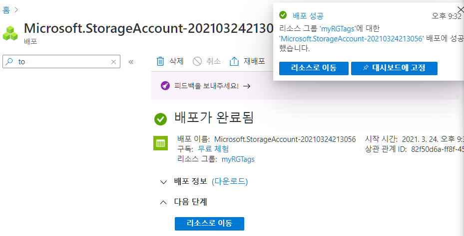
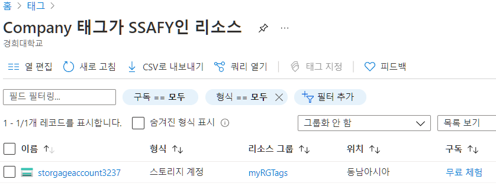

- 이번에 할 것
  - 태깅이 필요한 정책 할당을 생성
  - 스토리지 계정을 생성하여 태깅을 테스트하고 
  - 지정된 태그가 있는 리소스를 보고 태깅 정책을 제거

- 태그란?
  -  리소스 이름에 포함할 수 없는 자산에 대한 정보를 포함
    - 지역, Test인지, 실제 서비스인지 등등 이름만으로 명시하기에는 가독성이나 너무 길어짐으로 태그로 속성을 설명
  - 서비스의 규모가 커질 수록 태그로 구분을 하지 않으면 어디서 돈이 나가는지 알기조차 쉽지 않음
    -  IT 또는 비즈니스 팀에서 이 정보를 사용하여 리소스를 찾거나 리소스 사용량 및 청구에 대한 보고서를 생성할 수 있습니다.
  -  리소스에 대한 보다 정교한 필터링 및 보고를 수행 가능해짐

# 1. 정책 만들기

1. `정책` 검색

2. 제작- 할당 선택
3. 정책할당 - 기본내용
   - 범위 - 무료체험
   - 기본내용 - 태그 검색
     - 리소스에 태그 필요 선택
4. 정책할당 - 매개변수
   - 태그 이름 - Company

5. 만들기

# 2. 스토리지 계정 만들기

1. 스토리지 계정 만들기
2. 기본사항 
   - 구독 - 무료체험
   - 리소스그룹 - 새로 만들기 - myRGTags
   - 스토리지 계정이름 - storgageaccount3237
   - 위치 - 동남아시아
   - 성능 - 표준
   - 계정종류 - StorageV2
   - 복제 - LRS
3. 만들기
4. 실패

5. 다시 만들기- 스토리지 계정만들기 - 기본사항
   - 구독 - 무료체험
   - 리소스그룹 - 새로 만들기 - myRGTags
   - 스토리지 계정이름 - storgageaccount3237
   - 위치 - 동남아시아
   - 성능 - 표준
   - 계정종류 - StorageV2
   - 복제 - LRS

6. 스토리지계정만들기 - 태그
   - 이름 : Company
   - 값: 아무거나 넣기

7. 생성 성공

# 3. 태그 검색

1. `태그` 검색
2. 방금 만든 태그 클릭하면 해당하는 요소에 대해서 검색이 됨

3. `모든 리소스` 검색

4. 필터 추가 

   - 필터 - 태그 - Company
   - 연산자 : ==
   - 값 : 모두 

   이렇게 검색하여 골라낼 수도 있음

# 4.정책 삭제

1. `정책` 검색 - 할당 - `리소스에 태그 필요` 클릭 
2. 할당 삭제