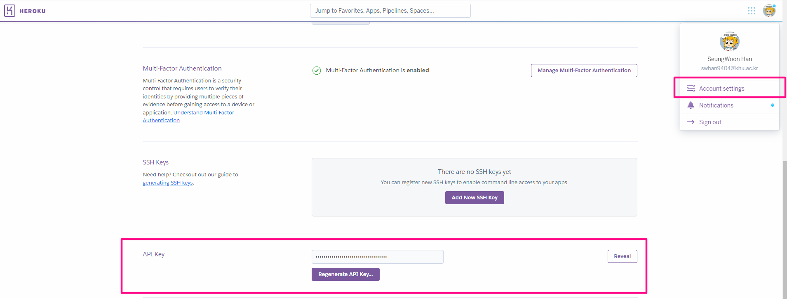
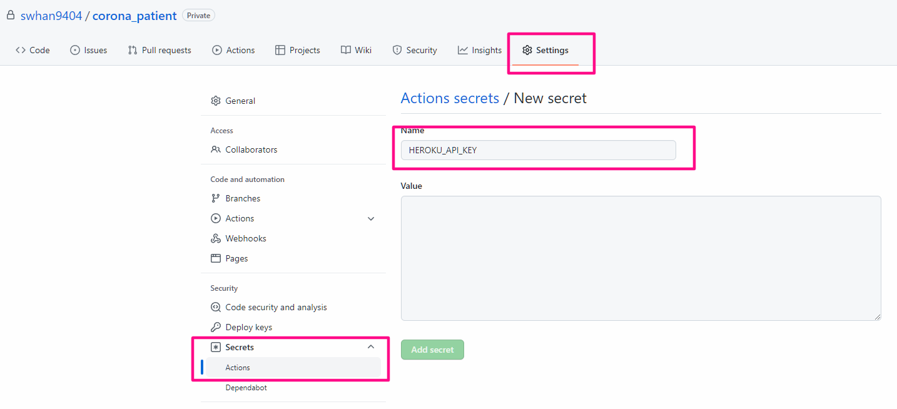
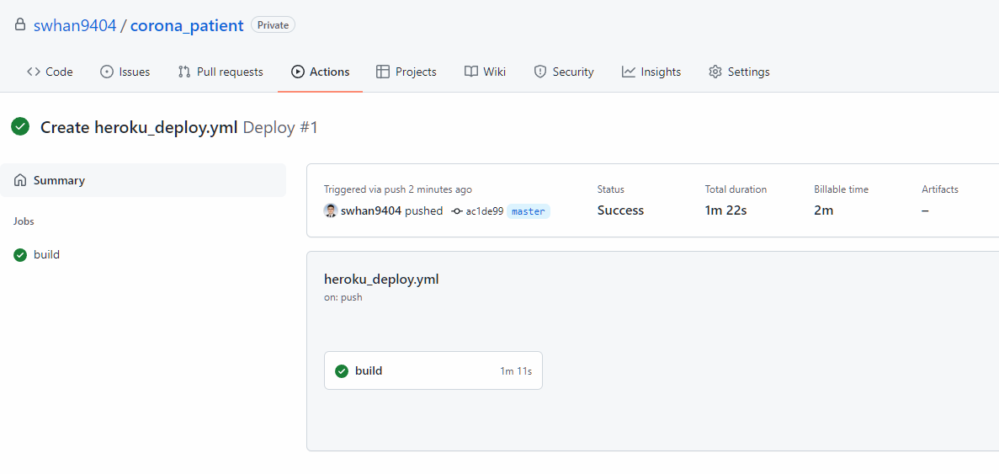

https://github.com/swhan9404/public_telegram_corona

코로나 텔레그램 알람 시스템을 수정하고 배포하는 방식이 현재 

1. git add 
2. git commit 
3. git push origin master
4. heroku login
5. git push heroku master


이 순서를 진행해야 한다.  오랜만에 배포하느라 heroku 아이디가 뭔지도 가물가물했고, 내가 왜 push 를 github에다가도 하고 heroku 에다 하고 두번이나 하고 있지 라는 생각이 들어 git action으로 자동화하기로 한다.


# secretkey 넣기

1. heroku에 로그인하게 되면 API -key를 찾을 수 있다.




2. 방금 복사한 api-key를 github repository 의 secret 에 추가해준다.




## git action 만들기

> 참고 : https://github.com/marketplace/actions/deploy-to-heroku

- on 은 어떤 동작을 할 떄 jobs 아래 동작을 동작할지를 결정

```yaml
name: Deploy

on:
  push:
    branches:
      - master

jobs:
  build:
    runs-on: ubuntu-latest
    steps:
      - uses: actions/checkout@v2
      - uses: akhileshns/heroku-deploy@v3.12.12 # This is the action
        with:
          heroku_api_key: ${{secrets.HEROKU_API_KEY}}
          heroku_app_name: "YOUR APP's NAME" #Must be unique in Heroku
          heroku_email: "YOUR EMAIL"
```


## 만들어진 git-action 감상하기

이제 내가 heroku를 따로 로그인할 필요도, 컴퓨터에서 heroku deploy 되는걸 기다릴 필요도 사라진다.




p.s 만드는 과정이나 이런걸 정리하는 markdown 이 private repository 에 따로 존재(secret key 나 이런 것이 markdown에 노출되어있어서..)하고, public repository는 그런 부분을 제외한 곳을 올려놨는데, private 에서 업데이트 한 내용을 public 에 올리는 것은 상당히 귀찮아지는 작업이라 안하고 있다. 다음에 생각나면 이거 간단하게 처리할 방법이 있을지 고민해봐야지;