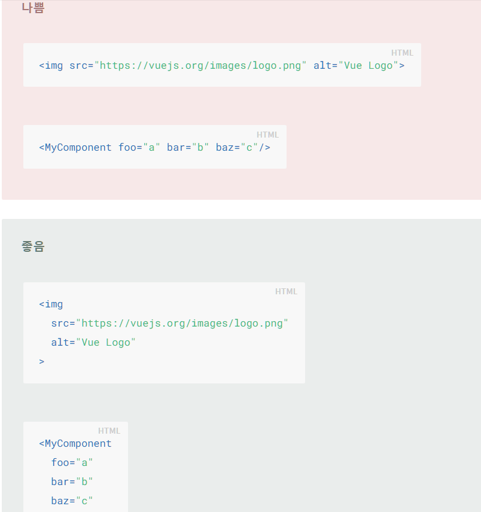

- vue를 더 깔끔하게 쓰기 위해 스타일가이드를 읽어보자
  - https://kr.vuejs.org/v2/style-guide/

# 1. 우선적으로 알아야할 사항

1. 컴포넌트 이름에는 합성어를 사용

   -  item, list 등의 단어를 붙이면서 명확하게 구분하며, 
   -  엘리먼트간의 이름충돌을 방지

2. 컴포넌트 데이터는 반드시 객체를 반환하는 함수여야함

   - 데이터가 object인 경우, 모든 컴포넌트의 인스턴스가 동일한 data 객체를 참조하게 됨 
     - 그렇게 되면 하나의 목록의 타이틀을 변경할 떄도 다른 모든 리스트의 타이틀이 변경되는 상황이 벌어짐
   - 원하는 바는 각 컴포넌트의 인스턴스들이 고유한 data객체를 생성해야하는 것
     - 따라서 객체를 반환하는 함수로 구현

3. props의 정의는 가능한 상세하게 정의되어야함

   - 컴포넌트의 사용방법을 쉽게 알수 있고
   - 개발 중 오류의 잠재적 원인을 더 빠르게 파악할 수 있게 됨

4. v-for 는 항상 key 와 함께 사용하기

   - 예측 가능한 행동을 유지하기 위한 노력

5. v-for가 사용된 엘리먼트에 절대로 v-if  사용하지 말것

   - v-for 가 v-if 보다 우선적으로 처리되기 떄문에 원하는 방향으로 처리가 안 될 수도 있음
   - 같이 써야할 필요가 있는경우
     - 리스트 목록 필터링 - computed 속성 사용
     - 숨기기 위해 리스트 랜더링 - 내부의 엘리먼트로 v-if를 옮겨서 사용

6. 컴포넌트 스타일을 작성할 때 전역적이지 않고 스코프적으로 작성해야함

   - ?

7. private 프로퍼티에는 항상 접두사 `$_` 사용

   - 또한 다른사람과 코드 충돌을 피하려면 named scope까지 포함
     - `$_yourPluginName_`
   - `_`  접두어로 private 프로퍼티를 정의하면, Vue 자체에서 `_` 접두어를 사용하여 private 프로퍼티를 정의하고 있기 떄문에, 인스턴스 속성을 덮어 쓸 위험이 있음
     - 이런 충돌을 방지하기 위해 `$_` 를 쓰는 것

   

# 2. 가독성 향상을 위한 것

1. 컴포넌트는 각자 자체 파일로 구성되어 있어야함

   - Vue  컴포넌트마다  .vue 파일로 나뉘어 있는 것을 의미

2. 컴포넌트 파일 이름은 PascalCase  혹은 kebab-case 로 구성

3. 베이스 컴포넌트의 이름을 지을 경우 모두 같은 접두어로 시작

   -  `Base` , ` App`, `V` 와 같은 접두어 사용

4. 싱글 인스턴스 컴포넌트 이름의 경우 `The` 접두어 사용

   - 접두어를 통해 하나만 있을 수 있음을 나타냄
   - 단일페이지에서 사용된다는 의미가 아닌, 페이지 당 한번만 사용된다는 의미
   - 이러한 구성요소는 앱 내 컨텍스트가 아니라 앱에 고유함으로 prop 쓰지 말것
   - 예시
     - TheHeading.vue
     - TheSidebar.vue

5. 부모와 밀접하게 연결된 자식 구성요소는 부모 구성 요소이름을 접두사로 포함

   - 일반적으로 파일을 알파벳 순으로 구성함으로 이러한 관련 파일을 나란히 보관하기 위함

6. 구성요소 이름은 최상위 단어(일반적인단어)로 시작하고 설명적인 수정 단어로 끝나야함

   - 일반적으로 파일을 알파벳 순으로 구성함으로 이러한 관련 파일을 나란히 보관하기 위함
   - 예시(안좋은예 > 좋은예)
     - ClearSearchButton.vue > SearchButtonClear.vue
     - ExcludeFromSearchInput.vue > SearchInputExcludeGlob.vue

7. 콘텐츠가 없는 구성요소는 

   - ?

8. 파일 컴포넌틍와 문자열 템플릿은 pascal,  DOM 템플릿에서는 kebab-case 로 작성

   - HTML에서 대소문자를 구분하지 않기 떄문에 kebab-case 를 사용해야함
   - 전부 kebab-case를 사용하는 것도 허용함
   - 다만, PascalCase 가 kebab-case 보다 더 직관적인 장점이 있기 때문에 구분해서 개발자가 잘 판단해서 사용할 것

9. 구성요소의 이름은 약어보다 전체 단어를 쓸 것

   - 긴이름을 작성하는 비용 < 명확성

10. 여러 속성이 있는 요소는 한 줄에 하나의 속성으로 여러 줄에 걸쳐 있어야함

11. 축약형 디렉티브를 항상사용하거나 사용하지 않는 일관적인 스타일을 지켜야함

    

