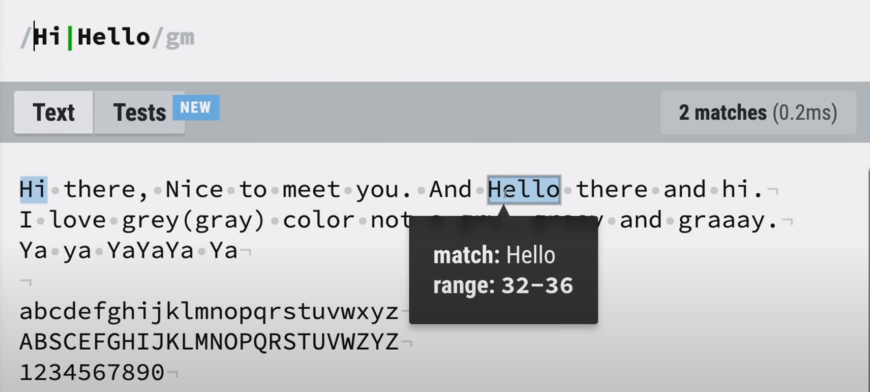
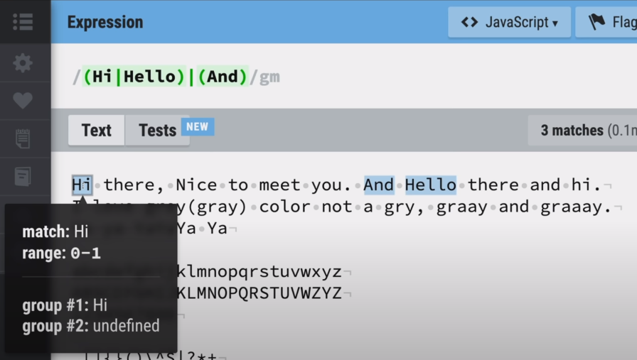
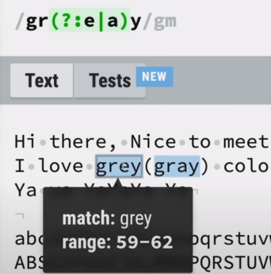
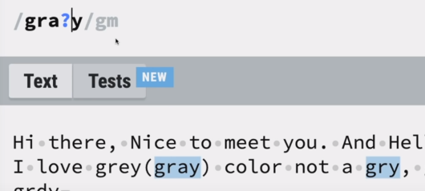
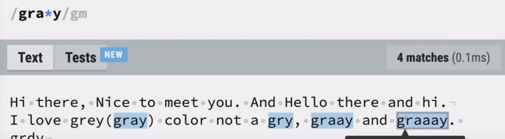
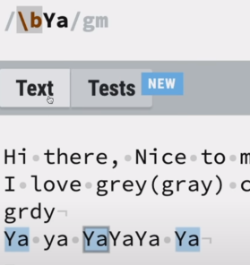
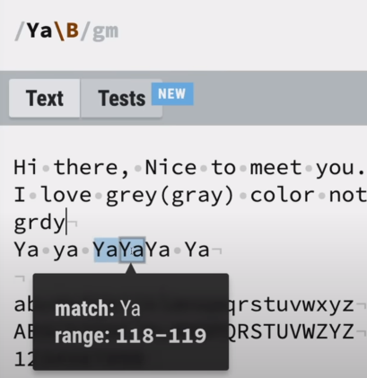
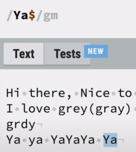
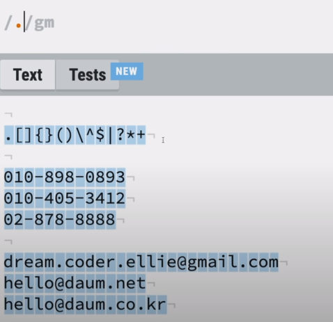

# 정규 표현식 ( `/regex/i` )

- 연습공간 : regexr.com/5mhou
  - explain 탭에 가면 정확히 어떤 역할을 하는지 눈으로 확인 가능
  - 상위 오른쪽에 보면 플래그도 사용 가능
  - 

## 언제 사용하는가?

- 대량의 텍스트에서 특정 패턴의 글을 찾을 경우
- 아이디나 패스워드의 유효성 검사


##  역사

- 1950년 stephen Cole Kleene 수학자에게 개발됨
- 유닉스 계열에서 텍스트와 같은 것들을 처리하고 프로세싱 하는데 많이 이용
- 다양한 프로그래밍언어(Java, Python, Javascript)에서 내부적으로 지원
- 텍스트나 코드 에디터에서도 정규표현식을 이용해서 검색하는 것이 가능해짐


## 사용방법

- `/패턴식/i`
  - 앞 뒤로 `/`를 사용해서 정규표현식임을 나타내줌
  - `/` 안에는 패턴을 넣어줌
  - `i`는 어떤 옵션을 이용해서 검색할건지 flag 이용


## 플래그

- g (Global) :  매칭되는 다수의 결과값을 기억할 수 있는 것
- m (Multiline) : 


# 표현식 문법

## Groups and ranges

- `|`  : 또는


- `() ` : 그룹

  예시1 ) Hi나 Hello에 속하거나(group1) And에 속하는(group2) 문자열 찾기

  예시 2 ) gr로 시작하고/ (e 또는 a)의 문자열을 가지고 있고/ y로 끝나는 단어찾기

  - `/gr(e|a)y/gm`



- `[]` : 문자셋, 괄호안의 어떤 문자든

  예시1)  gr로 시작하고/ (e 또는 a)의 문자열을 가지고 있고/ y로 끝나는 단어찾기 

  - `/gr[ea]y/gm` : (e|a) 로 표현할수도 있지만, 이렇게 표현하면 더 간결하게 표현됨

  예시2) gr로 시작하고/ (a,b,c,d,e,f) 중 하나의 문자열을 가지고 있고/ y로 끝나는 단어찾기

  - `/gr[a-f]y/gm` : [abedef] 로 표현할 것을 [a-f]로 표현함으로 더 간결하게 표현할 수 있음

  예시3) 특수문자를 제외한 모든 문자열 찾기

  - `/[a-zA-Z0-9]/gm` : 소문자, 대문자, 숫자를 모두 검색해냄

- `[^]` : 부정문자셋, 괄호 안의 어떤 문자가 아닐 때

  예시1) 소문자, 대문자, 숫자를 제외한 문자열 찾기

  - `/[^a-zA-Z0-9]/gm`  : 특수문자, 띄어쓰기 검색됨

- `(?:)` : 찾지만, 기억하지는 않음

  예시1 ) gr로 시작하고/ (e 또는 a)의 문자열을 가지고 있고/ y로 끝나는 단어 를 찾지만 그룹으로 만들지는 않음

  



## Quantifier

- `?` : 있거나 없거나(zero or one)

  예시1) gr로 시작하고 / a가 있거나 없거나 / y로 끝남

  - `/gra?y/gm`



- `*` : 없거나 있거나 많거나 (zero or more)

  예시1)  gr로 시작하고 / a가 있거나 없거나 많은경우/ y로 끝남

  - `/gra*y/gm`



- `+` : 하나 또는 많이(one or more)

  예시1)  gr로 시작하고 / a가 있거나 많은경우/ y로 끝남

  - `gra+y/gm` : *과의 차이는 없을때의 경우를 제외한 다는 것

- `{n}` : n 번 반복

  예시1)  gr로 시작하고 / a가 3개 있고/ y로 끝남

  - `gra{3}y/gm`

- `{min,}` : 최소
  예시1 )  gr로 시작하고 / a가 최소 2개 최대 3개 있고/ y로 끝남
  - `gra{2, 3}y/gm`

- `{min, max}` : 최소, 그리고 최대
  예시1)  gr로 시작하고 / a가 최소 2개/ y로 끝남
  - `gra{2, }y/gm`


## Boundry-type 

- `\b` : 단어경계 (역슬래시 주의)

  예시1) 단어 앞에 쓰이는 Ya만 검색

  - `/\bYa/gm`

  예시2) 단어 뒤에서 쓰이는 Ya만 검색

  - `/Ya\b/gm`



- `\B` : 단어경계가 아님

  예시1) 단어 뒤에 쓰이는 Ya만 빼고 검색

  - `/ya\B/gm`



- `^` : 문장의 시작

  예시1) 문장 시작의 Ya 만 검색

  - `/^Ya/gm`

  예시2) 전체 문장에서 문장 시작 Ya를 검색 - multiline 옵션 제거

  - `/Ya/g` 

- `$` : 문장의 끝

  예시1) 문장 끝의 Ya 만 검색

  - `/^Ya/gm`




## Character classes

- `\` : 특수 문자가 아닌 문자

- `.` : 어떤 글자(줄바꿈 문자 제외)

  예시1)  모든 문자열 선택

  - `/./gm` 

  예시2) `.` 를 찾고 싶다면 - 특수문자의 경우 앞에 `\`(역슬래시)를 넣고 찾아야함

  - `/\./gm`



- `\d` : digit 문자

- `\D` : digit 문자 아님

- `\w` : word 문자

- `\W`: word문자 아님

- `\s` : space 공백

- `\S` : space 공백 아님


# 연습하기

- 전화번호만 선택하기

  - 010-898-0893 : - 로 연결된 경우
  - 02-893-0839 : 앞자리가 2글자인 경우
  - 010 898 0893 : 띄어쓰기로 연결된 경우
  - 010.898.0893 : . 으로 연결된 경우

  - 답 만들어보기
    - `/\d\d\d-\d\d\d-\d\d\d\d/gm`  : 3글자숫자-3글자숫자-4글자숫자 로 구성된 것 찾기
    - `/\d{2,3}[- .]\d{3,4}[- .]\d{4}` 
      - 2~3 글자의 숫자
      - `-` ` ` (띄어쓰기) `.`로 이어져있는지
      - 3~4 글자의 숫자

- 이메일 선택하기

  - 답 만들어보기
    - `/[a-zA-Z0-9._+-]+@[a-zA-Z0-9-]+\.[a-zA-Z0-9.]+/gm `
      - `[a-zA-Z0-9._+-]` 안에 들어가있는 문자들이
      - `+` : 여러번 반복(`*` 사용하면 없는 것도 검색되므로 + 로 사용)
      - @ 가 중간에 들어가고
      - `[a-zA-Z0-9-]`가 여러번 반복되고
      - `\.` : `.`이 들어가고
      - `[a-zA-Z0-9.]`: 이 여러번 들어감

- Youtube 주소 아이디만을 가져오기

  - https://www.youtu.be/-ZClicWm0zM

  - https://youtu.be/-ZClicWm0zM

  - youtu.be/-ZClicWm0zM

  - 답 만들기 

    - `(?:/https?:\/\/)(?:www\.)?youtu.be\/([a-zA-Z0-9-]{11})/gm`

      - `https?`: http 뒤에 s가 붙거나 안붙을 경우
      - `\/\/` : `//` 특수문자이므로 `\/\/` 로 넣어주기
      - `(/https?:\/\/)?/gm` : `https://`가 있어도 되고 없어도 됨으로 그룹핑 후 `?`
      -  `(www\.)?` : `www.`도 있어도 되고 없어도 되므로 그룹핑후 `?`
      - `youtu.be\/` : 로 이어지고
      - `([a-zA-Z0-9-]{11})` : youtube id가 11자로 매칭됨

      - ``(?:/https?:\/\/)(?:www\.)` : 현재 나눠진 그룹 3개 중에 앞에 2개는 원하지 않으니 `?:` 를 이용해 기억하지 않음 처리


# 프로그래밍 언어에서 사용해보기

## Javascript 내에서 사용하기

```javascript
const regex = /(?:/https?:\/\/)(?:www\.)?youtu.be\/([a-zA-Z0-9-]{11})/; // 정규표현식 할당

const url = 'https://www.youtu.be/-ZClicWm0zM';

url.match(regex); // 주소를 정규표현식으로 분석
<!-- 배열로 반환됨
	0 : url 전체 반환
    1 : group의 데이터 반환
-->

const result = url.match(regex)[1]; // Youtube 아이디 빼오기
```


# 더 연습하기

- [https://regexone.com/](https://www.youtube.com/redirect?event=video_description&redir_token=QUFFLUhqbnVMUVM4NXJhbmtsQ1VFci1NMFNDMmxwUXJ0QXxBQ3Jtc0trYnBzU1F0RHNXT1paZkRSYzF1eU9vM1FiSkszWDIya1dWR056SGduUVFQb2J6cE5qbVY1MDdOeXd6bGNwU1l2b1BUYk0zaFI0eTNlSVpBQkVxLVVINjlWVHI2TndaTE54UENscUJxUVdLUVBWNEgzOA&q=https%3A%2F%2Fregexone.com%2F)
- 참고 : https://youtu.be/t3M6toIflyQ