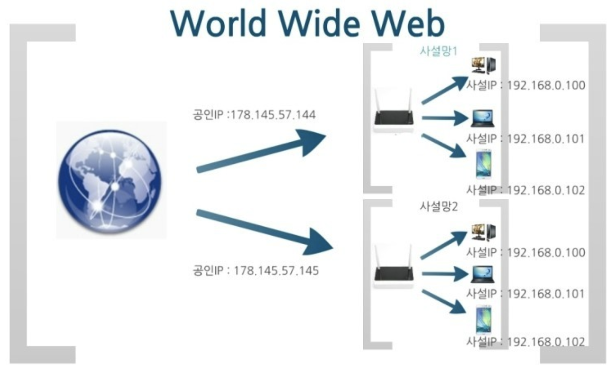

# IP

- Internet Protocol의 약자로, 인터넷상의 네트워크 자원들을 궂분하는 고유한 주소
- OSI 3계층에 해당
- IP는 주소에 따라 IP버전4 (IPv4)와 IP버전6(IPv6) 으로 구분
  - IPv4 의 가용 숫자 문제와 효율성 문제를 해결 한 것이 IPv6이지만, 아직까지 IPv4를 많이 사용함
- IPv4 기준 구성 
  - ex) 130.5.5.25
    - 130.5 까지는 네트워크 번호
    - 5.25 까지는 호스트 번호를 나타냄
    - 만약 서브넷을 사용하길 원한다면 호스트 번호가 아래 처럼 쪼개짐
      - 5 : 서브넷 주소
      - 25 : 호스트 번호
  - 이와 같은 예시는 서브넷을 8비트로 정했을 때의 예시이며, 실제로는 세번째 쿼드의 일부, 심지어 네번쨰 쿼드의 일부만으로 서브넷을 사용하는 등 다른 구성을 선택할 수 있음
- IPv6는 IPv4 에 비해 이런 개선점을 가지고 있다
  - 패킷을 단편화하지 않으면서도 보다 효율적인 라우팅
  - 지연에 민감한 패킷을 구분하는 기본적인 QoS(Quality of Service)
  - NAT를 없앰으로써 주소 공간을 32비트에서 128비트로 확장
  - 네트워크 레이어 보안 내장(IPsec)
  - 손쉬운 네트워크 관리를 위한 무상태 주소 자동 구성
  - 처리 오버헤드가 줄어든 개선된 헤더 구조
- IPv4 와 IPv6의 작동원리
  - IPv6 주소의 128비트는 콜론으로 분리된 8개의 16비트 16진수 블록입니다. 예를 들어 2dfc:0:0:0:0217:cbff:fe8c:0과 같습니다.
  - IPv4 주소는 “클래스”로 분리되는데, 클래스 A 네트워크는 소수의 대형 네트워크를 위한 것이고, 클래스 C 네트워크는 수천 개의 소형 네트워크를 위한 것이고, 클래스 B 네트워크는 그 사이에 있는 것입니다. IPv6는 서브넷팅을 사용하여 주어진 주소 공간 할당에 맞게 네트워크 크기를 조정합니다.
  - IPv4는 멀티캐스트 사용을 위해 클래스 유형의 주소 공간을 사용합니다(224.0.0.0/4). IPv6는 FF00::/8에서 멀티캐스트를 위해 통합된 주소 공간을 사용합니다.
  - IPv4는 각 디바이스가 멈추고 패킷을 확인하도록 강제하는 “브로드캐스트” 주소를 사용합니다. IPv6는 멀티캐스트 그룹을 사용합니다.
  - IPv4는 0.0.0.0을 미지정 주소로 사용하고 클래스 유형 주소(127.0.0.1)를 루프백에 사용합니다. IPv6는 미지정 주소에는 ::을, 루프백에는 ::1을 사용합니다.
  - IPv4는 전역적으로 고유한 퍼블릭 주소를 트래픽 및 “프라이빗” 주소에 사용합니다. IPv6는 전역적으로 고유한 유니캐스트 주소와 로컬 주소를 사용합니다(FD00::/8).

| 구분     | IPv4                                                    | IPv6                                                         |
| -------- | ------------------------------------------------------- | ------------------------------------------------------------ |
| 주소길이 | 32bit                                                   | 128bit                                                       |
| 표기방법 | 8비트씩 4개의 파트로 10진수 표현 예)39.118.188.233 | 16비트씩 8개의 파트로 16진수 표현 예) 2002:0221:ABCD:CDEF:0000:0000:FFFF:1234 |
| 주소갯수 | 약 43억개                                               | 약 43억 * 43억 * 43억 *43억                                  |

## 퍼블릭 IP와 프라이빗 IP

- 퍼블릭 IP
  - 인터넷 구간의 통신 대상을 식별하기 위해 ISP(Internet Service Provider 인터넷 서비스 공급자)에서 제공하는 IP 주소
  - 해당 퍼블릭 IP는 전 세계의 인터넷 구간에서 유일한 주소를 가짐
  - 공인 IP 주소가 외부에 공개되어 있기에 인터넷에 연결된 다른 PC로부터의 접근이 가능하다. 따라서 공인 IP 주소를 사용하는 경우에는 방화벽 등의 보안 프로그램을 설치할 필요가 있다.
- 프라이빗IP (사설 IP)
  - 일반 가정이나 회사 등의 독립된 네트워크에서 사용하는 내부 IP 주소
  - 프라이빗 네트워크 관리자에 의해 할당
    - IPv4의 주소부족으로 인해 서브넷팅된 IP이기 때문에 라우터에 의해 로컬 네트워크상의 PC 나 장치에 할당
  - 독립된 네트워크 상에서 유일한 주소를 가짐
  - 프라이빗 IP주소를 통해 외부 인터넷 구간과 통신이 불가능함
    - **라우터를 통해 1개의 공인(Public) IP**만 할당하고, **라우터에 연결된 개인 PC는 사설(Private) IP**를 각각 할당 받아 인터넷에 접속할 수 있게 된다.
  - 사설 IP 주소 대역
    - 사설IP 주소는 다음 3가지 주소대역으로 고정된다.
      - Class A : **10**.0.0.0 ~ **10**.255.255.255
      - Class B : **172.16**.0.0 ~ **172.31**.255.255
      - Class C : **192.168**.0.0 ~ **192.168**.255.255

- 인터넷 구조
  - 💻➡🌏 : 사설 IP를 할당받은 스마트폰 혹은 개인 PC가 데이터 패킷을 인터넷으로 전송하면, 라우터(공유기)가 해당 사설 IP를 공인 IP로 바꿔서 전송한다.
  - 🌏➡💻 : 인터넷에서 오는 데이터 패킷의 목적지도 해당하는 사설 IP로 변경한 후 개인 스마트폰 혹은 PC에 전송한다.

|               | 공인 IP (Public IP)           | 사설 IP (Private IP)        |
| ------------- | ----------------------------- | --------------------------- |
| **할당 주체** | ISP(인터넷 서비스 공급자)     | 라우터(공유기)              |
| **할당 대상** | 개인 또는 회사의 서버(라우터) | 개인 또는 회사의 기기       |
| **고유성**    | 인터넷 상에서 유일한 주소     | 하나의 네트워크 안에서 유일 |
| **공개 여부** | 내/외부 접근 가능.            | 외부 접근 불가능            |

## 고정 IP와 유동 IP

> 퍼블릭 ip 의 두가지 종류인 고정 ip와 유동 ip

- **고정 IP** 
  - 컴퓨터에 고정적으로 부여된 IP로 한번 부여되면 IP를 반납하기 전까지는 다른 장비에 부여할 수 없는 IP 주소를 말한다.
  - static
- **유동 IP**
  - 장비에 고정적으로 IP를 부여하지 않고 컴퓨터를 사용할 때 남아 있는 IP 중에서 돌아가면서 부여하는 IP를 뜻한다.
  - DHCP
- **인터넷 상에서 서버를 운영하고자 할 때는 공인 IP를 고정 IP로 부여해야 한다는 것이 중요하다.** 
  - 즉, 공인 IP를 부여받지 못하면 다른 사람이 내 서버에 접속할 수가 없고, 고정 IP를 부여하지 않으면 내 서버가 아닌 다른 사람의 서버로 접속이 될 수도 있기 때문이다.
  - 반면에 우리가 집에서 사용하는 인터넷 서비스 업체는 각 가정마다 공인 IP를 유동 IP로 부여하고, 공유기 내부에서는 사설 IP를 유동 IP로 부여하는 것이 일반적

## 서브넷과 서브넷 마스크

- 나오게 된 배경

  - IP 클래스의 비효율성
    - IPv4는 초기에 클래스로 나누어서 할당을 방법을 택했습니다. 하지만 이 방식은 크게 비효율적이었습니다. 예로들어 클래스 B를 어느 중소기업체에게 할당했을 경우 65000여개의 아이피를 다 쓰는 것이 아닌 10000개 정도만 쓴다고 가정합시다. 그러나 10000개가 아닌 나머지 50000여개의 IP는 쓰이지 않은 채 이 기업체는 클래스 B의 하나를 점유하고 있는 상태가 됨. 그렇다고 이 기업체에게 클래스 C를 IP를 할당하자니 IP자원이 너무 부족
    - 이러한 문제를 해결하기 위해 IP를 사용하는 네트워크 장치 수에 따라 효율적으로 사용할 수 있는 서브넷(Subnet)이 등장

- 서브넷과 서브넷 마스크

  - 서브넷- 말그대로 부분망이라는 뜻
  - IP 주소에서 네트워크 영역을 부분적으로 나눈 부분망, 부분 네트워크
  - 서브넷을 만들 때 쓰이는 것이 바로 **서브넷 마스크**입니다. 
    - 서브넷을 서로 간에 구분하는 역할 수행

- 서브넷 마스크를 통한 서브넷팅 계산법
  - **서브넷 마스크는 연속된 1과 연속된 0으로 구성**
  - 예시
    -  서브넷 마스크 : 255.255.255.0
      - 255.255.255.0 을 2진수로 표현하면 1111 1111 1111 1111 1111 1111 1111 0000 0000
      - 연속된 1의 갯수가 24개
    -  IP주소 : 192.168.200.1
      - 서브넷 마스크와 합쳐서
      - 192.168.200.1/24 로 표현하기도 함
      - /24 는 255.255.255.0 의 연속된 1의 갯수를 나타냄
      - 이런 표기법을 CIDR 표기법이라고 함
  - AND 연산
    - 결과 : 192.168.200.0 
    - 이것은 IP주소의 네트워크 부분
  - 이것을 통해 알 수 있는 것
    - 255.255.255.0 <- 이 마지막 0 을 잘게 쪼개서 쓰는 것이기 때문에 가능한 호스트의 숫자는 2^8 -2 = 254개 이다
      - 모두 0일 경우 네트워크 주소와 모두 1일 경우 브로드 캐스트를 제외
    - 위에 말한 것은 /24 일 경우를 말한 것이고 /n 의 n 의 숫자가 작아질 수록 서브넷을 잘게 쪼개 쓴다는 의미이고, /n을 크게 할 수록 작게 잘라서 쓴다는 의미로 해석할 수 있다.
  

- 서브넷마스크의 작동 방식

  - 서브넷 마스크를 이용하여 IP주소 체계의  Network ID와 Host ID를 서브넷 마스크를 통해 분리
    - Network ID 는 서브넷을 식별하는 영역
    - HOST ID는 서브넷에서 대상을 식별하는 영역
    - 즉, 동일한 서브넷에 속한 IP 주소의 네트워크 ID의 값은 모두 동일하며 호스트 ID를 통해 개별 구분
    - 즉, 서브넷 마스크는 IPv4 와 마찬가지로 32bit 구조이며, 이진수 값이 1인 영역이 네트워크 ID, 0인 영역이 HOST ID
    - IP주소는 IP 클래스에 의해 분리되는 Network Prefix와 나머지 Host Number로 분리
    - 서브넷 마스크에 의해 이루어지는 서브넷팅은 이 Host Number를 Subnet Number와 서브넷안에서 식별되는 Host Number로 다시 분리

- 디폴트 서브넷 마스크
  - 모든 IP 주소에는 서브넷 마스크가 잇는데, 서브넷을 하지 않은 상태로 쓰는 경우 디폴트 서브넷 마스크를 사용한다.
    - 즉, 클래스의 기본 성질 대로 쓰는 경우
  - 대역별 디폴트 서브넷 마크스
    - A클래스 : 255.0.0.0
    - B클래스 : 255.255.0.0
    - C클래스 : 255.255.255.0

## ipconfig로 살펴보기

## NAT 

- Network Address Translation
  - 네트워크 주소 변환(퍼블릭ip <- > 프라이빗ip)

## 포트번호

- 포트

  - 하드웨어적 의미 : 컴퓨터의 주변 장치와 연결하기 위한 연결단(물리적 통로)
  - 소프트웨어적 의미 : 네트워크 서비스나 특정 프로세스를 식별하는 논리적 단위(논리적 통로)

- 어디서 필요?

  - 어떠한 데이터를 송수신 할 떄 
  - DataLink 계층에서는 호스트의 NIC로 MAC Address를 판별
  - Network 계층에서는 IP Address로 목적지를 판별
  - 이렇게 MAC Address와 IP Address를 통해 목적지 호스트까지 도달한 후에는
  - **어떤 Process(프로세스)에서 데이터를 받을 것인지 **알아야하는데 이 때 사용되는 것이 포트번호

- 정확한 개념

  - OSI 7 Layer의 Transport 계층에서 동작하는 TCP / UDP 프로토콜에서 application이 상호구분을 위해 사용하는 번호
  - IP 내에서 프로세스 구분을 하기 위해 사용하며, 각 프로토콜의 데이터가 컴퓨터 내부의 논리적 통로를 따라 흐른다.
  - 네트워크를 통해 데이터를 주고받는 프로세스를 식별하기 위해 호스트 내부적으로 프로세스가 할당받는 고유한 값

- 표기법 

  - 일반적으로 IP Address 뒤에 콜론(:) 표시를 하여 표기한다.
    - **Ex) 192.168.100.1:3053**

- 포트 포워딩

  - 외부에서 공유기 내의 특정한 장치로 접속하기 위해서는 IP Address를 알아야 하지만

    *공유기 내부의 IP는 사설 IP로 이루어져 있어 외부에서 IP만으로 특정 PC를 지정할 수 없다.*

    따라서 **공유기의 공인 IP로 접속한 후 특정한 PC로 연결되도록 포트 넘버를 공유기에서 정의해주는 작업**이 필요하다.

    이러한 과정을 Port Forwarding 이라 한다.

### 포트번호의 구성

- Port Number는 16bits로 이루어져 있다.
- 2^16이므로 총 65536개의 Port Number가 존재할 수 있다.
- Port Number 크게 3가지로 분류한다.
  1. Well-Known Ports ( 잘 알려진 포트 ) : 0번 ~ 1023번
  2. Registered Ports ( 등록된 포트 ) : 1024번 ~ 49151번
  3. Dynamic Ports ( 동적 포트 ) : 49152번 ~ 65535번
     - 사용자가 임의로 사용한 포트번호

undefined

## DHCP

- DHCP (Dynamic Host Configuration Protocol)
  - DHCP란 호스트의 IP주소와 각종 TCP/IP 프로토콜의 기본 설정을 클라이언트에게 자동적으로 제공해주는 프로토콜
  - DHCP에 대한 표준은 RFC문서에 정의되어 있으며, DHCP는 네트워크에 사용되는 IP주소를 DHCP서버가 중앙집중식으로 관리하는 클라이언트/서버 모델을 사용하게 됩니다. 
  - DHCP지원 클라이언트는 네트워크 부팅과정에서 DHCP서버에 IP주소를 요청하고 이를 얻을 수 있습니다.
  - 네트워크 안에 컴퓨터에 자동으로 네임 서버 주소, IP주소, 게이트웨이 주소를 할당해주는 것을 의미하고, 해당 클라이언트에게 일정 기간 임대를 하는 동적 주소 할당 프로토콜입니다.
- DHCP 의 장점
  - PC의 수가 많거나 PC 자체 변동사항이 많은 경우 IP 설정이 자동으로 되기 때문에 효율적으로 사용 가능하고, IP를 자동으로 할당해주기 때문에 IP 충돌을 막을 수 있습니다.
- DHCP 의 단점
  - DHCP 서버에 의존되기 때문에 서버가 다운되면 IP 할당이 제대로 이루어지지 않습니다.

### DHCP의 구성

1. **DHCP** **서버** 
   - DHCP서버는 네트워크 인터페이스를 위해서 IP주소를 가지고 있는 서버에서 실행되는 프로그램으로 일정한 범위의 IP주소를 다른 클라이언트에게 할당하여 자동으로 설정하게 해주는 역할
   - DHCP서버는 클라이언트에게 할당된 IP주소를 변경없이 유지해 줄 수 있습니다.
   - 클라이언트에게 IP 할당 요청이 들어오면 IP를 부여해주고 할당 가능한 IP들을 관리해주게 됩니다.
2. **DHCP** **클라이언트**
   - 클라이언트들은 시스템이 시작하면 DHCP서버에 자신의 시스템을 위한 IP주소를 요청하고, DHCP 서버로부터 IP주소를 부여받으면 TCP/IP 설정은 초기화되고 다른 호스트와 TCP/IP를 사용해서 통신을 할 수 있게 됩니다.
   - 서버에게 IP를 할당받으면 TCP/IP 통신을 할 수 있습니다.

**DHCP 프로토콜의 원리**

- DHCP를 통한 IP 주소 할당은 “임대”라는 개념을 가지고 있는데 이는 DHCP 서버가 IP 주소를 영구적으로 단말에 할당하는 것이 아니고 임대기간(IP Lease Time)을 명시하여 그 기간 동안만 단말이 IP 주소를 사용하도록 하는 것입니다.
- 단말은 임대기간 이후에도 계속 해당 IP 주소를 사용하고자 한다면 IP 주소 임대기간 연장(IP Address Renewal)을 DHCP 서버에 요청해야 하고 또한 단말은 임대 받은 IP 주소가 더 이상 필요치 않게 되면 IP 주소 반납 절차(IP Address Release)를 수행하게 됩니다.

### DHCP 서버로 부터 IP 할당(임대) 절차

1. **DHCP Discover**
   - 메시지 방향: 단말 -> DHCP 서버
   - 브로드캐스트 메시지 (Destination MAC = FF:FF:FF:FF:FF:FF)
   - 의미: 단말이 DHCP 서버를 찾기 위한 메시지입니다. 그래서 LAN상에(동일 subent상에) 브로드캐스팅을 하여 "거기 혹시 DHCP 서버 있으면 내게 응답 좀 해 주세요"라고 단말이 외칩니다.
   - 주요 파라미터
     - Client MAC: 단말의 MAC 주소
2. **DHCP Offer **
   - 메시지 방향: DHCP 서버 -> 단말
   - 브로드캐스트 메시지 (Destination MAC = FF:FF:FF:FF:FF:FF)이거나 유니캐스트일수 있습니다. 이는 단말이 보낸 DHCP Discover 메시지 내의 Broadcast Flag의 값에 따라 달라지는데, 이 Flag=1이면 DHCP 서버는 DHCP Offer 메시지를 Broadcast로, Flag=0이면 Unicast로 보내게 됩니다.
   - **의미**: DHCP 서버가 "저 여기 있어요~"라고 응답하는 메시지입니다. 단순히 DHCP 서버의 존재만을 알리지 않고, 단말에 할당할 IP 주소 정보를 포함한 다양한 "네트워크 정보"를 함께 실어서 단말에 전달
   - 주요파라미터
     - Client MAC: 단말의 MAC 주소
     - Your IP: 단말에 할당(임대)할 IP 주소
     - Subnet Mask (Option 1)
     - Router (Option 3): 단말의 Default Gateway IP 주소
     - DNS (Option 6): DNS 서버 IP 주소
     - IP Lease Time (Option 51): 단말이 IP 주소(Your IP)를 사용(임대)할 수 있는 기간(시간)
     - DHCP Server Identifier (Option 54): 본 메시지(DHCP Offer)를 보낸 DHCP 서버의 주소. 2개 이상의 DHCP 서버가 DHCP Offer를 보낼 수 있으므로 각 DHCP 서버는 자신의 IP 주소를 본 필드에 넣어서 단말에 보냄
3. **DHCP Request**
   - 메시지 방향: 단말 -> DHCP 서버
   - 브로드캐스트 메시지 (Destination MAC = FF:FF:FF:FF:FF:FF)
   - 의미: 단말은 DHCP 서버(들)의 존재를 알았고, DHCP 서버가 단말에 제공할 네트워크 정보(IP 주소, subnet mask, default gateway등)를 알았습니다. 이제 단말은 DHCP Request 메시지를 통해 하나의 DHCP 서버를 선택하고 해당 서버에게 "단말이 사용할 네트워크 정보"를 요청합니다.
   - 주요 파라미터
     - Client MAC: 단말의 MAC 주소
     - Requested IP Address (Option 50): 난 이 IP 주소를 사용하겠다. (DHCP Offer의 Your IP 주소가 여기에 들어감)
     - DHCP Server Identifier (Option 54): 2대 이상의 DHCP 서버가 DHCP Offer를 보낸 경우, 단말은 이 중에 마음에 드는 DHCP 서버 하나를 고르게 되고, 그 서버의 IP 주소가 여기에 들어감. 즉, DHCP Server Identifier에 명시된 **DHCP** **서버에게** **"DHCP Request"** **메시지**를 보내어 단말 IP 주소를 포함한 네트워크 정보를 얻는 것
4. **DHCP Ack**
   - 메시지 방향: DHCP 서버 -> 단말
   - 브로드캐스트 메시지 (Destination MAC = FF:FF:FF:FF:FF:FF) 혹은 유니캐스트일수 있으며 이는 단말이 보낸 DHCP Request 메시지 내의 Broadcast Flag=1이면 DHCP 서버는 DHCP Ack 메시지를 Broadcast로, Flag=0이면 Unicast로 보내게 됩니다.
   - 의미: DHCP 절차의 마지막 메시지로, DHCP 서버가 단말에게 "네트워크 정보"를 전달해 주는 메시지입니다. 앞서 설명드린 DHCP Offer의 '네트워크 정보"와 동일한 파라미터가 포함됩니다.
   - 주요파라미터
     - Client MAC: 단말의 MAC 주소
     - Your IP: 단말에 할당(임대)할 IP 주소
     - Subnet Mask (Option 1)
     - Router (Option 3): 단말의 Default Gateway IP 주소
     - DNS (Option 6): DNS 서버 IP 주소
     - IP Lease Time (Option 51): 단말이 본 IP 주소(Your IP)를 사용(임대)할 수 있는 기간(시간)
     - DHCP Server Identifier (Option 54): 본 메시지(DHCP Ack)를 보낸 DHCP 서버의 주소

이렇게 DHCP Ack를 수신한 단말은 이제 IP 주소를 포함한 네트워크 정보를 획득(임대)하였고, 이제 인터넷 사용이 가능하게 됩니다.

## DNS

- **Domain Name System**
  - 영문/한글 주소를 IP 네트워크에서 찾아갈 수 있는 IP로 변환해 준다
  - 즉. 우리가 naver.com 으로 치면 네이버 서버 ip를 찾아가는 것
- 네임서버(Name Server)
  - DNS를 운영하는 서버

