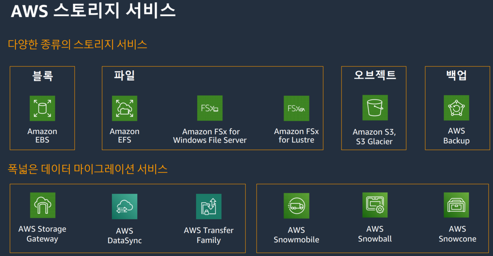
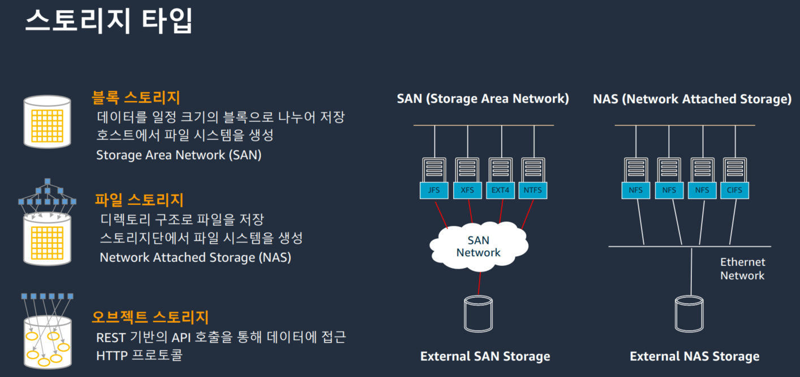
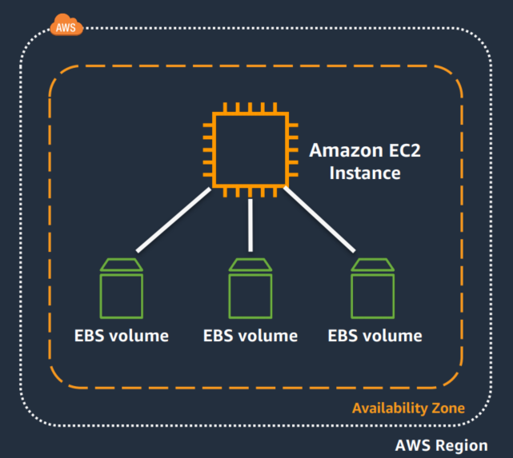
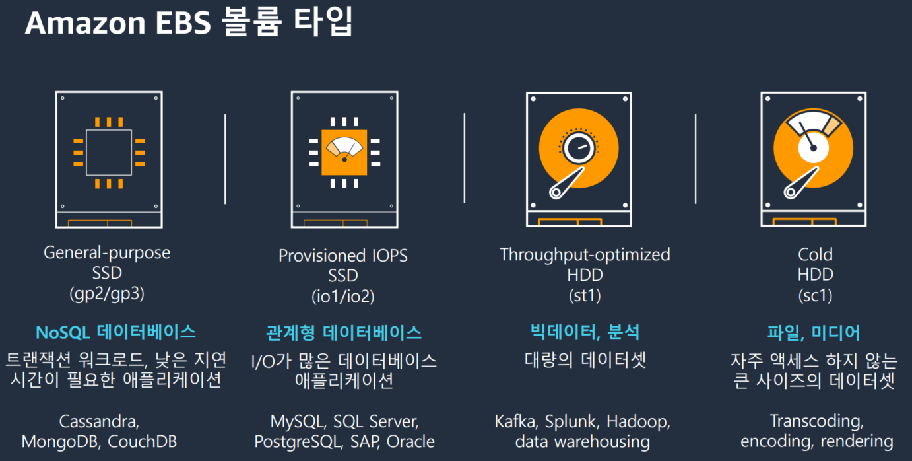
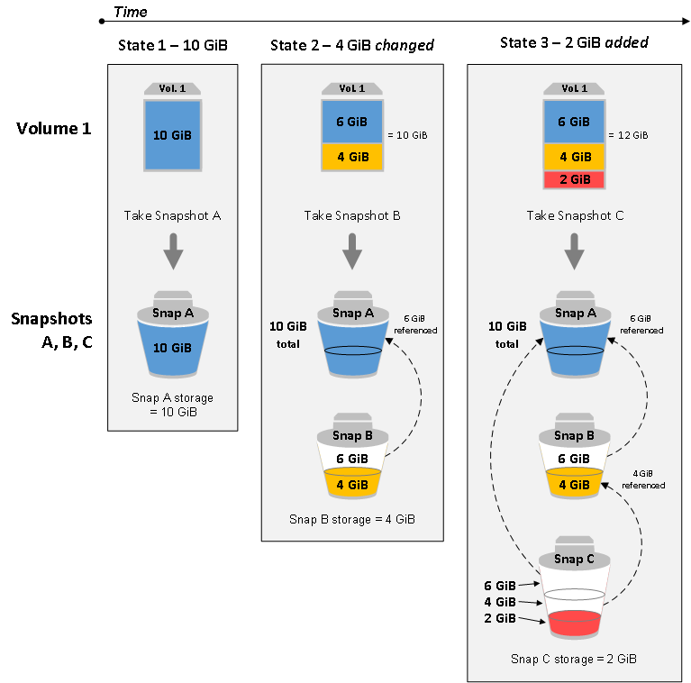
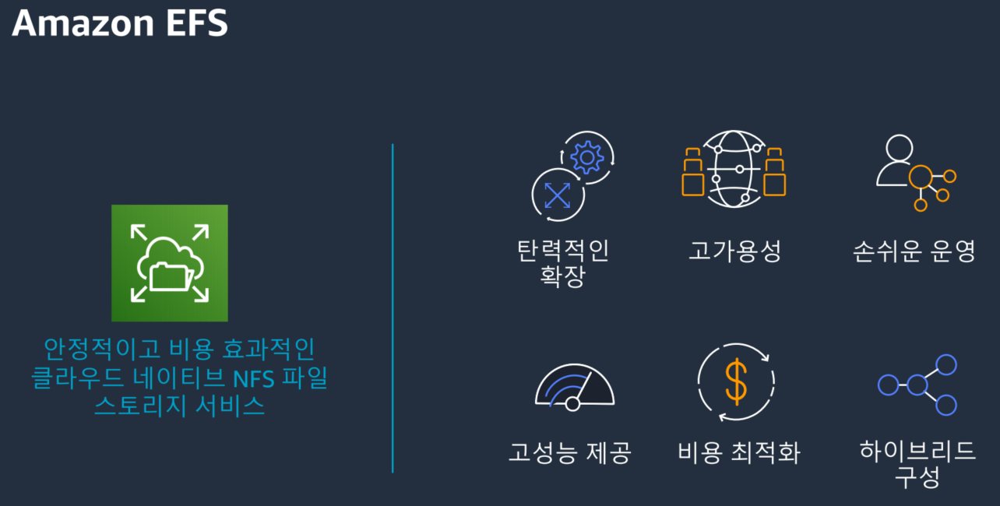
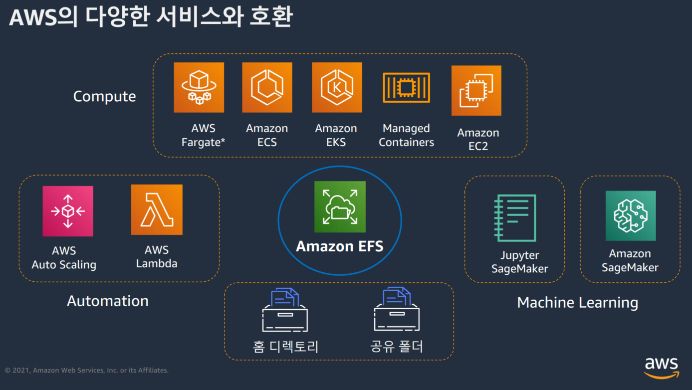
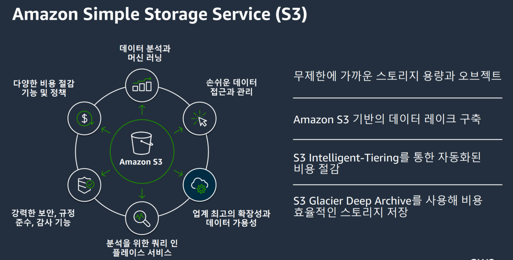
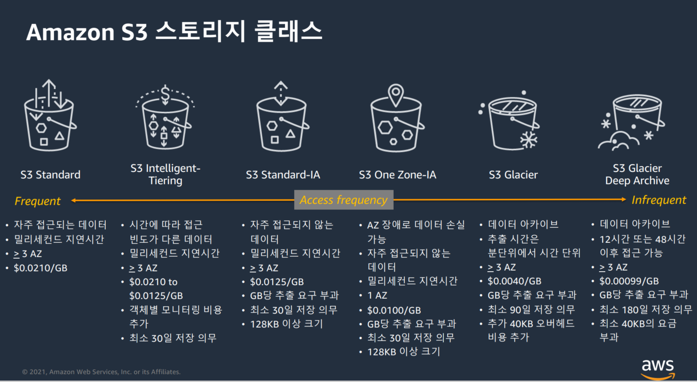
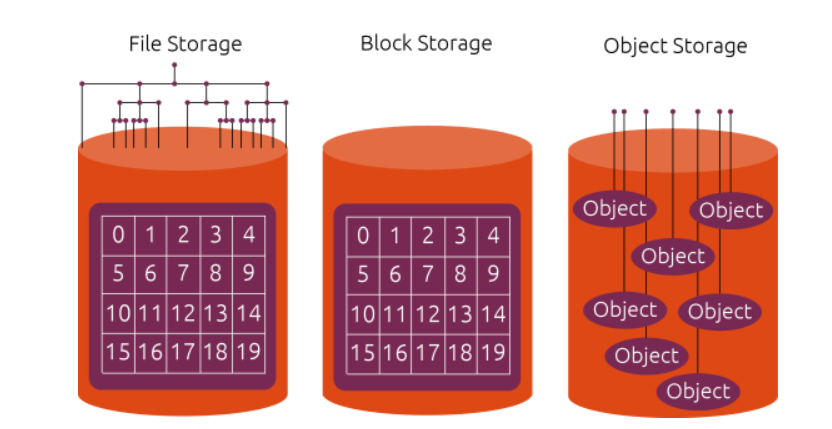

# AWS 스토리지 서비스




## 스토리지 타입

- 어떤 곳에 사용하는게 좋은가?
  - Block Storage : 호스트에서 직접 파일을 액세스하고 기록하며 빠른 성능을 요하는 경우
  - File Storage : 여러대의 서비스들이 데이터를 공유하고 공유에서 사용해야 하는 경우
  - Object Storage : 대량의 데이터를 저장하고 또는 앱 컨텐츠로 사용되어야 하거나 다수의 서버에서 해당 데이터에 접근 해야 하는 경우





|          |                                            | File EFS                                                     | Object S3                                                    | Block EBS                                                    |
| -------- | ------------------------------------------ | ------------------------------------------------------------ | ------------------------------------------------------------ | ------------------------------------------------------------ |
| 퍼포먼스 | 작업별 대기 시간                           | 낮음, 일관됨                                                 | 낮음, 여러 요청 타입 처리, CloudFront와 통합                 | 가장 낮음, 일관됨                                            |
|          | 처리량 크기                                | 초당 GBs                                                     | 초당 GBs                                                     | 초당 GB                                                      |
| 특성     | 가용성 / 내구성 (availability, durability) | 여러 AZ에 중복 저장                                          | 여러 AZ에 중복 저장                                          | 단일 AZ에 중복 저장                                          |
|          | 엑세스                                     | 1개~수천개의 EC2인스턴스 / on-premise 서버 / 여러 AZ에서 동시 접근 | 웹을 통한 수백만 개의 연결                                   | 하나의 AZ에 속한 하나의 EC2 인스턴스                         |
|          | 사용 케이스                                | 웹 서비스 및 컨텐츠 관리 엔터프라이즈 어플리케이션 홈 디렉토리 데이터베이스 백업 개발자 도구 컨테이너 스토리지 빅데이터 분석 | 웹 서비스 및 컨텐츠 관리 미디어 및 엔터테인먼트 백업 빅데이터분석 데이터 레이크 | 부팅 볼륨 트랜잭션 및 NoSQL 데이터베이스 데이터 웨어하우징 및 ETL |


### EBS

- Amazon Elastic Block Storage(EBS)
  - SAN 방식
- EBS는 EC2에서 사용하도록 설계된 영구 지속 블록 스토리지 서비스( 하드 디스크  개념 )
  - EBS 볼륨을 활용하여 파일 시스템을 생성하거나 블록 디바이스 자체로 활용(볼륨구성 동적으로 변경가능)
  - 고성능 대규모 데이터 처리와 트랜잭션 집약적인 워크로드에 사용
  - 데이터베이스, 빅데이터 분석, 엔터프라이즈 애플리케이션과 같은 중요한 업무에 활용
  - 볼륨의 크기를 변경은 수동적인 작업
- 어떨 때 사용하는가?
  - 데이터를 빠르게 액세스하고, 장기적으로 지속해야하는 경우 적합
  - 단일 EC2 인스턴스의 전용 블록 스토리지
- 특징
  - 고가용성
    - 99.999% 가용성 제공
    - 데이터 손실 방지를 위해 가용 영역 내에서 자동으로 볼륨 복제
  - 안정성
    - 모든 EBS 볼륨 유형은 암호화를 지원
    - AES-256 및 Amazonb이 관리하는 키인프라를 사용
  - 확장성
    - 애플리케이션 중단없이 볼륨 유형 변경 가능
    - 볼륨 크기 확장 가능
  - 성능
    - 낮은 지연 시간 제공
    - 일정한 I/O 유지
  - 백업
    - 스냅샷을 통해 특정 시점 백업 (특정 시점 스냅샷을 S3에 저장도 가능)
    - 가용영역이나 리전간 스냅샷 복제 가능
    - 마지막 스냅샷 이후 변경된 블록이 저장되는 방식(증분 스냅샷)





| SSD                                 | SSD                      | HDD                                      | HDD                         |
| ----------------------------------- | ------------------------ | ---------------------------------------- | --------------------------- |
| Provisioned IOPS SSD                | General Purpose SSD      | Throughput Optimized HDD                 | Cold HDD                    |
| 지연시간에 민감한 트랜잭션 워크로드 | 다양한 트랜잭션 워크로드 | 자주 엑세스하고 처리량 집약적인 워크로드 | 엑세스 빈도가 낮은 워크로드 |
| 4GB ~ 1TB                           | 1GB ~ 16TB               | 500GB ~ 16TB                             | 500GB ~ 16TB                |
| 64000 IOPS                          | 16000 IOPS               | 500 IOPS                                 | 250 IOPS                    |
| 가장 비쌈                           |                          |                                          | 가장 저렴                   |





### EFS

- Elastic File Storage
  - NAS 방식
- AWS 클라웃드 서비스와 온프레미스 리소스에서 사용할 수 있는 간단하고 확장 가능하며 탄력적인 완전 관리형 탄력적 NFS 파일 시스템
  - 애플리케이션 중단할 필요없이 확장되므로 사용자가 용량을 프로비저닝 및 관리할 필요 없음
    - 프로비저닝 (provisioning) : 사용자의 요구에 맞게 시스템 자원을 할당, 배치, 배포해 두었다가 필요 시 시스템을 즉시 사용할 수 있는 상태로 미리 준비해두는 것
  - 최대 수천개의 EC2 인스턴스를 위한 스토리지이며 동시에 액세스 가능
  - EFS 파일 시스템은 다중 가용 영역에 걸쳐 데이터와 메타데이터를 저장
  - 네트워크 연결 공유 파일 스토리지 (NFSv4 프로토콜 사용)
  - VPC 내에서 Ec2 인스턴스는 직접 액세스 할 수 있음
  - On-promisse 서버는 Direct Connect & VPN 연결을 통해 팡리 시스템 탑재
    - Direct Connect는 대역폭이 높고 지연 시간이 짧은 전용 네트워크 연결
  - 페타바이트 규모로 탄력적으로 자동 확장 및 축소
  - Multi AZ







#### EFS 마운트

```shell
# EFS DNS 이름 
availability-zone.file-system-ID.efs.aws-region.amazonaws.com (볼드체는 고정)
file-system-ID.efs.aws-region.amazonaws.com (볼드체는 고정)

# 인스턴스에 마운트
sudo mount -t efs fs-12345678:/ efs

# 전송 중 데이터 암호화 사용 시
sudo mount -t efs -o tls fs-12345678:/ efs
```


### S3

- Amazon Simple Storager Service(S가 3개라 S3)
  - 인터넷용 객체(Object)기반 무제한 스토리지 서비스
- S3 개념
  - 버킷
    - 버킷은 데이터 스토리지를 위한 S3의 기본 컨테이너
    - 객체는 어떤 버킷에 포함됨 
    - 리전에 생성됨 - 버킷을 만든 후에는 이름 또는 리전을 변경할 수 없음
    - 버킷의 이름은 저역수준에서 고유하며, 네임스페이스는 모든 aws 계정이 공유함
  - 객체
    - S3 에 저장되는 기본 매체
    - 객체는 객체 데이터와 객체 메타데이터로 구성됨
    - 메타데이터는 객체를 설명하는 이름-값 페어의 집합
    - 객체를 저장할 때 사용자 정의 메타데이터를 지정할 수 있음
    - 객체는 키(이름) 및 버전 ID를 버킷내에서 고유하게 식별됨
  - 키
    - 버킷 내 개체의 고유한 식별자
    - 버킷 내 모든 객체는 정확히 하나의 키를 가짐
    - S3는 "버킷 + 키 + 버전"과 객체 사이의 기본 데이터맵으로 생각할 수 있음
  - S3 데이터 일관성 모델
    - S3 버킷에 있는 객체 대해서 여러 버서로 데이터를 복제함으로 고가용성을 구현하고 데이터 일관성 모델을 제공
- 버킷 액세스 방법
  - 가상 호스팅 방식 액세스 : 정적 웹사이트 접속 시
    - 형식 : [https://*bucket-name*.s3.*Region*.amazonaws.com/*key](https://bucket-name.s3.region.amazonaws.com/key) name*
    - 예시 : [https://*my-bucket*.s3.*us-west-2*.amazonaws.com/*puppy.png*](https://my-bucket.s3.us-west-2.amazonaws.com/puppy.png)
  - S3:// 를 사용하여 버킷 액세스 : 일부 AWS 서비스는 S3://bucket 를 사용하여 S3 버킷을 지정해야 합니다.
    - 형식 : S3://*bucket-name/key-name*
    - 예시 : S3://*mybucket/puppy.jpg*
  - S3 엑세스 포인트를 통해 버킷 액세스 : 가상 호스트 스타일의 주소로 접속
    - 형식 : [https://*AccessPointName-AccountId*.s3-accesspoint.*region*.amazonaws.com](https://accesspointname-accountid.s3-accesspoint.region.amazonaws.com/)
- 버킷 이름 지정 규칙
  - 버킷 이름은 3자에서 63자 사이여야 합니다.
  - 버킷 이름은 소문자, 숫자, 점(.) 및 하이픈(-)으로만 구성될 수 있습니다.
  - 버킷 이름은 문자 또는 숫자로 시작하고 끝나야 합니다.
  - 버킷 이름은 IP 주소 형식(예: 192.168.5.4)을 사용하지 않습니다.
  - 최상의 호환성을 위해 정적 웹 사이트 호스팅에만 사용되는 버킷을 제외하고 버킷 이름에 점(.)을 사용하지 않는 것이 좋습니다.








### Object Storage 란?

- 스토리지의 3가지 종류
  - 블록스토리지
    - 정해진 블록 안에 데이터를 저장
    - C드라이브, D드라이브 처럼 파티션을 나눠주고 그 공간안에서 사용
    - 파일 스토리지는 경로를 하나만 가지고 있지만, 블록스토리지는 여러개의 경로를 가질 수 있음
    - 공유는 가능하지만 OS와의 연결은 한번에 1개만 가능
    - 낮은 IO 레이턴시를 보이기 때문에 RDB와 같은 데이터베이스에 적합
  - 파일스토리지
    - 폴더와 파일로 이루어지는 계층 구조를 갖는 스토리지
    - 각 파일은 폴더에 종속되며 폴더 역시 다른 폴더에 종속도리 수 있음
    - 파일을 찾기 위해서는 어느 위치에 있는지 알아야함
    - 파일이 많지 않다면 분류하고 정리하는데 큰 문제가 없지만, 파일철들이 계속해서 늘어나면 점점 분류하고 정리하는(파일시스템의 인덱싱)이 많아지고 찾기가 힘들어짐
  - 오브젝트 스토리지
    - 블록스토리지와 파일스토리지가 모두 OS 단에서 동작하지만, 오브젝트 스토리지는 어플리케이션 단에서 동작
    - Storage 내에서 폴더를 만들거나 다른 버킷으로 파일을 옮긴다고 해도 실제로 블록을 이동하거나 폴더에 종속된 것이 아닌 단지 사용자에게 그렇게 보이도록 해줌 - 논리적인 스토리지
    - 물리적인 제약이 없기 떄문에 원하는 만큼 공간을 확장시킬 수 있음
    - RestFul Protocol(HTTP)를 이용하여 Get혹은 Post로 요청하면 파일을 주기 때문에 파일에 대한 많은 정보를 가지지 않음. 따라서 파일이 아무리 많아져도 블록스토리지나 파일스토리지에 비해 빠르게 동작
    - 파일의 수정이 불가능 - 파일이 수정될 때 트랜잭션을 통해 일관성을 유지하기가 힘들기 때문에 덮었는 방법을 이용
      - 그래서 이미지, 동영상 같이 수정이 잘 일어나지 않는 정적인 데이터를 호스팅 할 떄 좋음




### S3 의 접근 통제

> S3 는 전세계에서 유일한 식별자를 두고 사용하기 때문에 누구나 접근할 수 있는 위험성이 있음 따라서 S3는 이러한 접근을 통제할 필요성이 있음

1. 액세스 제어 목록
   - 액세스 제어 목록(ACL)을 사용하여 버킷 및 객체 각각에 대한 액세스를 제어할 수 있습니다. 
   - 종류
     - 객체 ACL
     - 버킷 ACL
2. 버킷정책
   - 버킷 정책은 S3 작업, 요청자, 리소스 및 요청의 여러 측면(예: IP 주소)를 비롯한 다양한 조건을 기반으로 버킷 및 객체에 대한 중앙 집중식 액세스 제어를 제공
   - 정책은 액세스 정책 언어로 표현되며 중앙 집중식 권한 관리를 가능하게 합니다. 버킷에 연결되는 권한은 해당 버킷의 모든 객체에 적용됩니다.
   - 개별 객체에 대해서만 권한을 추가(부여) 할 수 있는 액세스 제어 목록과 달리, 정책은 버킷 내 모든 객체 또는 객체의 하위 세트에 대해 권한을 추가 또는 거부할 수 있습니다.
   - 또한 버킷에 포함된 임의 개수의 객체에 대한 권한을 설정 할 수도 있습니다.
   - 버킷 소유자만 정책을 버킷에 연결할 수 있습니다. 액세스 정책 언어로 작성되는 정책은 다음을 기반으로 요청을 허용 또는 거부 합니다.
     - S3 버킷 작업(예. PUT ?acl) 및 객체 작업(예: PUT Object 또는 GET Object)
     - 요청차
     - 정책에 지정된 조건
   - 계정은 `GetObject`, `GetObjectVersion`, `DeleteObject` 또는 `DeleteBucket`과 같은 특정 Amazon S3 작업을 기반으로 액세스를 제어할 수 있습니다.
   - 조건은 IP 주소, IP 주소 범위(CIDR 표기법 사용), 날짜, 사용자 에이전트, HTTP 참조자 및 전송(HTTP 및 HTTPS) 등이 될 수 있습니다.
3. IAM 정책
   - IAM 을 사용하여 S3 리소스에 대한 액세스를 관리할 수 있습니다. 