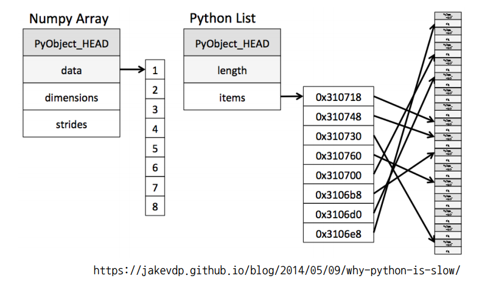
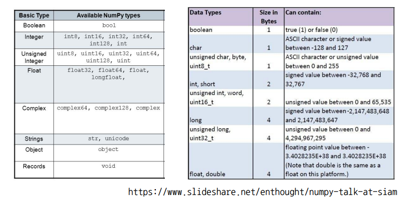
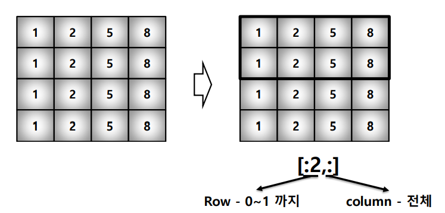
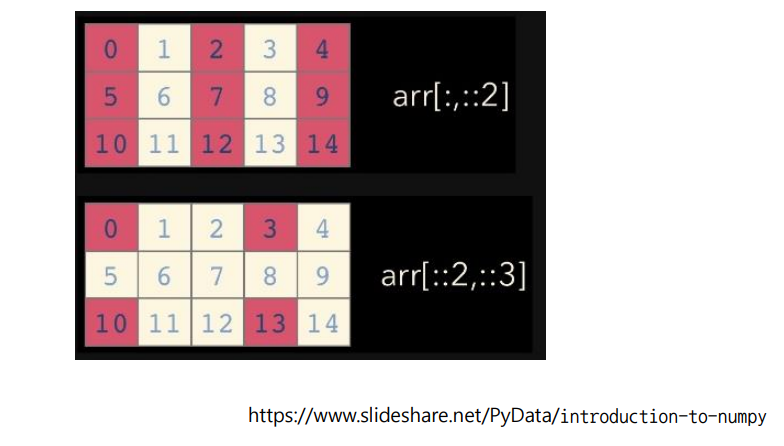
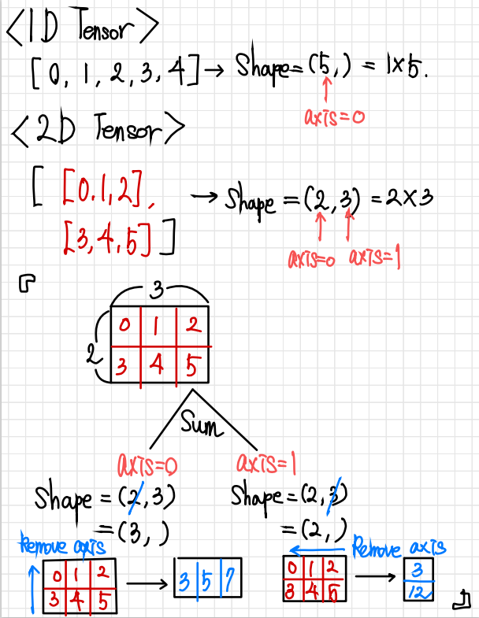
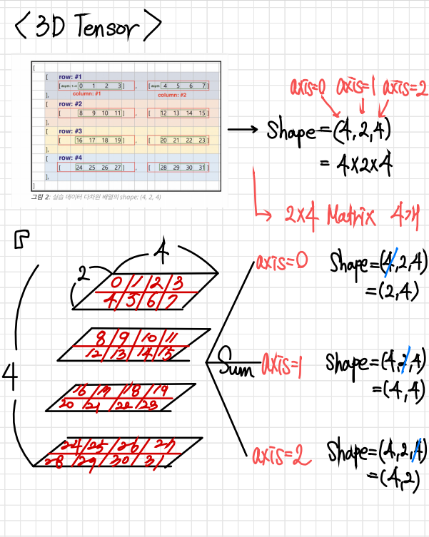
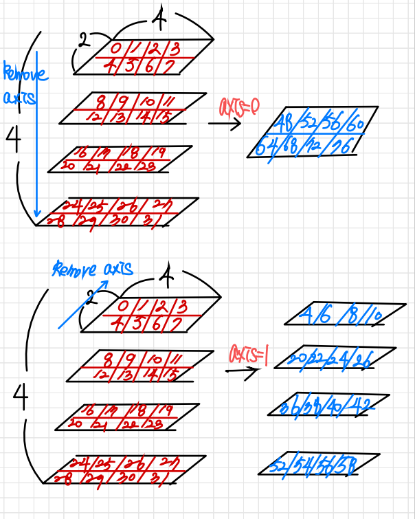
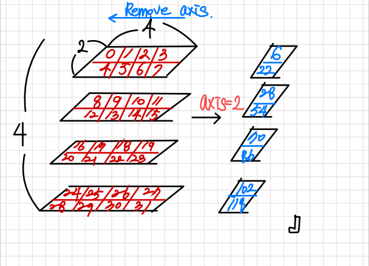
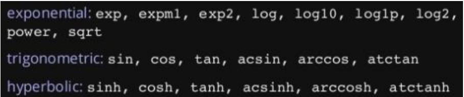

# 📌 Numpy

- 파이썬의 고성능 과학 계산용 패키지로, 
- **Matrix 와 Vector 와 같은 Array 연산의 표준** 으로 불리운다.
- **넘파이(Numpy)** 는 일반 List에 비해 빠르고, 메모리 효율적이다. 
- 또한 반복문 없이 데이터 배열에 대한 처리를 치원하고 선형대수와 관련된 다양한 기능을 제공한다.


------


# 📄 Array creation



### :pencil2: ndarray

- `np.array([자료], dtype=자료형) ` 

- **Numpy의 array**는 python list와는 다르게 **순차적인 데이터 저장 구조 방식으로 저장용량 과 접근 방식의 비용에 있어서 더 효율적이다.** 
- 또한 **하나의 데이터 type** 만 배열에 넣을수 있다. 즉, **dynamic typing** 을 지원하지 않는다.
- rray의 RANK에 따라 불리는 이름이 있음
  - 0 Rank : scalar
  - 1 Rank : vector
  - 2 Rank : matrix
  - 3 Rank : 3-tensor
  - n Rank : n-tensor

```python
import numpy as np
data=np.array([1,2,3,'4'],dtype=np.float32) # ndarray 객체
data

#array([1., 2., 3., 4.], dtype=float32)
data_1D=np.array([1,2,3,4],dtype=np.int32) # np.array([1,2,3,4],int) 로 쓸 수 도 있음
data_1D.shape # Vector ,(4,)
#####################################

data_2D=np.array([[1,2,3],
                  [4,5,6]],dtype=np.int32)
data_2D.shape # Matrix ,(2,3)
#####################################

data_3D=np.array([[[1,2,3],[4,5,6]],
                  [[1,2,3],[4,5,6]],
                  [[1,2,3],[4,5,6]]],dtype=np.int32)
data_3D.shape # 3-tensor ,(3,2,3)
```

------

# 📄 Array dtype



ndarray의 single element 가 가지는 data type 으로 **각 element가 차지하는 memory 의 크기**가 결정된다.

```python
np.array([[1,2,3],[4.5,'6','5']],dtype=np.float32).nbytes # 32bit = 1byte *4 =4bytes -> 6 *4bytes =24bytes
# 24
```

------

# 📄 Handling shape

## ✏️ Reshape

Array의 크기를 **element의 갯수는 유지하면서 변형한다.**

```python
test_matrix=np.arange(10).reshape(2,5) # vector -> 2x5 matrix 
test_matrix 
# array([[0, 1, 2, 3, 4],
# 	[5, 6, 7, 8, 9]])
```

## ✏️ Flatten

다차원 array를 **1차원 array로 변환한다.**

```python
test_matrix=np.arange(10).reshape(2,5) # 2x5 matrix
test_matrix.flatten()
# array([0, 1, 2, 3, 4, 5, 6, 7, 8, 9])
```

------

## 📄 Indexing & Slicing

## ✏️ Indexing

- list와 달리 이차원 배열에서 [0,0] 표기법을 제공함
- matrix일 경우, 앞은 row 뒤는 column을 의미함

```python
test_matrix=np.arange(6).reshape(3,2)
test_matrix
#     array([[0, 1],
#           [2, 3],
#           [4, 5]])

test_matrix[2,1] # ==test_matrix[2][1]

#5
```

## ✏️ Slicing

- list 와 달리 **행과 열부분을 나눠서 slicing이 가능** 하여 matrix의 부분집합을 추출할때 유용하다.





```python
test_matrix=np.arange(15).reshape(3,5)
test_matrix
#    array([[ 0,  1,  2,  3,  4],
#           [ 5,  6,  7,  8,  9],
#           [10, 11, 12, 13, 14]])

test_matrix[:,1] # row 전체, 두번째열
#    array([ 1,  6, 11])

test_matrix[:,:] # == test_matrix == test_matrix[:]
#    array([[ 0,  1,  2,  3,  4],
#           [ 5,  6,  7,  8,  9],
#           [10, 11, 12, 13, 14]])

test_matrix[::2,::3]
#    array([[ 0,  3],
#           [10, 13]])
```

------

## 📄 Creation function

## ✏️ arange

- list의 range 처럼 **array의 범위를 지정하여 생성한다.** **list의 range 와의 차이점은 step의 경우 floating point도 표시가능하다.**
- np.arange(start, end, step)

```python
np.arange(30,50,0.5) # floating point 도 가능하다

#    array([30. , 30.5, 31. , 31.5, 32. , 32.5, 33. , 33.5, 34. , 34.5, 35. ,
#           35.5, 36. , 36.5, 37. , 37.5, 38. , 38.5, 39. , 39.5, 40. , 40.5,
#           41. , 41.5, 42. , 42.5, 43. , 43.5, 44. , 44.5, 45. , 45.5, 46. ,
#           46.5, 47. , 47.5, 48. , 48.5, 49. , 49.5])
```

## ✏️ Ones / Zeros / Empty / Something_like

- ones : 1로 가득찬 ndarray 생성
- zeros : 0으로 가득찬 ndarray 생성
- empty : shape만 주어지고 비어있는 ndarray 생성(memory initialization이 되지 않음)
- somthing_like - 기존 ndarray의 shape 크기 만큼 1, 0, 또는 empty array 생성

```python
np.zeros((2,5)) # 2x5 - zero matrix
#  array([[0., 0., 0., 0., 0.],
#           [0., 0., 0., 0., 0.]])

np.ones((2,5)) # 2x5 - one matrix

#    array([[1., 1., 1., 1., 1.],
#           [1., 1., 1., 1., 1.]])

np.empty((2,5)) # 2x5 - empty matrix (결과는 one matrix 가 생성된것같지만 해당 메모리의 값이 1로 쓰레기값이 남아 있어서이다)
 
#    array([[1., 1., 1., 1., 1.],
#           [1., 1., 1., 1., 1.]])


test_matrix=np.arange(30).reshape(5,6)
np.ones_like(test_matrix) # 5x6 one matrix
# array([[1, 1, 1, 1, 1, 1],
#           [1, 1, 1, 1, 1, 1],
#           [1, 1, 1, 1, 1, 1],
#           [1, 1, 1, 1, 1, 1],
#           [1, 1, 1, 1, 1, 1]])
```

## ✏️ Identity

단위행렬을 생성한다

```python
np.identity(n=3,dtype=np.float32)
# array([[1., 0., 0.],
#           [0., 1., 0.],
#           [0., 0., 1.]], dtype=float32)
```

## ✏️ Eye

- **대각선이 1인 행렬로 **
- **identity와의 차이점은 shape 설정과 k값을 통해 start index 설정이 가능하다**
  - k=0일 때 np.identity와 같음

```python
np.eye(3)
#  array([[1., 0., 0.],
#           [0., 1., 0.],
#           [0., 0., 1.]])

np.eye(3,5,k=2)
#    array([[0., 0., 1., 0., 0.],
#           [0., 0., 0., 1., 0.],
#           [0., 0., 0., 0., 1.]])
```

## ✏️ Diag

- **대각행렬의 값을 추출하며**
- **k값을 통해 start index 설정이 가능하다**

```python
matrix=np.arange(9).reshape(3,3)
matrix
#    array([[0, 1, 2],
#           [3, 4, 5],
#           [6, 7, 8]])

np.diag(matrix)
#    array([0, 4, 8])

np.diag(matrix,k=1) 
#    array([1, 5])
```

## ✏️ Random sampling

데이터 분포에 따른 sampling으로 array를 생성한다

- np.random.uniform() : 균등분포
- np.random.normal() : 정규분포
- np.random.exponential() : 지수분포

```python
np.random.uniform(0,1,10).reshape(2,5) # 균등분포
#  array([[0.08602674, 0.74042107, 0.15989891, 0.65901218, 0.71817766],
#           [0.34351467, 0.32649185, 0.18205676, 0.14635388, 0.68248751]])
np.random.normal(0,1,10).reshape(2,5) # 정규분포
#    array([[ 0.12853111,  0.39784715,  1.34587716, -0.20692527,  0.53340462],
#           [ 1.19029392, -0.72233091,  0.79634839,  0.67064794,  0.13323741]])
```

------

## 📄 Operation function

## ✏️ Axis

Operation function 및 Comparison 을 실행할때 기준이 되는 dimension 축으로 이 부분을 잘 이해하고 있어야 한다

### :pen: newaxis 

- numpy array 의 차원을 늘려주는 것 ( 1D -> 2D , 2D-> 3D)

- **newaxis = None** 

  - newaxis가 생각 안나면 None을 써도 무방

- reshape와 newaxis의 차이?

  - reshape는 변환전 차원의 합과 변환후 차원의 합이 같아야 함

    (4,1) -> (2,2) 가능

     (4,1) -> (3,3) 불가능

- 어떨 때 사용하는가 - 사용예제 3개

  - 1D array를 row vector나 column vector로 사용하고 싶을 경우

  ```python
  arr = np.arange(4)
  arr.shape # (4,)
  
  row_vec = arr[np.newaxis, :]
  row_vec.shape # (1, 4)
  row_vec # array([[0, 1, 2, 3]])
  
  col_vec = arr[:, np.newaxis]
  col_vec.shape
  col_vec # array([[0, 1, 2, 3]])
  ```

  - numpy broadcasting이라고 shape이 다른 array간 연산을 할때도 유용

  ```python
  x1 = np.array([1, 2, 3, 4, 5])
  x2 = np.array([5, 4, 3])
  
  x1+x2 # ValueError: operands could not be broadcast together with shapes (5,) (3,)
  
  x1_new = x1[:, np.newaxis]
  # now, the shape of x1_new is (5, 1)
  # array([[1],
  #        [2],
  #        [3],
  #        [4],
  #        [5]])
  
  x1_new + x2
  """
  array([[ 6,  5,  4],
         [ 7,  6,  5],
         [ 8,  7,  6],
         [ 9,  8,  7],
         [10,  9,  8]])
  """
  ```

  

  - array라는 단순한 녀석을 좀 더 고차원으로 만들고 싶다면

  ```python
  arr = np.arange(5*5).reshape(5,5)
  arr.shape # (5, 5)
  
  arr_5D = arr[np.newaxis, ..., np.newaxis, np.newaxis]
  arr_5D.shape # (1, 5, 5, 1, 1)
  ```

  










## ✏️ Sum / Mean / Std / Mathematical functions

- sum: ndarray의 element 들 간의 합.

- mean: ndarray의 element 들 간의 평균.

- std : ndarray의 element 들 간의 표준편차.

- mathematical functions : 다양한 수학연산자를 제공하므로 필요한 내용은 레퍼런스 참조.(np.something 호출)



```python
test_matrix=np.arange(10).reshape(2,5)
test_matrix
#    array([[0, 1, 2, 3, 4],
#           [5, 6, 7, 8, 9]])

test_matrix.sum()
#    45

test_matrix.sum(axis=1)  #axis=1을 기준으로 summation
#    array([10, 35])


test_matrix.mean()
# 4.5

test_matrix.std()
#    2.8722813232690143    
```

## ✏️ Concatenate

numpy array를 붙이는 함수를 제공한다.

- vstack : vertical 방향으로 붙인다
- hstack : horizontal 방향으로 붙인다
- concatenate : 두 array를 axis 기준으로 붙인다

```python
a=np.array([1,2,3])
b=np.array([4,5,6])

np.vstack((a,b))
#    array([[1, 2, 3],
#           [4, 5, 6]])

np.hstack((a,b))
#    array([1, 2, 3, 4, 5, 6])

np.concatenate((a,b),axis=0) # == np.hstack((a,b))
#    array([1, 2, 3, 4, 5, 6])
```

------

## 📄 Array Operation

- numpy는 array간의 기본적인 사칙연산을 지원한다. 
- **주의할것은 기본적인 연산 의 경우 element-wise operation 이며, **
- **행렬 곱연산을 원할경우 dot함수를 이용하자.**

## ✏️ Basic element-wise operations

```python
test_a=np.array([[1,2,3],
                 [4,5,6]])
test_a+test_a
#    array([[ 2,  4,  6],
#           [ 8, 10, 12]])

test_a-test_a
#    array([[0, 0, 0],
#           [0, 0, 0]])

test_a*test_a
#    array([[ 1,  4,  9],
#           [16, 25, 36]])

test_a/test_a
# array([[1., 1., 1.],
#           [1., 1., 1.]])

test_a//test_a
#   array([[1, 1, 1],
#           [1, 1, 1]], dtype=int32)

test_a%test_a
#    array([[0, 0, 0],
#           [0, 0, 0]], dtype=int32)
```

## ✏️ Dot

matrix의 기본연산은 dot함수를 사용한다.

```python
test_a=np.array([[1,2,3],
                 [4,5,6]]) #2x3
test_b=test_a.T # ==test_a.transpose()

test_a.dot(test_b) # 2x2

#    array([[14, 32],
#           [32, 77]])
```

## ✏️ Broadcasting

shape이 다른 배열간 연산을 지원해준다.

```python
test_scalar=3
test_vector=np.arange(2) # [0,1]
test_matrix=np.arange(4).reshape(2,2) # [[0,1],[2,3]]

test_vector-test_scalar # Vector - scalar
#    array([-3, -2])

test_matrix-test_scalar # Matrix - scalar
#    array([[-3, -2],
#           [-1,  0]])

test_matrix-test_vector # Matrix - vector
#    array([[0, 0],
#           [2, 2]])
```

------

## :pencil2: transpose

- 행과 열을 바꾸기 
- 전치행렬(transpose matrix)
- 3가지 방법
  - `a.T`
  - `np.transpose(a)`
  - `np.swapaxes(a, 0, 1)`


## 📄 Comparison

## ✏️ All/Any

데이터의 전부(and) 또는 일부(or) 가 조건 만족여부 반환한다.

```python
a=np.arange(10) # [0,1,2,3,4,5,6,7,8,9]
np.all(a>5) # False
np.any(a>8) # True
```

## ✏️ Comparison operation

**numpy는 배열의 크기가 동일할때 element 간 비교의 결과를 boolean type의 array로 반환해준다.**

```python
test_a=np.array([1,3,0])
test_b=np.array([5,2,1])

test_a>test_b
# array([False,  True, False])

test_a==test_b
#    array([False, False, False])

(test_a>test_b).any()
# True
np.logical_and(test_a>1,test_b<3)
#  array([False,  True, False])

np.logical_not(test_a>1) # test_a<=1
#    array([ True, False,  True])


np.logical_or(test_a>1,test_b<3) 
#    array([False,  True,  True])
```

## ✏️ Where

- np.where(condition, TRUE, FALSE)
- np.where(condintion): index 값 반환

```python
test_a=np.array([1,3,0])
np.where(test_a>1,2,-2) # where(condition,True일경우 값 변환,False일경우 값변환)
# array([-2,  2, -2])

np.where(test_a>1) # Index 반환
#    (array([1], dtype=int64),)


test_b=np.array([1,np.NaN,np.Inf])
np.isnan(test_b)
#    array([False,  True, False])

np.isfinite(test_b)
#    array([ True, False, False])
```

## ✏️ Argmax / Argmin

arry 내 최대값 또는 최소값의 index를 반환해준다

```python
test_a=np.arange(10).reshape(2,5)
test_a
#    array([[0, 1, 2, 3, 4],
#           [5, 6, 7, 8, 9]])
np.argmax(test_a,axis=1) # axis=1 : 행기준 행마다 최대값 위치/ axis=0 : 열기준 열마다 최대값 위치
#    array([4, 4], dtype=int64)

np.argmin(test_a[1]) #test_a[1] = [5,6,7,8,9]
# 0
```

------

## 📄 Boolean & Fancy index

## ✏️ Boolean index

특정조건에 따른 boolean 값을 이용하여 해당 element 추출 가능.

```python
test_array=np.array([1,-1,2,3,-3])
test_array[test_array>0] # 양수만 추출
#    array([1, 2, 3])
```

## ✏️ Fancy index

array를 index 로 사용해서 해당 element 추출 가능.

```python
test_array=np.array([1,-1,2,3,-3])
fancy_index=np.array([0,2,3,2],dtype=np.int8) # 0,2,3,2 번 인덱스 element 추출. 반드시 integer로 선언

test_array[fancy_index]
#    array([1, 2, 3, 2])

test_array.take(fancy_index)  # take : bracket index 와 같은 효과
#    array([1, 2, 3, 2])

#================================
test_matrix=np.array([[1,4],[9,16]])
row_fancy=np.array([0,1,1],dtype=np.int8)
column_fancy=np.array([1,1,0],dtype=np.int8)
test_matrix[row_fancy,column_fancy] # Matrix에도 가능 # (0,1), (1,1), (1,0) 위치 뽑아냄
#    array([ 4, 16,  9])
```
