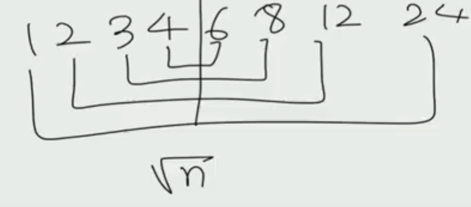

# 1. 소수 배열 구하기 - 에라토스테네스의 체

- 역할

  - N 이 주어지면 N 이하의 모든 소수를 구할 때 사용

- 시간 복잡도 : O(N^2)

- 아이디어 

  - 2부터 순서대로 진행하며, 자신의 배수를 전부 지워버림

  ```python
  # N 을 입력받음
  
  MAX = N
  primes = []
  check = [False] * (MAX+1)
  
  for i in range(2,MAX+1) : # 2~Max까지 돌면서 확인
      if check[i] == False :
          primes.add(i) # 소수 목록에 추가
          for j in range(i, MAX+1, i) : # i 의 배수는 모두 소수가 아님
              check[j] = True
  ```

  

# 2. 소수 판별 하기

## 2 ~ n-1 까지 나누어 보기

- 소수의 정의를 통해 구하는 1차원적인 방법


## 2 ~ n//2 까지 나누어보기

- 소수는 2의 배수가 아님
- (n//2 이상의 수) *  x =  n 이 되기 위해서는 1<=x <= 2 이어야함.
  - 계산할 필요가 없어짐


## 2 ~ 루트n 까지 나누어보기

- 모든 약수는 루트n 기준으로 대칭이 됨
  - 이 특징 때문에 루트n을 기준으로 나눠지는 수가 없을 경우 루트n 이상에서도 나눠지는 수가 없음!





# 문제풀어보기

## 12852 골드바흐 파티션(실버2)

- https://www.acmicpc.net/problem/17103


### 1. 소수 판별로 풀이

- 시간초과

```python
T = int(input())
inp_arr = [int(input()) for _ in range(T)]

def check_prime(n) :
    sqrt_n = int(n **(1/2))
    for i in range(2,sqrt_n+1) :
        if n%i == 0 :
            return False
    else :
        return True

def func(x) :
    cnt=0
    for i in range(2, x//2 +1) :
        if check_prime(i) and check_prime(x-i) :
            cnt+=1
    return cnt

for x in inp_arr :
    print(func(x))
```


### 2. 에라토네스의 체 이용

- 에라토네스의 체로 visited 함수를 만들어서 확인
  - 소수 집합을 보내버리면 in 을 이용하여 x-i 가 소수인지 또 판별해야되기 때문

| 제출 번호 | 아이디                                              | 문제                                           | 문제 제목       | 결과             | 메모리 | 시간 | 언어     | 코드 길이 | 제출한 시간 |
| :-------- | :-------------------------------------------------- | :--------------------------------------------- | :-------------- | :--------------- | :----- | :--- | :------- | :-------- | :---------- |
| 27986011  | [swhan9404](https://www.acmicpc.net/user/swhan9404) | [17103](https://www.acmicpc.net/problem/17103) | 골드바흐 파티션 | **맞았습니다!!** | 36584  | 2192 | Python 3 | 570       |             |

```python
T = int(input())
inp_arr = [int(input()) for _ in range(T)]

def make_prime_arr(max_inp) :
    visited = [0] * max_inp
    visited[0] =1
    visited[1] =1
    
    for i in range(2, max_inp) :
        if visited[i] == 0 :
            for j in range(i+i, max_inp, i) :
                visited[j] = 1
    return visited
visited = make_prime_arr(max(inp_arr)+1)

def func(x, visited) :
    cnt=0
    half = x//2 +1
    for i in range(2, half) :
        if visited[i]==0 and visited[x-i] ==0:
            cnt+=1
    return cnt

for x in inp_arr :
    print(func(x, visited))
```


### 3. 더 빠르게 푼 사람은 어떻게 풀었는가?

| 등수 | 제출 번호 | 시도 | 아이디                                              | 메모리 | 시간 | 언어                                                | 코드 길이 | 제출한 시간                   |
| :--- | :-------- | :--- | :-------------------------------------------------- | :----- | :--- | :-------------------------------------------------- | :-------- | :---------------------------- |
| 1    | 20281354  | 9    | [daisyjeon](https://www.acmicpc.net/user/daisyjeon) | 39792  | 512  | [Python 3](https://www.acmicpc.net/source/20281354) | 844       | [9달 전](javascript:void(0);) |

- 참조하여 풀이 재구성

- 어떤 부분이 다른가?
  1. visited를 만들어 낼 때 prime_arr를 같이 만들었음( #1 )
     - i 가 소수인지 판단을 할 필요없이 prime_arr 의 원소를 돌게 함
     - 이렇게 하면 i 가 언제일 때 최적일지 생각을 해야 하는데
       - #2 를 통해서 pair_i 보다 i가 커질 때 ( 실제로는 i > x //2 를 판별) 하는 매우 좋은 아이디어!
- 실제로 이 코드를 적용하니 548ms 로 시간이 1/4나 단축됨

```python
T = int(input())
inp_arr = [int(input()) for _ in range(T)]

def make_prime_arr(max_inp) :
    visited = [0] * max_inp
    visited[0] =1
    visited[1] =1
    prime_arr =[]
    
    for i in range(2, max_inp) :
        if visited[i] == 0 :
            prime_arr.append(i)
            for j in range(i+i, max_inp, i) :
                visited[j] = 1
    return prime_arr, visited # 1
prime_arr, visited = make_prime_arr(max(inp_arr)+1)

def func(x, prime_arr, visited) :
    cnt=0
    for i in prime_arr :
        pair_i = x-i
        if pair_i < i : # 2
            break
        if visited[pair_i] ==0:
            cnt+=1
    return cnt

for x in inp_arr :
    print(func(x, prime_arr, visited))
```


