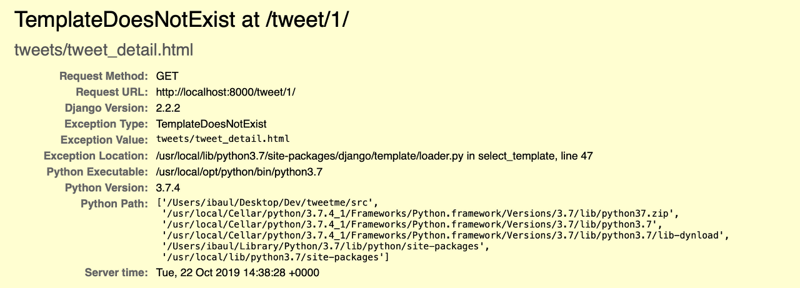
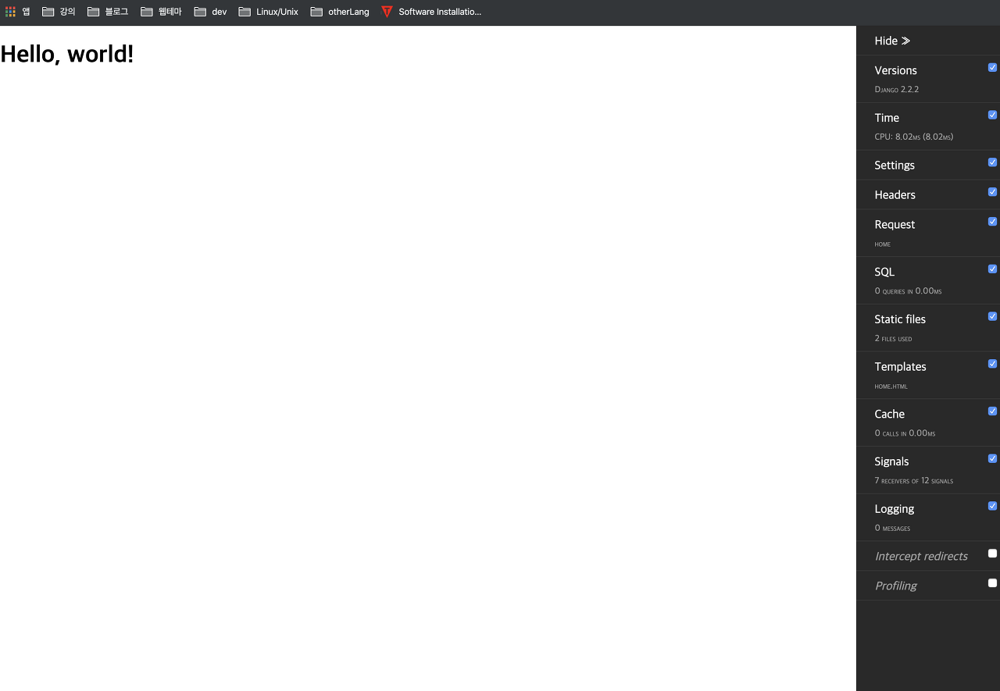

django는 아래 에러페이지로 어떤 에러가 났는지 얘기를 해주지만, 좀더 직관적이고, 페이지 내부에서 디버깅해주는 디버깅 툴이 있다.



## 1. 설치
먼저 pip install을 진행한다.
```bash
pip install django-debug-toolbar
```

## 2. 프로젝트에 적용
### `프로젝트폴더.setting.py`
```python
INSTALLED_APPS = [
    'django.contrib.admin',
    'django.contrib.auth',
    'django.contrib.contenttypes',
    'django.contrib.sessions',
    'django.contrib.messages',
    'django.contrib.staticfiles',
    'debug_toolbar' # 여기
]

MIDDLEWARE = [
    'django.middleware.security.SecurityMiddleware',
    'django.contrib.sessions.middleware.SessionMiddleware',
    'django.middleware.common.CommonMiddleware',
    'django.middleware.csrf.CsrfViewMiddleware',
    'django.contrib.auth.middleware.AuthenticationMiddleware',
    'django.contrib.messages.middleware.MessageMiddleware',
    'django.middleware.clickjacking.XFrameOptionsMiddleware',
    'debug_toolbar.middleware.DebugToolbarMiddleware' #여기
]


INTERNAL_IPS = ('127.0.0.1')
```
### 프로젝트폴더.url.py
- debug 세팅 추가
```python
if settings.DEBUG:
    import debug_toolbar
    urlpatterns += [
            url(r'^__debug__/', include(debug_toolbar.urls)),
        ]
```

## 작동모습
