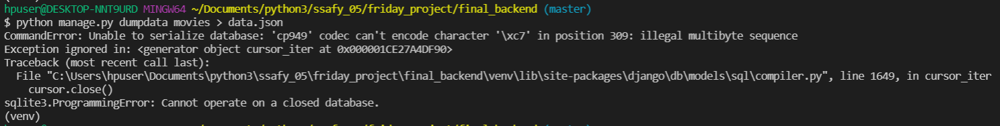
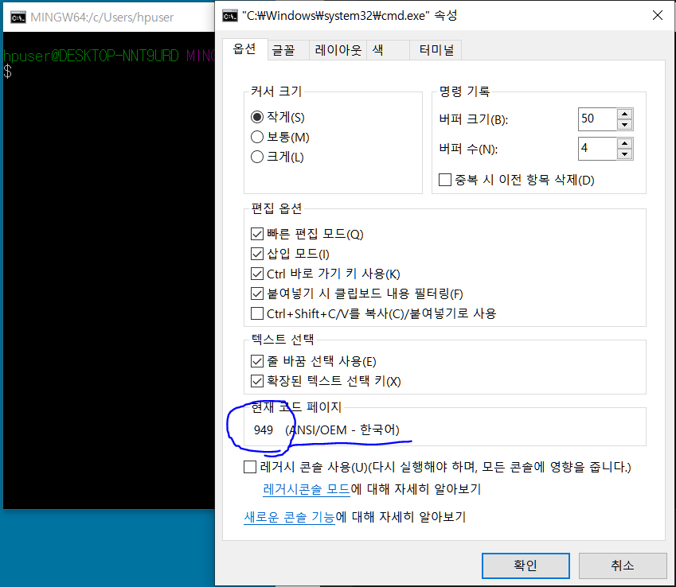

# Dumpdata

## 문제 정의

- 상황
  - tmdb의 자료를 선별해서 local sqlite3까지 넣어놓은 상태
  - 하지만, 팀원에게 db 내용을 공유하기 위해서는 sqlite3를 압축해서 직접 보내거나, json이나 다른 형식으로 dumpdata 할 필요가 있었음
- 첫 시도
  - python manage.py dumpdata 앱이름/모델이름 > 파일이름.json
  - 하면 인코딩 에러 발생





## 문제의 분석

- python 자체의 encoding은 UTF8 을 기본값으로 가짐
  - 그런데 현재 에러를 분석해보면 cp949 인코딩이어서 에러가 났다고 되어있음
  - 파이썬 자체는 UTF8로 수행을 하나, 한글 윈도우 cmd는 Default 값으로 CP949 방식을 사용하기 때문에 인코딩 에러가 나는 것
    - 기본적으로 명령줄에서 실행되는 파이썬 REPL(read-eval-print loop)의 인코딩은 터미널의 로케일을 따르기 때문에 CP949로 됨
- 확인하는 법
  - bash 켜서 속성 열고 옵션 - 현재 코드 페이지 확인




## 해결방법

### VScode 내 terminal Encoding 변경(안됨...)

- vscode 켜기 > `ctrl + ,` > `settings.json` 
  - `"terminal.integrated.shell.windows": "C:\\Program Files\\Git\\bin\\bash.exe",` 
    - bash를 vscode에 넣는 설정을 찾을 수 잇음
  - bash 추가한 것 밑에 language 설정을 바꿔버리기

```json
"terminal.integrated.env.windows": {
    "LANG": "C.UTF-8"
},
```


### 로케일 인식 모드 재정의(Xutf8 사용 - 성공)

- https://docs.python.org/3/using/cmdline.html#id5

  - 운영 체제 인터페이스에 UTF-8 모드를 활성화하여 기본 로케일 인식 모드를 재정의

    - 인터프리터의 UTF8 모드 활성화
    - 로케일 설정과 상관없이 시스템 인터페이스의 텍스트 인코딩을 UTF8 로 사용

  - `python -Xutf8 manage.py dumpdata 앱이름 > 파일이름.json`