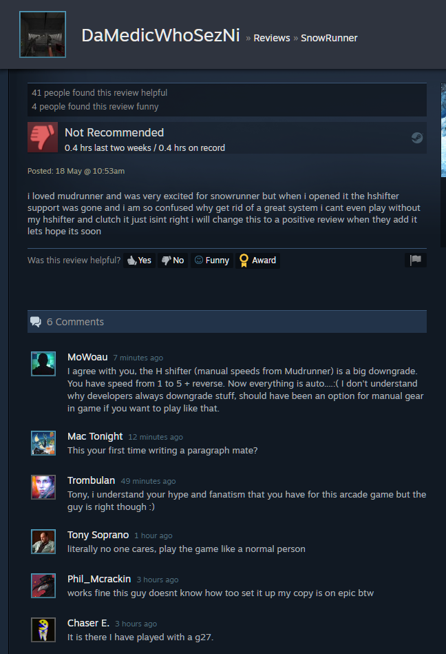
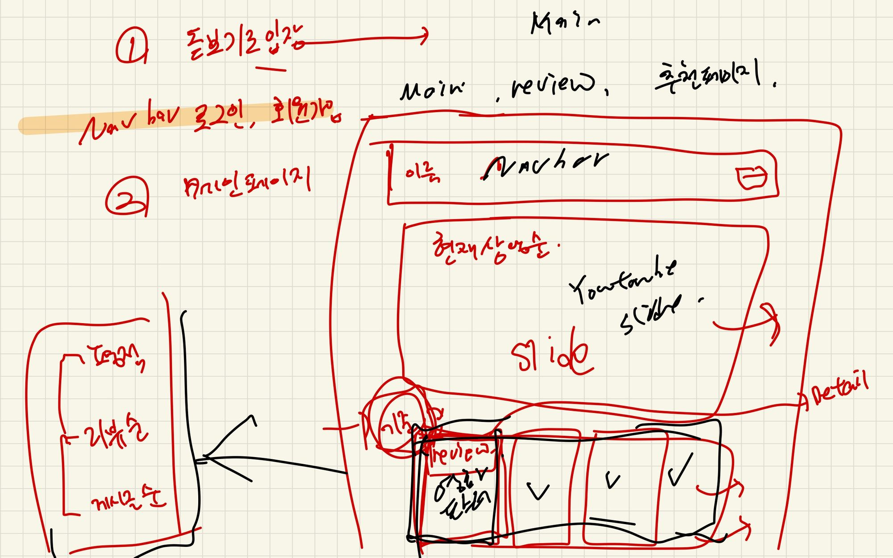
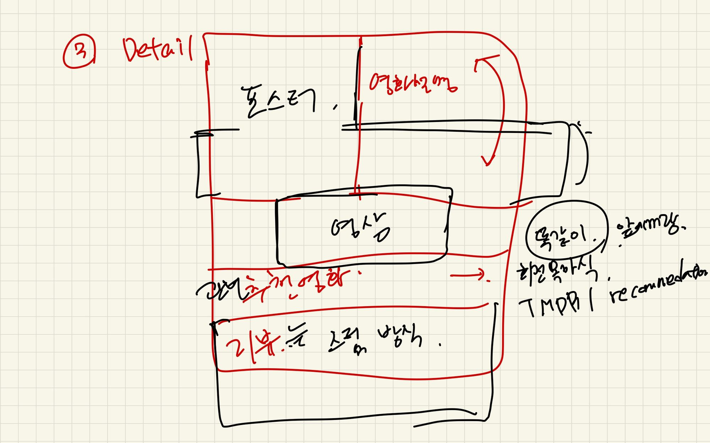
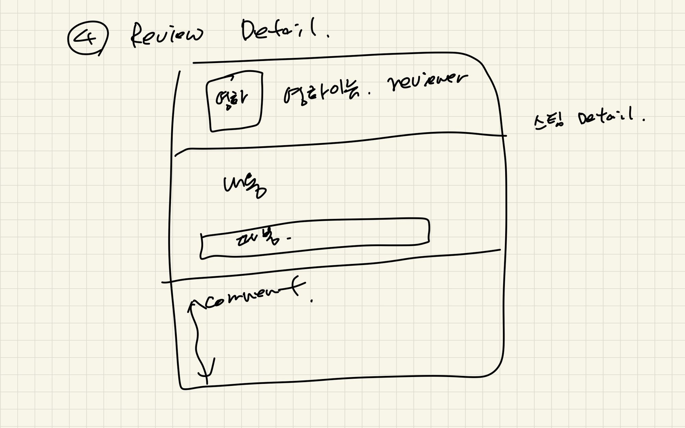
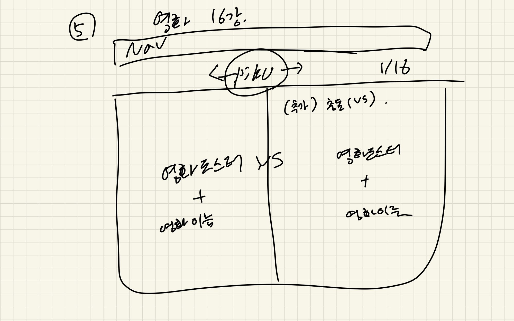
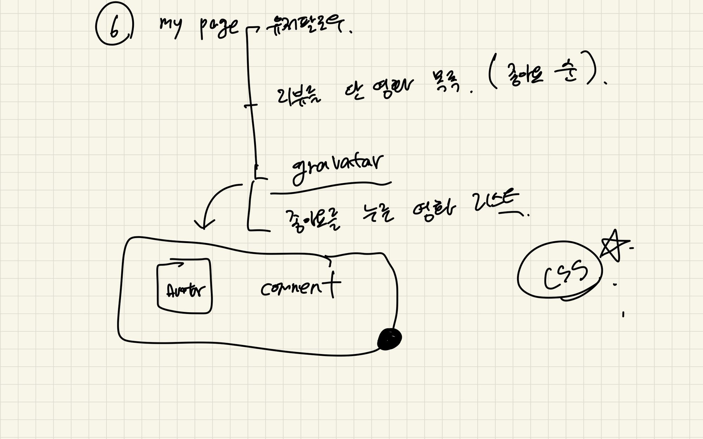
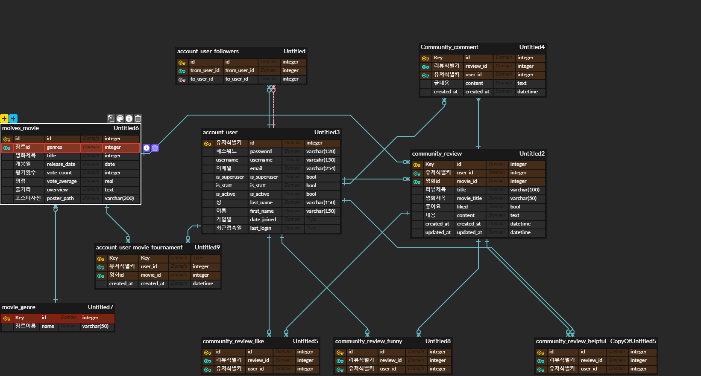

# 어떻게 설계하였는가?

## 구조 설계상의 고민

- 백엔드 
  - Django Rest framework
  - CORS
  - JWT Authentication
- 프론트
  - vue
  - router (SPA)
  - vuex
- 스타일 보조
  - bootstrap5
  - animeJS
  - swiperJS

## 기능적인 고민

- 기본적으로 구현해야할 기능
  - 영화 정보 출력
  - 영화 추천 기능
  - 영화 커뮤니티 기능
  - 관리자 페이지
- 우리만의 유니크한 기능?
  - 영화 16강 대전

# 어떤 것들을 참조할 것인가?

- 영화 정보
  - TMDB ( https://www.themoviedb.org/?language=ko )

- 메인페이지 디자인
  - Netflix
  - Watcha
- 영화 상세 디자인
  - TMDB
- 영화 16강 대전
  - 이상형월드컵( https://www.piku.co.kr/ )

- 커뮤니티

  - 익스트림 무비 ( https://extmovie.com/ )

- 커뮤니티 상세

  - 스팀 커뮤니티
    - 게시글 자체가 추천인지 비추천인지 구분되는 성격
    - helpful? 에 Yes, No, Funny, Award 의 4가지 버튼
    

# 개략적인 디자인

# ERD 제작
