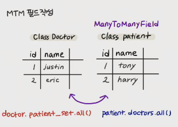

# Many to Many Relationship

- 병원 진료 시스템 구상

  - 내원하는 환자/ 의시간의 예약 시스템을 구축
  - 모델링을 하는 것은 우리 일상에 가까운 예시를 통해 DB를 설계하고, 내부에서 일어나느 데이터의 흐름을 어떻게 제어할 수 있을지 고민해보는 것
  - 가장 핵심 모델 -> 의사/ 환자 => M:N 관계
    - 다른 의사에게 방문한 기록은 어떻게?
    - 방문예약을 1에서 2의사로 변경하려면?
    - 1:N 모델로 표현하는데 한계가 있음
  - **중계모델 생성** : doctor_id, patient_id 만 따로 빼서 Reservation 테이블을 만들자

- `ManyToManyField`

  - https://docs.djangoproject.com/en/3.1/topics/db/examples/many_to_many/

  - foreign key 와 똑같이 작동합니다.

  - model에는 중계테이블이 보이지 않지만, 자동으로 만들어짐

  - `앱이름_시작테이블_필드이름` : hospitals_patient_doctor  이런식으로 만들어짐

    ```python
    class Patient(models.Model) :
        name = models.TextField()
        # doctor = models.ForeignKey(Doctor, on_delete=models.CASCADE)
        doctor = models.ManyToManyField(Doctor) # 이거 한줄이 밑과 같음
    
        def __str__(self) :
            return f'{self.pk}번 환자 {self.name}'
    
    # 이 model 만드는 것과 같은 역할을 함
    class Reservation(models.Model) :
        doctor = models.ForeignKey(Doctor, on_delete=models.CASCADE)
        patient = models.ForeignKey(Patient, on_delete=models.CASCADE)
    
        def __str__(self) :
            return f'{self.doctor_id}번 의사의 {self.patient_id}번 환자'
    ```

- 예약 만드는 방법

  - `patient1.doctors.add(doctor1)`
    - 예약 추가
  - 중계모델을 사용할 경우 예약의 주체가 환자가 될 수 없지만, ManyToManyField를 사용할시에 환자가 예약의 주체가 될 수 있음

- 참조할 때

  - 규칙성을 맞추기 위해

    `doctors= models.ManyToManyField(Doctor, related_name='patients')`

    로 하면 doctor.patient_set.all()로 접근하던 것을 doctor.patients.all()로 접근하게됨



## ManyToManyField()

- M:N 관계를 나타내기 위해 사용하는 필드
- 하나의 필수 위치인자(M:N 관계로 설정할 모델 클래스)가 필요
- 필드의 RelatedManager를 사용하여 관련 개체를 추가, 제거 또는 만들 수 있음.


## Related manager

- 1:N 또는 M:N 관련 컨텍스트에서 사용되는 매니저
- methods
  - 같은 이름의 메서드여도 각 관계(1:N, M:N)에 따라 다르게 동작
  - 1:N 에서는 target 모델 객체만 사용가능
  - M:N에서는 관련된 두 객체에서 모두 사용 가능
  - `add()`, create(), `remove()`, `clear()`, `set()`
    - add() 
      - 지정된 객체를 관련된 객체의 집합에 추가
      - 이미 존재하는 관계에 다시 사용하면 관계가 복제되지 않음
    - remove()
      - 관련 객체 집합에서 지정된 모델 객체를 제거(중계테이블  내의 선택된 객체가 사라짐)

## ManyToManyField's Arguments

- 모두 optional하며 관계가 작동하는 방식을 제어
- related_name
- symmetrical
- through
- limit_chocies_to, through_fields, db_table, ..


### related_name

- target model이 source model을 참조할때 사용할 manager name
- ForeignKey의 related_name과 동일

- source  model(instance)  이란
  - 관계 필드를 가진 모델
- target model(instance) 이란
  - source model이 관계필드를 통해 참조하는 모델


### Symmetrical

```python
from django.db import models

class Person(models.Model) :
    friends = models.ManyToManyField('self') # 자기 자신을 참조
```

- 위처럼 동일한 모델을 가리키는 정의의 경우 Person 클래스에 `person_set 매니저`를 추가하지 않음
- 대신 대칭적(symmetrical)이라고 간주하며, source 인스턴스가 target 인스턴스를 참조하면 target 인스턴스도 source 인스턴스를 참조하게 됨
- self 와의 M:N 관계에서 대칭을 원하지 않는 경우 symmetrical를 False로 설정(디폴트 값이 True)


### through

- django 는 다대다 관계를 관리하는 중개 테이블을 자동으로 생성함

- 하지만, 중개 테이블을 직접 지정하려면 through 옵션을 사용하여 중개 테이블을 나타내는 Django 모델을 지정할 수 있음

- 일반적으로 추가 데이터를 다대다 관계와 연결하려는 경우 (extra data with a many-to-many relationship)에 사용

  ```python
  class Person(models.Model):
      name = models.CharField(max_length=50)
  
  class Group(models.Model):
      name = models.CharField(max_length=128)
      members = models.ManyToManyField(
          Person,
          through='Membership', # 밑에 모델을 직접 지정 ( 중개테이블 지정 )
          through_fields=('group', 'person'),
      )
  
  class Membership(models.Model):
      group = models.ForeignKey(Group, on_delete=models.CASCADE)
      person = models.ForeignKey(Person, on_delete=models.CASCADE)
      inviter = models.ForeignKey(
          Person,
          on_delete=models.CASCADE,
          related_name="membership_invites",
      )
      invite_reason = models.CharField(max_length=64)
  ```

  


## 중개 테이블 필드 생성 규칙

1. source model 및 target model이 다른 경우
   - id
   - `<source_model>_id`
   - `<target_model>_id`
2. ManyToManyField가 동일한 모델을 가리키는 경우
   - id
   - `from_<model>_id`
   - `to_<model>_id`


## 실습하기 - 좋아요 기능 만들기

1. `articles/models.py` 에서 좋아요를 구현하기 위해 Article model 변경

   - `like_users = models.ManyToManyField(settings.AUTH_USER_MODEL)` 를 쓸 경우

   - user와 1:N 관계
     - `article.user.`
       - 게시글을 작성한 유저
     - `user.article_set.`  <<
       - 유저가 작성한 모든 게시글 - 역참조
   - M:N 관계
     - `article.like_users.`
       - 좋아요 누른 유저
     - `user.article_set.`  <<
       - 좋아요 누른 모든 게시글
   - 하고자 하는 역할이 다른데 지금 이름이 겹치게 되어버렸다.
   - `like_users = models.ManyToManyField(settings.AUTH_USER_MODEL, related_name='like_articles')` 를 써서 중복제거

   ```python
   class Article(models.Model):
       user = models.ForeignKey(settings.AUTH_USER_MODEL, on_delete=models.CASCADE)
       # like_users = models.ManyToManyField(settings.AUTH_USER_MODEL)
       like_users = models.ManyToManyField(settings.AUTH_USER_MODEL, related_name='like_articles')
       title = models.CharField(max_length=10)
       content = models.TextField()
       created_at = models.DateTimeField(auto_now_add=True)
       updated_at = models.DateTimeField(auto_now=True)
   
       def __str__(self):
           return self.title
   
   ```

   

2. `articles/urls.py` 추가

   -  `path('<int:article_pk>/likes/', views.likes, name='likes'),`

3. `articles/views.py` 추가

   - `if article.like_users.filter(pk = request.user.pk).exist() :`
   - `article.liek_users.remove(request.user)`
   - `article.like_users.add(request.user)`

   ```python
   @require_POST
   def likes(request, article_pk) :
       if request.user.is_authenticate : # 로그인 안한 회원은 로그인페이지로 이동하게
           article = get_object_or_404(Article, pk=article_pk)
           if article.like_users.filter(pk = request.user.pk).exist() : # 동작은 똑같지만, 하나가 있는지 없는지 찾을 떄는 이렇게 써야 부담이 덜 가고 빠름
           # if request.user in article.like_users.all() : # article에 좋아요를 누른 모든 유저 안에 user 가 있을시
               # 좋아요 취소
               article.liek_users.remove(request.user)
           else : # user가 이 글에 좋아요를 누르지 않은 유저라면 
               # 좋아요 추가
               article.like_users.add(request.user)
       
           return redirect('articles:index')
       return redirect('accounts:login')
   ```

4. `index.html` 수정

   - 로그인한 회원이 좋아요를 누른 상태면 취소 버튼 / 안누른 상태면 좋아요 버튼
   -  article,like_users.all 을 검색해서 length로 몇명이 이걸 좋아하는지

   ```html
       <div>
         <form action="" method="POST">
           
           
             <button>좋아요 취소</button>
           
             <button>좋아요</button>
           
           
         </form>
       </div>
       <p> {{ article.like_users.all|length }}명이 이 글을 좋아합니다.</p>
   ```
   
5. https://fontawesome.com/
- 가입 후 로그인, cdn 복사
- `base.html`에 넣기
- 검색어로 원하는 모양 검색 ( ex : heart )
- element 클릭하여 복사 후 쓰고 싶은 html 위치에 넣어서 사용


## 실습하기 - 프로필 만들기

1. `accounts/urls.py`

   - `path('<username>/', views.profile, name='profile'),`

2. `accounts/views.py`

   ```python
   def profile(request, username) :
       # 변수명을 user로 사용하게 된다면 django에서 기본으로 넘겨주는 request, user 두 개의 인자중 user와 겹치기 때문에 사용하지 않는 것을 추천
       person = get_object_or_404(get_user_model(), username=username)
       context = {
           'person' : person,
       }
       return render(request, 'accounts/profile.html', context)
   ```

3. `profile.html`

   ```html
   
   
   
   <h1>{{ person.username }} 님의 프로필</h1>
   <hr>
   
   <h1>{{ person.username }} 님의 게시글</h1>
   
     <div>{{ article.title }}</div>
   
   <hr>
   
   <h1>{{ person.username }} 님의 댓글</h1>
   
     <div>{{ comment.content }}</div>
   
   <hr>
   
   <h1>{{ person.username }} 님의 좋아요</h1>
   
     <div>{{ article.title }}</div>
   
   
   
   
   ```

4. `base.html`

   ```html
       
         <a href="">프로필로 가기</a>
   	  ...
   	
   ```

5. `accounts/index.html`

   

## 실습하기 -FOLLOW 기능 구현하기

1. `accounts/models.py` 

   ```python
   class User(AbstractUser):
       # symmetrical 이 true로 되어 있다면, 한명이 follow 하면 바로 맞팔이 되어버림
       following = models.ManyToManyField('self', symmetrical=False, related_name ='followers')
   ```

2. `accounts/urls.py` 

   - `  path('<int:user_pk>/follow/', views.follow, name="follow"),`

3. `accounts/views.py`

   ```python
   def follow(request, user_pk) :
       if request.user.is_authenticated : #로그인사람만 접근
           # follow 하려는 대상
           you = get_object_or_404(get_user_model(), pk=user_pk)
           me = request.user
   
           if you != me : # 자기 자신을 follow 하는 걸 막기
               if you.followers.filter(pk = me.pk).exist() : # 이미 팔로우가 되어있다면(너의 follower들 안에 내가 있다면)
                   # 팔로우 끊음
                   you.followers.remove(me)
               else : 
                   # 팔로우 신청
                   you.followers.add(me)
           return redirect('accounts:profile', you.username)
       return redirect('accounts:login')
   ```

4. `profile.html`

   ```html
   <div>
     <div>
       팔로잉 : {{ person.followings.all|length }} / 팔로워 : {{ person.followers.all|length }}
     </div>
      <!-- 자기 자신이 아닌 프로필에 들어왔을 때만-->
       <div>
         <form action="" method="POST">
           
           
             <button>언팔로우</button>
           
             <button>팔로우</button>
           
         </form>
       </div>
     
   </div>
   ```

   - 더 나아가기 
     - 자주 쓰는 변수를 DTL 내에서 선언 
       - with  변수는 띄어쓰기로 구분해서 선언, with 블럭 안에서만 사용가능

   ```html
   
     <div>
       <div>
         팔로잉 : {{ followings|length }} / 팔로워 : {{ followers|length }}
       </div>
        <!-- 자기 자신이 아닌 프로필에 들어왔을 때만-->
         <div>
           <form action="" method="POST">
             
             
               <button>언팔로우</button>
             
               <button>팔로우</button>
             
           </form>
         </div>
       
     </div>
   
   ```

   

# 더 나아가기

## QuerySet은 lazy하다

- 실제 쿼리셋을 만드는 작업에는 DB 작업이 포함되지 않음

- https://docs.djangoproject.com/en/3.1/topics/db/queries/

  - ```python
    q = Entry.objects.filter(title__startswith="What")
    q = q.filter(created_at__lte=datetime.date.today())
    q = q.exclude(context__icontains="food")
    print(q) # 평가
    ```

  - 이 3개가 일어나는 동안 DB에서는 아무 일도 안함

  - 평가가 될 때 일함 

    1. 쿼리를 DB로 날린다
    2. 쿼리셋 캐시

  - https://docs.djangoproject.com/en/3.1/ref/models/querysets/

    - 평가가 되는 시점

    - 반복될 때 (iteration)

      - 쿼리셋은 반복 가능하며 처음 반복할 때 데이터베이스 쿼리를 실행(평가)
      - 평가 이후 쿼리셋의 내장 캐시에 저장

      ```python
      for e in Entry.objects.all() :
          pass
      ```

      

    - 슬라이싱(slicing)

    - 캐싱()

    - repr : 객체 표현(print)

    - len : 길에 잴 떄

    - list() : 리스트화 시킬 때

    - bool() : boolean 평가

      ```python
      if Entry.objects.filter(title__'test') :
          pass
      ```

      

- 캐싱과 평가

  - 나쁜 예 -1

    ```python
    print([e.headline for e in Entry.objects.all()]) # 평가
    print([e.headline for e in Entry.objects.all()]) # 평가
    ```

  - 좋은 예

    - 캐시에서 재사용하기

    ```python
    queryset = Entry.objects.all() # 평가
    print([e.headline for e in queryset])
    print([e.headline for e in queryset])
    ```

  - 나쁜 예 -2

    ```python
    queryset = Entry.objects.all()
    print(queryset[5]) # 평가
    print(queryset[5]) # 평가
    ```

  - 좋은 예

    ```python
    queryset = Entry.objects.all()
    [entry for entry in queryset] # 전체 쿼리셋을 평가시켜버림
    print(queryset[5]) # 평가
    print(queryset[5]) # 평가
    ```

  - 나쁜 예 -3

    ```python
    like_set = article.like_users.filter(pk=request.user.pk)
    if like_set : # 평가
        #쿼리셋의 전체 결과가 필요하지 않은 상황임에도 ORM은 전체 결과를 가져옴
        article.like_users.remove(request.user)
    ```

  - 좋은 예

    ```python
    like_set = article.like_users.filter(pk=request.user.pk)
    if like_set.exist() : # 평가
        # exists() 쿼리셋 캐시를 만들지 않으면서 특정 레코드가 있는지 검사
        # DB에서 가져온 데이터가 없다면 메모리를 절약할 수 있다.
        article.like_users.remove(request.user)
    ```

  - 나쁜 예-4

    ```python
    like_set = article.like_users.filter(pk=request.user.pk)
    if like_set : # 평가
        for user in like_set : # 순회할 떄는 위에서 캐싱된 쿼리셋을 사용 -django가 알아서 효율적으로
            print(user.username)
    ```

  - 좋은 예

    ```python
    # 만약 쿼리셋 자체가 너무너무 크다면?
    # iteraotr는 전체 레코드의 일부씩만 DB에서 가져오므로 메모리 절약
    # 데이터를 작은 덩어리로 쪼개서 가져오고, 이미 사용한 레코드는 메모리에서 지움
    like_set = article.like_users.filter(pk=request.user.pk)
    if like_set.exist() : # 쿼리셋이 크다면 exist로 최적화 - exist는 캐싱을 하지 않기 때문에 밑에 사용하지 않을때만 하는 것이 좋음
        for user in like_set.iterator() : # iterator 사용으로 메모리 절약
            print(user.username)
    ```

# Pagination 만들기

- https://docs.djangoproject.com/en/3.1/topics/pagination/
  - Paginator 다루는 법 소개
- https://docs.djangoproject.com/en/3.1/ref/paginator/
  - `Paginator` ( *object_list* , *per_page* , *orphans = 0* , *allow_empty_first_page = True* ) 
    - orphans  :  항목이 거의없는 마지막 페이지를 원하지 않을 때 사용
    - allow_empty_first_page : 첫 페이지를 비워 둘 수 있는지 여부입니다. `False`및 `object_list`이 비어 있으면 `EmptyPage`오류가 발생
    - `Paginator.get_page( 페이지번호)` :  페이지에 해당하는 page객체 반환
    - `Paginator.count` : 총 페이지 수
  - Page클래스
    - `Page.has_next()` : 다음페이지가 있으면 True 반환
    - `Page.next_page_number()` : 다음페이지 번호 반환 / 없으면 InvalidPage 에러
    - `Page.has_previous()` : 이전페이지가 있으면 True 반환
    - `Page.previous_page_number()` : 이전페이지 번호 반환 / 없으면 InvalidPage 에러
    - `Page.has_other_pages()` : 다음 또는 이전 페이지가 있으면 True 반환
    - `Page.start_index()` : 페이지 내에 글 시작번호를 거져옴
    - `Page.end_index()` : 페이지 내에 글 끝번호를 가져옴
    - `Page.object_list` : 이 페이지의 개체 목록
    - `Page.number` : 현재 페이지 번호
    - `Page.paginator` : 연결된 Paginator 객체
- https://getbootstrap.com/docs/5.0/components/pagination/


## 글.views.py

```python
from django.core.paginator import Paginator

@require_safe
def index(request):
    page = int(request.GET.get('page', default='1')) # page 매개변수가 없을 경우 1 이 되게, GET방식으로 page 변수를 받음
    all_reviews = Review.objects.order_by('-pk') # 전체 글 목록을 정렬해서 데이터 베이스에서 가져옴
    paginator = Paginator(all_reviews, 5, allow_empty_first_page = True) # Paginator(자료목록, 몇개씩출력할지)
    reviews = paginator.get_page(page) # 현재 페이지에 대한 자료를 가져옴

    all_page_list = paginator.page_range # 전체 페이지 리스트 가져오기
    alpha= beta = 0 # 항상 목록에 5개만 나오게 하기 위한 임시변수

    if page -2 <= 0 : 
        alpha = 3 - page
    elif page +2 > len(all_page_list) :
        beta = 2 + page - len(all_page_list) 
    page_list = all_page_list[max((page-1)-2-beta, 0)  : min((page-1)+3+alpha, len(all_page_list))] # paginator에서 쓸 페이지 리스트

    
    context = {
        'reviews': reviews,
        'page_list' : page_list,
    }
    return render(request, 'community/index.html', context)
```


## index.html

```HTML



  <h1>Community</h1>
  <hr>
  <br>
  
    <a href="">{{ review.title }}</a>
    <p>영화 : {{ review.movie_title }}</p>
    <p>평점 : {{ review.rank }}</p>
    <p>리뷰 : {{ review.content }}</p>
  


<!-- 여기서 부터 -->
  <nav aria-label="Page navigation example">
    <ul class="pagination">
       <!-- Previous 버튼 관련 -->
        <li class="page-item"><a class="page-link" href="?page={{ reviews.previous_page_number }}">Previous</a></li>
      
        <li class="page-item"><a class="page-link" href="?page=1">Previous</a></li>
      
      
       <!-- 페이지 목록 출력 관련 -->
         <!-- 현재 페이지 파란색으로 표시 -->
          <li class="page-item active"><a class="page-link" href="?page={{ p }}">{{ p }}</a></li>
        
          <li class="page-item"><a class="page-link" href="?page={{ p }}">{{ p }}</a></li>
        
        
      
      

       <!-- Next 버튼 관련-->
        <li class="page-item"><a class="page-link" href="?page={{ reviews.next_page_number }}">Next</a></li>
      
        <li class="page-item"><a class="page-link" href="?page={{ reviews.number }}">Next</a></li>
      
    </ul>
  </nav>

```


