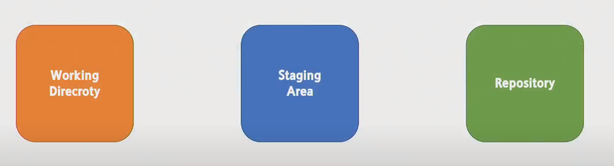
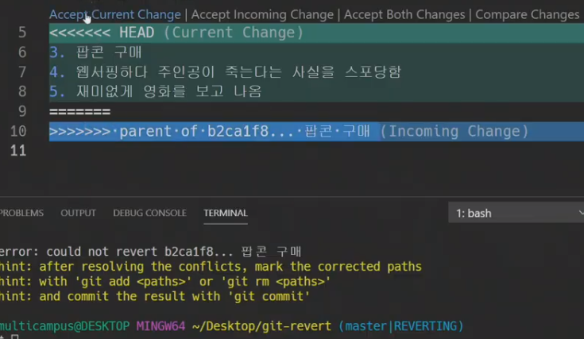
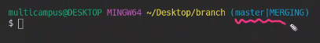
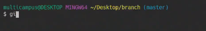
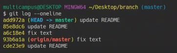
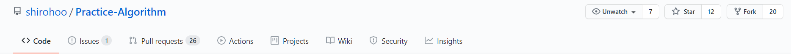
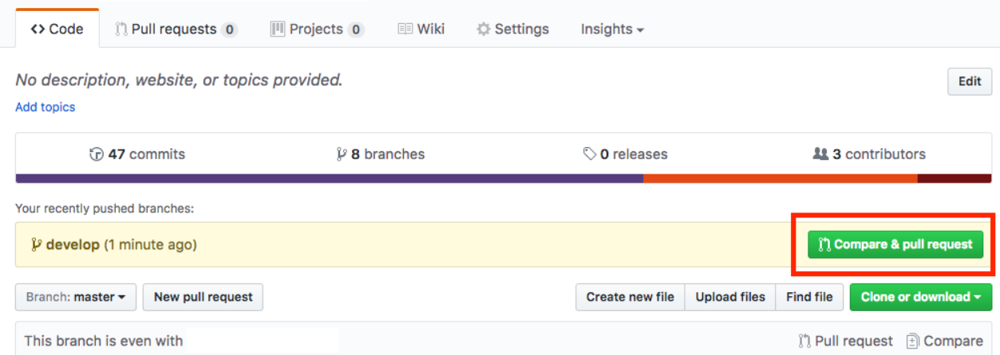
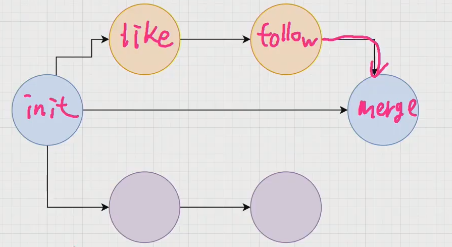

# 1. git

- 역할
  - 버전관리
  - 협업


## 1.1 git 기본



-  git init 
   - git 관리 시작
-  git stauts
   - 현재 working directory 와 staging Area의 차이 를 보여줌
-  git add 특정파일
   - working directory 변경 내역을 staging Area로 올림
-  git rm --cached 특정파일
   - staging Area에 올라간 변경 내역을 취소함
-  git restore --staged 특정파일
   - staging Area  의 내역을 수정함
-  git commit 
   - staging Area를 repository에 올림
-  git log 
   - commit 내역 확인
   - `git log --oneline` 으로 하면 한줄한줄에 commit 내용을 간략하게 볼 수 있음
-  git commit --amend 
   - 가장 최근의 commit 내용 변경할 때 사용
   - vim 이 열림
-  상황1 : 어떤 파일을 add 하고 commit 까지 완료한 상황에서 commit 된 내역에 추가적인 변경사항을 넣고 싶을 때
   - `git add` 해주기
   - `git commit --amend`
     - 이러면 commit 내용에 방금 전 add 한 내용까지 합쳐지게됨
   - `:wq` 로 변경 내용 저장하고 나가기
     - 만약 amend로 잘못된 내용이 commit 에 추가되었을 경우 
       - `git reset --soft HEAD@{1}` 을 하면 HEAD 커밋과 동일한 세부 정보를 사용하지만 부모가 이전 버전의 HEAD 새 커밋을 만드는 것입니다. git reset --soft 는 분기 포인터를 이동하여 현재 분기 헤드가 현재있는 위치와 다른 커밋 위에 다음 커밋이 발생하도록합니다.


-  상황2 : 특정 commit 으로 상태 돌아가기 > 거의 쓰면 안됨(git서버와 충돌이 발생할 수 있기 때문)

   - reset hard
     - `git reset --hard 특정commit값` 
     - 완전히 특정commit 상태로 돌아감(commit상태와 코드 둘다)
     - 현재 시점~ 특정commit 시점 사이의 기록을 날려버림
     - add 한 기록까지 다 날려버리는 것
   - reset soft
     - `git reset --soft 특정commit값`
     - commit 상태만 특정commit상태로 돌아가고, 코드는 그대로
     - staging Area에  현재 시점~ 특정commit 시점 사이의 기록을 가지고 있음
     - add 한 기록을 가지고 있는 것
   - reset mixed
     - `git reset --mixed  특정commit값`
       - `--mixed` 생략가능 reset의 default값임
     - Working Directory에  현재 시점~ 특정commit 시점 사이의 기록을 가지고 있음(코드는 살아있다)/  현재와 reset 위치 사이의 commit 기록은 stage에서 사라짐
-  revert
   - `git revert 특정commit값`
   - 마치 merge의 충돌처럼 reset때와 현재상태의 변경사항이 표시되게됨. 상태도 master|REVERTING
   - 어떻게 바꿀지 merge하듯이 코드를 수정하고 다시 commit 을 시키면 됨
     - log 자체도 과거의 변경사항이 다 살아있고충돌을 merge한 것 처럼 log가 남음
     - 이러한 특징때문에 과거로 돌아가는 것 자체는 그렇게 하면 좋지 않지만, 만약 한다고 하면 reset보다는 revert가 권장됨





## 1.2 협업시 발생하는 충돌상황

- 원격 저장소와 로컬 저장소의 충돌 상황


### 1.2.1 상황만들기1 

- 상황
  - gitHub로 현재 상태를 올린다.
  - 서로 다른 위치에서 동시에 문서 변형
    - GitHub 페이지에서 `test.txt`문서 맨 뒤에 . 을 찍고 stage and commit - commit 메시지 동일하게
    - 로컬에서 `test.txt`문서 맨 뒤에 .을 찍고 저장 후 add, commit  - commit 메시지 동일하게
  - 그러면 변경사항도 같고, commit 메세지도 똑같은 상황
  - 하지만, local과 repo의 방금 commit한 commit의 고유 id 값이 서로 다르게 됨 
    - Commit의 History가 다르다는 의미
- 로컬에서 추가적인 내용 변경 후 commit 하고 git push 시도
  - reject 당함
    - 원격저장소의 변경사항을 반영하라고 힌트가 나옴(git pull)
- 로컬에서 `git pull origin master` 하기
  - gitHub와 local이 동일하게 내용을 변경한 부분은 Git이 알아서 병합을 해줌.
  - 내가 추가적으로 수정한 부분 때문에 땡겨옴과 동시에 충돌이 발생
    - 내가 로컬에서 저장했을 때의 commit 과 GitHub 페이지에서의 commit의 히스토리를 정렬하는데 있어서 어떻게 정렬해야할지 몰라서 발생하는 것
    - git이 스스로 판단을 할 수 없어 개발자에게 판단을 미루는 것
  - 어떤 변경사항이 올바른 것인지 알기 위해 코드 충돌 부분이 `<<<현재변경사항`, `======`,```>>>들어온변경사항` 식으로 나타나게 됨 
  - 4가지의 충돌 해결 방법
    - Accept Current Change : 현재 변경사항으로 정해짐
    - Accept Incoming Change : 들어온 변경사항으로 정해짐
    - 직접 코드를 확인해서 수정
- 현재 상태를 보게 되면 master|MERGING 임을 확인할 수 있음
  - MERGING  : 지금 충돌이 난 상황을 우선적으로 해결하고 commit push 를 해달라는 의미로 해석하면 됨



- Merge한 내용을 git add, commit 하기

  - MERGING 부분이 사라진 것을 볼 수 있음

  

- 로그 확인해보기

  - add97a : 충돌상황 merge
  - 85e8dc6 : local에서 문서 변경(추가적 내용)
  - a6c18e4  : local에서 문서 변경(GitHub와 같은내용 같은 이름 commit)
  - 93b6a1a : GitHub에서 문서를 수정한 내역
  - cde23e9  : 로컬 작성이후 첫 git push

  


## 1.3 브랜치 다뤄보기

- 브랜치

  - master : 메인이 되는 줄기(main으로 쓸 수도 있음)
  - 브랜치마다 git log가 다르게 쌓여서 branch 마다 버전관리를 할 수 있음

- `git branch`

  - 현재 branch의 목록이 표시 됨

- `git branch 브랜치명`

  - 새로운 브랜치를 만들 수 있음

- `git switch 브랜치명` / `git checkout 브랜치명`

  - 현재 브랜치의 상태를 해당 브랜치로 변경
  - switch는 최근 버전(2.3)/ checkout은 이전버전
  - `HEAD` 가 해당 브랜치로 바뀌는 것

- `git branch -d 브랜치명`

  - 브랜치를 지움

- Understanding the GitHub flow

  - https://guides.github.com/introduction/flow/

  1. 새로운 브랜치를 만들기
  2. commit들을 추가하기
  3. Pull Request 하기
  4. 코드에 대해 토론 하기
  5. Deploy 하기 - 작동가능하게 만드는 일(테스트 과정)
  6. 병합(Merge) 하기

  

### 1.3.1 브랜치 연습해보기1

-  상황
   -  브랜치를 만들고 브랜치에서 코드를 수정 후 add, commit
   -  브랜치는 최신버전, master는 옛날버전 이게 됨
-  master 최신화 하기
   - `git switch master`
   - `git merge 브랜치명`
     - Fast-forward 방식으로 병합됬다고 나옴
-  병합한 branch 지우기
   -  `git branch -d 브랜치명`


### 1.3.2 브랜치 연습해보기2

- 상황
  - feature/login 에 대한 것
    - `git branch feature/login` 으로 새 브랜치 만들기
    - `git switch feature/login` 으로 브랜치로 가기
    - 코드 작성 후 add, commit
  - master에 대한 것
    - `git switch master` 로 마스터 브랜치로 돌아오기
    - 코드 수정 후 add, commit
      - feature/login 에서 수정하지 않은 곳을 수정
- merge 하기
  - `git merge feature/login`
- 상태 살펴보기
  - `git log -oneline --graph` 
    - log를 분기까지 더 시각적으로 표현해줌


### 1.3.3 브랜치 연습해보기3

- 상황
  - feature/signup 에 대한 것
    - `git branch feature/signup` 으로 새 브랜치 만들기
    - `git switch feature/signup` 으로 브랜치로 가기
    - 코드 작성 후 add, commit
    - 추가 적인 코드 작성 후 add, commit (2번째)
  - master에 대한 것
    - `git switch master` 로 마스터 브랜치로 돌아오기
    - 코드 수정 후 add, commit
      - feature/signup 에서 2번째에 수정한 곳을 수정
- merge 하기
  - `git merge feature/signup`
    - merge 하려고 했으나 충돌이 발생하여 충돌된 부분을 어떻게 바꿀지 수정해야함
  - 충돌부분 수정 이후 add, commit
- branch 지워주기
  - `git branch -d feature/signup`


### 1.3.4 웹에서 브랜치 병합하기

- Merge Request 만들기 메뉴
  - 대상branch 로 Source branch를 병합
  - `git merge 소스브랜치`  와 같은 작동
- 하지만 로컬에서는 병합되지 않은 상태 그대로
  - `git pull origin master` 하기
- 하지만, 병합은 충돌가능성도 있고 하니 로컬에서 하고 웹에 올리는 것이 좋다.


### 1.3.5 두명이서 하는거 연습 - A 와 B

1. A가 프로젝트를 git init 후 세팅해서 add, commit push

2. A가 B로 repository를 초대함

3. B는 초대받은 repo를 들어가서 자신의 local에 clone 함

4. A 행동

   - `git branch 브랜치명A` : 브랜치 만들기
   - 작업 후 add, commit. push

   그와 동시에 B도 행동

   - `git branch 브랜치명B`  : 브랜치 만들기
   - 작업 후 add, commit

5. A가 로컬에서 코드 병합

   - `git switch master` 
   - `git merge 브랜치명A` 
   - `git push origin master` 

6. B가 A가 병합한 코드를 가져오기

   - `git switch master`
   - `git pull origin master`  : A가 병합한거 가져오기
   - `git merge 브랜치B` : B꺼까지 다 병합
   - 코드 충돌 된거 있으면 고치고 add, commit, push

7. A는 6번 반복


## 1.4 남의 레포지토리에 의견내기

### 1.4.1 이슈 남기기

- GitLab에서 이슈 메뉴
- 이슈추가
- 코드를 들어가면 각각 줄에 대한 링크를 가져올 수 있음
  - shift 키를 이용해서 여러 줄에 대한 링크도 가능
- 게시판 형식으로 이슈를 남기는 것(자유게시판)


### 1.4.2 직접 프로젝트 코드를 수정하는 방법

- repo를 수정할 권한이 없는 사람 기준
- Fork 버튼을 눌러서 내 계정으로 복제를 해서 가져옴
- git clone 주소 
- 내 local에서 코드 수정 후 add, commit, push ( 내 계정의 repo 에 저장되는 것 )
- 병합 요청 보내기
  - 원본 repo에 자신의 repo를 병합요청 보낼 수 있음


## 1.5 Pull Request (GitHub)

1. Fork 뜨기

   

2. 로컬에 다운 받기

   - clone
   - git remote로 원본 프로젝트 저장소 추가 ( 필요한지는 모르겟음 ; )

3. branch 생성 이후 작업

4. 작업 이후 add, commit, push

5. pull request 하기

   

6. 코드리뷰, Merge Pull Request

   - PR 받은 원본 저장소 관리자는 코드 변경내역을 확인하고 Merge 여부를 결정

7. Merge 이후 동기화 및 branch 삭제

   - 원본 저장소에 Merge가 완료되면 로컬 코드와 원본 저장소의 코드를 동기화 한다
   - 작업하던 로컬의 branch를 삭제한다.


# 2. vim

- 공부하기
  - https://www.openvim.com/
  - https://vim-adventures.com/

- 입력모드
  - `i` 를 누르면 입력모드로 바뀜
    - 이 때 바꾸고 싶은 내용 지우거나 수정
  - `esc`로 입력모드 나갈 수 있음
  - `:wq` 저장하고 나가겠습니다.
- 출력모드


# 3. GitLab 활용하기


## 3.1 merge 하기

1. clone 해오기

   - `git clone 주소 폴더이름`
   - 하면 폴더이름으로 저장됨

2. A 사람이 git branch 브랜치A 를 만들고 작업하기

   좋아요 기능 코드 작성 후 add, commit

    팔로우 기능 코드 작성 후 add, commit

   git push origin 브랜치A  >( GitLab에서 branch를 확인할 수 있게 됨)

   

   B 사람은 동시에 git branch 브랜치 B를 만들고 작업하기

   회원가입 기능 코드 작성 후 add, commit

   로그인기능 코드 작성 후 add, commit

   git push origin 브랜치B >( GitLab에서 branch를 확인할 수 있게 됨)

   

   - GitLab 사이트에서 병합하기

     - 병합요청 

       - Source branch - branchA
       - Target branch - master
       - submit merge request 누르기

     - merge 가 가능하면 merge버튼 활성화되서 나옴 

       - merge 버튼 누르기 > 병합 완료

       - 소스 브랜치 제거 버튼 - 이미 병합되서 필요가 없어지기 때문에(하나의 프로세스 종료)

       

   - GitLab 사이트에서 병합하기-2

     - 병합요청 
       - Source branch - branchB
       - Target branch - master
       - submit merge request 누르기
     - 머지 충돌이 있습니다. - > 충돌 해결
       - GitLab에서 하는 방법 - 하지만 GitLab에서 코드를 수정하는 것은 추천할만한 행동은 아님(작동 확인할 수 없어서)
       - Local에서 하는 방법
         - B가 git switch master
         - git pull origin master
         - git merge branchB
         - 충돌 병합(Accept Both Change) 후 add, commit
         - git push origin master
       - A는 병합상황을 받기 위해 git switch master
         - git pull origin master

     


