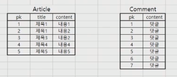
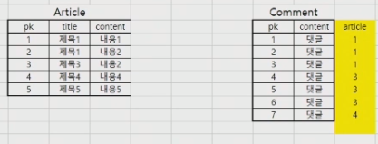
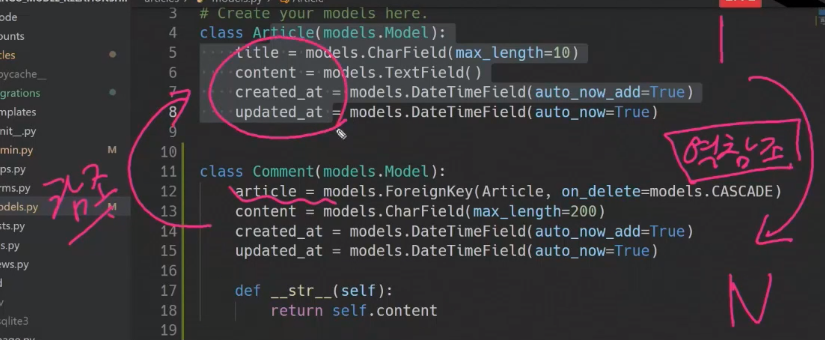
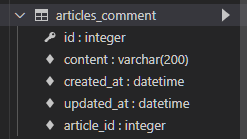
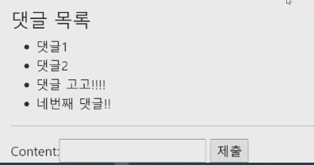
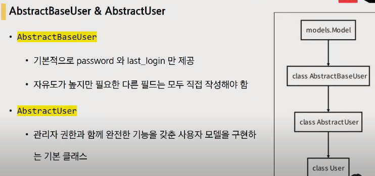
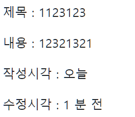

# Model Relationship

- 모델이 하나 이상 생겨서 모델간의 관계를 설정하는 것
- https://docs.djangoproject.com/ko/3.1/ref/models/fields/#module-django.db.models.fields.related
- Relationship fields
  - 모델 간 관계를 나타내는 필드
  - Many to one( 1: N )
    - ForeignKey()
  - Many to Many ( M:N )
    - ManyToManyField()
  - One to One( 1:1 )
    - OneToOneField


# Many to one ( 1: N )

- 관계성 이해하기
  - 게시글 - 댓글 = 1:N 관계
    - 하나의 컬럼에는 하나의 값만 들어가야함
    - 노란 부분이 외래키라고 생각하면 됨






## Foreign Key

**개념**

- 외래 키(외부 키)
- RDBMS에서 한 테이블의 필드 중 다른 테이블의 행을 식별할 수 있는 키
- 참조하는 테이블에서 1개의 키(속성 또는 속성의 집합)에 해당하고 이는 참조되는 측의 테이블의 기본 키를 가리킴
- 참조하는 테이블의 속성의 행 1개의 값은, 참조되는 측 테이블의 행 값에 대응
  - 이 때문에 참조하는 테이블의 행에는, 참조되는 테이블에 나타나지 않는 값을 포함할 수 없음
  - 하나의 테이블이 여러 개의 외래 키를 포함 할 수 있음
    - 이러한 외래키들은 각각 서로 다른 테이블을 참조할 수 있음
- 참조하는 테이블의 행 여러 개가, 참조되는 테이블의 동일한 행을 참조할 수 있음
  - 대댓글 생각

**특징**

- 키를 사용하여 부모 테이블의 유일한 값을 참조 (참조 무결성)

  - 참조 무결성 

    - 데이터 무결성 원칙 3가지 중 한가지 - 데이터의 정확성과 일관성을 유지하는 것

      - 개체 무결성 - 모든 테이블이 기본 키(primary key)를 가져야 하며 기본 키로 선택된 열은 고유하여야 하며 빈 값은 허용치 않음을 규정

      - 참조 무결성 - 기본 테이블에서 일치하는 필드가 **'기본 키'**이거나, **고유 인덱스**를 갖고 있거나, 관련 필드의 **데이터 형식**이 같아야 합니다.

        참조되는 테이블의 행을 이를 참조하는 참조키가 존재하는 한 삭제될 수 없고, 기본키도 변경될 수 없습니다.

      - 개체 무결성 - 테이블에 있는 모든 행들이 유일한 식별자를 가질 것을 요구	

- 외래 키의 값이 부모 테이블의 기본 키 일 필요는 없지만 **유일**해야 함

  - 이러한 특징 때문에 PK를 참조하는 게 좋다.


## ForeignKey field

- `ForeignKey()`

- Django 에서 A many-to-one relationship(1:N)을 표현하기 위한 model field

- 2개의 필수 위치 인자가 필요

  - 참조하는 model class
  - on_delete 옵션

- 작성 예시

  ```python
  class Comment(models.Model) :
      article = models.ForeignKey(Article, on_delete=models.CASCADE)
  ```

  


### 1:N model manager 

```python
# articles/models.py

class Comment(models.Model):
    article = models.ForeignKey(Article, on_delete=models.CASCADE)
    content = models.CharField(max_length=200)
    created_at = models.DateTimeField(auto_now_add=True)
    updated_at = models.DateTimeField(auto_now=True)

    def __str__(self):
        return self.content
```

- Article : Comment = 1 : N → 하나의 게시글에는 여러 개의 댓글이 달릴 수 있다.


### on_delete

- ForeignKey의 필수 인자이며, ForeignKey가 참조하고 있는 부모(Article) 객체가 사라졌을 때 달려 있는 댓글들을 어떻게 처리할 지 정의
- Database Integrity(데이터 무결성)을 위해서 매우 중요한 설정이다.
  - 데이터 무결성 : 데이터의 정확성과 일관성을 유지하고 보증하는 것

- on_delete에 쓸 수 있는 매개변수들(https://docs.djangoproject.com/en/3.1/ref/models/fields/#arguments)
  - `CASCADE` : **부모 객체(참조 된 객체)가 삭제 됐을 때 이를 참조하는 객체도 삭제**
  - `PROTECT` : 참조가 되어 있는 경우 오류 발생
  - `SET_NULL ` : 부모 객체가 삭제 됐을 때 모든 값을 NULL로 치환(NOT NULL 조건 시 불가능)
  - `SET_DEFAULT` : 모든 값이 DEFAULT 값으로 치환
  - `SET()` : 특정 함수 호출
  - `DO_NOTHING`  : 아무것도 하지 않음
    - 다만, 데이터베이스 필드에 대한 SQL ON DELETE 제한 조건을 설정해야한다.
  - `RESTRICT` : 3.1 에 새로나온 기능 
    - RestrictedError를 발생시켜 참조된 객체의 삭제를 방지


## 1 : N 관계 역참조 하기

- **Article(1)** : **Comment(N)** : 역참조
  - 사용 : `article.comment_set.all()`
    - 반환 값 예시 : `<QuerySet [<comment: 댓글1>, <comment:댓글2>]>`
    - 반복 출력이 가능한 반환값 형태(QuerySet)임을 알 수 있음
  - django에서는 역참조시 `모델이름_set`형식의 manager를 생성
  - `article.comment` 형태로는 가져올 수 없다. 
  - 게시글에 몇 개의 댓글이 있는지 Django ORM이 보장할 수 없기 때문
  - 본질적으로는 Article 클래스에 Comment 와의 어떠한 관계도 연결하지 않음
- **Comment(N)** : **Article(1)** : 참조
  - 사용 : `comment.article`
  - 댓글의 경우 어떠한 댓글이든 반드시 자신이 참조하고 있는 게시글이 있으므로 `comment.article`와 같이 접근할 수 있음





### related_name

> https://docs.djangoproject.com/en/3.1/ref/models/fields/#django.db.models.ForeignKey.related_name

- 위에서 확인한 것처럼 부모 테이블에서 역으로 참조할 때(the relation from the related object back to this one.) `모델이름_set` 이라는 형식으로 참조한다. (**역참조**)

- `related_name` 값은 django 가 기본적으로 만들어 주는 `_set` manager를 임의로 변경할 수 있다.

  ```python
  # articles/models.py
  
  class Comment(models.Model):
      article = models.ForeignKey(Article, on_delete=models.CASCADE, related_name='comments')
    ...
  ```

- 위와 같이 변경하면 `article.comment_set` 은 더이상 사용할 수 없고 `article.comments` 로 대체된다.

  - `article.comment_set.all()`  >> `article.comments.all()` 로 변화
  - 두개가 혼용되는 것이 아니라 `comment_set`은 사용할 수 없게 됨

- 1:N 관계에서는 거의 사용하지 않지만 M:N 관계에서는 반드시 사용해야 할 경우가 발생한다.


## 댓글 시스템 구현하기 - 글 상세에 댓글 입력란 만들기

1. `articles/models.py` 에서 댓글 model 만들기

   - `article = models.ForeignKey(Article, on_delete=models.CASCADE)`
     - Article을 참조
     - CASCADE
     - article_id로 컬럼명이 테이블에 만들어지게됨
     - 만약 ForeignKey 를 article 이라고 하지 않고 `abcd = models.ForeignKey(..)` 형태로 생성 했다면 `abcd_id` 로 만들어진다. 
     - 이렇게되면 모델 관계를 파악하는 것이 어렵기 때문에 부모 클래스명의 소문자(단수형)로 작성하는 것이 바람직하다.

   - 내용 - 200 자 제한
   - 생성일
   - 수정일

   ```python
   class Comment(models.Model):
       article = models.ForeignKey(Article, on_delete=models.CASCADE)
       content = models.CharField(max_length=200)
       created_at = models.DateTimeField(auto_now_add=True)
       updated_at = models.DateTimeField(auto_now=True)
       
       def __str__(self): # 확인 더 편하게 보기 위해서 출력 형태 설정
           return self.content
   ```

2. 데이터 베이스에 적용하기

   - python manage.py makemigrations
   - python manage.py migrate



3. `articles/admin.py` 에 Comment 등록하기

   ```python
   from .models import Comment
   
   admin.site.register(Comment)
   ```

4. `articles/forms.py` - comment form 만들기

   - `exclude = ('article', )` 
     - 댓글 입력 할 때 굳이 글 선택이 필요 없기 때문에 form 에서 제외

```python
from .models import Comment


class CommentForm(forms.ModelForm):

    class Meta:
        model = Comment
        exclude = ('article', )
```

5. `articles/views.py > detail` 에서 댓글도 출력할 수 있게 수정
   - `comment_form = CommentForm() `
   - `comments = article.comment_set.all()` 
     - 역참조로 article에 대한 comment들 가져오기


```python
from .forms import CommentForm

def detail(request, pk):
    article = get_object_or_404(Article, pk=pk)
    comment_form = CommentForm()
    comments = article.comment_set.all()
    context = {
        'article': article,
        'comment_form': comment_form,
        'comments' : comments,
    }
    return render(request, 'articles/detail.html', context)
```

6. `articles/urls.py` 에 댓글 작성 주소 만들기
   - `path('<int:pk>/comments/', views.comments_create, name='comments_create'),`
7. `articles/templates/articles/detail.html` 에 댓글 작성 form 추가
   - `<form action="" method="POST">`
   - 댓글 출력 for문으로 해주기
   - 댓글 길이 출력의 여러가지 방법
     - `{{ comments|length }}`
     - `{{ article.comment_set.all|length }}`
     - `{{ comments.count }}`
       - 이 방법은 

```html

  
  
    ...
    <a href="">back</a>
    <hr>

	<h4>댓글 목록 ({{ comments|length }} 개)</h4>
	<ul>
        
            <li>{{ comment }}</li>
        
	</ul>

    <form action="" method="POST">
      
      {{ comment_form }}
      <input type="submit">
    </form>
  
```

8. `articles/views.py` 에 `comments_create` 만들기
   - POST 때만 생각하면 됨 - detail 페이지가 댓글 보여지는 것을 해주기 때문
   - 댓글 저장 부분이 글 작성과 다름 / 그냥 `comment_form.save()` 하면 에러가 남 
     - https://docs.djangoproject.com/en/3.0/topics/forms/modelforms/#the-save-method
     - comment가 참조하는 article에 대한 정보를 넣어주지 않았기 때문에
     - `comment = comment_form.save(commit=False)` 
       - commit=False : 인스턴스는 만들어주는데 데이터베이스에 적용은 안한 상태가 됨/ 기본값은 True
     - `comment.article = article` 에 값을 넣어주고,  `comment.save()` 하면 됨
   - `HttpResponse(status=401)`  : 로그인 안한 상태에서의 접근을 처리하기
     - 401(권한 없음): 이 요청은 인증이 필요하다. 서버는 로그인이 필요한 페이지에 대해 이 요청을 제공할 수 있다. 상태 코드 이름이 권한 없음(Unauthorized)으로 되어 있지만 실제 뜻은 인증 안됨(Unauthenticated)에 더 가깝다
     - HttpResponse 를 이용하여  HTTP 상태코드를 보내준다.
     - https://docs.djangoproject.com/en/3.1/ref/request-response/#httpresponse-subclasses

```python
from django.http import HttpResponse

@require_POST
def comments_create(request, pk):
    if request.user.is_authenticated : # @require_POST 랑 @login_required랑 같이 있으면 로그인 된 순간 GET방식으로 여기에 돌아와서 논리적 모순이 일어나니 이렇게
        article = get_object_or_404(Article, pk=pk)
        comment_form = CommentForm(request.POST)
        if comment_form.is_valid():
            comment = comment_form.save(commit=False)
            comment.article = article
            comment.save()
            return redirect('articles:detail', article.pk)
        context = {
            'comment_form': comment_form,
            'article': article,
        }
        return render(request, 'articles/detail.html', context)
    #return redirect('accounts:login') # 로그인 하지 않은 상황에서 쓰려하면 로그인페이지로 이동
    return HttpResponse(status=401) # 401 에러 : 잘못된 로그인 권한 에러페이지로 보내주기
```




## 댓글 시스템 구현하기 - 댓글 삭제

1. `articles/urls.py`
   - 글키/comments/댓글키/delete/

```python
path('<int:article_pk>/comments/<int:comment_pk>/delete/', views.comments_delete, name='comments_delete'),
```

2. `articles/views.py`
   - 댓글 삭제 이후 detail로 돌아가야하는데 article.pk가 필요함
   - article_pk 를 `comment.article.pk` 로 접근해서 받아도 되지만, RestAPI 설계 구조에 맞게 짜기 위해서는 url에 article_pk 를 명시하는게 훨씬 좋은 짜임이 된다.

```python
@require_POST
def comments_delete(request, article_pk, comment_pk):
    if request.user.is_authenticated : # 로그인 확인
        comment = get_object_or_404(Comment , pk=comment_pk)
        comment.delete()
    	return redirect('articles:detail', article_pk)
    return redirect('accounts:login') # 로그인 하지 않은 상황에서 지우려하면 로그인페이지로 이동
```

3. `articles/detail.html` 
   - 댓글 삭제 버튼추가
   - 댓글이 없는 경우의 처리

```html

  
  
    ...
    <a href="">back</a>
    <hr>

	<h4>댓글 목록</h4>
	<ul>
        
            <li>`
                {{ comment }}
                <form action="" method="POST">
                    
                    <input type="submit" value="DELETE">
                </form>
        	</li>
        
         <!-- 댓글 없는 경우의 처리 -->
        	<p>아직 댓글이 없습니다.</p>
        
	</ul>

    <form action="" method="POST">
      
      {{ comment_form }}
      <input type="submit">
    </form>
  
```


# User model 커스텀하기

- Substituting a custom User model (커스텀 유저 모델로 대체하기)
  - 일부 프로젝트에서는 built-in User model이 제공하는 인증 요구사항이 적절하지 않을 수 있음
  - django는 custom model을 참조하는 `AUTH_USER_MODEL` 설정을 제공하여 기본 user model을 재정의(override) 할 수 있도록 함
  - 새 프로젝트를 시작하는 경우 기본 사용자 모델이 충분하더라도, 커스텀 유저 모델을 설정하는 것을 강력하게 권장
  - 커스텀 유저 모델은 기본 사용자 모델과 동일하게 작동하면서도 필요한 경우 나중에 맞춤설정할수 있기 때문
  - **단, 프로젝트의 모든 migrations 혹은 첫 migrate를 실행하기 전에 이 작업을 마쳐야함**
  - https://docs.djangoproject.com/en/3.1/topics/auth/customizing/#substituting-a-custom-user-model


## AUTH_USER_MODEL

- User를 나타내는데 사용하는 모델
- settings.py 에서 설정
- 기본 값은 `auth.User`
  - `django.contrib.auth` 내부에 들어있음 - settings.py를 보면 INSTALLED_APPS에 있는걸 볼 수 있음
- 주의 사항
  - 프로젝트가 진행되는 동안 변경할 수 없음(완전히 불가능은 아니지만, 변경하기 위해서는 너무 많은 노력이 필요함) - 종속된 모델을 만들고 마이그레이션 된 후
  - 프로젝트 시작 시 설정하기 위한 것이며, 참조하는 모델을 첫번쨰 마이그레이션에서 사용할 수 있어야 함


## Abstract 와 AbstractBase

https://github.com/django/django/blob/main/django/contrib/auth/base_user.py#L47
https://github.com/django/django/blob/main/django/contrib/auth/models.py#L321

- Abstract 가 앞에 붙은 클래스
  - 완전한 기능을 갖춘 사용자 모델을 구현하는 추상 기본 클래스
- AbstractBase
  - 기본적인 기능만 제공
  - 자유도가 높지만, 필요한 것들을 모두 직접 작성해야함





### Abstract base classes

- 몇 가지 공통 정보를 여러 다른 모델에 넣을 때 사용하는 클래스
- 데이터베이스 테이블을 만드는 데 사용되지 않으며, 대신 다른 모델의 기본 클래스로 사용되는 경우 해당 필드가 하위 클래스의 필드에 추가 됨


## 커스텀 User를 사용할 때 재정의할 부분

- form 중에 기본 User를 가지고 만들어지는 form 2개가 있다. 이 두개에 대해서 재정의가 필요하다.
  - https://docs.djangoproject.com/en/3.1/topics/auth/customizing/#custom-users-and-the-built-in-auth-forms
  - UserCreationForm
    - https://github.com/django/django/blob/main/django/contrib/auth/forms.py
    - UserCreationForm 은 Meta에 Auth.User를 받아서 만들어지기 때문에 다시 작성해야함
  - UserChangeForm
- AbstractBaseUser의 모든 subclass와 호환되는 forms 들은 아무것도 안해도됨
  - AuthenticationForm, SetPasswordForm, PasswordChangeForm, AdminPasswordChangeForm


## User 모델을 참조하는 두가지 방법

https://docs.djangoproject.com/en/3.1/topics/auth/customizing/#referencing-the-user-model

- `settings.AUTH_USER_MODEL`
  - 유저 모델에 대한 외래 키 또는 M:N 관계를 정의할 때 사용
  - 즉, **models.py에서 유저 모델을 참조할 때 사용**
  - return 값이 문자열
  - 이렇게 쓰는 이유는 django의 runserver 하면 실행되는 내부 로직때문임/ 밑은 runserver가 되면 실행되는 일들의 순서
    1. INSTALLED_APPS 를 주르륵 가져옴
       - articles.models.py를 읽을 떄 get_user_model()을 쓰게 되면 활성화된 user 객체를 가져와야하는데, 이럴 경우 accounts의 model이 먼저 읽었어야함. 
       - 이런 충돌이 일어날 수 있기 때문에 accounts app이 구동을 안했어도 문제가 발생하지 않도록 문자열을 받아서 만들게 구조화되어 있음.
       - 실제로 INSTALLED_APPS 에 articles 위에 accounts를 적는다면 get_user_model()을 사용하더라도 문제없이 구동되기는 한다.(바람직한 방향은 아니다)
- `get_user_model()`
  - django는 User 모델을 직접 참조하는 대신 get_user_model()을 사용하여 사용자모델을 참조하라고 권장
  - 현재 활성화 된 유저 모델(지정된 커스텀 유저모델, 그렇지 않은 경우 User)을 반환
  - 즉, **models.py가 아닌 다른 곳에서 유저 모델을 참조할 떄 사용**
  - return 값이 User 객체


## 실습하기 - 커스텀 User 대체하기

1. `account/models.py` 에 커스텀 계정 모델 만들기
   - `AbstractUser`를 상속 받아 만듬

```python
from django.contrib.auth.models import AbstractUser

class User(AbstractUser) :
    pass # 아직은 커스텀하지는 않았지만 대체만
# 지금까지와 builtin과의 차이는 나중에 커스텀을 할 수 있냐 없냐의 차이임.
```

2. `프로젝트.settings.py`  

   - 맨 밑에 `AUTH_USER_MODEL='accounts.User'`  추가
   - 현재까지는 기능적으로 완전히 동일

3. `accounts/forms.py`

   - CustomUserChangeForm 과 CustomUserCreationForm 재정의 해주기

   ```python
   from django.contrib.auth.forms import UserChangeForm, UserCreationForm
   from django.contrib.auth import get_user_model
   
   class CustomUserChangeForm(UserChangeForm):
   
       class Meta:
           model = get_user_model()
           fields = ('email', 'first_name', 'last_name',) #너무 많은 작성form이 생겨서 조금 선택해서 나오게 하기
   
   class CustomUserCreationForm(UserCreationForm) :
       class Meta(UserCreationForm.Meta) : # 사실 UserCreationForm.Meta를 상속 받지 않아도 작동에는 지장이 없으나, 이렇게 하는 것이 명시적으로 더 좋음
           model = get_user_model() # user를 직접참조하기보다 이렇게 간접적으로 참조하는 것이 바람직하다.
           fields = UserCreationForm.Meta.fields + ('추가필드들', )
           # UserCreationForm의 Meta정보에서 field만 가져와서 모든 field들을 쓰지 않고 편하게 만들기
   
   ```

4. `accounts.view.py` 에서 UserCreationForm과 UserChangeForm들을 우리가 재정의한 Form으로 바꿔주기

   - signup 함수
   - update 함수

5. `articles/models.py` 가서 User와 article의 1:N 관계를 세팅해주기

   - `user = models.ForeignKey(settings.AUTH_USER_MODEL, on_delete=models.CASCADE)`

   ```python
   # from accounts.models import User # 직접참조는 바람직한 방법이 아님
   from django.conf import setttings
   
   class Article(models.Model) :
       user = models.ForeignKey(settings.AUTH_USER_MODEL, on_delete=models.CASCADE)
   ```

6. 데이터베이스에 적용하기

   - python manage.py makemigrations
     - 이전 생성한 글들을 어떻게 할 것인지 경고문이 나올텐데 1번 유저로 쓴 것으로 하거나 그냥 데이터베이스 초기화를 하거나 해서 처리
   - python manage.py migrate

7. `articles/forms.py` 에서 글작성할 때 작성자도 선택하게 현재는 되기 때문에 Meta 수정해주기

   ```python
   class CommentForm(forms.ModelForm):
   
       class Meta:
           model = Comment
           # fields = '__all__'
           exclude = ('article',)
   
   ```

   


## 데이터베이스를 초기화 

> 혹시 User 커스텀을 까먹고 작업을 하다가 커스텀User를 적용해야하는 경우

1. 모든 설계도 파일(migration)을 지움
   - migrations 폴더를 날려버리면 안된다. 내부 내용만 지울것
2. db.sqlite3 파일도 지움
3. 다시 migrations, migrate 하기


## 실습하기 - article 과 user 연동

1. `articles/models.py` 수정 - User와 연결

   ```python
   class Article(models.Model) :
       user = models.ForeignKey(settings.AUTH_USER_MODEL, on_delete = models.CASCADE)
       ...
       
   ```

2. `article/forms.py` - form에서 아이디 고를 수 없도록 -> title, content만 쓸 수 있도록 설정

   ```python
   class ArticleForm(forms.ModelForm):
   
       class Meta:
           model = Article
           fields = ('title', 'content',)
           # exclude = ('title',)
   ```

   

3. `article/views.py > create` 수정

   - commit=False 하고 외래키 관련 값 넣어주는 것 추가

   ```python
   @login_required
   @require_http_methods(['GET', 'POST'])
   def create(request):
       if request.method == 'POST':
           form = ArticleForm(request.POST)
           if form.is_valid():
               article = form.save(commit=False)
               article.user = request.user
               article = form.save()
               return redirect('articles:detail', article.pk)
       else:
           form = ArticleForm()
       context = {
           'form': form,
       }
       return render(request, 'articles/create.html', context)
   ```

   

4. `article/views.py > update` 수정

   - `if request.user == article.user :` 추가로 글쓴이만 수정 할 수 있도록 로직 수정

   ```python
   from django.http import HttpResponseForbidden
   
   @login_required
   @require_http_methods(['GET', 'POST'])
   def update(request, pk):
       article = get_object_or_404(Article, pk=pk)
       if request.user == article.user :
           if request.method == 'POST':
               form = ArticleForm(request.POST, instance=article)
               if form.is_valid():
                   form.save()
                   return redirect('articles:detail', article.pk)
           else:
               form = ArticleForm(instance=article)
       else :
           return HttpResponseForbidden() # 글 쓴 유저가 아닐 경우 권한 없음 에러코드 반환
       context = {
           'form': form,
           'article': article,
       }
       return render(request, 'articles/update.html', context)
   ```

5. `article/views.py > delete` 수정

   - 글쓴이와 아이디가 같아야 삭제 가능

   ```python
   @require_POST
   def delete(request, pk):
       article = get_object_or_404(Article, pk=pk)
       
       if request.user.is_authenticated:
           if request.user == article.user :
               article.delete()
               return redirect('articles:index')
       return redirect('articles:detail', article.pk)
   ```

6. `articles/templates/articles/detail.html`

   - 글쓴이와 아이디가 같을 경우에만 update, delete 버튼이 보이도록 수정

   ```html
     
       <a href="" class="btn btn-primary">[UPDATE]</a>
       <form action="" method="POST">
         
         <button class="btn btn-danger">DELETE</button>
       </form>
     
   ```

   

## 실습하기 - comment와 user, article 연동

1. `articles/models.py` 수정 - Comment를 user, article과 연결

   ```python
   class Comment(models.Model):
       user = models.ForeignKey(settings.AUTH_USER_MODEL, on_delete=models.CASCADE)
       article = models.ForeignKey(Article, on_delete=models.CASCADE)
       content = models.CharField(max_length=200)
       created_at = models.DateTimeField(auto_now_add=True)
       updated_at = models.DateTimeField(auto_now=True)
   
       def __str__(self):
           return self.content
   ```

2. `article/forms.py` - form에서 아이디 고를 수 없도록 -> content만 쓸 수 있도록 설정

   ```python
   class CommentForm(forms.ModelForm):
   
       class Meta:
           model = Comment
           exclude = ('article', 'user')
   ```

   

3. `articles/views.py > comment_create` 수정

   - commit =False 하고 article이랑 user 정보 넣어주기

   ```python
   @require_POST
   def comments_create(request, pk):
       if request.user.is_authenticated:
           article = get_object_or_404(Article, pk=pk)
           comment_form = CommentForm(request.POST)
           if comment_form.is_valid():
               comment = comment_form.save(commit=False)
               comment.article = article
               comment.user = request.user
               comment.save()
               return redirect('articles:detail', article.pk)
           context = {
               'comment_form': comment_form,
               'article': article,
           }
           return render(request, 'articles/detail.html', context)
       return redirect('accounts:login')
   ```


4. `articles/templates/articles/detail.html`

   - 로그인 한 회원만 댓글 입력창이 보이고, 
   - 로그인하지 않았다면 로그인 링크가 보이게 수정

   ```HTML
     
       <form action="" method="POST">
         
         {{ comment_form }}
         <input type="submit">
       </form>    
     
       <a href=""> 로그인 하세요 </a>
     
   ```

   

5. `articles/views.py > comment_delete` 수정

   - 댓글 쓴 사람과 user를 비교해서 같아야 지울 수 있도록

   ```python
   @require_POST
   def comments_delete(request, article_pk, comment_pk):
       if request.user.is_authenticated:
           comment = get_object_or_404(Comment, pk=comment_pk)
           if request.user == comment.user :
               comment.delete()
           else :
               return HttpResponseForbidden()
       return redirect('articles:detail', article_pk)
   ```

   

6. `articles/templates/articles/detail.html` 

   - 로그인 한 유저와 댓글단 유저가 같아야만 delete가 보이도록 수정

   ```html
           
             <form action="" method="POST" class="d-inline">
               
               <input type="submit" value="DELETE">
             </form>        
           
   ```

   

# django humanize

- https://docs.djangoproject.com/en/3.1/ref/contrib/humanize/
- 역할
  - 숫자를 1 -> one, 2 -> two 이런 표현으로 바꿔줌
  - 숫자에 `,` 를 넣어줌 
  - `1000000` becomes `1.0 million` 처럼 바꿔주기
  - 현재 시간에 따라서 날짜를 yesterday, today, tomorrow로 출력
  - 현재 시간에 따라 now, 29 seconds ago, 2 hours ago 같이 출력

## 사용 방법

- `settings.py > INSTALLED_APPS` 에 추가

  - `django.contrib.humanize`

- 사용하고자 하는 template에서

  - ` `

- `articles/detail.html`

  ```html
  
  
    <p>작성시각 : {{ article.created_at|naturalday }}</p>
    <p>수정시각 : {{ article.updated_at|naturaltime }}</p>
  ```


