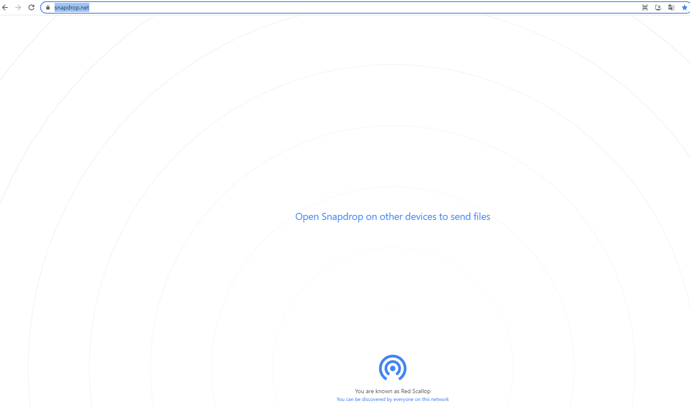

**[장점]**

- 에어드랍 만큼이나 UI가 쉽고 직관적이다

- 공짜다

- 맥북, 윈도우 컴퓨터, 아이폰, 안드로이드 가리지 않고 모두 공유 가능하다

**[단점]**
- 연결하고자 하는 기기들이 모두 같은 와이파이나 공유기에 물려 있어야 한다.

## 사용방법
https://snapdrop.net/
으로 파일전송을 원하는 기기 둘다 들어가서(같은 와이파이 사용), 대상을 누르고 파일전달
