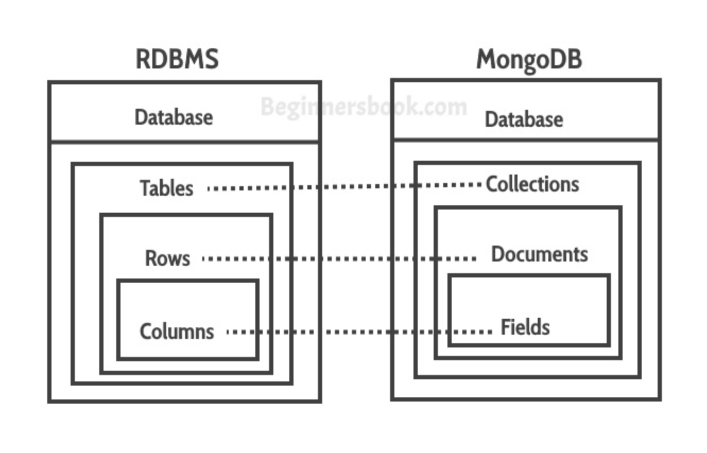
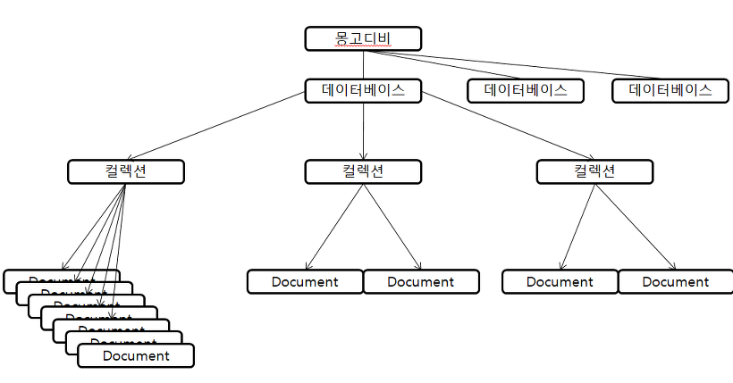
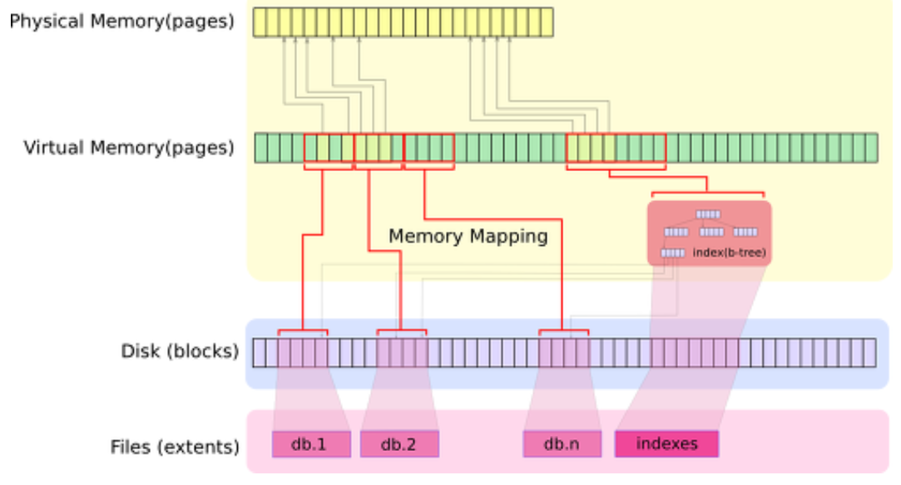

# MongoDB

**[MongoDB 개요]**

NoSQL DBMS의 한 종류
테이블과 같은 schema가 없으며, JSON형태의 문서 지향적 NoSQL 데이터베이스입니다.
MongoDB 는 C++로 작성된 오픈소스 문서지향 (Document-Oriented) 적 Cross-platform 데이터베이스이며, 뛰어난 확장성과 성능을 자랑합니다.


**[MongoDB 공홈에서의 소개]**

- MongoDB **는 유연하고 JSON과 유사한 문서에 데이터를 저장합니다** . 즉, 필드는 문서마다 다를 수 있으며 시간에 따라 데이터 구조를 변경할 수 있습니다.
- 문서 모델 **은 응용 프로그램 코드의 객체에 매핑** 되므로 데이터를 쉽게 사용할 수 있습니다.
- **임시 쿼리, 인덱싱 및 실시간 집계** 는 데이터에 액세스하고 분석하는 강력한 방법을 제공합니다
- MongoDB는 기본적 으로 **분산 데이터베이스** 이므로 고 가용성, 수평 확장 및 지리적 분포가 내장되어 있고 사용하기 쉽습니다.
- MongoDB는 **무료로 사용할 수 있습니다** . 


**[특징]**

- Document-oriented storage : MongoDB는 database > collections > documents 구조로 document는 key-value형태의 BSON(Binary JSON)으로 되어있다.
- Full Index Support : 다양한 인덱싱을 제공한다. ( 인덱스와 데이터는 분리되어 별도로 운영 )
  - Single Field Indexes : 기본적인 인덱스 타입
  - Compound Indexes : RDBMS의 복합인덱스 같은 거
  - Multikey Indexes : Array에 매칭되는 값이 하나라도 있으면 인덱스에 추가하는 멀티키 인덱스
  - Geospatial Indexes and Queries : 위치기반 인덱스와 쿼리
  - Text Indexes : String에도 인덱싱이 가능
  - Hashed Index : Btree 인덱스가 아닌 Hash 타입의 인덱스도 사용 가능

- Replication& High Availability : 간단한 설정만으로도 데이터 복제를 지원. 가용성 향상.
- Auto-Sharding : MongoDB는 처음부터 자동으로 데이터를 분산하여 저장하며, 하나의 컬렉션처럼 사용할 수 있게 해준다. 수평적 확장 가능
- Querying(documented-based query) : 다양한 종류의 쿼리문 지원. (필터링, 수집, 정렬, 정규표현식 등)
- Fast In-Pace Updates : 고성능의 atomic operation을 지원
- Map/Reduce : 맵리듀스를 지원.(map과 reduce 함수의 조합을 통해 분산/병렬 시스템 운용 지원, 하둡처럼 MR전용시스템에 비해서는 성능이 떨어진다)
- GridFS : 분산파일 저장을 MongoDB가 자동으로 해준다. 실제 파일이 어디에 저장되어 있는지 신경 쓸 필요가 없고 복구도 자동이다.
  - 별도의 스토리지 엔진을 통해 파일 저장. 스토리지 엔진에서 DB 엔진을 분리하는 새로운 아키텍처를 도입
  - 몽고DB의 기본 스토리지 엔진인 와이어드 타이거(Wired Tiger)는 높은 쓰기 성능을 제공하고, 압축을 기본 내장해 더 적은 스토리지 비용을 요구
  - 별개의 인메모리와 암호화 데이터스토어를 추가. 또한 몽고DB는 스파크 커넥터를 제공해 대용량 인메모리 분석을 지원
- Commercial Support : 10gen에서 관리하는 오픈소스


**[장점]**

- Flexibility : Schema-less라서 어떤 형태의 데이터라도 저장할 수 있다.

  - 배열(Array)이나 날짜(Date) 등 기존 RDMS에서 지원하지 않던 형태로도 저장할 수 있기 때문에 JOIN이 필요 없이 한 문서에 좀 더 이해하기 쉬운 형태 그대로 정보를 저장할 수 있다는 것이 특징

- Performance : Read & Write 성능이 뛰어나다. 캐싱이나 많은 트래픽을 감당할 때 써도 좋다.

- Scalability : 애초부터 스케일아웃 구조를 채택해서 쉽게 운용가능하다. Auto sharding 지원

- Deep Query ability : 문서지향적 Query Language 를 사용하여 SQL 만큼 강력한 Query 성능을 제공한다.

- Conversion / Mapping : JSON형태로 저장이 가능해서 직관적이고 개발이 편리하다.

  


**[단점]**

- JOIN이 없다. join이 필요없도록 데이터 구조화 필요

- memory mapped file으로 파일 엔진 DB이다. 메모리 관리를 OS에게 위임한다. 메모리에 의존적, 메모리 크기가 성능을 좌우한다.

- SQL을 완전히 이전할 수는 없다.

- B트리 인덱스를 사용하여 인덱스를 생성하는데, B트리는 크기가 커질수록 새로운 데이터를 입력하거나 삭제할 때 성능이 저하된다. 이런 B트리의 특성 때문에 데이터를 넣어두면 변하지않고 정보를 조회하는 데에 적합하다.

  

  

## RDBMS와의 비교

> 데이터를 저장하는 자료 구조 관점에서 보면 MongoDB와 RDBMS는 많은 공통점이 있다. MongoDB에서는 컬렉션(Collection)이나 도큐먼트(Document)와 같이 객체의 이름이 조금 다를 뿐 RDBMS와 비슷한 역할을 한다.

- MongoDB는 쿼리의 결과로 커서를 반환
  - 커서란?
    - 쿼리 결과 집합에 대한 포인터입니다. 
  - 응용 프로그램이나 MongoDB 클라이언트 프로그램에서 커서를 통해 반복적으로 실제 도큐먼트를 가져올 수 있다.
  - MongoDB에서 쿼리의 결과로 커서를 반환하는 이유는 쿼리의 결과를 클라이언트 서버의 메모리에 모두 담아두지 않아도 처리할 수 있게 하기 위해서
  - MongoDB에서 커서를 읽을 때마다 서버(MongoDB 서버)에서 그때그때 도큐먼트를 가져오는 것은 아니고, 필요할 때마다 지정된 페이지 사이즈 단위로 서버로부터 전송받아 MongoDB 클라이언트 서버에 캐싱한 후에 유저에게 서비스하는 것

- 쿼리문
  - MongoDB는 SQL 못지 않은 다양한 종류의 쿼리문을 지원한다.(필터링, 수집, 정렬, 정규 표현식 등)
  - MongoDB는 외래키를 명시적으로 지원하지는 않지만, 논리적으로 도큐먼트 간의 관계(Embedded Document)를 만들어서 사용
    - RDBMS와 같지는 않지만 "$lookup"이라는 집계 기능을 이용하면 관계형데이터베이스와 비슷한 형태의 조인 처리를 수행할 수 있다.(샤딩 환경에서는 여러 제약이 존재)
- 보조 인덱스
  - MongoDB는 모든 부분에 있어서 스키마 프리라고는 보기 힘들다. 다른 NoSQL 데이터베이스와는 달리 보조 인덱스를 생성할 수 있는데, MongoDB의 보조 인덱스는 항상 먼저 인덱스를 구성하는 필드를 먼저 정의해야 한다.


| MongoDB                           | RDBMS                               |
| --------------------------------- | ----------------------------------- |
| 데이터베이스(Database)            | 데이터베이스(Database)              |
| 컬렉션(Collection)                | 테이블(Table)                       |
| 도큐먼트(Document)                | 레코드(Record OR Row)               |
| 필드(Field)                       | 컬럼(Column)                        |
| 인덱스(Index)                     | 인덱스(Index)                       |
| 쿼리의 결과로 "커서(Cursor)" 반환 | 쿼리의 결과로 "레코드(Record)" 반환 |







### Document

```javascript
{
    "_id": ObjectId("5099803df3f4948bd2f98391"),
    "username": "ljh",
    "name": { first: "J.H.", last: "Lee" }
}
```

- RDB의 레코드와 비슷한 개념으로, 데이터 구조는 1개이상의 key-value 쌍으로 이루어 진다
- id
  - 12bytes의 hexadecimal 값으로서, 각 document의 유일함(uniqueness)을 제공
    - 첫 4bytes는 현재 timestamp
    - 다음 3bytes는 machine id
    - 다음 2bytes는 MongoDB 서버의 프로세스id
    - 마지막 3bytes는 순차번호 = 추가될때마다 값이 높아진다는 말이 된다.
- Document는 동적 스키마를 갖고있기 때문에, 같은 Collection 안의 Document끼리 다른 스키마를 갖고 있을 수 있다. 
  즉, 서로 다른 데이터들을 가지고 있을 수 있다.


## MongoDB의 물리적 데이터 저장구조

>  MongoDB를 구성할 때 보면, 가장 많이 이슈되는 부분 중 하나가 메모리량과 디스크 성능이다. 메모리 크기가 아주 민감한 요인이 된다. 



- 쓰기 작동 과정

MongoDB는 기본적으로 memory mapped file(OS에서 제공되는 mmap을 사용)을 사용한다. 
데이터를 쓰기할때, 디스크에 바로 쓰기작업을 하는 것이 아니라 논리적으로 memory 공간에 쓰기를 하고, 일정 주기에 따라서, 이 메모리 block들을 주기적으로 디스크에 쓰기한다. 이 디스크 쓰기 작업은 OS에 의해서 이루어 진다.


- 가상메모리

쓰기 작동 과정의 논리적 memory는 OS에 의해서 제공되는 가상 메모리를 사용하게 되는데, 물리 메모리 양이 작더라도 가상 메모리는 훨씬 큰 공간을 가질 수 있다. 
가상 메모리는 페이지(Page)라는 블럭 단위로 나뉘어 지고 

→ 이 블럭들은 디스크 블럭에 매핑되고 

→ 이 블럭들의 집합이 하나의 데이터 파일이 된다.


- 메모리에 저장되는 내용
  - 실제 데이터 블록
  - 인덱스 자체 


- MongoDB에서 인덱스를 남용하면 좋지 않다.

인덱스를 생성 및 업데이트 하는데 자원이 들어갈 뿐더러, 인덱스가 메모리에 상주하고 있어야 제대로 된 성능을 낼 수 있기 때문이다.
만약, 물리 메모리에 해당 데이터 블록이 없다면, 페이지 폴트가 발생하게 되고, 디스크에서 그 데이터 블록을 로드하게 된다. 물론 그 데이터 블록을 로드하기 위해서는 다른 데이터 블록을 디스크에 써야한다.
즉, 페이지 폴트가 발생하면, 페이지를 메모리와 디스카 사이에 스위칭하는 현상이 일어나기 때문에 디스크IO가 발생하고 성능 저하를 유발하게 된다.


- 페이지폴트는, 메모리 용량이 성능에 영향을 미치는 원인이 된다.

페이지 폴트가 발생하면, 페이지를 메모리와 디스카 사이에 스위칭하는 현상이 일어나기 때문에 디스크IO가 발생하고 성능 저하를 유발하기 때문에, 메모리 용량을 최대한 크게 해서 이 페이지폴트를 예방해야한다.
그러나, 페이지 폴트가 아예 발생 안할 수는 없다.(1TB의 데이터를 위해 메모리를 진짜 1TB만큼 올릴 수는 없다.) 그래서 페이지 폴트를 줄이는 전략으로 접근 하는 것이 옳은 방법이다.


- 페이지 폴트시 디스크로 write되는 데이터

페이지 폴트시 디스크로 write되는 데이터는 LRU(Least Recently Used Algorithm - 가장 오랫동안 참조되지 않은 페이지를 교체하는 기법) 에 의해서 결정
자주 안쓰는 데이터가 disk로 out되는데, 일반적인 애플리케이션에서 자주 쓰는 데이터의 비율은 그리 크지 않다.


- Hot Data

자주 액세스되는 데이터를 Hot Data라고 하는데, 이 데이터들이 집중되서 메모리에 올라가도록 Key 설계를 하는 것이 핵심


- 최적화 전략

전체 데이터를 scan하는 등의 작업을 하게 되면, 무조건 페이지 폴트가 발생하기에 table scan이 필요한 시나리오는 별도의 index table(summary table)을 만들어서 사용하는 등의 전략이 필요


## MongoDB 배포 형태별 아키텍쳐

밑에 나올 용어 정리

- 클러스터 

  인스턴스들의 모임, 데이터를 저장하는 서버 그룹

- 레플리카 세트 

  단일 클러스터에서 각각의 인스턴스는 동일한 복제본을 가지고 있으며 이모음을 레플리카 세트라고 한다. 데이터의 사본을 저장하는 인스턴스의 모음. 동일한 데이터를 저장하는 소수의 연결된 머신들은 머신 중 하나에 문제가 발생하더라도 데이터가 그대로 유지되도록 합니다.

- 인스턴스

  로컬 또는 클라우드에서 특정 소프트웨어를 실행하는 단일 머신, MongoDB에서는 데이터베이스입니다.


### 단일 노드

- 단일 노드로 MongoDB를 사용할 때에는 아무런 관리용 컴포넌트도 필요하지 않다.
- 클라이언트는 MongoDB 클라이언트 드라이버와 통신하며 MongoDB 클라이언트 드라이버는 1:1로 MongoDB 서버와 통신한다.


### 단일 레플리카 셋

- 레플리카 셋을 쓰는 이유

  - 특정 서버에 장애가 발생했을 때, 자동 복구를 위한 최소 단위이므로 자동 복구가 필요하다면 항상 레플리카 셋으로 배포해야 한다.

- MongoDB 클라이언트 드라이버는 직접 MongoDB 서버로 접속하지만, 단일 노드로 접속할 때와 달리 레플리카 셋 옵션을 사용해야 한다.

- 레플리카 셋의 구성

  - 항상 하나의 **프라이머리 노드**와 1개 이상의 **세컨드리 노드**로 구성
    - 프라이머리 노드 :  사용자의 데이터 변경 요청을 받아서 처리 
      - 쓰기권한o , 읽기권한o
    - 세컨드리 노드 : 프라이머리 노드로부터 변경 내용을 전달받아서 서로의 데이터를 동기화 
      - 쓰기권한x, 읽기권한o(기본값은 읽기권한x, readPreference을 설정하면 읽기권한 주고, Read 작업 분산을 통해 Primary 부하 줄일 수 있음, readPreference을설정은 클라이언트의 드라이버에서 설정)

  - 홀수 갯수의 노드 구성
    - MongoDB 레플리카 셋은 항상 레플리카 셋에 포함된 노드 간 투표를 통해서 프라이머리 노드를 결정하기 때문에,  가능하면 홀수 개의 노드로 구성하는 것이 좋다
    - 짝수 개의 노드로도 구성할 수 있지만, 실제 홀수로 구성한 것과 가용성이 다르지 않으며 오히려 하나의 노드가 낭비된다. 또한 짝수로 구성하면 쿼럼(의결을 하는 데 필요한 최소한도의 인원수) 구성이 어려워질 수도 있다.

- 레플리카 셋을 굳이 3대의 서버로 구축하는 것은 때로는 서버의 낭비일 수 있지 않나?

  - 이런 경우를 위해서 MongoDB서버를 아비터 모드로 실행할 수 있다.

  - 아비터 모드란?

    - 아비터 모드로 시작되면 레플리카 셋의 노드들과 하트비트만 주고 받으며, 
      프라이머리 노드가 불능일 때, 아비터 모드가 아닌 세컨드리 노드중에 프라이머리 노드의 선출을 위한 투표에만 참여

    - 아비터는 로컬 디스크에 데이터를 저장하지 않고 프라이머리부터 데이터를 주고 받지 않기 때문에 고 사양의 장비가 필요하지 않다.

    - 아비터는 데이터를 가지고 있지 않으므로 프라이머리 노드로 선출될 수도 없다. 

    - 하나의 레플리카 셋에 여러개의 아비터 노드가 존재할 수는 있지만, 실제 정상적인 상태에서 하나 이상의 아비터는 필요하지 않다.

      

      

### 샤딩된 클러스터

- 구성 조건
  - 샤딩된 클러스터 구조에서는 하나 이상의 레플리카 셋이 필요
    - 각 레플리카 셋은 자신만의 파티션된 데이터를 가지게 된다.
      (예를 들면 전체 데이터가 6이고, 레플리카 셋이 3개라면 각각 2의 데이터 파티션을 나누어 갖는다.)
- 샤드란?
  - 샤딩된 클러스터에 참여하고 있는 각각의 레플리카 셋을 샤드라고 한다.
  - 이 샤드들이 어떤 데이터를 가지는지에 대한 정보는 MongoDB 컨피그(Config) 서버가 관리한다.

- MongoDB 클라이언트 드라이버와의 연결

  - MongoDB 클라이언트 드라이버가 직접 서버에 붙지 않고 MongoDB 라우터(mongos)에 연결된다.

  - 라우터는 자동으로 MongoDB 컨피그 서버로부터 각 샤드가 가지고 있는 데이터에 대한 메타 정보들을 참조하여 쿼리를 실행한다. 말 그대로 라우터(mongos)는 사용자로부터 요청된 쿼리를 실제 데이터를 가지고 있는 샤드로 전달하는 역할을 수행

  - 이뿐만 아니라 라우터는 사용자를 대신하여 모든 샤드로부터 쿼리를 요청하고 결과를 정렬 및 병합해서 반환하는 처리도 수행

  - 라우터는 각 샤드간의 데이터가 재분배되는 시점에도 동일한 역할을 수행하여 사용자나 응용 프로그램이 알아채지 못하게 투명하게 데이터 리밸런싱 작업을 처리

    

## 데이터 형식(JSON, BSON)

- JSON 형태의 document 작성 규칙
  1. {} 중괄호로 도큐먼트가 시작하고 끝나야합니다.
  2. 필드와 값이 : 콜론으로 분리되어야 하며, 필드와 값을 포함하는 쌍은 , 쉼표로 나뉘어야 합니다.
  3. 필드도 문자열이기 때문에 "" 쌍따옴표로 감싸야 합니다.
- JSON 의 단점
  - JSON은 텍스트 형식이기 때문에 읽기 쉽지만, 파싱이 매우 느리고, 메모리 사용에 있어서 비효율적입니다.
  - 그리고 JSON은 기본 데이터 타입만을 지원하기 때문에 사용 할 수 있는 타입에 제한이 있습니다
    - 문자열, boolean, 숫자, 배열
- 해결 방안 - BSON(Binary JSON) 
  - JSON의 단점들을 해결하기 위한 방안으로 BSON(Binary JSON) 형식을 도입
  - JSON 문서를 바이너리로 인코딩한 포맷이다. 
    - JSON보다 빠르게 데이터를 CRUD 할 수 있다
  - 주로 JSON 형태의 데이터를 저장하거나 네트워크 전송하는 용도로 사용된다. 바이너리 데이터를 JSON 구조에 추가할 수 있다는 장점이 있다
  - BSON에서는 데이터타입을 조금 더 디테일하게 표현할 수 있습니다. 
    예를들어서 숫자의 경우도 Integer, Float, Long, Decimal과 같이 분류가 되며 날짜의 형태(datetime)도 저장이 가능합니다.

 

### import, export 명령어

- **JSON** 형식
  - **mongoimport** : 데이터를 가져오는 명령어
  - **mongoexport** :  데이터를 내보내기 위한 명령어
- **BSON** 형식
  - **mongorestore** : 데이터를 가져오는 명령어
  - **mongodump** : 데이터를 내보내기 위한 명령어


