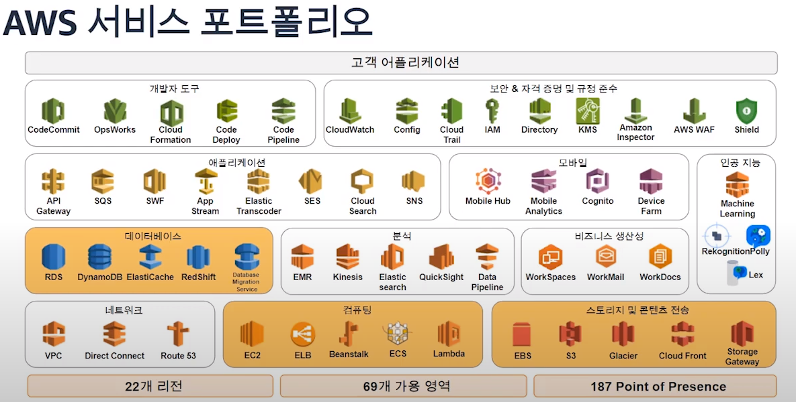
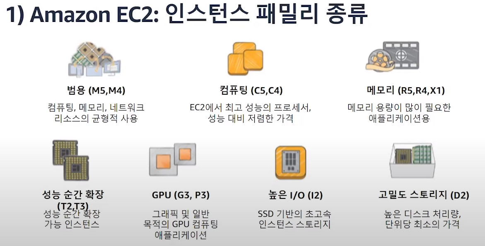
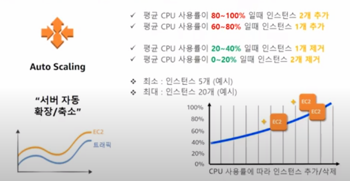
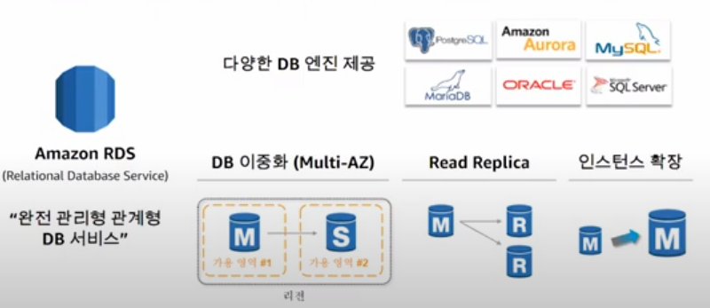
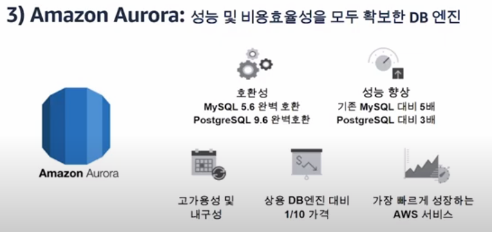
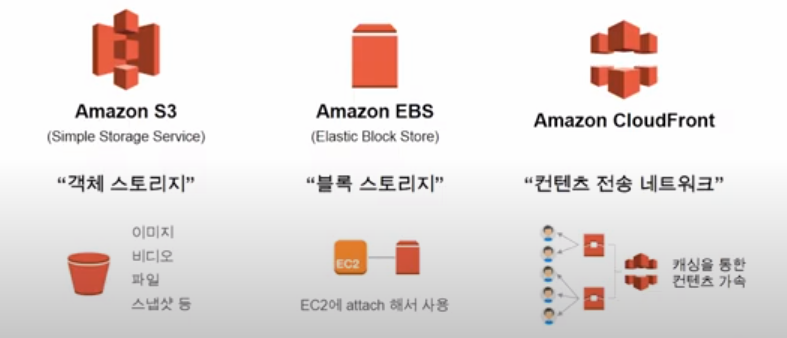
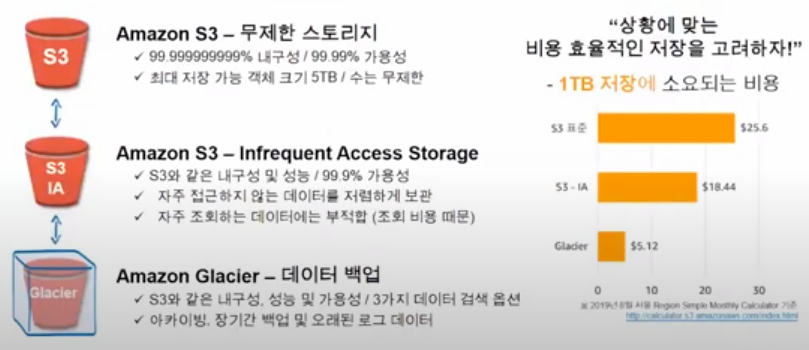
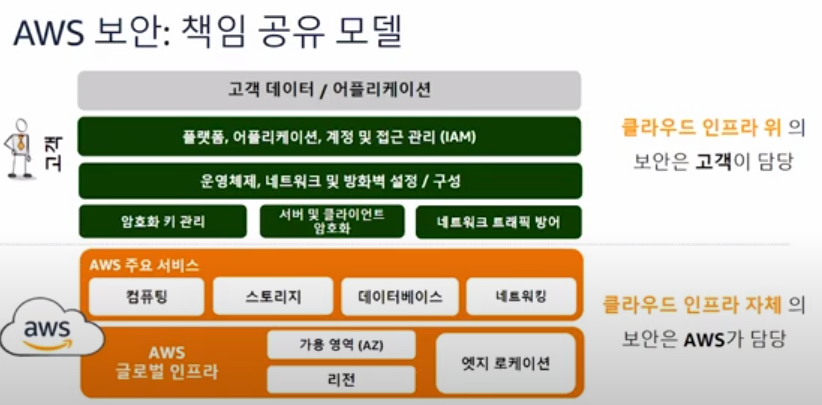
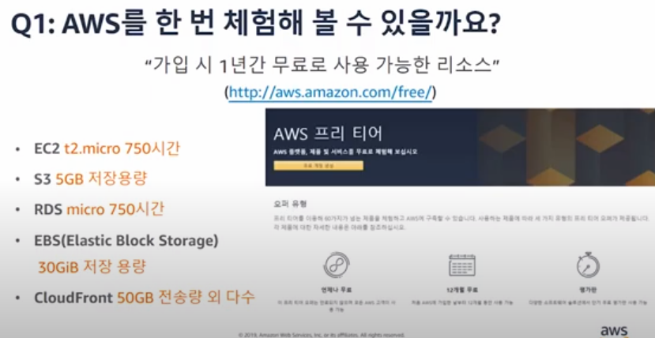

# AWS 클라우드 소개

- AWS 란?
  - 클라우드에서 매우 안정적이고 저렴한 확장형 인프라 플랫폼을 제공하여 전 세계 190개국에 있는 수천 개의 비즈니스 운영을 지원하는 서비스
  - https://www.youtube.com/watch?v=1Ddvg2dH4PE&t=896s
- AWS 솔루션 포트폴리오
  - https://aws.amazon.com/ko/solutions/
  - AWS 플랫폼을 사용하여 공통된 문제를 해결하고 보다 빠르게 구축할 수 있도록 예시를 지원

## AWS 서비스 포트폴리오

### EC2

- Virtual Machine
- 재구성이 가능한 컴퓨팅 리소스
- 쉽게 확장/축소되는 컴퓨팅 용량
- 고객 업무 영역에 따른 다양한 인스턴스 타입 제공
- 사용한 만큼만 과금

### Auto Scaling

- 서버 자동 확장/축소
  - 서버 최대용량이 너무 크다면
    - 자원낭비
  - 서버 최대용량이 너무 작다면
    - 과부하 발생 - 서비스 장애, 지연

### Amazon RDS 

### 배포 서비스

- Amazon S3 : 무제한 객체 스토리지
  -  객체 기반의 무제한 파일 저장 스토리지
  - url을 통해 손쉽게 파일 공유 가능
  - 99.99999999%의 내구성
  - 사용한 만큼만 지불(GB 당 과금)
  - 정적 웹 사이트 호스팅 가능
- Amazon EBS : 블록 스토리지
  - EC2에 attach해서 쓸 수 있는 블록 스토리지
  - 서버에 들어가는 SSD나 HDD로 생각하면됨
- Amazon CloudFront : 컨텐츠 전송 네트워크(CDN)
  - 컨텐츠(이미지, HTML 등)을 캐싱하여 성능 가속
  - 전세계 187개 엣지 로케이션 : 글로벌 서비스
  - AWS 서비스 > CloudFront 간 데이터 전송 무료
  - 글로벌 고속 백본 네트워크 확보
  - DDoS 방어 무료제공(AWS Shield Standard)

### 보안

## AWS 체험

- AWS console의 Billing and Cost Management Console에서 free-tier를 초과하는 비용이 발생하는 부분에 대한 알림등을 설정 가능
  - https://docs.aws.amazon.com/ko_kr/awsaccountbilling/latest/aboutv2/free-tier-limits.html
  - https://docs.aws.amazon.com/ko_kr/awsaccountbilling/latest/aboutv2/tracking-free-tier-usage.html

