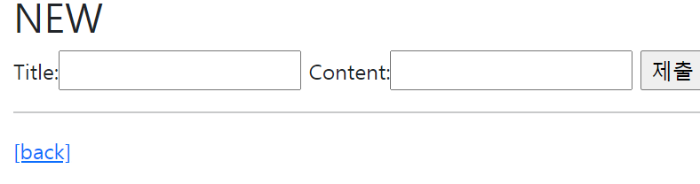
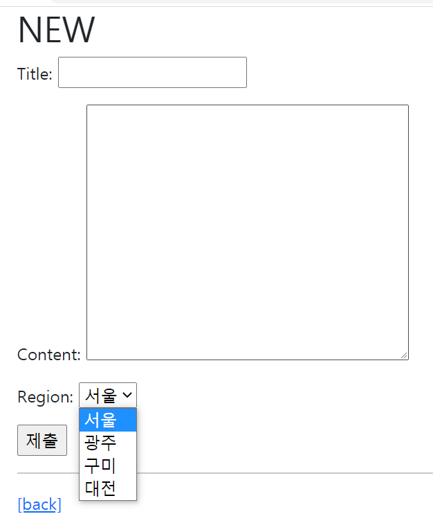
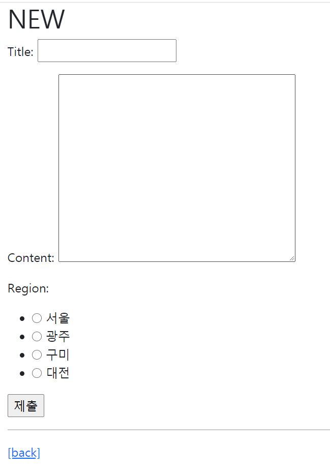
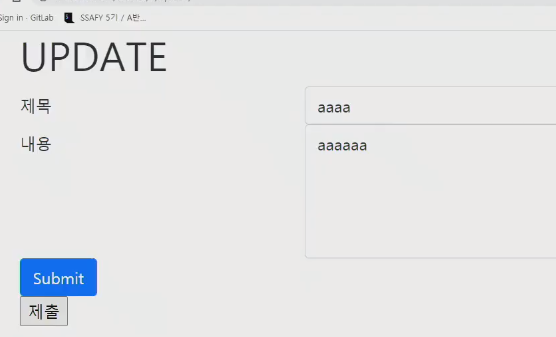
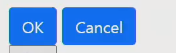

# 1. Form

- https://developer.mozilla.org/ko/docs/Learn/Server-side/Django/Forms
- https://docs.djangoproject.com/en/3.1/topics/forms/
- Form은 Django 프로젝트의 주요 유효성 검사 도구들 중 하나이며, 공격 및 우연한 데이터 손상에 대한 중요한 방어 수단
- django는 Form에 관련된 작업의 아래 세부분을 처리해줌
  - 랜더링을 위한 데이터 준비 및 재구성
  - 데이터에 대한 HTML forms 생성
  - 클라이언트로부터 받은 데이터 수신 및 처리
- Form과 ModelForm의 차이
  - Form
    - 어떤 model에 저장해야하는지 알 수 없으므로 유효성 검사 이후 `cleanded_data` 딕셔너리를 생성(cleaned_data 딕셔너리에서 데이터를 가져온 후 `.save()` 호출)
    - model에 연관되지 않은 데이터를 받을 때 사용
  - ModelForm
    - django가 해당 Model에서 양식에 필요한 대부분의 정보를 이미 정의
    - 어떤 레코드를 만들어야 할지 알고 있으므로 `is_valid()` 이후 `.save()` 호출 가능


## 1.1 Form Class

- django Form 관리 시스템의 핵심
- form 내 field, field 배치, 디스플레이 widget, label, 초기값, 유효하지 않은 field에 관련된 에러메세지를 결정
- django는 사용자의 데이터를 받을 때 해야할 과중한 작업(데이터 유효성 검증, 필요시 입력된 데이터 검증 결과 재출력, 유효한 데이터에 대한 요구되는 동작 수행 등)과 반복 코드를 줄여줌


### 1.1.1 Widgets

- https://docs.djangoproject.com/en/3.1/ref/forms/widgets/

- Django의 HTML input element 표현
- HTML 렌더링 처리
- 주의사항
  - Form Field와 혼동되서는 안됨
  - Form Field는 input 유효성 검사를 처리
  - Widgets은 웹페이지에서 input element의 단순 raw한 렌더링 처리


## 1.2 사용해보기

1. `어플.forms.py` 생성하기
   - widget 은 화면상에서 어떻게 보여질지를 정해주는 것

```python
class ArticleForm(forms.FORM) :
    title = forms.CharField(max_length= 10)
    content = forms.CharField(widget = forms.Textarea)
```

2. `어플.views.py` 에서  
   - `forms.py` import 받기
   - context로 form 객체 생성해서 넘겨주기

```python
from .forms import ArticleForm

def new(request):
    articleForm = ArticleForm()
    context = {
        'articleForm' : articleForm,
    }
    return render(request, 'articles/new.html', context)
```

3. `해당페이지.html`
   - form 안에 `{{ 넘겨줬던form인스턴스 }}` 를 넣어주기
     - `인스턴스명.as_p` : 각각 input 태그를 p로 감싸줌
     - `인스턴스명.as_ul` : 각각 input 태그를 ul로 감싸줌
     - `인스턴스명.as_table` : 각각 input 태그를 table로 감싸줌
   - 그럼 자동으로 페이지에 form 형태가 만들어짐
     - `어플.forms.py` 에서 생성한 변수명에 따라 `id`, `name`이 자동으로 붙어짐
     - 기본 속성 `required`

```html



  <h1>NEW</h1>
  <form action="" method="POST">
    
    {{ articleForm }}
    <input type="submit">
  </form>
  <hr>
  <a href="">[back]</a>


```




## 1.3 choice field

- `어플.forms.py`

```python
from django import forms

class ArticleForm(forms.Form) :
    title = forms.CharField(max_length=10)
    content = forms.CharField(widget = forms.Textarea)

    REGION_A = 'seoul'
    REGION_B = 'gwangju'
    REGION_C = 'gumi'
    REGION_D = 'daejeon'
    REGION_CHOICES = [
        (REGION_A, '서울'),
        (REGION_B, '광주'),
        (REGION_C, '구미'),
        (REGION_D, '대전'),
    ]

    region = forms.ChoiceField(choices = REGION_CHOICES)
```



- 만약 widget = radioselect를 선택해준다면?

  `region = forms.ChoiceField(choices = REGION_CHOICES, widget = forms.RadioSelect)`




## 1.4 ModelForm Class

- https://docs.djangoproject.com/en/3.1/topics/forms/modelforms/

- model을 통해 Form Class를 만들수 있는 Helper
- 일반 Form Class와 완전히 같은 방식(객체 생성)으로 view에서 사용 가능
- Meta Class
  - Model의 정보를 작성하는 곳
  - 해당 model에 정의한 field 정보를 From에 적용하기 위함


### 1.4.1 사용방법

- `어플.forms.py` 
  - model에서 어떤 변수들을 사용할지 지정해주어야함 .둘 중하나의 방법으로
    - `fields= '__all__'` : 어떤 것을 사용할지
    - `exclude = ('title', )` : 어떤것을 제외하고 사용할지

```python
class ArticleForm(forms.ModelForm) :
    class Meta :
        model = Article
        fields= '__all__' # 어떤 변수들을 사용할건지 지정
```


- `어플.views.py`

  - modelFom 으로 정보를 받았을 때 더 편하게 받는법

  - ModelForm을 이용한 유효성 검사

    - 유효성 검사는 크게 두 단계로 이루어진다.

      1. (프론트방어)사용자가 HTML 페이지에서 내가 원하는 형태로 데이터를 작성할 수 있게 만든다.

         (ex-required 속성을 줘서 작성하지 않으면 submit 하지 못하도록 만들기)

      2. (서버단검증)사용자가 데이터를 submit 하면 서버 단에서 데이터 형태가 올바른지 다시 한번 검증한다.

         (ex- 사용자가 required를 뻬버리고 submit을 눌렀을 경우, ModelForm에 있는 is_valid 메서드를 호출하여 다시 한번 검증한다.)

  - save mehtod

    - 만약 form이 유효성검사를 통과하지 않고 바로 save 하면 에러가 뜨게됨.
    - save 메서드를 쓰면 Form에 바인딩 되어 있는 데이터에 대한 데이터베이스 객체를 생성하고 DB에 저장한다.
    - 모델폼의 하위클래스를 instance라는 키워드 인자를 받을 수 있는데, 이미 존재하는 모델 인스턴스를 받을 수 있다.
      - 만약 모델인스턴스가 주어지면, 기존에 존재하는 인스턴스를 UPDATE한다.
      - 주어지지 않으면, 정의되어 있는 모델의 새로운 인스턴스를 CREATE한다.

```python
def create(request):
    title = request.POST.get('title')
    content = request.POST.get('content')
    article = Article(title=title, content=content)
    article.save()
    return redirect('articles:detail', article.pk)

######를 이렇게 바꿀 수 있음
def create(request):
    # 1. POST Dat에 들어있는 ModelForm 인스턴스를 생성한다.
    form = ArticleForm(request.POST)
    # 2. Form 에 들어있는 데이터에 대한 유효성 검사를 실시한다.
    if form.is_valid() :
        # 3. 새로운 Article 인스턴스를 생성하고 DB에 저장한다.
        article =  form.save()
        # 4. 생성한 Article 인스턴스의 PK값과 함게 상세정보 페이지로 Redirect 한다.
        return redirect('articles:detail', article.pk)

    # 유효성 검사가 실패했을 경우
    return redirect('articles:new')
```


## 1.5 실습하기 - 생성폼페이지와 생성페이지 합치기

- `어플.views.py` 

```python
def create(request) :
    """
    사용자가 /articles/create/로 요청을 보낸 경우,
    1) GET : 비어있는 ModelForm 을 던진다.
    2) POST : 데이터를 받아서 DB에 저장한다.
    """
    if request.method == "POST" :
        form = ArticleForm(request.POST)
        if form.is_valid() :
            article = form.save() # 저장한 Article객체 반환됨
            return redirect('articles:detail', article.pk)
            
    else :
        form= ArticleForm()
        
    # form에 들어올 수 있는 데이터 형태
    # 1) GET 요청 : 사용자가 데이터를 입력할 수 있는 비어있는 form
    # 2) POST 요청 
    # 	- 사용자가 입력한 데이터가 유효성 검사에서 실패한 경우
    #   - 에러 메시지를 포함한 form
   	context={
        'form' : form,
    }
    return render(request, 'articles/create.html', context)
    
```

- `어플.templates/어플/create.html`
  - 자기 자신으로 보내기 때문에 form action을 비워 자기 자신으로 보내게 처리 시켜버릴 수 있다.

```HTML



  <h1>CREATE</h1>
  <form action="" method="POST">
    
    {{ form.as_p }}
    <input type="submit">
  </form>
  <hr>
  <a href="">[back]</a>

```


## 1.6 form field

- https://docs.djangoproject.com/en/3.1/ref/forms/fields/
- form 형태 커스터마이징하기
- `어플.form.py`
  - form 관련 내용들을 override 시켜서 꾸미기
    - label
    - widget
    - error_message 
    - 등등..

```python
class ArticleForm(forms.ModelForm) :
    title = forms.CharField(
        label='제목', # label에 보이는 글씨값 조정
        widget=forms.TextInput( # 해당 HTML 요소 꾸미기
            attrs={
                'class' : 'my-title', # 띄어쓰기로 여러 클래스 입력가능
                'placeholder' : '제목을 입력해주세요',
            }
        ), 
        error_messages={
            'required' : '입력값이 없는 상태로 오셨습니다.',
        }
    )

    content = forms.CharField(
        label="내용",
        widget=forms.Textarea(
            attrs={
                'class' : 'my-content',
            }
        )
    )

    class Meta :
        model = Article
        fields= '__all__'
```


## 1.7 실습 - UPDATE 합치기

- `어플.views.py`
  - instance로 

```python
def update(request, pk):
    article = Article.objects.get(pk= pk)
    if request.method == 'POST' :
        form =ArticleForm(request.POST, instance=article) # 인스턴스를 넘겨주고 save를 하면 update를 하고, 인스턴스 안넘겨주고 save하면 새로운 인스턴스 create함
        if form.is_valid() :
            form.save()
            return redirect('articles:detail', article.pk)
    else :
        form =ArticleForm(instance=article)

    context = {
        'form' : form,
        'article' : article,
    }

    return render(request, 'articles/update.html', context)
```

- `어플.templates/어플/update.html`

```HTML



  <h1>UPDATE</h1>
  <form action="" method="POST">
    
    {{ form.as_p }}
    <input type="submit">
  </form>
  <hr>
  <a href="">[back]</a>


```


# 2. Django-Bootstrap

## 2.1 설치 

- `pip install django-bootstrap-v5`
  - https://pypi.org/project/django-bootstrap-v5/
- `프로젝트.settings.py > INSTALLED_APPS` 
  - `"bootstrap5"` 추가하기
- https://django-bootstrap-v5.readthedocs.io/en/latest/
  - Docs 주소


## 2.2 템플릿에 적용하기

- `` 을 `` 밑에 작성

### 2.2.1 bootstrap CDN 적용하기

- Load CSS and JavaScript 적용

```HTML


```

### 2.2.2 bootstrap form 적용하기

- `{{ 폼객체.as_p }}` 로 썼던 것을 `` 으로 씀

- `<input type="submit">`을 밑에 코드로 수정

  - ```HTML
    
    	<button type=submit class="btn btn-primary">
            Submit
    	</button>
    
    ```

- 만약 horizontal로 정렬된 form 을 쓰고 싶다면

  - ``
  - 밑에 사진처럼 라벨이 왼쪽, input이 오른쪽으로 정렬되서 출력됨

  


### 2.2.3 Button

- OK로 submit, Cancel로 내용 reset
  - ``




# 3. Include 태그를 이용한 분리

- 하는 이유
  - 역할 코드를 분리함으로써 관리가 편해짐
  - `base.html`이 굉장히 깔끔해짐

- `navbar.html` 를 만들고,  navbar 코드만 넣는다.

  - 위치는 `프로젝트.templates`에 만듬. (공통으로 쓰는 것이기 때문에)

  ```HTML
  <nav class="navbar navbar-expand-lg navbar-light bg-light">
    <div class="container-fluid">
      <a class="navbar-brand" href="#">Navbar</a>
      <button class="navbar-toggler" type="button" data-bs-toggle="collapse" data-bs-target="#navbarSupportedContent" aria-controls="navbarSupportedContent" aria-expanded="false" aria-label="Toggle navigation">
        <span class="navbar-toggler-icon"></span>
      </button>
      <div class="collapse navbar-collapse" id="navbarSupportedContent">
        <ul class="navbar-nav me-auto mb-2 mb-lg-0">
          <li class="nav-item">
            <a class="nav-link active" aria-current="page" href="#">Home</a>
          </li>
          <li class="nav-item">
            <a class="nav-link" href="#">Link</a>
          </li>
          <li class="nav-item dropdown">
            <a class="nav-link dropdown-toggle" href="#" id="navbarDropdown" role="button" data-bs-toggle="dropdown" aria-expanded="false">
              Dropdown
            </a>
            <ul class="dropdown-menu" aria-labelledby="navbarDropdown">
              <li><a class="dropdown-item" href="#">Action</a></li>
              <li><a class="dropdown-item" href="#">Another action</a></li>
              <li><hr class="dropdown-divider"></li>
              <li><a class="dropdown-item" href="#">Something else here</a></li>
            </ul>
          </li>
          <li class="nav-item">
            <a class="nav-link disabled" href="#" tabindex="-1" aria-disabled="true">Disabled</a>
          </li>
        </ul>
        <form class="d-flex">
          <input class="form-control me-2" type="search" placeholder="Search" aria-label="Search">
          <button class="btn btn-outline-success" type="submit">Search</button>
        </form>
      </div>
    </div>
  </nav>
  ```

- navbar 가 필요한 HTML 페이지에 include로 넣는다.
  - ``
  - `프로젝트.settings`에 DIR에 `프로젝트.templates` 위치가 등록되어있어야함.  


# 4. View Decorators

- Decorator(데코레이터)

  - 어떤 함수에 기능을 추가하고 싶을 때, 해당 함수를 수정하지 않고 기능을 연장해주는 함수
  - django는 다양한 기능을 지원하기 위해 view 함수에 적용할 수 있는 여러 데이코레이터를 제공
  - https://docs.djangoproject.com/en/3.1/topics/http/decorators/

- Allowed HTTP methods

  - `from django.views.decorators.http import require_http_method`
  - 요청 메서드에 따라 view 함수에 액세스를 제한
  - 요청이 조건을 충족시키지 못하면 HttpResponseNotAllowed을 return
  - `require_http_methods()` - 특정 request 방식에 따른 접근 허용

  ```python
  @require_http_methods(["GET", "POST"])
  def my_view(request) :
      ...
      pass
  ```

  

  - `require_GET()` : GET method만 허용 - 이건 안씀
  - `require_POST()`  : POST method만 허용
    - 다른 mehtod 접근시 405ERROR 발생 (method 사용 불가능 상태 메세지)
  - `require_safe()` : GET method만 허용/ GET method가 아니면 require not allowed 에러 발생


# 5. Postman

- 페이지에 요청을 임의로 만들어서 보낼 수 있는 API
- https://www.postman.com/
- 이것으로 자신의 홈페이지가 얼마나 단단한지 실험해 볼 수 있음

