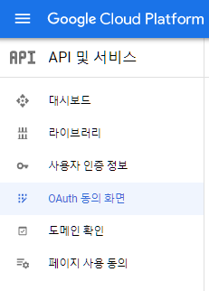
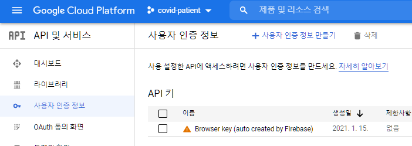
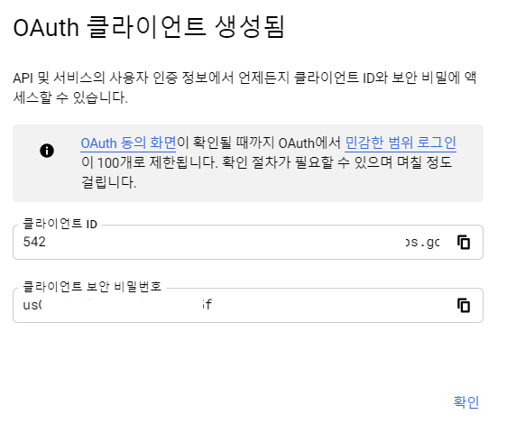
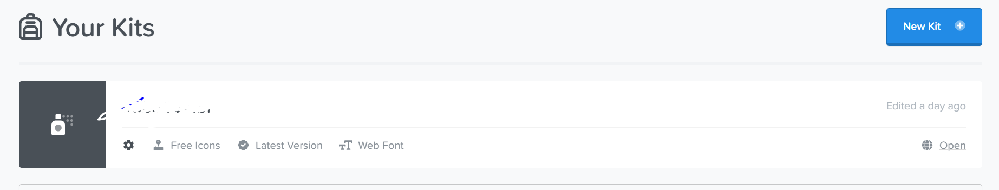
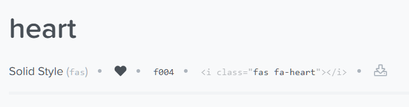

# 1. pagination

## 1.1 django-bootstrap-pagination 를 이용한 방식 

- https://pypi.org/project/django-pagination-bootstrap/

- `pip install django-pagination-bootstrap`

  

```
INSTALLED_APPS = (
    # other apps
    "django_pagination_bootstrap",
)
```

```
TEMPLATES = [
    {
        # ...
        "OPTIONS": {
            "context_processors": [
                # ...
                "django.template.context_processors.request"
                # ...
            ],
        },
    },
]
```

- html
  - ``
  - ``
    - 갯수는 한 페이지에 보일 글의 갯수
  - ``
    - 페이지 목록 표시


## 1.2 django.paginator만 이용한 방식

- https://docs.djangoproject.com/en/3.1/topics/pagination/
  - Paginator 다루는 법 소개
- https://docs.djangoproject.com/en/3.1/ref/paginator/
  - `Paginator` ( *object_list* , *per_page* , *orphans = 0* , *allow_empty_first_page = True* ) 
    - orphans  :  항목이 거의없는 마지막 페이지를 원하지 않을 때 사용
    - allow_empty_first_page : 첫 페이지를 비워 둘 수 있는지 여부입니다. `False`및 `object_list`이 비어 있으면 `EmptyPage`오류가 발생
    - `Paginator.get_page( 페이지번호)` :  페이지에 해당하는 page객체 반환
    - `Paginator.count` : 총 페이지 수
  - Page클래스
    - `Page.has_next()` : 다음페이지가 있으면 True 반환
    - `Page.next_page_number()` : 다음페이지 번호 반환 / 없으면 InvalidPage 에러
    - `Page.has_previous()` : 이전페이지가 있으면 True 반환
    - `Page.previous_page_number()` : 이전페이지 번호 반환 / 없으면 InvalidPage 에러
    - `Page.has_other_pages()` : 다음 또는 이전 페이지가 있으면 True 반환
    - `Page.start_index()` : 페이지 내에 글 시작번호를 거져옴
    - `Page.end_index()` : 페이지 내에 글 끝번호를 가져옴
    - `Page.object_list` : 이 페이지의 개체 목록
    - `Page.number` : 현재 페이지 번호
    - `Page.paginator` : 연결된 Paginator 객체
- https://getbootstrap.com/docs/5.0/components/pagination/

### 1.2.1 글.views.py

```python
from django.core.paginator import Paginator

@require_safe
def index(request):
    page = int(request.GET.get('page', default='1')) # page 매개변수가 없을 경우 1 이 되게, GET방식으로 page 변수를 받음
    all_reviews = Review.objects.order_by('-pk') # 전체 글 목록을 정렬해서 데이터 베이스에서 가져옴
    paginator = Paginator(all_reviews, 5, allow_empty_first_page = True) # Paginator(자료목록, 몇개씩출력할지)
    reviews = paginator.get_page(page) # 현재 페이지에 대한 자료를 가져옴

    all_page_list = paginator.page_range # 전체 페이지 리스트 가져오기
    alpha= beta = 0 # 항상 목록에 5개만 나오게 하기 위한 임시변수

    if page -2 <= 0 : 
        alpha = 3 - page
    elif page +2 > len(all_page_list) :
        beta = 2 + page - len(all_page_list) 
    page_list = all_page_list[max((page-1)-2-beta, 0)  : min((page-1)+3+alpha, len(all_page_list))] # paginator에서 쓸 페이지 리스트

    
    context = {
        'reviews': reviews,
        'page_list' : page_list,
    }
    return render(request, 'community/index.html', context)
```


### 1.2.2 index.html

```html



  <h1>Community</h1>
  <hr>
  <br>
  
    <a href="">{{ review.title }}</a>
    <p>영화 : {{ review.movie_title }}</p>
    <p>평점 : {{ review.rank }}</p>
    <p>리뷰 : {{ review.content }}</p>
  


<!-- 여기서 부터 -->
  <nav aria-label="Page navigation example">
    <ul class="pagination">
       <!-- Previous 버튼 관련 -->
        <li class="page-item"><a class="page-link" href="?page={{ reviews.previous_page_number }}">Previous</a></li>
      
        <li class="page-item"><a class="page-link" href="?page=1">Previous</a></li>
      
      
       <!-- 페이지 목록 출력 관련 -->
         <!-- 현재 페이지 파란색으로 표시 -->
          <li class="page-item active"><a class="page-link" href="?page={{ p }}">{{ p }}</a></li>
        
          <li class="page-item"><a class="page-link" href="?page={{ p }}">{{ p }}</a></li>
        
        
      
      

       <!-- Next 버튼 관련-->
        <li class="page-item"><a class="page-link" href="?page={{ reviews.next_page_number }}">Next</a></li>
      
        <li class="page-item"><a class="page-link" href="?page={{ reviews.number }}">Next</a></li>
      
    </ul>
  </nav>

```


# 2. 소셜 로그인

## 2.1 세팅

- https://django-allauth.readthedocs.io/en/latest/installation.html
- `pip install django-allauth`

## 2.2 google gcp

1. https://console.developers.google.com/ 접속
2. OAuth 동의 화면 만들기



3. 사용자 인증정보 
   - `+ 사용자 인증정보 만들기 `> OAuth 2.0 클라이언트 ID  
     - 애플리케이션 유형 -  웹 애플리케이션
     - URI : `http://127.0.0.1:8000`
     - 승인된 리디렉션 URI - `http://127.0.0.1:8000/accounts/google/login/callback/`



4. 만들면 2가지를 받음
   - 클라이언트 ID
   - 클라이언트 보안 비밀번호



## 2.3 settings.py 

- `INSTALLED_APPS`

  ```python
  INSTALLED_APPS = [
      "django.contrib.sites",		
  
      'allauth',
      'allauth.account',
      'allauth.socialaccount',
  
      # providers
  
      'allauth.socialaccount.providers.google',
  ]
  ```

  

- `AUTHENTICATION_BACKENDS` 추가

  ```python
  AUTHENTICATION_BACKENDS = [
      # Needed to login by username in Django admin, regardless of `allauth`
      'django.contrib.auth.backends.ModelBackend',
  
      # `allauth` specific authentication methods, such as login by e-mail
      'allauth.account.auth_backends.AuthenticationBackend',
  ]
  ```

  

- `SITE_ID` 추가

  - `SITE_ID = 1`


- `SOCIALACCOUNT_PROVIDERS` 추가

  ```python
  # Provider specific settings
  SOCIALACCOUNT_PROVIDERS = {
      'google': {
          'APP': {
              'client_id': '아까받은클라이언트ID',
              'secret': '아까받은secretKey',
              'key': ''
          }
      }
  }
  ```

  

- `urls.py` 에서 추가

  -  ` path('accounts/', include('allauth.urls')),`


- 여기까지 하고 나서 `python manage.py migrate`
  - INSTALLED_APPS 에 추가한 부분에 이미 makemigrations가 다 되어 있기 떄문에 migrate만 하면 됨


## 2.4 login.html

- next는 로그인 이후 어디로 url을 이동할지에 대한 변수임

```html


<a href="" >Google</a>
```


- 추가적 구글 버튼 이미지로 하고 싶다면?

  - https://developers.google.com/identity/branding-guidelines?hl=ko 에서 버튼 다운로드
  - `accounts/static/accounts` 폴더 만들고 안에 원하는 로그인 이미지파일 넣기

  ```html
  
  
  
    <div>
      <a href="" >
        
      </a>
    </div>
  ```

  

# 3. gravatar 이용한 프로필 사진

- https://ko.gravatar.com/
  - https://ko.gravatar.com/site/implement/images/

## 3.1 accounts/urls.py

-   path('<username>/profile/', views.profile, name='profile'),


## 3.2 accounts/views.py

```python
def profile(request, username):
    person = get_object_or_404(get_user_model(), username=username)
    context = {
        'person' : person,
    }
    return render(request, 'accounts/profile.html', context)
```


## 3.3 custom filter 추가

- `accounts/tempaltetags/` 만들고

  - `__init__.py` 
  - `만들태그.py` 만들기

- `gravatar.py`

  ```python
  import hashlib
  from django import template
  
  register = template.Library()
  
  @register.filter
  def gravatar_url(email) :
      return hashlib.md5(email.encode('utf-8').strip().lower()).hexdigest()
  ```

  

## 3.4 profile.html + gravatar

- ``
- ``
- `<i class="fas fa-user-plus" style="color:blue;"></i>`

```html





  <h1>{{ person.username}} 님의 프로필</h1>
  <div>사진 : </div>

  
    <div> 팔로잉 : {{ followings|length }} / 팔로워 : {{ followers|length }}</div>

    
      <div>
        <form action="" method="POST">
          
          
            <button class="btn"> <i class="fas fa-user-plus" style="color:blue;"></i> </button>
          
            <button class="btn"> <i class="fas fa-user-plus"></i> </button>
          
        </form>
      </div>
    
  


```


# 4. FontAwesome을 이용한 아이콘 사용

- https://fontawesome.com/

- 회원가입

  - 오른쪽 마이페이지 사진 

  - Kits 메뉴 클릭



  - 들어가서 Script src로 되어있는거 복사 해서 쓸 html 에 붙여넣기

- 원하는 아이콘 검색

  - `i class` 부분 복사 사용




# 5. Django-bootstrap

- https://pypi.org/project/django-bootstrap-v5/
- https://django-bootstrap-v5.readthedocs.io/en/latest/


## 5.1 설치

- `pip install django-bootstrap-v5`
- `프로젝트.settings.py > INSTALLED_APPS`
  "bootstrap5" 추가하기


## 5.2 템플릿에 적용하기

- `` 을 `` 밑에 작성


### 5.2.1 bootstrap CDN 적용하기

```HTML


```


### 5.2.2 form 사용

- ``
- ``
  - 쓸 수 있는 매개변수 
    - layout
      - inline
      - horizontal
    - form_group_class
      - mb-3
    - field_class
      - div
    - label_class
      - form-label
    - show_help
      - Show the field's help text, if the field has help text.
      - 기본값 True
    - show_label
      - 기본값 True
    - exclude
      - A list of field names that should not be rendered
    - size
      - small
      - medium
      - large
    - placeholder
    - addon_before, addon_after
      - https://getbootstrap.com/docs/5.0/forms/input-group/#basic-example
    - addon_before_class, addon_after_class
    - required_css_class
    - error_css_class
    - bound_css_class
  - https://github.com/zelenij/django-bootstrap-v5/blob/f1c9092c1e54f901ff04b38163730b79b4bb5b35/src/bootstrap5/templatetags/bootstrap5.py#L362


### 5.2.3 button 사용

- ``


