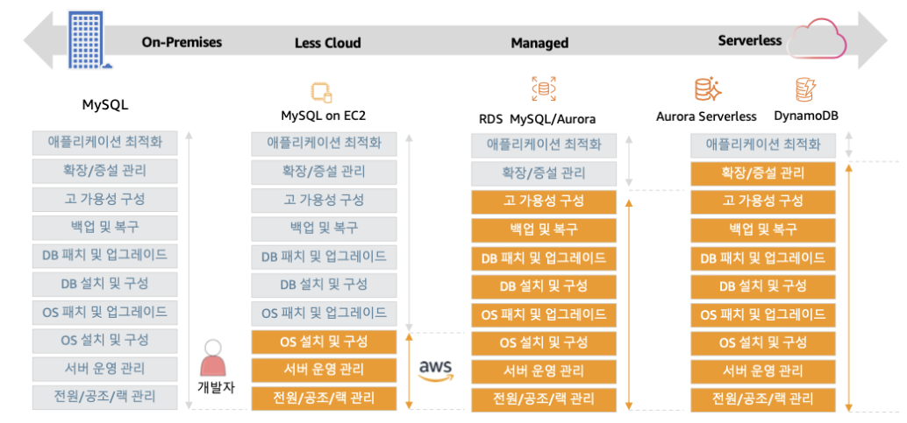
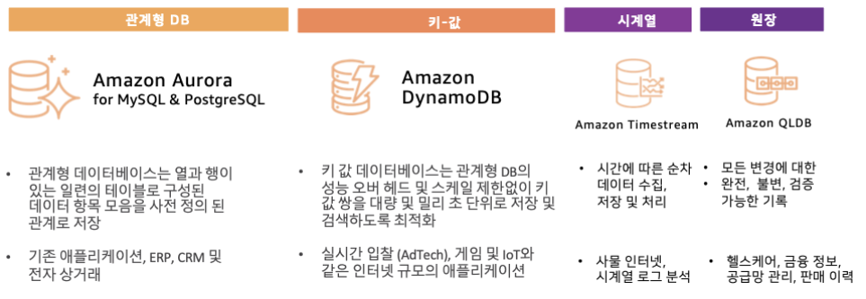
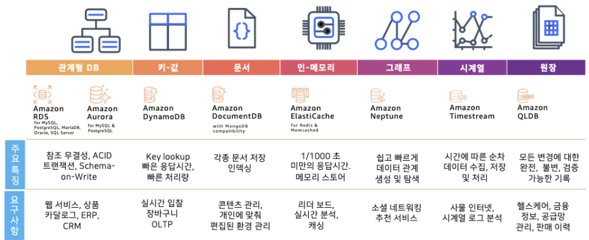
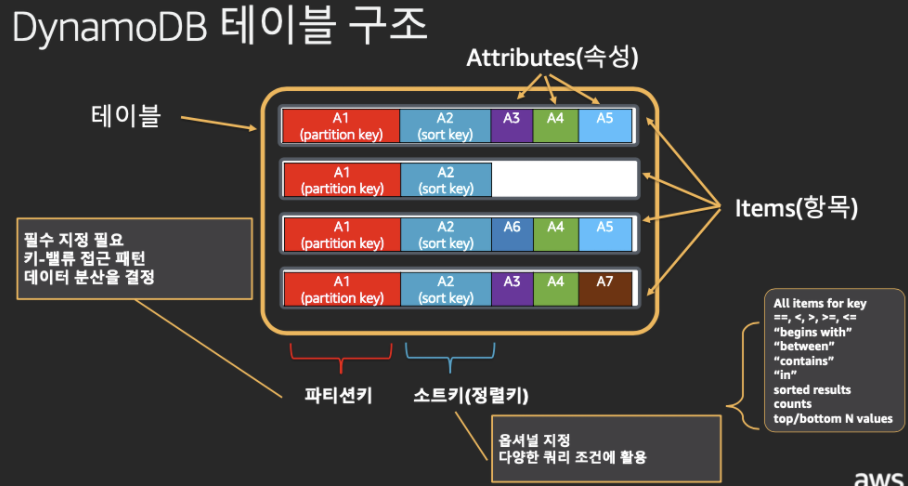
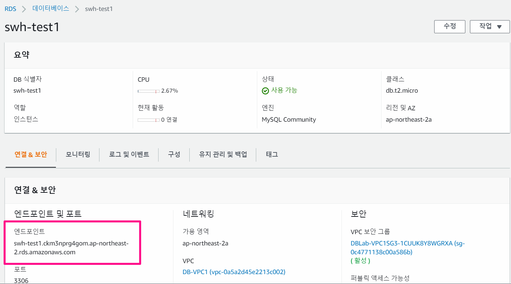

#  Cloud DB

- Cloud DB의 변천사
  - EC2 에 배포 
    - 세부사항까지 개발자가 직접 구성할 수 있으나, 그만큼 작업량이 많아짐
  - RDS 로 배포
    - 개발자는 확장/증설과 애플리케이션 최적화만 신경쓰면 되도록 함
    - 적절한 시기에 서버를 증설해주지 않는다면, 서버가 터질 수 있음
  - Serverless 로 배포
    - 애플리케이션이 최적화만 신경쓰면 됨

## 서버리스 DB

- 특징
  - 서버 및 클러스터 관리 전혀 필요 없음
  - 사용량에 따라 자동을 확장 가능
  - 고 가용성 및 자동 장애 복구 지원
  - 컴퓨팅 사용량 기준으로만 과금
- AWS 서비스 종류

# AWS 데이터베이스 서비스

## Amazon Aurora

- 클라우드를 위해 구축된 MySQL 및 PostgreSQL 호환 관계형 데이터베이스
- 1/10의 비용으로 상용 데이터베이스 수준의 성능 및 가용성 제공
- 특징
  - 완전 관리형
    - 하드웨어 프로비저닝, 소프트웨어 패치, 설정, 구성, 백업과 같은 DB 관리 작업 제공
  - 성능 및 확장성
    - 표준 MySQL보다 5배, PostgreSQL 보다 3배 빠른 성능을 제공
    - 15개의 읽기 전용 복제본으로 확장 가능
  - 가용성 및 내구성
    - 내결함성을 갖춘 자가 복구 분산 스토리지
    - 3개의 가용영역에 걸친 6개의 복사본
    - Amazon S3로의 지속적인 백업
  - 보안 및 암호화
    - Amazon VPC를 통한 네트워크 격리
    - 저장 및 전송 중 데이터 암호화

### Aurora Serverless

- 작동 특징
  - 요청시 기동, 사용하지 않을 때 종료
  - 자동으로 용량 조정
  - 유연한 확장 구조
  - 초방 지불, 최소 1분
  - 자주 사용하지 않거나 예측할 수 없거나 주기적인 워크로드에 적합
  - HTTP 를 통해 쿼리를 실행하기 위한 데이터 API 제공
- 동작 방식
  1. 트래픽 변화 인지
     - 70% CPU 사용시 또는 90% 최대 커넥션 시
  2. 스케일 업/ 다운
     - 스케일 용량 대상 선택
     - 풀에서 해당 인스턴스 선택
     - 인스턴스 교체
  3. 무중단 서비스
     - 워크로드의 지속적인 운영
     - 신규 인스턴스 작업
  4. 자동 확장/축소

## DynamoDB

- 어떤 규모에서든 빠르고 유연한 key-value NoSQL 데이터 베이스
- 특징
  - 규모와 관계없이 일관된 성능
    - 어던 규모에서도 일관되게 수 밀리초 미만의 응답 시간 제공
    - 거의 무제한의 처리량 필요한 애플리케이션 구축 가능
  - 서버리스
    - 서버 프로비저닝, 소프트웨어 패치 적용 및 관리 불필요
    - 용량에 맞게 테이블 자동 확장/축소하여 성능 유지
  - 통합적인 보안 기능 제공
    - 데이터 암호화(기본사항)
    - 강력한 보안을 위해 AWS ID 및 액세스 관리와 완벽하게 통합
  - 글로벌 서비스를 위한 데이터베이스
    - 여러 aws 리전으로 테이블을 쉽고 빠르게 복제하여 빠르게 액세스 가능한 글로벌 애플리케이션 구축
- DyanmoDB 구조

- 용량 관리 방법
  1. 용량 수동 설정
     - 모니터링에 따라 필요 용량 수동 조절
     - 사용하지 않아도 최소 읽기/ 쓰기 용량 설정 필요
  2. 용량 자동 설정
     - 목표 사용량 및 최대/최소 사용량 설정
     - 사용하지 않아도 최소 읽기/ 쓰기 용량 설정 필요
-  On-Demand 기능
  - 트래픽에 따른 용량 모니터링이나 확장 설정등이 필요 없음
  - 트래픽 상승 및 하강시 읽기/쓰기별 워크로드 자동 수용
  - 수 밀리초 지연 시간 보장(SLA) 및 동일한 보안 기능 제공
  - 미리 최소 용량 설정이 필요 없으며, 최대 용량 제한 없이 요청당 요금지불 가능

## RDS

- **AWS RDS는 인프라 및 데이터베이스 업데이트를 관리해주는 것 뿐만 아니라 까다로운 관계형 데이터베이스의 설치, 운영 그리고 관리를 지원하는 서비스**
  - Amazon RDS는 현재 MySQL, Oracle, SQL Server, PostgreSQL, MariaDB, Aurora(MySQL과 호환)을 비롯한 총 6가지 데이터베이스 엔진을 지원
- EC2를 사용하지 않고, RDS를 사용함으로써 얻을 수 있는 장점과 단점
  - AWS에 지불하는 비용만 놓고 비교하면 EC2에 사용 중인 데이터베이스를 직접 설치하는 것이 확연히 저렴하고, 성능도 훨씬 좋을 수 있음. 하지만,
    - RDS를 사용할 경우 빠른 시간 내에 가치를 이룸으로써 생기는 비용 절감
    - 사용 중인 데이터베이스 대신에 RDS를 사용하게 되면, OS 및 데이터베이스의 설치 및 관리 그리고 업데이트를 따로 할 필요가 없어짐
    - RDS를 사용함으로써 더 이상 스토리지의 [LUN](https://bespinglobal.com/cloud-terms-lun/)을 구성하고 더 나은 [I/O](https://bespinglobal.com/cloud-terms-io/)를 위해 [스트라이핑(Striping)](https://bespinglobal.com/cloud-terms-striping/)을 최적화하는 데 시간과 노력을 쓸 필요가 없어짐
  - AWS RDS 요금 정책은 다소 어렵고 복잡하여 정확한 요금예측이 어려울 수 있음

- Amazon RDS Multi-AZ
  - 평상시에 다른 AZ에 백업본 구성
  - AZ로 주 DB 장애 시 백업 DB가 동작
    - 엔드 포인트의 변경없이 무중단 서비스 가능
    - 하지만, 백업본은 주DB가 문제가 생겼을 때만 작동
- Amazon RDS Read Replica
  - 평상시에 DB 동기화
  - 평상 시 읽기 Endpoint URL(Quert = SELECT)는 Read Replica 사용 가능(AWS RDS는 최대 5 Copy 가능)
    - 서비스 분산 목적
    - Endpoint 주소는 생성된 RDS의 연결&보안 탭에서 확인할 수 있음

### 참고자료
- https://docs.aws.amazon.com/ko_kr/AmazonRDS/latest/UserGuide/USER_MySQL.Replication.ReadReplicas.html