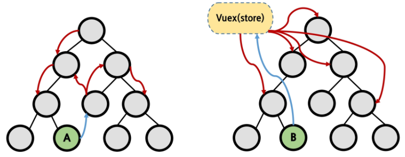

# Vuex

- Vuex는 Vue.js 애플리케이션에 대한 **상태관리패턴 + 라이브러리**
- 상태를 전역 저장소로 관리할 수 있도록 지원하는 라이브러리
  - 예측 가능한 방식으로 상태를 변경될 수 있도록 보장하는 규칙 설정
  - 애플리케이션의 모든 컴포넌트에 대한 **중앙집중식 저장소** 역할
- Vue의 공식 devtools 확장프로그램과 통합
  - 설정 시간이 필요없는 디버깅 및 상태 스냅샷 내보내기/ 가져오기와 같은 고급 기능을 제공


## State

- State는 data이며, 해당 어플리케이션의 핵심이 되는 요소
- 각 컴포넌트에서 관리(.html의 경우 `new Vue({})`, SFC에서는 `.vue`에 해당)
- DOM은 data(state)에 반응하여 DOM을 랜더링 


## Pass props 와 Emit event의 단점

- 각 컴포넌트는 독립적으로 데이터를 관리했음
- 데이터는 단방향 흐름으로 부모 -> 자식 간의 전달만 가능하며 반대의 경우 이벤트를 통해 전달
- 장점
  - 데이터 흐름을 직관적으로 파악 가능
- 단점
  - 컴포넌트 중첩이 깊어지는 경우 동위 관계의 컴포넌트로의 데이터 전달이 불편해짐




### in Vuex

- 중앙 저장소에서 state를 모아놓고 관리
- 규모가 큰 (컴포넌트 중첩이 깊은) 프로젝트에서 매우 편리
- 각 컴포넌트에서는 중앙 집중 저장소의 state만 신경쓰면 됨
- 이를 공유하는 다른 컴포넌트는 알아서 동기화


## Vuex 의 핵심 컨셉

### 단방향 데이터 흐름 

- 단방향데이터 흐름이란
  - 상태(state)는 앱을 작동하는 원본 소스(data)
  - 뷰(View)는 상태의 선언적 매핑
  - 액션(action)은 뷰에서 사용자 입력에 대해 반응적으로 상태를 바꾸는 방법(methods)
- 단방향 데이터 흐름의 단점
  - 공통의 상태를 공유하는 여러 컴포넌트가 있는 경우 빠르게 복잡해짐
  - 예를 들면, 지나치게 중첩된 컴포넌트를 통과하는 prop


### 상태관리패턴

- 컴포넌트의 공유된 상태를 추출하고 이를 전역에서 관리 하도록 함
- 컴포넌트는 커다란 뷰가 되며 모든 컴포넌트는 트리에 상관없이 상태에 엑세스하거나 동작을 트리거 할 수 있음
- 상태 관리 및 특정 규칙 적용과 관련된 개념을 정의하고 분리함으로써 코드의 구조와 유지관리기능 향상


## Vuex의 구성요소

1. State
2. Actions
3. Mutations
4. Getters


### State

- 중앙에서 관리하는 모든 상태 정보 (**data**)
- Mutations에 정의된 메서드에 의해 변경
- 여러 컴포넌트 내부에 있는 특정 State를 중앙에서 관리
  - 이전의 방식은 state를 찾기 위해 각 컴포넌트를 직접 확인
  - Vuex를 활용하는 방식은 Vuex Store에서 컴포넌트에서 사용하는 state를 한눈에 파악 가능
- state가 변화하면 해당 state를 공유하는 컴포넌트의 DOM은 알아서 렌더링

- 작동
  - 컴포넌트는 이제 Vuex Store에서 State 정보를 가져와 사용
  - `dispatch()`를 사용하여 Actions 내부의 메서드를 호출


### Action

- Component에서 `dispatch()` 메서드에 의해 호출
- state를 직접 변경하지 않고, mutations에 정의된 메서드를 호출하여 변경
- **데이터 fetch 및 처리 & 가공, 비동기 작업을 진행**함
  - Backend API와 통신하여 **Data Fetching** 등의 작업을 수행
  - 동기적인 작업 뿐만 아니라 **비동기적인 작업**을 포함 가능
- 항상 **context** 가 인자로 넘어옴
  - store.js 파일 내에 있는 모든 요소에 접근해서 속성 접근 & 메서드 호출이 가능
  - 단,(가능하지만) state를 직접 변경하지 않음
- mutations에 정의된 메서드를 **commit 메서드**로 호출
- state는 오로지 mutations 메서드를 통해서 조작
  - 명확한 역할 분담을 통해 서비스 규모가 커져도 state를 올바르게 관리하기 위함


### Mutations

- Actions에서 `commit()` 메서드에 의해 호출
- **state를 변경하는 로직**
- 비동기적으로 동작하면 state가 변화하는 시점이 달라질 수 있기 때문에 **동기적인 코드만 작성**
- mutations에 정의하는 메서드의 첫번째 인자로 **state**가 넘어옴


### Getters

- state를 변경하지 않고 활용하여 계산을 수행(computed와 유사)
  - **실제 계산된 값을 사용하는 것처럼 getters는 저장소의 상태(state)를 기준으로만 계산**
  - 예를 들어, state에 todo list의 해야할일의 목록의 경우 todo가 완료된 목록만 필터링해서 보여줭햐ㅏ는 경우가 있음
  - gettters에서 completed의 값이 true인 요소가 필터링 되서 계산된 값을 담아놓을 수 있음
- getters 자체가 state 자체를 변경하지는 않음
  - state를 특정한 조건에 따라 구분(계산)만 함
  - 즉, 계산된 값을 가져옴


## 언제 사용해야할까?

- Vuex 는 공유된 상태 관리를 처리하는데 유용하지만, 개념에 대한 이해와 시작하는 비용이 크다는 것을 인지해야함

- 앱이 단순하다면 Vuex 없이 괜찮음 
  - 간단한 글로벌 이벤트 버스만 있으면 됨
- 중대형 규모의  SPA 를 구축하는 경우 Vue컴포넌트 외부의 상태를 보다 잘 처리할 수 있는 방법으로써  Vuex 를 선택하는 단계가 옴 


## vuex 컴포넌트 바인딩 헬퍼

- https://vuex.vuejs.org/kr/api/#%E1%84%8F%E1%85%A5%E1%86%B7%E1%84%91%E1%85%A9%E1%84%82%E1%85%A5%E1%86%AB%E1%84%90%E1%85%B3-%E1%84%87%E1%85%A1%E1%84%8B%E1%85%B5%E1%86%AB%E1%84%83%E1%85%B5%E1%86%BC-%E1%84%92%E1%85%A6%E1%86%AF%E1%84%91%E1%85%A5
- 5 가지 종류
  - mapState
  - mapGetters
  - mapActions
  - mapMutations
  - createNamespacedHelpers
- 목적 
  - 컴포넌트에서 vuex 와 연동하면서 생기는 반복적인 코드 줄이기


###  mapstate

- 역할 : computed와 state를 매핑
- 사용법
  - `import { mapState} from 'vuex'`
  - computed 안에
    - `...mapState([ '쓰고싶은state' ])`


### mapGetters

- 역할 : computed와 Getters 매핑
- 사용법
  - `import { mapGetters } from 'vuex'`
  - computed 안에
    - `...mapGetters([ '쓰고싶은getters' ])`


### mapActions

- 역할 :  methods랑 actions이랑 매핑
- 사용법
  - `import { mapActions } from 'vuex'`
  - methods 안에
    - `...mapActions([ '쓰고싶은actions' ])`
  - payload를 넘겨줘야하는 상황인 경우 저대로 하면 넘길 수 없음
    - `button @click="이벤트(payload)">`
    - 형태로 호출할 때 인자로 넣어줌


## 브라우저의 로컬 스토리지 사용

- 로컬 스토리지란?

  - 쿠키나 세션같이 값을 저장하는 공간
    - 자동 로그인 등
  - 키-밸류 스토리지 형태
  - 로컬 스토리지의 데이터는 사용자가 지우지 않는 이상 계속 브라우저에 남아있음
    - 비슷한 역할을 하는 세션 스토리지의 경우 윈도우나 브라우저 탭을 닫을 경우 제거됨
  - 로컬 스토리지와 세션 스토리지는 window 객체 안에 들어있음
    - Storage 객체 상속을 받기 때문에 메소드가 공통적으로 존재ㅉ
    - 도메인 별 용량 제한도 있음(모바일의 경우 2.5mb, 데스크탑은 5~10mb)
      - 그래서 만약 부족하다면 50mb 를 기본적으로 저장할 수 있는 IndexedDB를 활용

- 쉽게 다룰 수 있는 플러그인 - vuex-persistedstate

- 설치방법
  - `npm i vuex-persistedstate`

    - https://www.npmjs.com/package/vuex-persistedstate

  - `store > index.js`

    - `import createPersistedState from "vuex-persistedstate";`

    - ```js
      export default new Vuex.Store({
        plugins : [
          createPersistedState(),
        ],
        ...
      ```

- 설치하면 무엇이 바뀌는가?

  - 새로고침을 하더라도 값이 다 초기화되지 않음
  - 그럼 어디에다가 값을 저장하고 있는 것인가?
    - f12- application - Local Storage 으로 들어가서 확인하기
    - vuex라는 키가 생겨있는 것을 확인할 수 있음
      - state를 여기다가 저장중