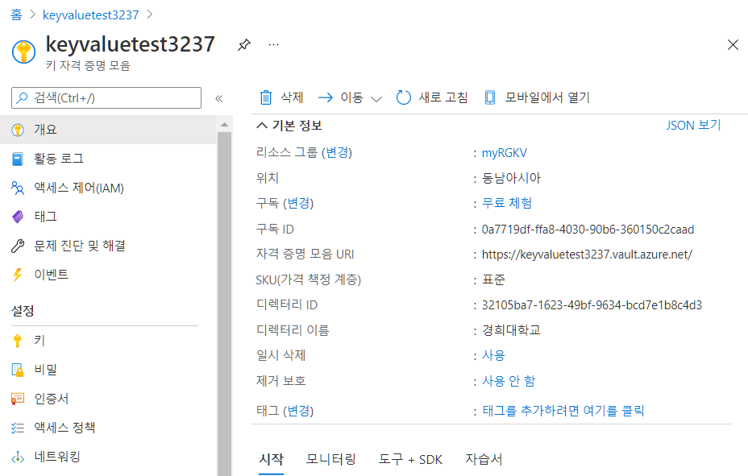
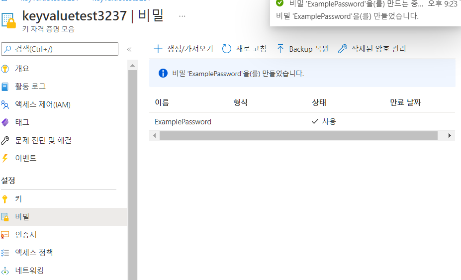
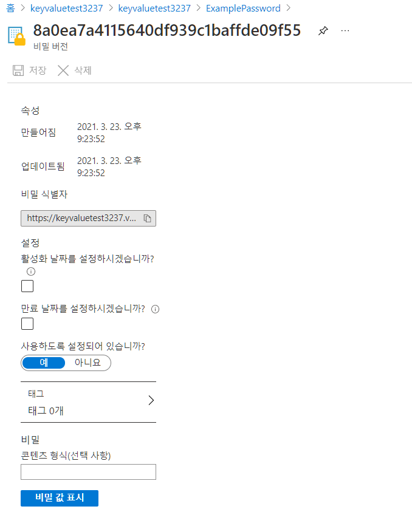

- 키 자격 증명의 역할
  - 애플리케이션 내에서 중요한 정보를 안전하게 액세스
  - 키, 암호 및 인증서는 코드를 직접 작성 하지 않고도 보호 되며 응용 프로그램에서 쉽게 사용할 수 있습니다.
    - 비밀번호를 안전하게 보호해서 RestAPI 같은 것으로 보내는 데 사용할 수 있다.
    - 비밀 번호를 보호하는 방법 등으로 사용할 수 있다.

- 오늘 실습 내용
  - 키 자격 증명 만들기
  - 자격 증명에 비밀 만들기
  - 비밀 내용 확인해보기

# 1. 키 자격 증명 만들기

1. `키 자격 증명 모음`검색

   - 만들기
     - 구독 - 무료체험
     - 리소스 그룹 - 새로만들기 - myRGKV
     - 주요 자격 증명 모음 이름 - unique 해야함
       - keyvaluetest3237
     - 지역 - 동남아시아
     - 가격 책정 계층 -표준
     - 삭제된 자격 증명 모음 보존 일 수 - 90일
     - 제거보호 - 보호제거사용안함

   

# 2. 키 자격 증명 모음 정보 확인

# 3. 키 자격 증명 모음에 비밀 추가

1. 설정 - 비밀 - 생성/가져오기

   - 업로드 옵션 - 수동
   - 이름 - ExamplePassword
   - 값 - hVFkk96
   - 콘텐츠 형식, 활성화 날짜, 만료날짜 체크 x
   - 사용하도록 설정되어 있습니까 - 예

2. ExamplePassword 클릭

   

