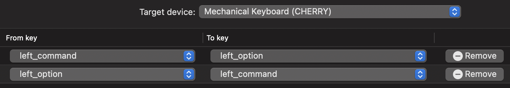

# 1. 맥북 기본 설정 하기

-  키보드
	-  키보드
		-  키반복 : 빠르게
		-  반복 지연 시간 : 짧게
	-  텍스트
		- 맞춤법 자동 수정 : 해제
		- 자동으로 문장 대문자로 시작 : 해제
		- 스페이스를 두 번 눌러 마침표 추가 : 해제
		- 스마트 인용 부호 및 대시 사용 : 해제

-   트랙패드
	-  Trackpad > Point & Click > Tab to click: 체크함

- 손쉬운 사용
	- 포인트 제어기
		- 트랙패드 옵션 > 드래그 활성화 : 세손가락으로 드래그하기
        
- 배터리
	- 배터리 > 디스플레이 끄기  - 안함 으로 설정

- 사운드
    - 사운드효과 > 시작 시 사운드 재생 : 체크 해제
        - 켜질 때 징 하고 소리나는거 제거

- 파인더 설정
  - 환경설정 > 일반 
	  - 새로운 Finder 윈도우에서 보기 : home folder 로 변경
  - 환경설정 > 고급 
	  - 모든 파일 확장자 보기 : 체크
  - 보기
	  - 상태 막대 보기
	  - 경로 막대 보기

	  
```shell
#!/usr/bin/env zsh

# macOS는 각종 설정을 보통 ~/Library/Preferences 폴더에 .plist 파일로 관리합니다. 시스템 및 파인더 설정도 동일한 방식을 사용하고 defaults 명령어로 설정할 수 있기 때문에 스크립트로 자동화 할 수 있다. - 스크립트 설정 후 반드시 시스템을 재시작해야 변경사항이 적용되고,
# 언어 및 지역, 보안 은 스크립트로 설정할 수 없어 수동으로 해주어야함

# 실행방법 : 밑에 코드로 파일 만들고, 
# /bin/zsh -c 파일
# 로 실행하기

logger() {
  local variant="${1:-info}"
  local message="${2:-}"

  if [ -z "$message" ]; then
    return
  fi

  case "$variant" in
    info)
      printf "\033[34m%-8s\033[0m %s\n" "info" "$message"
      ;;
    success)
      printf "\033[32m%-8s\033[0m %s\n" "success" "$message"
      ;;
    warning)
      printf "\033[33m%-8s\033[0m %s\n" "warning" "$message"
      ;;
    error)
      printf "\033[31m%-8s\033[0m %s\n" "error" "$message"
      ;;
  esac
}

() {
  logger "info" "Setting macOS system ..."
  
  ## Dock & Menu Bar > Automatically hide and show the Dock (enable)
  logger "info" "✅ [Dock] Automatically hide and show the Dock"
  defaults write com.apple.dock autohide -bool true

  ## Mission Control > Automatically rearrange Spaces based on most recent use (disable)
  logger "info" "✅ [Mission Control] Disable Automatically rearrange Spaces based on most recent use"
  defaults write com.apple.dock mru-spaces -bool false

  ## Keyboard > Text > Correct spelling automatically (disable)
  logger "info" "✅ [Keyboard] Disable correct spelling automatically"
  defaults write NSGlobalDomain NSAutomaticSpellingCorrectionEnabled -bool false

  ## Keyboard > Text > Capitalize words automatically (disable)
  logger "info" "✅ [Keyboard] Disable capitalize words automatically"
  defaults write NSGlobalDomain NSAutomaticCapitalizationEnabled -bool false

  ## Keyboard > Text > Add period with double-space (disable)
  logger "info" "✅ [Keyboard] Disable add period with double-space"
  defaults write NSGlobalDomain NSAutomaticPeriodSubstitutionEnabled -bool false

  ## Keyboard > Text > Use smart quotes and dashes (disable)
  logger "info" "✅ [Keyboard] Disable use smart quotes and dashes"
  defaults write NSGlobalDomain NSAutomaticQuoteSubstitutionEnabled -bool false
  defaults write NSGlobalDomain NSAutomaticDashSubstitutionEnabled -bool false

  ## Keyboard > Shortcut > Use keyboard navigation to move focus between controls (enable)
  logger "info" "✅ [Keyboard] Use keyboard navigation to move focus between controls"
  defaults write NSGlobalDomain AppleKeyboardUIMode -int 3

  ## Trackpad > Point & Click > Tab to click (enable)
  logger "info" "✅ [Trackpad] Enable tab to click"
  defaults write com.apple.AppleMultitouchTrackpad Clicking -bool true
  defaults write com.apple.driver.AppleBluetoothMultitouch.trackpad Clicking -bool true
  # Enable tap at login as well
  defaults -currentHost write NSGlobalDomain com.apple.mouse.tapBehavior -int 1
  defaults write NSGlobalDomain com.apple.mouse.tapBehavior -int 1

  ## Accessibility > Pointer Control > Trackpad options... (Enable dragging - three finger drag)
  logger "info" "✅ [Trackpad] Enable dragging - three finger drag"
  defaults write com.apple.AppleMultitouchTrackpad Dragging -bool false
  defaults write com.apple.AppleMultitouchTrackpad TrackpadThreeFingerHorizSwipeGesture -int 0
  defaults write com.apple.AppleMultitouchTrackpad TrackpadThreeFingerVertSwipeGesture -int 0
  defaults write com.apple.AppleMultitouchTrackpad TrackpadThreeFingerDrag -bool true
  defaults write com.apple.driver.AppleBluetoothMultitouch.trackpad Dragging -bool false
  defaults write com.apple.driver.AppleBluetoothMultitouch.trackpad TrackpadThreeFingerHorizSwipeGesture -int 0
  defaults write com.apple.driver.AppleBluetoothMultitouch.trackpad TrackpadThreeFingerVertSwipeGesture -int 0
  defaults write com.apple.driver.AppleBluetoothMultitouch.trackpad TrackpadThreeFingerDrag -bool true
  defaults -currentHost write .GlobalPreferences com.apple.trackpad.threeFingerHorizSwipeGesture -int 0
  defaults -currentHost write .GlobalPreferences com.apple.trackpad.threeFingerVertSwipeGesture -int 0
  defaults -currentHost write .GlobalPreferences com.apple.trackpad.threeFingerDragGesture -bool true

  logger "info" "Setting finder ..."

  # New Finder windows show (set home)
  logger "info" "✅ [Finder] Set New Finder windows show - Home"
  defaults write com.apple.finder NewWindowTarget -string 'PfHm'
  defaults write com.apple.finder NewWindowTargetPath -string "file://$HOME/"

  # Show all filename extensions (enable)
  logger "info" "✅ [Finder] Show all filename extensions"
  defaults write NSGlobalDomain AppleShowAllExtensions -bool true

  # Show Path Bar (enable)
  logger "info" "✅ [Finder] Show Path Bar"
  defaults write com.apple.finder ShowPathbar -bool true

  logger "success" "Please restart macOS ..."
}
```  

## 1.2 키입력 변경
**₩ 대신 backtick 입력하기**
```shell
mkdir ~/Library/KeyBindings

cat <<EOF > ~/Library/KeyBindings/DefaultkeyBinding.dict
{
  "₩" = ("insertText:", "\`");
  "~₩" = ("insertText:", "₩");
}
EOF
```
터미널에서 입력하고, OS 재시작하기


**한/영전환 딜레이 없애기**

CapsLock이 한/영 전환키이기 때문에 전환 딜레이가 있어 의도치 않게 한글 또는 영어가 입력되는 경우가 있어서 변경 - m1 pro 할 때는 안해줘도 됨

- karabiner-Element 설치
	- https://karabiner-elements.pqrs.org
- karabiner에서 설정하기
	- CapsLock을 F19 (사용하지 않는 키)로 맵핑
- 설정 - 키보드에서 설정하기
	- Input Soure 전환 키를 F19(CapsLock)으로 설정


## 외장키보드 설정



# 기본 프로그램 설치

## iTerm2
https://iterm2.com/

### profile 설정

- Profiles > General > Working Directory: Reuse previous session's directory
- Profiles > Text > Unicode normalization form: None -> NFC  (파일명 또는 디렉토리의 한글 자/모가 분리되는 현상 방지)
- Profiles > Terminal > Scrollback lines: 100,000 (지난 결과 더 보기 버퍼를 늘리기)
- 상태바 추가
	- Profile > Session: Status bar enabled 체크
		- Configure Status Bar 선택하여 원하는 항목 드레그 추가: CPU / Memory / Network / Clock 등
		- `/expression` 밑에 가져두고, configure Component 메뉴 누르고, string value `\(user.cpu)` 쓰고 OK
			- 밑에 `\(user.cpu)`를 누르면 작동할 함수를 정의
		- Auto-Rainbow: Automatic
	- Appearance > General > Status bar location: Top -> Bottom

```shell
cat <<'EOF' >> ~/.zprofile


iterm2_print_user_vars() {
  CPU=$(uname -m)
  iterm2_set_user_var cpu $CPU
}

EOF
```


## HomeBrew

- x86_64와 arm64 두 가지 brew를 모두 설치하고 실행 중인 터미널 환경에 맞는 brew가 실행되도록 ~/.zprofile에 분기 설정을 합니다. 그리고 arm64 터미널에서 x86_64만 지원하는 프로그램을 설치할 수 있도록 ibrew alias를 추가합니다.

```shell
# install homebrew (arm64)
arch -arm64 /bin/bash -c "$(curl -fsSL https://raw.githubusercontent.com/Homebrew/install/master/install.sh)"
# install homebrew (x86_64)
arch -x86_64 /bin/bash -c "$(curl -fsSL https://raw.githubusercontent.com/Homebrew/install/master/install.sh)"

# set homebrew env
cat <<'EOF' >> ~/.zprofile
CPU=$(uname -m)
if [[ "$CPU" == "arm64" ]]; then
  eval "$(/opt/homebrew/bin/brew shellenv)"
else
  export PATH=/opt/homebrew/bin:$PATH
  eval "$(/usr/local/bin/brew shellenv)"
fi

alias ibrew="arch -x86_64 /usr/local/bin/brew"
alias abrew="arch -arm64 /opt/homebrew/bin/brew"

EOF
```


## git
```shell
brew install git git-lfs

git lfs install
git config --global user.name "Your Name"
git config --global user.email "you@your-domain.com"

# mac에서 한글 파일명을 정상으로 처리하기 위해 추가옵션 설정
git config --global core.precomposeunicode true
git config --global core.quotepath false
```

## oh-my-zsh

```shell
sh -c "$(curl -fsSL https://raw.githubusercontent.com/ohmyzsh/ohmyzsh/master/tools/install.sh)"

git clone https://github.com/zsh-users/zsh-syntax-highlighting.git ${ZSH_CUSTOM:-~/.oh-my-zsh/custom}/plugins/zsh-syntax-highlighting

git clone git://github.com/zsh-users/zsh-autosuggestions $ZSH_CUSTOM/plugins/zsh-autosuggestions

```

```shell
vi ~/.zshrc

plugins=(
  git
  zsh-syntax-highlighting
  zsh-autosuggestions
)

# 수정이후
# source ~/.zshrc 명령어 실행하기
```

## Openinterminal
- 파인터에서 바로 터미널을 열고 싶을 때 클릭 한번으로 열 수 있는 도구 ( 고 ⌘ + 드래그로 파인더 도구막대에 앱 바로가기를 추가 가능)

```shell
brew install --cask openinterminal
```
 System Preferences -> Extensions -> Finder Extensions 권한 체크
 openinterminal 설정 > Apply to Finder Toolbar Menu 랑 Apply to Finder Context Menu 체크
 


## node 설치
```shell
brew install node@14

# yarn 설치
npm install yarn --location=global

```

## python 설치
- python 은 호환이 안되는 것이 많아 x86으로 깔아야한다.
```shell
ibrew install python@3.8
```

## IDLE 설치

### pycharm
https://www.jetbrains.com/ko-kr/

- 설치 플러그인
	1. rainbow bracket
	2. pylint
	3. key promoter x
	4. pydantic

### webstorm
https://www.jetbrains.com/ko-kr/webstorm/download/#section=mac

- 설치 플러그인
	1. rainbow bracket
	2. indent rainbow
	3. jsonToTypeScript

## docker 설치

https://www.docker.com/get-started

- 이걸로 redis, mongo 등 다 띄움


## db Viewer
- mongo Compass
	- https://www.mongodb.com/products/compass
	- arm 용을 따로 지원하지 않아서 아직 느림
- medis( redis 뷰어 )


## markdown Editor
- typora를 사용했었지만, 베타가 끝나고 유료화로 바뀌어서 VSCode로 변경
- VScode 세팅법
  - vscode Extension 다운로드
  	- markdown all in one
    - markdown paste 
      - Markdown Paste: Path = `./${fileBasenameNoExtension}/`
        - 현재 마크다운 파일 위치에 마크다운파일과 동일한 폴더를 만들고 그 안에 넣음 
      - 사진 복사 붙여넣기 방법 : `cmd` + `option` + `v`
      
      
## Aldente
https://apphousekitchen.com/
- 무료버전만 써도 충분함
- 맥북을 항상 충전기 꽂아놓고 쓰는 사람들을 위한 것
  - 배터리를 오래 쓰기 위해서 배터리를 60~80% 정도로 맞춰놓고 사용
  - 이 어플 사용시 
  	- 맥북 설정 > 배터리 > 최적화된 배터리 충전 끄기
    - Aldente 설정 > 시작시 자동 실행
  - 설치 후 현재 배터리가 100% 라면 방전 버튼을 눌러서 방전시켜 사용
  - 만약 어플을 삭제할 경우 충전 한도를 100% 로 바꾼 이후 삭제해야함 주의
  

## Scroll reserver
- 마우스를 사용시 거꾸로 스크롤 되는 것 제어
https://pilotmoon.com/scrollreverser/


## App Cleaner
- 어플을 편하게 깨끗이 제거하는데 도움
https://freemacsoft.net/appcleaner/


# Chrome 세팅

- Whatfont
사이트에서 사용한 폰트를 클릭해서 알아볼 수 있다.

- ColorZilla
사이트에서 사용한 색이 무슨색인지 알 수 있다.

- JSON Viewer
JSON 형식을 이쁘게 볼 수 있게 해준다. 이와 함께 Online JSON Viewer 사이트도 같이 사용한다.

- Octortree
깃허브에서 저장소의 파일 트리를 제공해준다. 원래는 클릭을 통해서 디렉토리를 왔다 갔다했었는데, 좌측에 파일 트리가 생겨서 마치 vscode처럼 사용할 수 있다.

