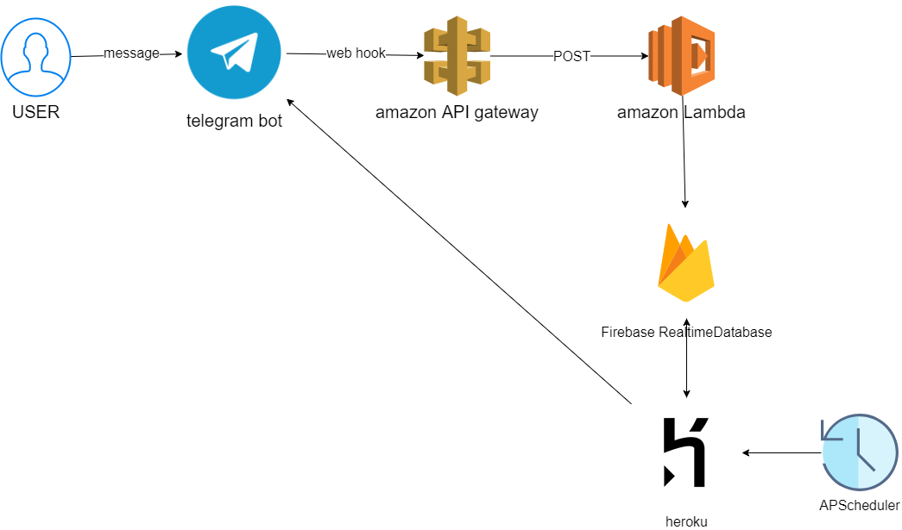

undefined

# 완성한 서비스의 구성

1. 텔레그램 봇 구성
web hook을 활용하여, amazon API gateway 에서 그 신호를 받고 amazon Lambda를 실행하여 발생할 수 있는 요금을 최소화하여 구성

2. 데이터 베이스 - Firebase Realtime DataBase
코로나 알림을 받을 사용자들 id, 전날 코로나 확진자수 내용 저장

3. 스케쥴 작업
heroku 에서 APScheduler를 활용하여 특정시간에 함수가 작동할 수 있도록 구성

# 만들면서 고민한 사항
- telegram bot을 상시 활동상태로 만들기 위해 여러가지 방법이 있었다. 

  1. getUpdates()를 주기적으로 호출(loop) 하면서 새로운 메세지가 도착했는지 확인(teleport, python-telegram-bot 라이브러리 활용)

     프로그램 코드를 올릴 '서버'가 필요 - EC2 , 라즈베리파이, Digital Ocean같은 곳의 VPS 등

     - 단점 : 챗봇과 메세지를 주고 받을 때보다 안그럴 때가 많다면 자원 낭비가 심하다

  2. 웹훅 - 메시지가 도착했을 때 주소를 호출

     AWS API Gateway - 웹훅할 주소 생성 및 lambda 실행 연결

     AWS Lambda - 서버없이 서비스를 구현할 수 있도록 만든 서비스

     - 메시지가 도착했을 때만 실행 - 자원 낭비 최소화
     
 
