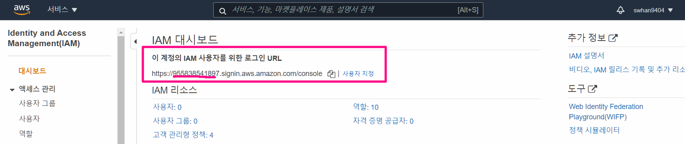
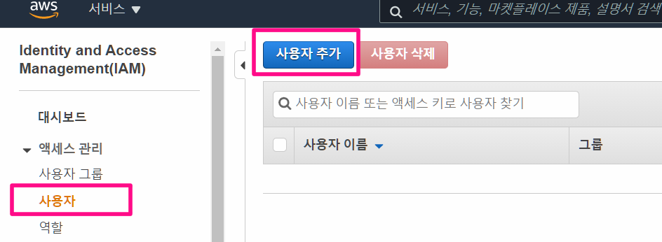
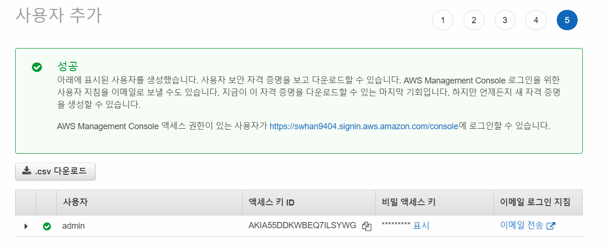
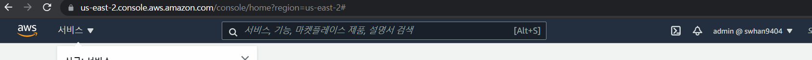
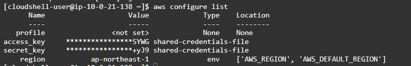

- 실습 목적
  - IAM User 만들기
  - IAM User로 로그인하고 권한 사용해보기

# 로그인 URL 별칭 만들기

- AWS 웹 콘솔 → IAM → 별칭 생성 ⇒ 전 세계 유일한 별칭으로 입력 → 이후 해당 로그인 URL로 접속하여 IAM User 로그인 하자
  - 설정을 하지 않았다면, 숫자로 표기되어 있어서 접근하기 어렵다

# 사용자 만들기

## Full-admin 권한 계정 만들기

- 사용자 추가
  - 사용자 이름 : admin
  - 액세스 유형 : ✔️ 프로그래밍 방식 액세스 , ✔️ AWS MgMt Console 액세스
  - 콘솔 비밀번호 : 사용자 지정 비밀 번호 → 아래 비밀번호 지정
  - 비밀번호 재설정 필요 : 해제
- 권한 설정
  - 기존정책직접연결
    - [AdministratorAccess](https://console.aws.amazon.com/iam/home?region=ap-northeast-2#/policies/arn%3Aaws%3Aiam%3A%3Aaws%3Apolicy%2FAdministratorAccess)
- 주의할 점
  - admin이 console에 접근하기 위해서 사용하는 access key (아이디와 패스워드)는 이번 한번만 표시됨
  - 따로저장하지 않거나 기록해놓지 않고 닫기를 누르게 되면 이 정보는 다시 볼수 없게 되니 주의
  - csv 파일을 밑에 실습을 위해 다운받기

## 보는 것만 가능한 view-user 만들기

- 사용자 추가

  - 사용자 이름 : viewuser
  - 액세스 유형 : ✔️ AWS MgMt Console 액세스
  - 콘솔 비밀번호 : 사용자 지정 비밀 번호 → 아래 비밀번호 지정
  - 비밀번호 재설정 필요 : 해제

- 권한 설정

  - 기존정책직접연결
    - [ViewOnlyAccess](https://console.aws.amazon.com/iam/home?region=ap-northeast-2#/policies/arn%3Aaws%3Aiam%3A%3Aaws%3Apolicy%2Fjob-function%2FViewOnlyAccess)

  

# IAM 계정으로 로그인하기

- 로그인 콘솔 접근 2가지 방법
  1. https://swhan9404.signin.aws.amazon.com/console 와 같이 별칭이 지정된 로그인 URL로 접근하기
  2. aws 로그인 창에서 IAM 을 클릭 
     - 아까 지정한 별칭 이나 ID번호로 계정ID 입력

- 아까 입력한 사용자 id 와 비밀번호를 입력해서 로그인하기

- admin 계정은 root 계정과 무엇이 다른가?
  - 빌링 메뉴가 없음
  - 약간의 제약사항 이외에는 root 계정 권한과 동일

# aws CLI로 접근하기

## admin 계정

1. root 계정에서 aws cloudshell 들어가기 - 지역: 일본

2. `aws configure`

   - 아까 admin 사용자 만들 때 다운 받았던 csv파일을 열고 밑의 정보들을 복사해서 붙여넣기
   - AWS Accces key ID
   - AWS Secret Access Key
   - Default region name : ap-northeast-2
   - Default output format : json

3. `aws configure list`

   - 자격증명 리스트 확인하기

4. `aws s3 ls` 를 통해서 s3를 만들거나

   `aws ec2 describe-vpcs`로 vpc 정보를 확인하는 작업이 가능함

   

   

   

