# 📌Pandas

구조화된 데이터의 처리를 지원하는 python 라이브러리로 numpy와 통합하여 강력한 `스프레드시트` 처리 기능을 제공한다. 그래서 데이터 처리 및 통계 분석을 위해 많이 사용되고 있다.

# 📌  Pandas의 구성


.png)

## 📄 datetime

- datetime 인덱스와 레이블이 있는 열을 가지고 있는 numpy 배열을 전달하여 데이터프레임을 만듭니다.

```python
dates = pd.date_range('20130101', periods=6)
"""
DatetimeIndex(['2013-01-01', '2013-01-02', '2013-01-03', '2013-01-04',
               '2013-01-05', '2013-01-06'],
              dtype='datetime64[ns]', freq='D')
"""
```


## 📄 Series

- Column vector를 표현하는 object로 **index**와 **value**로 구성된다.

.png)

```python
import pandas as pd

#### 리스트로 Series 생성
list_data=[1,2,3,np.nan,5]
series_obj=pd.Series(data=list_data)
"""
0    1
1    2
2    3
3    NaN
4    5
dtype: int64
"""

series_obj.index # RangeIndex(start=0, stop=5, step=1)
series_obj.values # array([1, 2, 3, 4, 5])


#### dict로 Series 생성
dict_data={'a':1,'b':2,'c':3,'d':4,'e':5} 
series_obj=pd.Series(dict_data, dtype=np.float32, name='example_data')
"""
a    1.0
b    2.0
c    3.0
d    4.0
e    5.0
Name: example_data, dtype: float32
"""

#### boolean index 활용
condition=series_obj>2 
series_obj[condition]
"""
c    3.0
d    4.0
e    5.0
Name: example_data, dtype: float32
"""

#### index 값을 기준으로 series 생성하기 / 해당 인덱스 값이 없을 시 NaN
dict_data1={'a':1,'b':2,'c':3,'d':4,'e':5} 
indices={'a','b','c','d','e','f','g','h'}
series_obj1=pd.Series(dict_data1,index=indices) 
"""
h    NaN
e    5.0
c    3.0
d    4.0
f    NaN
b    2.0
a    1.0
g    NaN
dtype: float64
"""
```


## 📄 DataFrame

- series가 모인 DataTable로 index와 columns로 구성

.png)

### ✏️ 생성

- 여러개의 list를 zip 한다고 생각하는게 편할듯

```python
df = pd.DataFrame(np.random.randn(6,4), index=dates, columns=list('ABCD'))
```

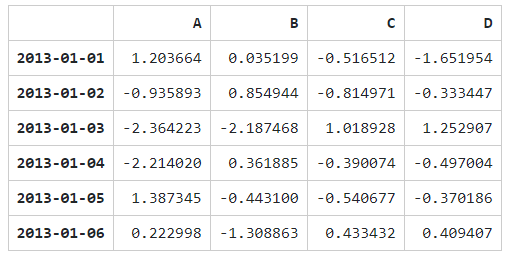

```python
# Series와 같은 것으로 변환될 수 있는 객체들의 dict로 구성된 데이터프레임을 만듭니다.
df2 = pd.DataFrame({'A' : 1.,
                    'B' : pd.Timestamp('20130102'),
                    'C' : pd.Series(1,index=list(range(4)),dtype='float32'),
                    'D' : np.array([3] * 4,dtype='int32'),
                    'E' : pd.Categorical(["test","train","test","train"]),
                    'F' : 'foo' })
```

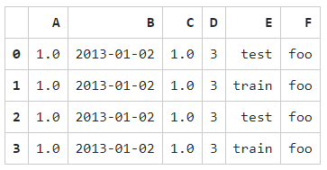


```python
raw_data = {
    "first_name": ["Jason", "Molly", "Tina", "Jake", "Amy"],
    "last_name": ["Miller", "Jacobson", "Ali", "Milner", "Cooze"],
    "age": [42, 52, 36, 24, 73],
    "city": ["San Francisco", "Baltimore", "Miami", "Douglas", "Boston"],
}
df = pd.DataFrame(raw_data,index=list('abcde'))
```

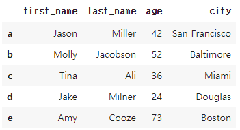

```python
# column 하나(debt) 늘리기 + 비어있는 데이터는 NaN으로 생성
df=pd.DataFrame(raw_data,index=list('abcde'),columns=["first_name", "last_name", "age", "city",'debt']) 
```

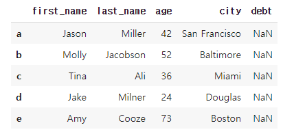


### ✏️ 데이터 확인하기

- **데이터프레임의 가장 윗 줄과 마지막 줄을 확인하고 싶을 때에 사용하는 방법은 다음과 같습니다.**

  - `df.head()` : 시작에서 마지막 까지 불러옴
  - `df.tail()` : 끝에서 시작까지 불러옴
    - 둘다 매개변수 n 넣으면 n줄만 불러옴

- df 세부 정보 가져오기

  - `df.index` : 인덱스 array 출력
  - `df.columns` : 컬럼 array 출력
  - `df.values` : 표의 내부 자료 array 출력
  - `df.describe()` : 데이터의 대략적인 통계적 정보 요약
    - count(컬럼당 자료 갯수) 
    - mean(컬럼당 평균)
    - std(컬럼당 표준편차)
    - min, max, 25%, 50%, 75%

- 형태 바꾸기

  - `df.T` : 데이터를 전치합니다. ( column과 인덱스 가 서로 바뀌기)

  - `df.sort_index(axis=1, ascending=False)` : 축별로 정렬하기

    - axis = 0 : 행 식별
    - axis = 1 : 열 식별
    - ascending : 오름차순

  - `df.sort_values(by="B")` : 값 별로 정렬

    - by = 해당컬럼 : 해당 컬럼의 값 으로 index를 정렬

    


### ✏️ 인덱싱

- **bracket indexing** : **column 이름** 또는 **index 위치** 또는 **index 이름** 를 통해서 접근
- **loc** : **index 이름** 을 통해서 접근
- **iloc** : **index 위치** 를 통해서 접근
- **at** : 레이블을 사용하여 단일 값에 액세스합니다.
- **Boolean Indexing** :  데이터를 선택하기 위해 단일 열의 값을 사용합니다.

```python
#### bracket indexing - column 이름
df.first_name # df['first_name']
"""
a    Jason
b    Molly
c     Tina
d     Jake
e      Amy
Name: first_name, dtype: object
"""

#### bracket indexing : index 위치
df[:2]
"""
first_name	last_name	age	city	debt
a	Jason	Miller	42	San Francisco	NaN
b	Molly	Jacobson	52	Baltimore	NaN
"""

#### bracket indexing : index 이름을 통해서 접근할시 기존의 리스트 인덱싱과 다르게 마지막 인덱스를 포함
df['a':'c']
"""
	first_name	last_name	age	city	debt
a	Jason	Miller	42	San Francisco	NaN
b	Molly	Jacobson	52	Baltimore	NaN
c	Tina	Ali	36	Miami	NaN
"""
```

```python
#### loc 이용 - 인덱스 이름을 통해서 접근할시 기존의 리스트 인덱싱과 다르게 마지막 인덱스를 포함한다
df.loc['a':'c']  
"""
first_name	last_name	age	city	debt
a	Jason	Miller	42	San Francisco	NaN
b	Molly	Jacobson	52	Baltimore	NaN
c	Tina	Ali	36	Miami	NaN
"""

#### 다중리스트처럼 이용하기
df.loc[:,['last_name']]
"""
last_name
a	Miller
b	Jacobson
c	Ali
d	Milner
e	Cooze
"""
```

```python
#### iloc 이용 
df.iloc[:3] #df[:3]
"""
first_name	last_name	age	city	debt
a	Jason	Miller	42	San Francisco	NaN
b	Molly	Jacobson	52	Baltimore	NaN
c	Tina	Ali	36	Miami	NaN
"""

df['last_name'].iloc[:2]  #Series , df['last_name'][:2]
"""
a      Miller
b    Jacobson
Name: last_name, dtype: object
"""

#### at 이용
# 지정된 행 / 열 쌍에서 값 가져 오기 -> 같은 방식으로 값설정도 가능함
df.at['b','age'] # b 행의 age열 값을 가져와라 
# 52

# 시리즈 내에서 값 얻기
df.loc['b'].at['age']
# 52

```

```python
#### Boolean Indexing 
#### 나이 40 이상만 가져오기
df[df.age > 40]
"""
first_name	last_name	age	city	debt
a	Jason	Miller	42	San Francisco	NaN
b	Molly	Jacobson	52	Baltimore	NaN
e	Amy	Cooze	73	Boston	NaN
"""

####Column에 새로운 데이터 할당
df.debt=df.age>40 # debt에 해당 인덱스의 age 컬럼값이 40 초과면 True / 40 이하면 False 넣기
"""
first_name	last_name	age	city	debt
a	Jason	Miller	42	San Francisco	True
b	Molly	Jacobson	52	Baltimore	True
c	Tina	Ali	36	Miami	False
d	Jake	Milner	24	Douglas	False
e	Amy	Cooze	73	Boston	True
"""
```


### ✏️ 삭제

- del 

```python
del df['열이름'] # 해당 column 삭제
```

### ✏️ selection & Drop

- **selection** : bracket indexing, loc,iloc 등을 이용한 선택
- **drop** : 해당 행이나, 열을 삭제한 DataFrame의 복사본을 반환한다. 만약 원본에도 적용시키고 싶다면 `inplace=True` 옵션 사용

```python
df
"""
	first_name	last_name	age	city
a	Jason	Miller	42	San Francisco
b	Molly	Jacobson	52	Baltimore
c	Tina	Ali	36	Miami
d	Jake	Milner	24	Douglas
e	Amy	Cooze	73	Boston
"""

# index 이름으로 drop 
df.drop('a')

# 1개 이상의 index 이름으로 drop
df.drop(['a','b'])
"""
first_name	last_name	age	city
c	Tina	Ali	36	Miami
d	Jake	Milner	24	Douglas
e	Amy	Cooze	73	Boston
"""

# 1개 이상의 column 으로 drop
df.drop(['first_name','last_name'],axis=1)
"""
age	city
a	42	San Francisco
b	52	Baltimore
c	36	Miami
d	24	Douglas
e	73	Boston
"""

```


## 📄 연산 (Operation)

- **Operation types** : add,sub,div,mul
- **Series ~ Series** : index 기준으로 연산 수행. 겹치는 index가 없을 경우 NaN
- **DataFrame ~ DataFrame** : column과 index를 모두 고려, 겹치는 column 또는 index 가 없을 경우 NaN
- **Series ~ DataFrame** : axis 를 기준으로 broadcasting


## 📄 Map / Replace / Apply / Applymap

- **map** : pandas 의 series type의 데이터에 해당함수를 적용하며 map 사용시 원본 데이터 변경된다.
- **replace** : map의 기능중 데이터 변환기능만 담당하며, 원본 데이터 변경을 하고 싶다면 `inplace=True` 옵션을 사용한다.
- **apply** : map 과 달리 column 또는 row 전체에 해당 함수를 적용. DataFrame에서 복수개의 컬럼에 적용할때 사용
- **applymap** : series 단위가 아닌 element 단위로 함수를 적용. series 단위에 apply를 적용시킬때와 같은 효과

### ✏️ map

```python
#### 원본
s1=pd.Series(np.arange(10))
"""
0    0
1    1
2    2
3    3
4    4
5    5
6    6
7    7
8    8
9    9
dtype: int64
"""

#### map, 함수를 인자로 적용
s1.map(lambda x:x**2)
"""
0     0
1     1
2     4
3     9
4    16
5    25
6    36
7    49
8    64
9    81
dtype: int64
"""

#### map , 인자로 함수 이외 dict, sequence형 자료등으로 대체 가능
z={1:'A',2:'B'}
s1.map(z) # dict type으로 데이터 교체 , 없는값은 NaN'
"""
0    NaN
1      A
2      B
3    NaN
4    NaN
5    NaN
6    NaN
7    NaN
8    NaN
9    NaN
dtype: object
"""

#### map, 인자로 series 넣기
s2=pd.Series(np.arange(11,20))
s1.map(s2) # 같은 위치의 데이터를 s2로 변환, 순서대로 변환하며 겹치지 않는 경우는 NaN

#### 한 행을 map으로 처리 후 바꿔주기
df['sex']=df.sex.map({'male':0,'female':1}) # sex 컬럼의 male, female을 0과1로 바꾸고 원본함수에 덮어씌우기
```
### ✏️ replace

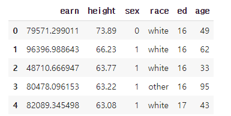

```python
# example - replace
df.race.replace(df['race'].unique(),['w','o','h','b'],inplace=True) # target list -> conversion list
# df 의 race 컬럼을 변경 - df의 race컬럼의 unique 한 리스트와 ['w','o','h','b'] 을 매칭시켜 변경
```

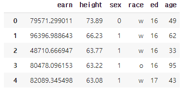

### ✏️ apply

```python
# example - apply
f=lambda x:-x # 음수로
df_info=df[['earn','height']]
df_info.apply(f) # 각 column 별로 결과값 반환 - f가 음수로 변환하는거

## 예시x
# 내장 연산함수를 사용할때도 똑같은 효과를 거둘수 있다.
df_info.apply(sum) # df_info.sum() 

# scalar 값 이외에 series 값의 반환도 가능하다.
def f(x):
  return pd.Series([x.min(),x.max()],index=['min','max'])
df_info.apply(f)
```

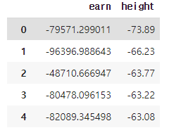

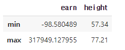


### ✏️ applymap

```python
# example - applymap
f=lambda x :-x
df_info.applymap(f)
```

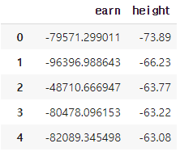

## 📄 결합

- concat : pandas 객체를 연결 - 인덱스 이어 붙이기
- join :  SQL 방식으로 병합
- append : 데이터프레임에 행을 추가합니다. [Appending](https://pandas.pydata.org/pandas-docs/stable/merging.html#merging-concatenation) 부분을 참조하세요.

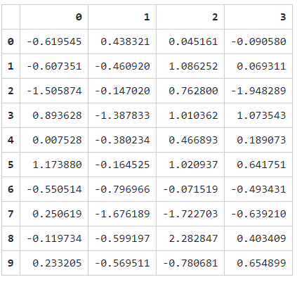

### ✏️ concat

```python
# break it into pieces
pd.concat([df[:3], df[3:7], df[7:]]) # 원본과 동일하게 나옴
```

### ✏️ join

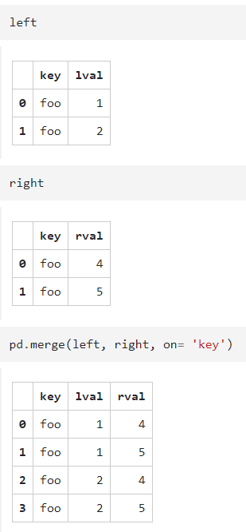

### ✏️ Append

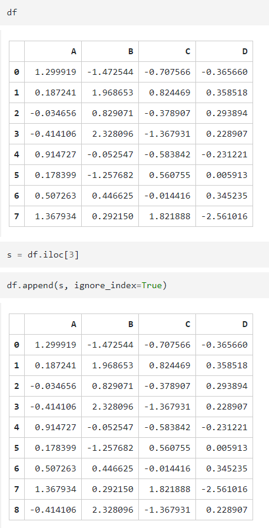

## 📄 Grouping

그룹화는 다음 단계 중 하나 이상을 포함하는 과정을 가리킵니다.

- 몇몇 기준에 따라 여러 그룹으로 데이터를 **분할 (splitting)**
- 각 그룹에 독립적으로 함수를 **적용 (applying)**
- 결과물들을 하나의 데이터 구조로 **결합 (combining)**

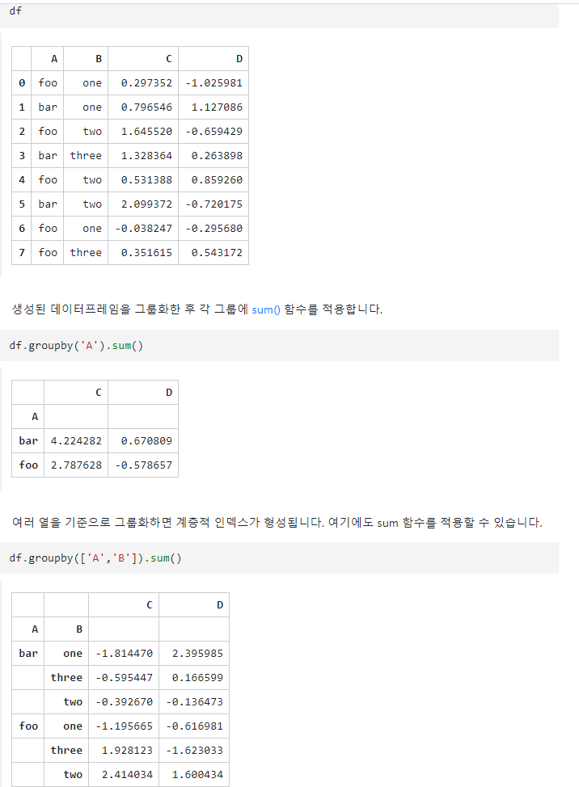


## 📄 특이 문법
- 유용한 것
  - describe(): (숫자형만) 통계치 한번에 출력
  - unique() : 유일값 찾기
  - sort_values() : 해당 값으로 인덱스 정렬
  - corr(): correlation
  - value_counts() : 유일한 값별로 개수 세기

### ✏️  isnull()
- column 또는 row 값의 NaN (null) 값의 index를 반환함

### ✏️ `isin()`

-  어떠한 값이 포함이 되는지 판단

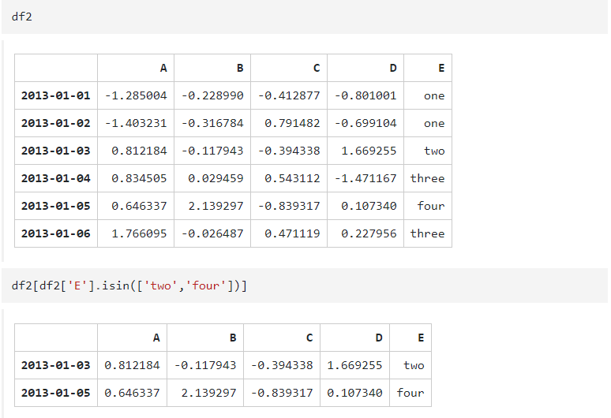

### ✏️ `to_csv()` 

- csv 파일 형식으로 변환

```python
df.to_csv()
# ,first_name,last_name,age,city,debt\na,Jason,Miller,42,San Francisco,True\nb,Molly,Jacobson,52,Baltimore,True\nc,Tina,Ali,36,Miami,False\nd,Jake,Milner,24,Douglas,False\ne,Amy,Cooze,73,Boston,True\n
```
## 더 알아보기
- https://dataitgirls2.github.io/10minutes2pandas/


# 아직 정리 안된 추가내용
## 1. Pandas (2)

- ### Groupby

  - SQL groupby 명령어와 동일

  - split - apply - combine 과정을 거쳐 연산

    ```
      # groupby(묶음의 기준 컬럼)[적용받는 컬럼].적용받는 연산
      df.groupby("Team")["Points"].sum()
    ```

- ### apply 유형

  - aggregation: 요약된 통계정보 추출 ex. sum, mean

  - transformation: 해당 정보 변환 ex. lambda

  - filtration: 특정 정보 제거 (필터링)

    ```
      grouped.agg(sum)
      grouped.agg(np.mean)
    
      # normalize
      score = lambda x: (x - x.mean()) / x.std()
      grouped.transform(socore)
    
      df.groupby("Team").filter(lambda x: x["Points"].max() > 700)
    ```

- ### pivot table

  - index 축은 groupby와 동일

  - column에 추가로 labeling 값 추가

  - value에 numeric type 값을 aggregation

    ```
      # 값: duration
      df.pivot_table([duration],
                      index=[df.month, df.item],
                      columns=df.network,
                      aggfunc="sum",
                      fill_value=0)
    ```

- ### merge & concat

  ```
    pd.merge(df_a, df_b, on='subject_id')
    # pd.merge(df_a, df_b, left_on='subject_id', right_on='id', how='right')
    # join: inner, left, right, full
    pd.concat([df_a, df_b])
  ```

- ### persistence

  - db 연결 conn을 사용해 dataframe 생성

    ```
      import sqlite3
    
      conn = sqlite3.connet('./data.db')
      cur = conn.cursor()
      cur.execute('select * from airlines limit 5;')
      res = cur.fetchall()
      # tuple 형태로 나옴
      df_airlines = pd.read_sql_query('select * from airlines;', conn)
    ```

  - XLS

    - openpyxls, XlsxWrite

      ```
        writer = pd.ExcelWriter('./df_routes.xlsx', engine='xlswriter')
        df_routes.to_excel(writer, sheet_name='Sheet1')
        df_routes.to_pickle('./df_routes.pickle')
      ```