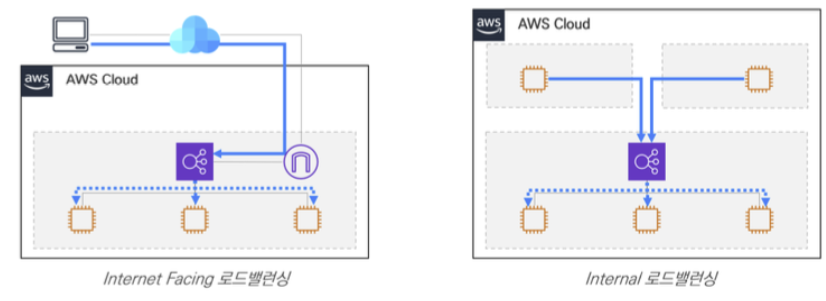
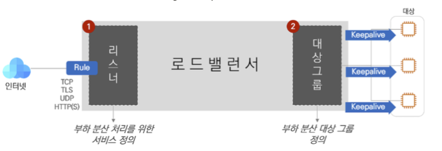
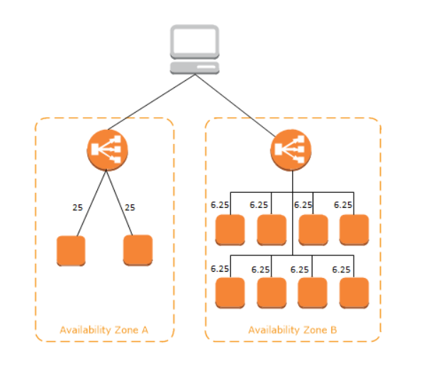
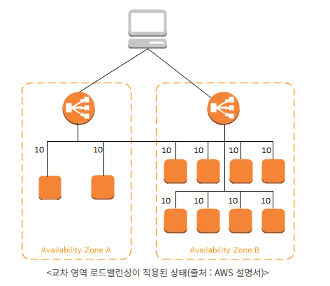

# AWS 로드 밸런스(ELB)

- Elastic Load Balancing
  - AWS에서 제공하는 로드 밸런싱 기술
  - ELB는 AWS의 VPC(Virtual Private Network)에 탑재되며, 사용자의 요청을 받고 이를 VPC 내의 리소스에 적절히 부하 분산
  - 일반적으로 최소 2개의 AZ 사용(**복수의 가용영역으로 고가용성 보장**)하며 사용자는 Route 53을 통해서 도메인 주소로 접근한다.
- ELB의 구분
  - Internet LB
    - 공인 IP, 사설 IP 둘다를 가지고 있음
    - 외부에서 인터넷 접속이 가능함
    - 외부 사용자들의 접근을 위한 웹서버를 부하 대상으로 삼아 구성
  - Internal LB
    - 사설 IP만 가지고 있음
    - 내부에서만의 접근만 허용
    - 애플리케이션 서버를 부하대상으로 삼아 구성

## 리스너(Listener)와 대상그룹(Target Group)

- 리스너(Listener)

  - 외부의 요청을 받아들이는 역할 (  사용자의 요청을 받아들이고 적절한 대상그룹으로 라우팅하는 역할 )
  - L4 로드밸런서(스위치)에서 Virtual Server 역할에 해당
  - 서비스 포트(Service Port)를 보유하고 있으며 외부의 요청은 서비스 포트로 접속하는 요청만을 처리
    - 보통 웹 서비스의 경우 80 포트(http)를 사용
  - 로드밸런서에 접근한다는 것은 해당 리스너의 포트로 접근하는 것이기에 리스너는 접근을 위한 리스너 ID에 포트를 명시
  - 한 개의 로드밸런서는 다수의 리스너를 보유할 수 있음
  - 뿐만 아니라 SSL 인증서를 게시하여 SSL Offload를 실시할 수도 있습니다

- 대상그룹(Target Group)

  - 요청을 분산/전달할 리소스의 집합( 리스너가 전달한 요청을 처리하기 위한 부하분산 대상들의 모임 )
  - L4 로드밸런서(스위치)에서 Pool 에 해당
  - 서비스 포트(Service Port)를 보유하고 있으며 부하 분산 대상인 EC2는 해당 포트가 열려있어야함
  - 대상 그룹의 포트는 꼭 리스너의 포트와 같을 필요는 없다.
    - 요청을 검토한 리스터가 요청이 적합한 경우 대상 그룹에게 이를 전달할 때 대상 그룹의 포트로 Port Translation을 한다.
  - 포함되어 있는 정보
    - 대상 그룹에 등록된 EC2의 각종 정보(인스턴스 ID, Port, AZ)
    - EC2가 전달받은 요청을 처리할 수 있는지를 나타내는 '헬스 체크(Health Check)'
      - 부하 분산 대상인 대상 그룹 내 리소스들은 헬스체크(Health Check)를 활용해 끊임없이 상태를 확인받는다.
    - 요청 처리에 관련된 모니터링(Monitoring)
      - 요청 처리에 관련된 모니터링이라 함은 이 대상 그룹에 요청 처리가 가능한 EC2가 몇 개인지, 불가능한 EC2는 몇 개인지를 뜻함

  

## ELB의 종류

- 세가지 유형의 로드 밸런서 - 주로 ALB와 NLB가 쓰임
  1. ALB ( Application Load Balancer)
  2. NLB ( Network Load Balancer )
  3. CLB ( Classic Load Balancer )
- 구성되는 방법의 차이
  - ALB와 NLB는 사용하려는 대상을 대상 그룹에 등록하고, 대상 그룹에 트래픽을 라우팅하여 사용
  - CLB는 로드밸런스에 인스턴스를 등록하고 라우팅

### ALB( Application Load Balancer)

- OSI 7계층에 해당

  - 사용자가 UI로 접하는 응용 프로그램과 관련된 계층으로 HTTP,FTP,DHCP,SMTP,DNS 등이 있습니다. 여기에 속한 프로토콜들은 어떠한 방법으로든 사용자와 직접 접하게 됩니다.

- 특징

  - HTTP, HTTPS의 특성을 주로 다루는 로드밸런서
    - 단순 부하분산뿐만 아니라 HTTP의 헤더 정보를 이용해 부하분산을 실시하는 것이 ALB의 가장 중요한 특징
    - HTTP 헤더의 값들을 보고 이 요청은 어느 대상그룹으로 보낼지 저 요청은 어느 대상그룹으로 보낼지를 판단할 수 있다는 뜻
    -  SSL 인증서를 탑재할 수 있어 대상 그룹의 EC2를 대신하여 SSL 암호화/복호화를 대신 진행할 수 있음
  - 처리속도: 느림
    동일 인스턴스로 다수의 포트 전달: 지원
    IP를 통한 관리: 미지원
    프라이빗 링크 지원: 미지원
    경로 기반 라우팅: 지원
    호스트 기반 라우팅: 지원

  - 람다(Lambda)를 대상 그룹으로 지정 가능

### NLB ( Network Load Balancer )

- OSI 4 계층에 해당

  - 송신자와 수신자의 논리적 연결(Connection)을 담당하는 부분으로, 신뢰성 있는 연결을 유지할 수 있도록 도와줌
    - endpoint(사용자) 간의 연결을 생성하고 데이터를 얼마나 보냈는지 얼마나 받았는지, 제대로 받았는지 등을 확인
  - TCP와 UDP가 대표적

- 특징

  - TCP와 UDP를 사용하는 요청을 받아들여 부하분산을 실시
    - HTTP도 TCP 기반의 프로토콜이기 때문에 분산이 가능하긴하지만,
      상위 Layer인 HTTP가 아닌 하위 Layer의 TCP Layer에서의 처리이므로 HTTP 헤더를 해석하지 못합니다
    - HTTP 헤더를 이용한 부하 분산을 불가능
  - 처리속도: 빠름
    동일 인스턴스로 다수의 포트 전달: 지원
    IP를 통한 관리: 지원
    프라이빗 링크 지원: 지원
    경로 기반 라우팅: 미지원
    호스트 기반 라우팅: 미지원

  - 고정 IP 보유

## 가용영역과 로드밸런스 노드

- 작동 방식
  - 일반적으로 로드밸런스는 고가용성을 위해 복수의 가용영역을 사용하게 됨
  - 로드 밸런서의 가용 영역을 활성화하면 Elastic Load Balancing가 해당 가용 영역에서 로드 `밸런서 노드`를 생성 - 로드밸런서 노드는 가용역역마다 하나씩 존재
    - 가용 영역에 대상을 등록하지만 가용 영역은 활성화하지 않는 경우 이러한 등록된 대상은 트래픽을 수신하지 않습니다.
- 로드밸런서 노드(Load Balancer Node)
  - ELB는 VPC 내에서 하나의 형태로 존재하고 다수의 네트워크 인터페이스(Network Interface)를 가지는데 이 다수의 인터페이스가 바로 로드밸런서 노드
  - ELB에서 실질적으로 사용자의 요청을 받아들여 부하분산 대상들에게 요청을 나누어주는 역할
  - AWS의 콘솔 상에서는 네트워크 인터페이스의 형태로만 보이기 때문에 EC2 서비스의 네트워크 인터페이스에서 이를 확인하실 수 있음
  - 즉,  VPC에서 ELB를 바라볼 땐 로드밸런서 노드와 EC2의 집합으로 보이며, 이는 각각 리스너(로드밸런서 노드), 대상 그룹(EC2의 집합)에 해당

### 교차영역 로드 밸런싱( Cross-zone load balancing)

- 왜 교차영역 로드밸런싱을 하는가?
  - AZ 별 부하분산 대상의 숫자가 균형을 이루지 않는 경우, 숫자가 적은 AZ 쪽에 있는 인스턴스에 부담이 쏠릴 수 있음( 각 노드밸런서 노드가 균등하게 부담을 분배하기 때문에 )

- 기능
  - AZ별 부하분산 대상의 숫자가 균형을 이루지 않는 경우 교차 영역 로드밸런싱을 활성화하면 AZ를 가리지 않고 고르게 부하를 분산
- 사용방법
  - ALB는 교차 영역 로드 밸런싱이 항상 사용
  - NLB는 기본적으로 교차 영역 로드 밸런싱이 비활성화
    - 하지만, 로드 밸런서 생성 이후 언제든지 교차 영역 밸런싱을 활성화하거나 비활성화 할 수 있음

## ELB에 사용자 접근

- 사용자가 로드밸런서의 `DNS` 이름을 통해 ELB에 접속
  - 사용자가 서비스 사용을 위해 접속할 때 로드밸런서 노드의 공인 혹은 사설 IP를 직접 입력하여 접근하는 것이 아니라, DNS 이름을 통해 접속하여
    ELB는 요청을 대상 그룹에 전달하고, 대상 그룹의 EC2가 요청을 처리하게 됨
- ELB 요청 처리 과정 - 로드밸런서는 Amazon의 DNS 서버를 이용하여 도메인을 해석하기 떄문에 DNS는 Amazon에서 제어
  1. 사용자가 로드밸런서에 접근하기 위해 Amazon의 DNS 서버에 로드밸런서의 도메인 해석을 요청
  2.  Amazon의 DNS 서버가 로드밸런서 노드 IP 리스트를 사용자에게 전달
  3.  사용자는 IP 중 하나를 선택하여 로드밸런서에 접근(+ Port 입력)
  4. 사용자는 로드밸런서의 (Port가 일치하는) 리스너에 접근하게 되며 리스너는 이 요청을 받아들여 적절한 대상그룹으로 전달
  5.  리스너로부터 전달받은 요청을 EC2가 처리한 후 다시 사용자에게 반환 
- 즉,  사용자가 로드밸런서의 도메인 이름을 해석하여 연결된 IP 중 하나를 택하여
  리스너에 접근하고, 리스너는 적절한 대상 그룹에 이 요청을 전달하여 EC2로 하여금 처리하도록 함

## 필요한 추가개념

### 보안그룹

- ELB 또한 EC2처럼 보안 그룹을 지닐 수 있습니다
  - 로드밸런서 노드 또한 네트워크 인터페이스의 형태를 띄기 때문
  - 보안 그룹은 네트워크 인터페이스에 적용되는 것이므로 네트워크 인터페이스를 갖는 ELB 또한 보안그룹을 가질 수 있는 것
- 대상 그룹의 EC2 에서 처리해야하는 것
  - 로드밸런서 노드가 있는 서브넷에서 오는 요청은 처리할 수 있도록 EC2의 보안 그룹 또한 작업을 해야함
  - 보안 그룹의 Source IP를 0.0.0.0/으로 허용하는 것은 아니더라도 로드밸런서 노드(네트워크 인터페이스)에 적용된 보안그룹에서의 요청은 허용해야한다는 뜻

### 상태체크

- 대상그룹의 EC2의 상태를 체크하는 것
  - 상태 체크에 통과하지 못한 EC2는 더이상 요청을 전달받지 못 함
- 종류
  - TCP
  - HTTP, HTTPS
- 방식
  - 트래픽이 유입되는 포트(서비스포트)로 헬스체크
  - 그렇지 않은 포트로의 헬스체크
- 정의 할 수 있는 것
  - 제한 시간
  - 간격
  - 성공 판단 횟수 등

### 유휴 제한 시간

-  유휴 제한 시간 ( Connection Time Out )
  - 사용자가 ELB를 거쳐 EC2에 접근하여 서비스를 접속하면 'Connection(이하 커넥션)'이 생성
  - 이 커넥션을 통해 사용자와 EC2가 통신을 하는 것
  - 더 이상의 통신이 없을 때 유휴 제한 시간이 작동하고, 그 시간이 지나면 커넥션이 사라집니다. 즉 어느 정도의 시간동안 통신이 없을 때 커넥션을 삭제할 것인가를 뜻하는 것

