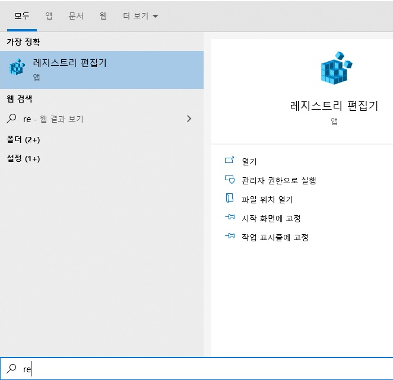
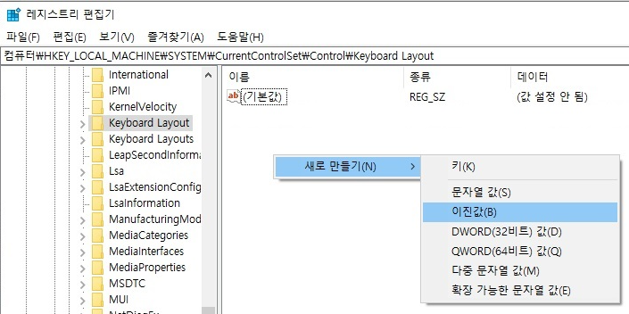
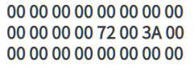
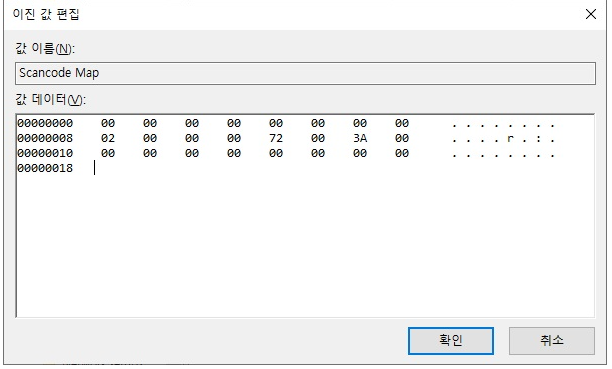

맥과 윈도우를 번갈아서 사용하다보니 키보드 한영키 바꾸는 것에 많은 불편함을 느끼게 되었다.  그래서 맥의 키보드세팅인 Capslock 을 한영키로 바꾸는 세팅으로 통일을 해보려한다.

## 1. 레지스트리 편집기 켜기

## 2. 레지스트리 편집기 왼쪽 트리에서 경로찾기

- 경로

HKEY_LOCAL_MACHINE/SYSTEM/CurrentControlSet/Control/Keyboard Layout/

**[주의]**

"Keyboard Layout" 과 "Keyboard Layouts" 2가지가 있으므로 "s" 없는 것으로 선택해야 합니다.

## 3. 레지스트리 생성

파일명 : Scancode Map

## 4. ScanCode Map 수정

다음의 내용을 그대로 순서에 맞게 입력해나가면 됨

- 내용 : 3줄을 입력하며, 2번째 줄의 "72"(한/영전환)와 "3A"(캡스락)가 3A->72로 매핑해주는 키보드 스캔코드 매핑 값입니다. 매핑이 되면 캡스락키가 눌리면(3A) 한영전환(72)로 입력된것으로 처리됩니다. 나머지는 모두 "00"으로 채우면 됩니다.

- 확인을 눌러 저장

## 5. 재부팅하기

캡스락 키를 눌러 한영 전환이 제대로 되는지 확인

 

캡스락 키에 LED로 대문자 고정 알림이 들어오는 키보드인 경우 한/영 전환으로 매핑을 하면 LED가 동작하지 않으니 주의